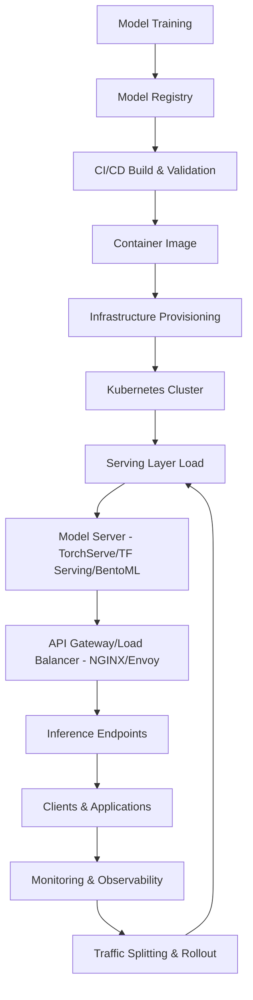

| Difficulty | Channel | Tags |
|---|---|---|
| beginner | devops | mlops, deployment |

Picture this: product teams at a global company are shipping ML-powered features, but getting each trained model into production means days of bespoke plumbing, inconsistent rollout patterns, and sleepless nights on-call. This is exactly what happened at Uber as it scaled globally, where the need to personalize pricing, ETAs, routing, and fraud detection at scale created a bottleneck that threatened both velocity and reliability [1]. What followed was a transformation in how machine learning moves from idea to real-time impact at massive scale. As you read on, you'll see how separating model deployment from model serving unlocks the agility and performance that production ML demands.

---

> ### Real-World Case — Uber
>
> As Uber scaled globally, its product teams needed to personalize pricing, ETAs, routing, fraud detection, and more in real time. Each of these features depended on machine learning models, but getting models from training into production was slow, inconsistent, and required heavy manual engineering effort across teams.
>
> | | |
> |---|---|
> | **Challenge** | Uber faced a massive MLOps bottleneck: they needed a way to deploy and serve thousands of models reliably at low latency while supporting rapid experimentation. Without a unified system, model rollout, versioning, rollback, monitoring, and scaling became operationally unsustainable. |
> | **Solution** | Uber built Michelangelo, an end-to-end ML platform that cleanly separates deployment and serving concerns. Deployment is handled by Michelangelo’s model lifecycle and workflow system: models are packaged, versioned, validated, and promoted through CI/CD-like pipelines into production. Serving is handled by Michelangelo’s high-throughput Prediction Service, which loads models into containerized servers, routes requests, supports real-time inference via low-latency APIs, and automatically scales horizontally to meet demand. |
> | **Outcome** | Michelangelo unified ML operations across Uber, enabling thousands of models to run in production and serve millions of predictions per second with sub-100ms latencies at peak. This transformed experimentation velocity—product teams could deploy and iterate on models without reinventing infrastructure—while maintaining reliability and observability at massive scale. |
> | **Lesson** | Separating model deployment (infrastructure, packaging, promotion, and governance) from model serving (runtime inference, routing, versioning, and autoscaling) is essential to achieve both developer velocity and production reliability at scale. |

---

## Hook — When Scaling Breaks Your ML Workflow

At some point, every engineering team discovers the painful truth: a notebook model is not a production system. For Uber's product teams, that pain hit hard. They needed personalization features like pricing, ETAs, routing, and fraud detection to run in real time for millions of users worldwide [1]. But without a unified platform, each team was reinventing deployment machinery — leading to slow, inconsistent releases and brittle operations. The stakes were enormous: if models couldn't reach production reliably, the business couldn't move fast without sacrificing user experience. This is where many organizations get stuck, and it's why understanding the distinction between deployment and serving becomes more than academic — it becomes a survival skill.

## Problem — The Deployment vs Serving Confusion

Many developers think "getting a model into production" is a single step, but in reality it's two fundamentally different concerns that often collide. Deployment is everything that happens before and around making a model runnable in production: building artifacts, setting up infrastructure, automating CI/CD pipelines, configuring resources, and putting observability in place [2][3]. Serving is the runtime layer that actually handles inference requests: loading models, routing traffic, batching, caching, handling versioning, and returning predictions with low latency [4][5]. The confusion leads teams to over-engineer one side while neglecting the other. When deployment is treated as serving (or vice versa), you end up with brittle rollouts, slow recovery from failures, and scaling headaches. The core challenge is designing systems where infrastructure and runtime concerns are cleanly separated so that product teams can iterate quickly without breaking production.

## Real-World Case — Uber's Michelangelo Platform

Uber's experience makes this abstract distinction painfully concrete. As the company scaled globally, product teams needed real-time personalization for pricing, ETAs, routing, and fraud detection, but getting models from training into production was slow, inconsistent, and required heavy manual engineering effort across teams [1]. Michelangelo emerged as Uber's unified ML platform to address this. By standardizing how models are deployed and served, Michelangelo enabled thousands of models to run in production and serve millions of predictions per second with sub-100ms latencies at peak [1]. More importantly, it transformed experimentation velocity: product teams could deploy and iterate on models without reinventing infrastructure, while still maintaining reliability and observability at massive scale [1]. This case shows that when deployment and serving are treated as first-class, complementary layers, teams move faster without sacrificing stability.

## Deep Dive — Key Differences, Technologies, and Trade-offs

To build systems like Michelangelo, you need to understand what belongs where. Deployment is about making the model available in production safely: it encompasses CI/CD pipelines, infrastructure provisioning, containerization, monitoring setup, rollback strategies, and reproducible artifact management [2][3]. Tools like Kubernetes for orchestration, MLflow for experiment tracking/model registry, and SageMaker for managed workflows help operationalize this layer [2][3][6]. Serving is runtime inference: loading the model into memory, handling request routing, versioning, traffic splitting, batching for throughput, and optimizing response latency [4][5][7]. Model servers like TorchServe, TensorFlow Serving, and BentoML provide battle-tested serving capabilities, often fronted by APIs (FastAPI/gRPC) behind load balancers like NGINX or Envoy [4][5][7][8]. Scaling trade-offs are critical: horizontal pod scaling increases throughput but can introduce cold starts; vertical scaling gives more memory/GPUs but caps density; latency requirements vary (sub-50ms for real-time vs seconds for batch); and A/B testing/gradual rollouts require careful traffic management. Understanding these boundaries helps you design for both agility and performance.

## Workflow — From Training to Inference at Scale

The cleanest mental model is a pipeline that flows through deployment into serving. First, a model is trained and packaged as an artifact with metadata (version, dependencies) stored in a model registry [2][3]. Next, deployment automates validation, builds container images, and provisions infrastructure via IaC, often using Kubernetes to manage compute and GPUs [2]. Finally, the serving layer loads the model, registers endpoints, and exposes inference APIs that autoscale based on load while enforcing latency SLOs and circuit breakers [4][5][7]. Traffic splitting and shadowing enable safe rollouts and A/B experiments [6]. Observability spans both layers: deployment metrics track build success and rollout health; serving metrics track p50/p95 latency, error rates, throughput, and model drift signals. The Mermaid diagram below visualizes how these layers connect, from CI/CD through to runtime inference serving millions of QPS with low latency.

## Code Example — A Minimal Production-Ready Inference Service

While Michelangelo operates at massive scale, the same principles apply to any team. A minimal serving service can be built with FastAPI to expose a low-latency inference endpoint, loading a model at startup to avoid cold starts in the hot path [7]. The code below shows a clean pattern: define a request/response schema, load the model once during app initialization, and implement a synchronous predict endpoint. For production, you'd wrap this in a Docker container, deploy to Kubernetes with autoscaling/HPA, add health checks, metrics, and model versioning via environment variables or a model registry [2][4][7].

## Lessons Learned — Building for Velocity and Reliability

The Uber case teaches a critical lesson: separating deployment from serving is what makes experimentation sustainable at scale. Deployment is your safety net (CI/CD, infra, rollback, observability) — invest in automation and reproducibility [2][3]. Serving is your performance engine (latency, throughput, routing, versioning) — optimize for request path, not build path [4][5]. Many teams over-focus on one and under-invest in the other. Watch out for tight coupling: if serving code depends on training code paths or deployment configs are hardcoded, you're asking for pain. Key takeaways: treat models as versioned artifacts, use a model registry, standardize containers, autoscale based on real traffic, and instrument everything. The result is what Uber achieved: product teams can deploy and iterate without reinventing infrastructure, while maintaining reliability and observability at massive scale [1].

---

## Deployment to Serving Pipeline

<strong>Original Interview Question</strong>

**Q:** Explain the key differences between model serving and model deployment in ML systems, including specific technologies, scaling considerations, and real-world implementation patterns?

**A:** Deployment encompasses CI/CD pipelines, infrastructure setup, and monitoring using tools like Kubernetes, MLflow, and SageMaker. Serving focuses on runtime inference APIs with frameworks like TensorFlow Serving, TorchServe, or BentoML, handling request routing, model versioning, and autoscaling. Key trade-offs include latency vs throughput, batch vs real-time inference, and cold start optimization.

## Conclusion

The journey from notebook to production doesn't have to be chaotic. By separating deployment (infrastructure, CI/CD, observability) from serving (runtime inference, routing, scaling), you get the best of both worlds: velocity to experiment and reliability to operate at scale. Uber's Michelangelo proved this at massive scale [1]; the same pattern works for teams of any size. Tomorrow, audit your ML workflow: if training, deployment, and serving are tangled together, refactor to treat them as distinct layers. Your on-call engineers (and your product teams) will thank you.

---

## References

1. [Uber incident report](https://www.uber.com/blog/michelangelo-machine-learning-platform/) — article
2. [Kubernetes Documentation](https://kubernetes.io/docs/home/) — documentation
3. [MLflow Documentation](https://mlflow.org/docs/latest/index.html) — documentation
4. [TorchServe Documentation](https://github.com/pytorch/serve) — documentation
5. [TensorFlow Serving](https://www.tensorflow.org/tfx/guide/serving) — documentation
6. [Amazon SageMaker Developer Guide](https://docs.aws.amazon.com/sagemaker/latest/dg/whatis.html) — documentation
7. [FastAPI Documentation](https://fastapi.tiangolo.com/) — documentation
8. [NGINX Documentation](https://nginx.org/en/docs/) — documentation

---

**Author:** Satishkumar Dhule — [GitHub](https://github.com/satishkumar-dhule) · [LinkedIn](https://linkedin.com/in/satishkumar-dhule) · [Website](https://satishkumar-dhule.github.io)
