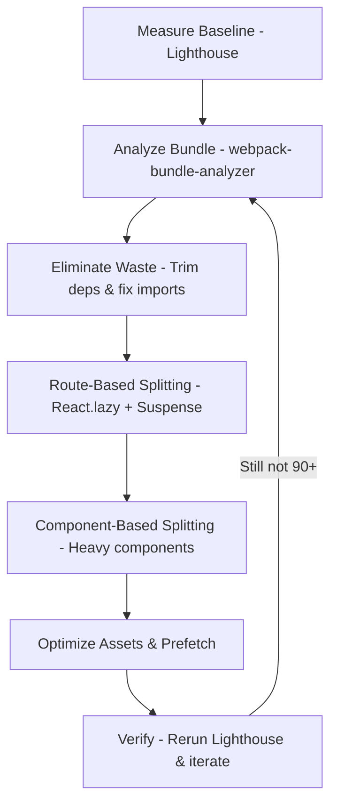

| Difficulty | Channel | Tags |
|---|---|---|
| intermediate | frontend | lighthouse, bundle, lazy-loading |

Speed is no longer a luxury for web applications — it's a make-or-break factor for keeping users engaged. In 2018, Netflix engineers discovered that their logged-out homepage was shipping roughly 300kB of JavaScript while taking nearly 7 seconds to load on a simulated 3G connection [1]. For a page that was mostly static HTML, this posed an existential question: how could so much JavaScript be responsible for such a massive slowdown? This discovery set the stage for a dramatic performance turnaround that holds powerful lessons for any team building React applications today.

---

> ### Real-World Case — Netflix
>
> Netflix's logged-out homepage — the most heavily A/B tested page in their entire sign-up funnel — shipped ~300kB of JavaScript and took roughly 7 seconds to load on a simulated 3G connection in Chrome DevTools, despite being mostly static HTML. The team set out to cut Time-to-Interactive for first-time visitors without breaking the SSR-based structure the rest of Netflix.com depends on.
>
> | | |
> |---|---|
> | **Challenge** | Most of the page was plain server-rendered HTML, yet the client shipped React, its hydration state, and utility libraries like Lodash — costing both bytes and main-thread parse/execute time on the critical path, and directly inflating Time-to-Interactive. |
> | **Solution** | Netflix took the counterintuitive route: instead of code-splitting React with React.lazy()/Suspense, they asked whether React was needed client-side at all. They kept React server-side for HTML generation, removed React, Lodash and its app code from the browser entirely, and rebuilt the only interactive pieces (e.g. the language switcher) in under 300 lines of vanilla JS — preserving the same component structure for developer consistency. Then they used idle time on the landing page to XHR-prefetch the JS/CSS (including React itself) for the next step of the sign-up flow, which is a much heavier SPA. |
> | **Outcome** | Total client-side JavaScript dropped by over 200kB, and loading plus Time-to-Interactive fell by more than 50% on the logged-out desktop homepage. Prefetching the next page's JS/CSS cut Time-to-Interactive for subsequent navigations by a further 30%. Notably, React's own runtime was only ~45kB — most of the 200kB win came from deleting the surrounding app code and libraries that shipped alongside it. |
> | **Lesson** | Bundle size is not a framework problem, it's a delivery problem. Before sprinkling React.lazy() and Suspense across a bundle, audit what's actually in it — if a page is mostly static HTML, no amount of code splitting beats not shipping the framework at all, and 'lazy loading' isn't always about splitting: sometimes it's about prefetching the heavy SPA during the user's idle time on a server-rendered page. |

---

## Hook — The Hidden Cost of Shipping Everything at Once

Picture this: a first-time visitor lands on your homepage, excited to explore your product. They are on a spotty mobile connection, and for the next seven seconds, all they see is a loading spinner. By the time your app becomes interactive, they have already tapped the back button and moved on to a competitor. This is not a hypothetical scenario — it is exactly what Netflix was facing with their most heavily A/B tested landing page [1]. 

Here is the uncomfortable truth: many developers assume that if a page looks simple, it should load fast. However, the bundle size can tell a completely different story. When an application ships its entire codebase upfront, even static-looking pages become bloated with JavaScript that users never requested. This realization forces you to ask: is everything you are shipping truly necessary for that first render?

## Problem — When More Code Means Slower Experiences

The core issue lies in how modern JavaScript applications are bundled. Without intervention, tools like webpack or Vite will package every component, utility, and third-party dependency into one or more large chunks that must be downloaded, parsed, compiled, and executed before users can interact with the page [2]. 

This creates several compounding problems for your users. First, larger bundles mean longer download times, especially on slower networks where every kilobyte counts [3]. Second, parsing and executing JavaScript is significantly more expensive than rendering HTML or CSS, creating CPU bottlenecks on lower-end devices [4]. Third, and perhaps most critically, Time to Interactive (TTI) suffers — meaning users see content but cannot actually click, type, or navigate until the main thread finishes processing all of that JavaScript. 

Many developers think that improving Lighthouse scores is merely about appeasing a tool. In reality, these metrics directly correlate with user retention and conversion rates. The stakes could not be higher: slow load times translate directly to lost opportunities and frustrated users. So how do you systematically attack this problem without dismantling your entire application architecture?

## Real-World Case — Netflix

Netflix encountered this exact dilemma with their logged-out homepage — the most heavily A/B tested page in their entire sign-up funnel [1]. Despite being mostly static HTML, the page was shipping approximately 300kB of JavaScript and taking around 7 seconds to load on a simulated 3G connection in Chrome DevTools. What made this particularly alarming was that the page's visual complexity did not justify its JavaScript footprint.

The team made a calculated decision to optimize for first-time visitors without breaking the server-side rendering (SSR) structure that the rest of Netflix.com depended on [1]. The results were staggering: total client-side JavaScript dropped by over 200kB, and loading time plus TTI fell by more than 50% on the logged-out desktop homepage. Additionally, by prefetching the next page's JS and CSS, Time to Interactive for subsequent navigations improved by a further 30%. 

Most notably, React's own runtime was only about 45kB — the vast majority of the 200kB savings came from eliminating surrounding app code and libraries that were being shipped alongside it for a page that did not need them [1]. This case study proves a powerful point: bundle size reduction is often about being intentional with what you ship, not just optimizing the framework itself.

## Deep Dive — The Art of Loading Only What You Need

So, how do you achieve similar results for your React application? The answer lies in a combination of measurement, strategic splitting, and disciplined dependency management. Before making any changes, you must first understand what is actually in your bundle — you cannot optimize what you cannot see. Tools like webpack-bundle-analyzer allow you to visualize your chunk composition and identify the largest offenders [2]. 

Once you have visibility, the next step is code splitting. Code splitting is the practice of breaking your application into smaller chunks that are loaded on-demand, rather than bundling everything upfront [5]. With React, this is typically achieved using `React.lazy()` in combination with `Suspense` to provide loading states while chunks are fetched [6]. 

There are two primary strategies to consider. Route-based splitting involves lazy-loading entire pages or routes, ensuring that users only download code for the page they are currently visiting [5]. This is often the lowest-hanging fruit and provides immediate wins for most applications. Component-based splitting, on the other hand, targets heavy, non-critical components — think charts, maps, rich text editors, or modals that may not be visible on initial render [6]. 

However, splitting alone is not enough. Tree shaking — the process of eliminating dead code — relies on your dependencies being written as ES modules and your build tool being properly configured to detect unused exports [7]. Similarly, being intentional with imports can dramatically reduce bundle size. For example, importing a specific function from `lodash-es` (`import { debounce } from 'lodash-es'`) instead of the entire library prevents pulling in unused code [8]. 

These techniques work in harmony: analysis reveals waste, splitting defers loading, and tree shaking removes what is never used. Together, they form the foundation for reaching Lighthouse scores of 90+ without sacrificing functionality.

## Workflow — A Systematic Path to a 90+ Lighthouse Score

To turn these concepts into actionable results, you need a structured workflow. Think of it as a diagnostic loop: measure, identify, optimize, verify, repeat. The following process mirrors the approach Netflix used — start with data, then surgically reduce what you ship.

**Step 1: Establish your baseline.** Run Lighthouse against your production build (or a realistic staging environment) to capture your starting metrics — bundle size, TTI, Largest Contentful Paint (LCP), and Total Blocking Time (TBT). Record these numbers so you can quantify improvements [3].

**Step 2: Analyze your bundle.** Generate a visual breakdown using webpack-bundle-analyzer (or the equivalent for your bundler like `rollup-plugin-visualizer` for Vite). Pay close attention to vendor chunks, large third-party libraries, and any unexpected dependencies [2].

**Step 3: Eliminate low-hanging waste.** Audit your `package.json` for unused dependencies. Replace heavy libraries with lighter alternatives where possible. Refactor imports to be granular and ensure you are using tree-shakeable ES module versions of packages [7][8].

**Step 4: Implement route-based code splitting.** Apply `React.lazy()` and `Suspense` to your top-level routes. This ensures the initial bundle contains only the code needed for the landing route [5][6].

**Step 5: Split heavy components.** Identify non-critical, expensive components that appear below the fold or in secondary flows. Lazy-load them with dynamic imports, and wrap them in error boundaries and meaningful fallbacks for a smooth user experience [6].

**Step 6: Optimize assets and prefetch.** Compress and serve images in modern formats (like WebP/AVIF), lazy-load offscreen images, and consider prefetching likely next routes' chunks to improve subsequent navigation TTI — a tactic Netflix leveraged to great effect [1][9].

**Step 7: Verify and iterate.** Rebuild, rerun Lighthouse, and compare against your baseline. Focus on TTI, LCP, and bundle size. Continue iterating until you reach your target of 90+ [3]. The diagram below illustrates how these pieces fit together in a cohesive optimization strategy.

## Code Example — Putting Route and Component Splitting Into Practice

Theory means little without implementation. The code below demonstrates a production-ready pattern that combines route-based splitting, component-based splitting, and Suspense fallbacks — all of which directly contribute to reducing your initial JavaScript payload [5][6].

This approach mirrors what high-performing teams use: load critical UI immediately, defer everything else until it is actually needed, and provide graceful loading states to avoid layout shifts or jarring experiences.

## Lessons Learned — From Theory to Transformation

The journey from a sluggish 65 Lighthouse score to a blazing-fast 90+ is not about a single silver bullet — it is about discipline and measurement. Netflix's case makes this abundantly clear: they did not reinvent React; they simply stopped shipping code their homepage did not need [1]. 

There are several key takeaways to carry with you. First, **measure relentlessly**. Baselines prevent you from optimizing blindly and let you prove impact to stakeholders [3]. Second, **start with route-based splitting** — it is the highest leverage change with the least complexity [5]. Third, **hunt for bloat in third-party dependencies**. Often, the biggest wins come from replacing or trimming heavy libraries [8]. Fourth, **prefetch strategically**. Loading the next likely route in advance improves perceived performance and subsequent TTI, especially for multi-page flows [1].

Most importantly, remember this: performance optimization is an ongoing practice, not a one-time task. User devices and network conditions vary wildly, so what feels fast on your machine may not feel fast for your users. By adopting this systematic workflow, you will not just chase Lighthouse scores — you will build experiences that respect your users' time and keep them coming back. So tomorrow, when you look at your bundle, ask yourself: what could you stop shipping today?

---

## Performance Optimization Workflow

<strong>Original Interview Question</strong>

**Q:** You're tasked with improving a React app's Lighthouse performance score from 65 to 90+. The bundle size is 2.1MB and Time to Interactive is 4.2s. What specific steps would you take to optimize the bundle and implement lazy loading?

**A:** Implement code splitting with React.lazy() and Suspense, analyze bundle composition with webpack-bundle-analyzer to identify largest chunks, remove unused dependencies and optimize imports, add dynamic imports for heavy components and third-party libraries, implement route-based splitting for better initial load times, and utilize tree shaking with proper ES module configuration.

## Conclusion

The path to a 90+ Lighthouse score is paved with intentionality. Netflix proved that even mostly-static pages can be weighed down by unneeded JavaScript — and that cutting that bloat by over 200kB can slash load times by more than half [1]. You do not need to rewrite your framework or sacrifice features. Instead, measure your baseline, analyze your bundle, split routes and heavy components, trim dependencies, and verify your gains. Start small: add route-based splitting to your largest route today. That single change might be the difference between a user staying — or hitting the back button. The next time you ship, ask yourself: is this code truly essential for the first interaction? Your users will thank you for the answer.

---

## References

1. [Netflix incident report](https://medium.com/dev-channel/a-netflix-web-performance-case-study-c0bcde26a9d9) — article
2. [webpack-bundle-analyzer Documentation](https://github.com/webpack-contrib/webpack-bundle-analyzer) — documentation
3. [Lighthouse Documentation - Google Developers](https://developer.mozilla.org/en-US/docs/Tools/Lighthouse) — documentation
4. [Parsing and Compiling Web Content - Web.dev](https://developer.mozilla.org/en-US/docs/Glossary/Parse) — documentation
5. [Code Splitting - React Documentation](https://react.dev/learn/code-splitting) — documentation
6. [React.lazy and Suspense - React Documentation](https://react.dev/reference/react/lazy) — documentation
7. [Tree Shaking - MDN Web Docs](https://developer.mozilla.org/en-US/docs/Glossary/Tree_shaking) — documentation
8. [Lodash-es - Lodash Documentation](https://github.com/lodash/lodash) — documentation
9. [Prefetching Resources - MDN Web Docs](https://developer.mozilla.org/en-US/docs/Web/HTTP/Link_prefetching_FAQ) — documentation

---

**Author:** Satishkumar Dhule — [GitHub](https://github.com/satishkumar-dhule) · [LinkedIn](https://linkedin.com/in/satishkumar-dhule) · [Website](https://satishkumar-dhule.github.io)
