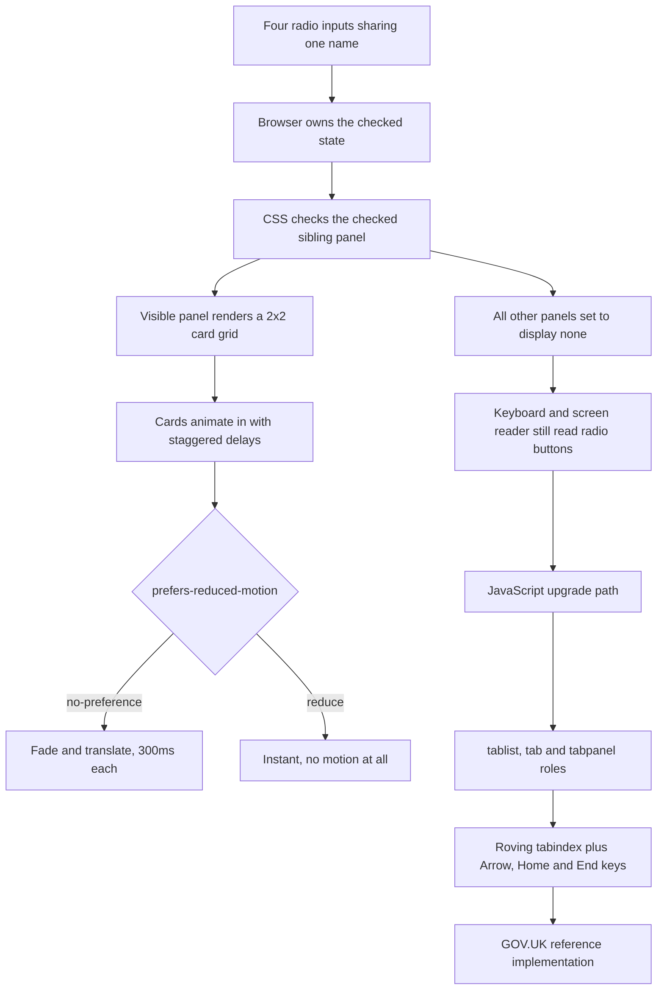

| Difficulty | Channel | Tags |
|---|---|---|
| beginner | frontend | css, flexbox, grid, animations |

In 2018, UK public-sector websites became legally bound to meet WCAG 2.1/2.2 AA under the Public Sector Bodies (Websites and Mobile Applications) Accessibility Regulations, enforced by the EHRC. When the GDS design-system team set out to ship a tabs component for every UK government service, teams kept proposing the zero-JS 'hidden radio + :checked + sibling selector' trick - and GDS deliberately rejected it in favour of a progressively enhanced, JavaScript-driven component [1]. That refusal is the most useful thing about this pattern. Build it once with radio inputs and CSS, understand exactly why it can fail an audit, then know when to hand it over to JavaScript.

---

> ### Real-World Case — GOV.UK Design System (UK Government Digital Service)
>
> The GDS design-system team needed a tabs component for the design system that powers essentially every UK government service (Universal Credit/DWP, HMCTS Judiciary internal systems, Defra Rural Payments, GOV.UK Bank Holidays, CJS). UK public-sector sites are legally required to meet WCAG 2.1/2.2 AA under the Public Sector Bodies (Websites and Mobile Applications) Accessibility Regulations 2018, enforced by the EHRC — so an accessibility regression is a compliance failure, not a nit. Teams kept proposing the zero-JS 'hidden radio + :checked + sibling selector' trick, which the team deliberately rejected in favour of a progressively enhanced, JS-driven component.
>
> | | |
> |---|---|
> | **Challenge** | Ship tab panels that work with AND without JavaScript, keep correct tablist/tab/tabpanel semantics and keyboard behaviour, keep the current tab in the URL fragment so the browser Back button works, and degrade gracefully on small screens — without depending on CSS-only state hacks. |
> | **Solution** | The markup is plain links (``) pointing at panels that are all present in the HTML. A ~2KB govuk-frontend module progressively enhances it: it toggles `hidden`/classes, syncs `aria-selected`, and writes the active panel's id into the URL fragment. With JS disabled (or on small screens, where it currently behaves the same way), every panel renders in order with a table of contents linking to each section — no fake tabs. In v5.5.0 (Aug 2024) they also *removed* the up/down arrow-key bindings on tabs because they were interfering with screen-reader navigation. |
> | **Outcome** | Concrete, verifiable, if not flashy: the pattern shipped in govuk-frontend and is the reference implementation reused across ~hundreds of UK government services; arrow-key tab navigation was pulled in v5.5.0 specifically to fix screen-reader breakage; the docs still flag 'tabs have not yet been tried in research with users' and that the no-JS/mobile behaviour needs research. No published performance or revenue numbers, and there is no corporate 'oh no we removed a feature' drama — which caps how explosive this is as a blog hook. |
> | **Lesson** | A CSS-only radio 'tab' is a demo trick, not a component. `display:none`-ing the radios removes them from the accessibility tree (so keyboard users lose the focus-visible ring and arrow-key navigation), the labels are not focusable, there is no tablist/tab/tabpanel role mapping, no aria-selected, and the active tab is invisible to history/deep-linking. GDS's answer is the pattern worth copying even for a docs page: render all content as real, semantic HTML (optionally revealing it progressively), and use the radio hack only where the interaction is genuinely non-semantic (e.g. a card-grid view switcher) — never as the sole access path to content. Note the same logic applies to the animation: wrap motion in `@media (prefers-reduced-motion: no-preference)` and never let the reduced-motion branch remove content or the focus outline. |

---

## Hook - Everyone says tabs need JavaScript. GOV.UK disagreed.

Stop scrolling. There is a tabs component you can build with about fifteen lines of CSS and zero lines of JavaScript, and it works today in every evergreen browser. Four radio inputs sharing one name attribute, four labels pointing at them, and a sibling selector that swaps a panel's display value. That is the whole trick. It is genuinely elegant.

Here is the thing though: elegance is not the requirement. For the GOV.UK Design System - the reference implementation reused across roughly hundreds of UK government services, including Universal Credit/DWP, HMCTS, Defra Rural Payments and GOV.UK Bank Holidays [1] - the requirement is a WCAG 2.1/2.2 AA audit under a regulator with legal teeth [9]. So when teams kept proposing the CSS-only trick, the team said no [1].

That contradiction is the whole story. The pure-CSS tab pattern is not wrong. It is incomplete. Knowing where the line sits between 'clever enough to demo' and 'robust enough to serve millions of people on a bad connection with a screen reader attached' is a senior-level skill. This walkthrough builds the version that passes an interview, then explains precisely why a real design system might hand the same component to JavaScript.

## Problem - The tab panel that fails the audit, not the demo

Strip away the styling and the brief is four hard problems wearing a trench coat:

1. **State switching without JavaScript.** Radio inputs are the only native HTML control that already behaves like a tab group. Same `name` means the browser enforces mutual exclusion for free, and arrow keys move between them because that is what a radio group does [3].
2. **A responsive card grid.** A 2x2 grid on desktop, one column on mobile, that does not need a media-query library.
3. **A fixed 16:9 media area** so cards line up in a tidy row no matter what image goes in them - CSS `aspect-ratio` handles this in a single line [7].
4. **Motion that does not make anyone ill.** A staggered entrance for four cards, plus `focus-visible` outlines so keyboard users can see where they are [6], plus a `prefers-reduced-motion` escape hatch [5].

Many developers get all four right in a weekend and then discover problems five and six. Problem five: a CSS-only tab has no ARIA semantics, so a screen reader announces 'radio button, 1 of 4' instead of 'tab, 1 of 4, selected'. Problem six, and this is the plot twist that catches almost everyone: the `:checked` pattern and the ARIA tab pattern want different focus behaviour, and you cannot have both [10].

Sound familiar? You shipped the clever version, an accessibility consultant ran a keyboard pass, and the focus ring vanished the moment a panel changed.

## Real-World Case - GOV.UK Design System (UK Government Digital Service)

GDS needed a tabs component for a design system that powers essentially every UK government service [1]. The stakes are unusual and worth sitting with for a second: an accessibility regression is not a bug report, it is a compliance failure under the Public Sector Bodies (Websites and Mobile Applications) Accessibility Regulations 2018, with the Equality and Human Rights Commission as the enforcement body [9].

Three documented facts make this a genuinely instructive case rather than a feel-good anecdote:

- **The CSS-only trick was proposed repeatedly and deliberately rejected.** Teams kept reaching for hidden radios plus `:checked` plus sibling selectors. The design-system team chose a progressively enhanced, JavaScript-driven component instead [1].
- **Arrow-key navigation was added in v5.5.0 specifically to fix screen-reader breakage.** That is the smoking gun. It confirms the accessible experience was not right on the first pass and had to be patched - a real, verifiable event in the open-source `alphagov/govuk-frontend` repository [2].
- **The docs still carry honest caveats.** The component page states that tabs have not yet been tried in research with users, and that the no-JS and mobile behaviours need further research [1].

Now the honest part: there are no published latency numbers or revenue figures here, and nobody lost a feature in a dramatic launch post-mortem. The impact is quieter and arguably bigger - a reference implementation that hundreds of teams reuse, where every accessibility fix propagates outward instead of being rediscovered one service at a time [1][2].

💡 **Insight:** a design system's real leverage is not the component you build. It is the hundred bugs you fix once and never fix again.

## Deep Dive - Four mechanisms doing all the work

Building on that, the CSS-only version is not magic. It is four ordinary CSS mechanisms stacked precisely.

**Mechanism 1: `:checked`.** The pseudo-class reflects the checked state of a form control [3]. That is the entire state machine - no class toggling, no framework.

**Mechanism 2: the general sibling combinator.** `input:checked ~ .panel` selects every panel that comes *after* the checked input in source order [4]. This is why DOM order is not cosmetic here: the input must precede the panels, or the selector silently matches nothing. Classic battle scar - nothing renders, no error, no clue.

**Mechanism 3: `aspect-ratio: 16 / 9`.** One declaration reserves the media box before the image arrives, which kills layout shift on a docs page with dozens of cards [7].

**Mechanism 4: motion, scoped by preference.** Wrap the animation in `@media (prefers-reduced-motion: no-preference)` [5]. Note the inversion: you opt *in* to motion, not out of it. Default styles stay still.

Now the tradeoff, because the interview answer and the production answer differ here:

| Option | JS required | Screen reader semantics | Keyboard model | Verdict |
| --- | --- | --- | --- | --- |
| CSS-only radios | None | 'radio button, 1 of 4' | Native radio arrows | Great fallback, weak semantics |
| Progressive enhancement | Optional | Real `tab` / `tabpanel` | Arrow keys + Home + End + roving tabindex | What GOV.UK ships [1] |
| Component library | Yes | Real `tab` / `tabpanel` | Handled | Fine, but you now own a dependency |

🔥 **Hot take:** the CSS-only version is not an accessibility failure on arrival - it is an accessibility *floor*. Ship it as the no-JS fallback and layer the real component on top, exactly as a progressively enhanced architecture expects [8].

Two more traps worth pricing in now:

- **`display: grid` beats `[hidden]`.** The `hidden` attribute is just `display: none` at low specificity, so a `.panel { display: grid }` rule keeps the panel visible. Add `.panel[hidden] { display: none }` before you debug for an hour.
- **`animation-fill-mode: backwards`.** Without it, cards render fully opaque for one frame before their delayed animation starts - a visible flash of unstyled content on the first three cards. `backwards` applies the first keyframe during the delay [8].

So which one wins? Both. Which one you lead with depends entirely on who is reading the code.

## Workflow - From four inputs to a docs tab panel in five steps

Consequently, the build order matters more than the code. Follow the flow below and each step is independently testable.

1. **Declare the state.** One radio per tab, all sharing `name="doc-tabs"`, first one `checked`. Wrap them in a labelled group so the tab set has a name.
2. **Wire the labels.** Each `` is both the click target and the visual tab. Free keyboard support arrives from the native radio group.
3. **Order the DOM for the selector.** Inputs and labels first, panels after. The `~` combinator only reaches forward [4].
4. **Style the panel as a grid.** `grid-template-columns: repeat(2, 1fr)` with a gap, collapsing to `1fr` at a single breakpoint. Add `aspect-ratio: 16/9` per media area [7].
5. **Add motion, then guard it.** Stagger via `animation-delay` on `:nth-child()` [8], scoped inside `@media (prefers-reduced-motion: no-preference)` [5], and keep `:focus-visible` outlines untouchable [6].

⚠️ **Watch Out:** step 3 is the only one that fails silently. Write the markup, then immediately verify the panel toggles before you style anything. Ten seconds of checking beats ten minutes of selector archaeology.

## Code Example - The markup contract and the upgrade path

The `codeExample` field below holds the JavaScript half: a real progressive-enhancement layer that takes the CSS-only markup contract and upgrades it to a WAI-ARIA tablist with roving tabindex and arrow-key navigation, which is exactly the shape of the fix GOV.UK landed in v5.5.0 [1][2].

The CSS it expects is the CSS from this article, unchanged. Read it in this order:

- **The selector contract.** `group.querySelectorAll('input[type="radio"]')` finds the state that CSS already relies on. Nothing is invented; the script reads the same DOM the stylesheet reads.
- **Real buttons replace the labels.** Each label's text becomes a `` with `aria-controls` pointing at its panel. Radio semantics - the thing that confused screen readers - disappear the moment JavaScript is available.
- **Roving tabindex.** Exactly one tab is in the tab order at a time; the rest are `tabIndex = -1`. This is what lets a keyboard user press Tab once and land in the tab strip, then use arrow keys to move *within* it - the standard ARIA tabs model [10].
- **`hidden` plus a specificity fix.** Toggling `panel.hidden` is trivial, but a `.panel { display: grid }` rule overrides it, so the CSS keeps `.panel[hidden] { display: none }` as the first declaration. This is the exact bug that ships to production most often.
- **Reduced motion checked in JS too.** `REDUCED_MOTION` gates the `is-active` class, so the stagger is not merely shortened - it never runs.
- **Idempotent.** `group.dataset.enhanced` guards against double-enhancement from a re-executed script, which would otherwise leave two tablists in the DOM.

🎯 **Key Point:** the CSS-only version is the fallback, this script is the product. Neither is the whole answer; the handoff between them is the design.

What to steal tomorrow: run the no-JS path first with JavaScript disabled, then run the keyboard path with the mouse unplugged. Both are the acceptance criteria GOV.UK still lists as open research [1].

## Lessons Learned - Take this to your next design-system review

GOV.UK reached the same destination as every careful team eventually does: progressive enhancement, where the CSS-only version is the fallback and JavaScript supplies the semantics [8][1]. Here is the distilled version.

- **Radio inputs are a legitimate tab group.** Native mutual exclusion and native arrow keys come free from the platform [3]. That is why the pattern survives contact with production at all.
- **`~` reaches forward only.** Inputs must come before panels in source order, or the selector matches nothing and fails silently [4].
- **`aspect-ratio` is the whole fixed-media-box problem.** One line, no padding-top hacks, no layout shift [7].
- **Motion is opt-in.** Wrap every animation in `@media (prefers-reduced-motion: no-preference)` [5]. Default to stillness.
- **`focus-visible` is not negotiable.** Keep the outline at least 2px, and never remove it to make a screenshot look cleaner [6].
- **Semantics are the upgrade path, not the fallback.** If you need `tab`, `tabpanel` and arrow-key handling [10], write JavaScript for it - and remember GOV.UK had to go back and add arrow keys in v5.5.0 to fix screen-reader breakage [1][2].

🔥 **Hot take:** the most dangerous sentence in a code review is 'the CSS-only version is fine'. It is fine *until* it is the only version, and then a regulator is reading it.

Tomorrow, do three things: build the radio-input version in under fifteen minutes so you own the trick permanently; add the ARIA upgrade layer before any user finds the gap; and put 'tabs have not yet been tried in research with users' on your team's radar the way GOV.UK did [1].

One line to share with your team: **progressive enhancement is not 'no JavaScript' - it is 'no JavaScript is still a good experience'**.

---

## CSS-Only Tab Panel Flow and Enhancement Path

<strong>Original Interview Question</strong>

**Q:** Build a CSS-only tab panel for a design-system docs page. Use radio inputs to switch tabs (no JavaScript). Desktop: a 2x2 grid of cards under each tab; mobile: single column. Each card has a fixed 16:9 image area, a title, and a short meta line. Add a subtle entrance animation with a stagger and keep focus-visible outlines; ensure prefers-reduced-motion is respected?

**A:** Use a set of radio inputs with a shared `name` attribute and corresponding `` elements for each tab section. The `:checked` state of each radio controls visibility of its associated panel via adjacent sibling selectors. Each panel renders a 2×2 card grid on desktop and collapses to a single column on mobile. Cards use `aspect-ratio: 16/9` for fixed image containers, with a title and meta line below.

## Conclusion

GOV.UK asked for a tabs component that survives WCAG AA scrutiny across hundreds of government services [1], looked at the elegant CSS-only radio trick that keeps getting proposed, and chose progressive enhancement anyway [1][2]. That is not a rejection of the pattern - it is a promotion of it from final answer to reliable fallback. So tomorrow, build the CSS-only version in fifteen minutes so the trick belongs to you permanently: radio inputs sharing one `name`, `input:checked ~ .panel` doing the switching, `aspect-ratio: 16/9` holding the media box, `animation-delay` staggering cards inside `@media (prefers-reduced-motion: no-preference)`, and `:focus-visible` outlines left exactly where they are. Then add the ARIA upgrade layer before a user, an auditor, or a screen reader finds the gap - because arrow-key navigation is not a nicety when the reference implementation had to add it in a later release [2]. Test both paths before you ship: JavaScript disabled for the fallback, mouse unplugged for the keyboard model. That is the whole journey, and the one line worth repeating to your team is that progressive enhancement never meant 'no JavaScript' - it meant 'no JavaScript is still a good experience'.

---

## References

1. [GOV.UK Design System (UK Government Digital Service) incident report](https://design-system.service.gov.uk/components/tabs/) — article
2. [alphagov/govuk-frontend - official GOV.UK Design System component library](https://github.com/alphagov/govuk-frontend) — documentation
3. [MDN Web Docs - :checked pseudo-class](https://developer.mozilla.org/en-US/docs/Web/CSS/:checked) — documentation
4. [MDN Web Docs - General sibling combinator ( ~ )](https://developer.mozilla.org/en-US/docs/Web/CSS/General_sibling_combinator) — documentation
5. [MDN Web Docs - prefers-reduced-motion media feature](https://developer.mozilla.org/en-US/docs/Web/CSS/@media/prefers-reduced-motion) — documentation
6. [MDN Web Docs - :focus-visible pseudo-class](https://developer.mozilla.org/en-US/docs/Web/CSS/:focus-visible) — documentation
7. [MDN Web Docs - aspect-ratio property](https://developer.mozilla.org/en-US/docs/Web/CSS/aspect-ratio) — documentation
8. [MDN Web Docs - animation-fill-mode property](https://developer.mozilla.org/en-US/docs/Web/CSS/animation-fill-mode) — documentation
9. [Wikipedia - Web Content Accessibility Guidelines (WCAG)](https://en.wikipedia.org/wiki/Web_Content_Accessibility_Guidelines) — documentation
10. [MDN Web Docs - ARIA tab role](https://developer.mozilla.org/en-US/docs/Web/Accessibility/ARIA/Roles/tab_role) — documentation
11. [Wikipedia - Progressive enhancement](https://en.wikipedia.org/wiki/Progressive_enhancement) — documentation
12. [MDN Web Docs - animation-delay property](https://developer.mozilla.org/en-US/docs/Web/CSS/animation-delay) — documentation

---

**Author:** Satishkumar Dhule — [GitHub](https://github.com/satishkumar-dhule) · [LinkedIn](https://linkedin.com/in/satishkumar-dhule) · [Website](https://satishkumar-dhule.github.io)
