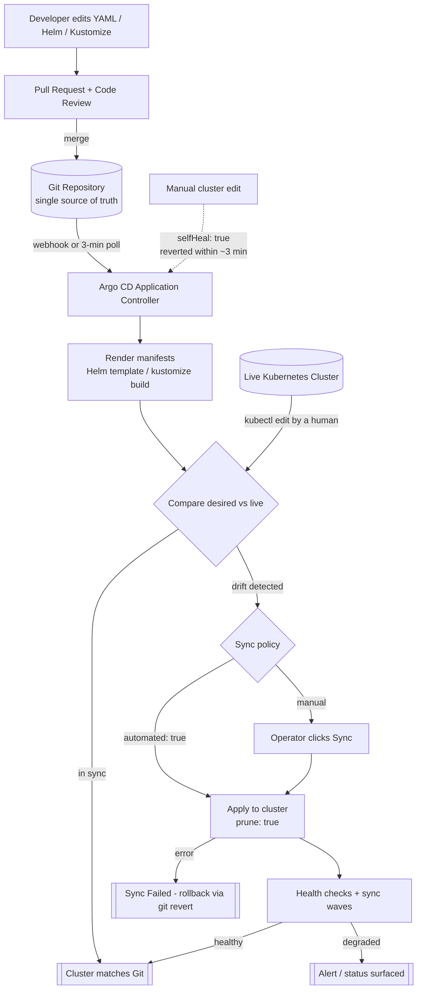

| Difficulty | Channel | Tags |
|---|---|---|
| beginner | devops | argocd, flux, declarative |

At 3am, an engineer at a large identity company ran one `kubectl scale` command that no commit ever recorded — and ninety minutes later, an automated release silently undid it. That is drift, and it is why GitOps exists. Okta’s Auth0 private-cloud team learned this at fleet scale: their first platform ran 12 Kubernetes clusters with manual, operator-driven updates, then they rebuilt it around Argo CD and grew to nearly 1,000 clusters and over a million resources with hundreds of daily deploys [1]. Here is how Argo CD auto-sync, self-healing, and the declarative-vs-imperative split actually work — and the one setting that quietly bites most teams.

---

> ### Real-World Case — Okta (Auth0 private-cloud / OffZero CIC platform)
>
> Okta's Auth0 team had to offer a single-tenant private cloud to large enterprise customers, and their first version was 12 Kubernetes clusters with Snowflake configs, manual operator-driven updates, weak access controls and code on VMs. As demand grew they rebuilt the platform cloud-native around Argo CD + Argo Workflows + Terraform, and within five years the fleet went from 12 clusters to nearly 1,000 — roughly one whole customer cluster per Argo CD Application, hundreds of daily deploys and millions of Kubernetes resources.
>
> | | |
> |---|---|
> | **Challenge** | Make declarative GitOps reconciliation survive at fleet scale: a single Argo CD instance had to keep 800–2,000 Applications across ~1,000 clusters (1M+ resources, 2M+ K8s resources, 32 app-controller pods, 24 repo-server pods) in sync, while each release bundle contained Terraform code, manifests, plugins and per-customer config that had to be applied in a strict order. |
> | **Solution** | Argo CD handles provisioning/reconciliation (Application CRDs + ApplicationSets + Kustomize as the Git source of truth), Argo Workflows handles deployment orchestration, Terraform handles IaC, and custom control-plane services orchestrate everything. Critically, they did NOT use Argo CD's built-in auto-sync: because Terraform-generated infrastructure determines the config and secrets services need, Terraform must run before the Argo CD sync, and auto-sync can neither honor that dependency nor customer-specific deployment windows. As principal engineer Kahou Lei put it: "we implement our own 'auto-sync' using Argo Workflows plus the control plane." They added controller scaling/sharding, ignore-resource settings, purpose-built CLI tooling, and a CLI wrapper that classifies transient failures (crash loops, sync conflicts, plugin failures, stuck syncs), enforces timeouts and controls retries. |
> | **Outcome** | 12 clusters in 2020 to nearly 1,000 clusters / 1M+ resources / hundreds of daily deploys by 2025, with zero-downtime red-black daily updates across the fleet. "We can safely say that the results now show they can scale over a thousand clusters, up from just a dozen or so a few years ago," says Jérémy Albuixech. Along the way they patched around real upstream defects themselves (a race condition in the application controller, performance issues from untracked resources) and shipped several fixes back to Argo as GitHub PRs. |
> | **Lesson** | Auto-sync is a starting point, not a destination. Once your desired state depends on ordering (Terraform before Argo CD), per-customer deployment windows, or Terraform-generated secrets, a naive auto-sync silently becomes wrong — Okta had to keep Git as the source of truth but drive the sync themselves. The second lesson: at fleet scale the bottleneck isn't the Git model, it's the controller — apps controllers crash under load, the UI degrades and even status output lies, so you need sharding, ignoreDifferences discipline and your own failure-retry wrapper. And the most telling detail: Okta's engineers shipped a Chrome extension to remove Argo UI's "Terminate" button — because Argo's own escape hatch bypassed exit hooks and broke their automation. |

---

## Hook — The 3am revert that never stopped happening

Somewhere around 3am, an on-call engineer at a large identity company runs a routine `kubectl scale deploy` command. It works. It is not supposed to work — there is no commit, no PR, no ticket. Then ninety minutes later someone re-runs the Helm release with the values file from last week, the pod comes back at the old replica count, and a Slack thread starts with the words: “who changed this?”

Sound familiar? That question is the sound of drift, and it is the reason GitOps exists. Many developers assume GitOps is about “deploying from Git” as if Git were a fancy CI runner. It is not. It is about making Git *the only* thing allowed to touch the cluster — and then letting a controller continuously undo anything else that tries.

🔥 Hot take: the winning GitOps platform is not the one with the prettiest UI. It is the one that makes the *imperative* path impossible. Okta's Auth0 private-cloud team learned that lesson the expensive way — their first generation of the platform ran 12 Kubernetes clusters with manual, operator-driven updates and Snowflake-stored config. Within five years of rebuilding around Argo CD, Argo Workflows, and Terraform, that same fleet was nearly 1,000 clusters [1].

So the real question is not “should you adopt GitOps?” It is: what exactly do you hand to Argo CD, and what happens to every `kubectl apply` someone runs behind its back?

## Problem — Two ways to change a cluster, one of them is a trap

Kubernetes hands you two ways to mutate state, and the difference between them is the entire argument.

| | Declarative | Imperative |
|---|---|---|
| You write | A manifest: “Deployment should have 4 replicas” | A command: “set replicas to 4 now” |
| State lives in | Git, reviewable, revertible | Terminal history, maybe muscle memory |
| Drift | Detected and corrected automatically | Detected by a human, weeks later |
| Rollback | `git revert` + sync | Re-derive from memory. Hope. |
| Audit trail | Every commit, every author, every review | “terminal history was cleared” |
| Scales to 12 clusters | Painful | Absurd |

The Kubernetes docs are blunt about this: imperative commands create resources but never record intent [5]. Once you `kubectl edit` a Deployment at 2am to unblock an incident, the cluster and Git have quietly forked into two different realities. Git still says 2 replicas. Production says 6. Nothing will ever tell you.

And here is the part that catches people with about three years of experience: **declarative does not mean “GitOps.”** Plenty of teams commit YAML and then run a pipeline that applies it with a service account. That is imperative infrastructure wearing a declarative costume — the cluster still accepts out-of-band writes, and nothing reconciles them.

⚠️ Watch out: the pain compounds with cluster count. A manual change is fine at three clusters. At three hundred, forgetting where you made it is not a mistake, it is a career-limiting scavenger hunt.

## Real-World Case — Okta (Auth0 private-cloud / OffZero CIC platform)

Okta's Auth0 team needed single-tenant private cloud for large enterprises. The first version was not terrible — it was simply hand-operated. Twelve Kubernetes clusters, configuration living in Snowflake, updates pushed by operators, weak access controls, and some code still running on VMs. Every new customer meant someone repeating the same sequence of manual steps.

Then they rebuilt cloud-native: **Argo CD** for continuous reconciliation, **Argo Workflows** for pipeline orchestration, and **Terraform** to create the clusters themselves. The guiding idea was one Argo CD Application per customer cluster — roughly 1,000 Applications. By 2025 that meant over a million Kubernetes resources and hundreds of deploys per day, with zero-downtime red-black updates across the entire fleet. As Jérémy Albuixech put it, the results show they can scale over a thousand clusters, up from just a dozen a few years earlier [1].

Three details are worth stealing:

- **One Application per tenant.** Not one giant Application managing a thousand clusters. Isolation meant a bad manifest for one customer could not take down the platform's other 999.
- **Hundreds of daily deploys with zero downtime.** This is only possible because sync is a controller, not a script. Red-blue cutovers are a Deployment strategy, and Argo CD just reconciles the new one [3].
- **They became Argo contributors.** They hit a race condition in the application controller and performance problems from untracked resources, patched around it, and shipped fixes upstream as pull requests [1]. At 1,000 Applications you stop being a GitOps *user* and start being a GitOps *maintainer*.

💡 Insight: GitOps is not a free upgrade in simplicity. At 12 clusters, `kubectl apply` is genuinely fine. The math inverts somewhere between 50 and 100 clusters — which is exactly the inflection Okta hit.

## Deep Dive — Reconciliation, auto-sync, and the self-healing trap

Argo CD is a **reconciliation controller**. The mental model is simpler than the docs suggest: it continuously asks “does the live cluster match the manifests in Git?” and if not, it pushes it back into line. The Git commit is the desired state; the cluster is the thing being argued with [3].

### The three Application knobs that matter

```yaml
spec:
  syncPolicy:
    automated:            # auto-sync: Git changes roll out without a human
      prune: true        # delete cluster resources Git no longer defines
      selfHeal: true     # revert manual drift in the cluster
    syncOptions:
      - CreateNamespace=true
      - PruneLast=true
```

- **`automated`** — Git becomes trigger. Argo CD polls the repo (via webhook in practice, poll every 3 minutes as a fallback) and syncs when HEAD moves [2].
- **`prune: true`** — Without it, deleting a Deployment from Git leaves the Deployment running forever. This is the setting people forget and then discover from a security audit.
- **`selfHeal: true`** — The interesting one. Someone `kubectl edit`s a replica count; Argo notices within its health check interval (commonly 3 minutes) and reverts it [8].

### The plot twist: self-healing can be hostile

Many developers enable `selfHeal: true`, celebrate, and then get paged at 4am because their emergency hotfix was reverted 90 seconds after they applied it. Self-healing does not know about incidents. It knows about Git. So the correct answer is to **never hotfix outside Git** — branch, patch, push, let it sync. If that sounds rigid, remember: the alternative is permanent drift.

### Sync phases and waves

Argo CD syncs in ordered phases: hooks (PreSync) → resources → sync waves → health checks → hooks (PostSync). `argocd.argoproj.io/sync-wave` annotations let you express “migrations before the app” or “app before smoke tests” declaratively [7]. This is the escape hatch that keeps teams from bolting on a homegrown orchestrator — and it is why Argo Workflows pairs so naturally with Argo CD in Okta's platform [1].

### Declarative vs imperative, one last time

Declarative wins on repeatability, auditability, and rollback because Git already gave us version control, review, and merge conflict detection. Imperative wins on exactly one axis: speed of typing. That is the whole trade-off. Everything else — environments that match, rollbacks that take ten seconds, audits that take ten minutes instead of ten days — is GitOps.

Flux is the other major player here and takes the same reconciliation approach with a different API surface [10]. Either works. Mixing both on one cluster is the one choice that reliably produces confusion.

## Workflow — From repo to reconciled cluster

The **GitOps Reconciliation Loop** diagram below is the whole system. A developer commits, a webhook fires, Argo CD diff desired-vs-live, and either it converges or it reports the diff to a human.

The sequence in practice:

1. **Commit the desired state.** YAML, Helm, or Kustomize [12]. Kustomize overlays are the sweet spot for microservices — one base, one overlay per environment, zero templating language to argue about.
2. **Register an Application.** Point `source.repoURL` at Git, `source.path` at the manifest directory, and set `destination.namespace`.
3. **Turn on automated sync** with `prune` and `selfHeal`, as above [2].
4. **Gate on sync waves** for ordering, and use `argocd app wait` in CI so your pipeline knows when the cluster has actually converged [7].
5. **Read drift, don't guess.** `argocd app diff` and the UI's diff view show exactly what would change before it happens [8].
6. **Roll back with a revert**, not with kubectl. `git revert` is your fastest known-state restore [6].
7. **Scope blast radius with Projects and RBAC** so one team's Application cannot manage another team's namespace [11].

✅ Pro tip: enable sync on empty, brand-new namespaces first. Self-heal with no `prune` surprises is a far cheaper way to learn what your manifests actually create.

## Code Example — Bootstrapping Argo CD, an Application, and CI that waits for convergence

The bash below is the production pattern: install Argo CD, declare the Application as a checked-in manifest, apply it declaratively, then use the CLI for drift inspection and CI gating. Nothing in here mutates workload state directly — every change flows through Git.

Key lines worth noting: `prune: true` so removed manifests actually delete resources; `selfHeal: true` so the 2am hotfix gets reverted automatically; `CreateNamespace=true` so a missing namespace is created; and `argocd app wait` at the end so CI fails loudly instead of shipping and hoping.

The one thing this script deliberately does **not** do is `argocd app sync --force`. Forcing a sync destroys Argo CD's optimistic-lock guarantee. With `selfHeal` on, a forced sync is also the fastest way to revert your own hotfix without reading the docs.

## Lessons Learned — What to do differently tomorrow

**1. Declarative everything, including the Application itself.** Okta's lesson was that Argo CD Configuration Management (declaring Applications from Git) is what makes the model scale past a handful of clusters [1]. Application specs are just YAML — put them in Git.

**2. One Application per bounded unit of ownership.** A shared mega-Application means one bad PR touches everyone. Okta landed at roughly one Application per customer cluster for exactly this reason.

**3. Never fix production outside Git.** This is the battle scar that bites most teams. Self-heal *will* revert you; that is the feature working. Branch, patch, push, let the controller do its job.

**4. Measure drift, don't assume there is none.** A weekly `argocd app diff` sweep across all Applications turns “nobody knows what changed” into a ticket. Okta only found upstream controller bugs because they were running at a scale where inefficiency became impossible to ignore [1].

**5. Start with prune, graduate to self-heal.** Enabling `selfHeal` before your manifests are complete turns a half-finished migration into a cluster that fights back.

The takeaway that survives every environment: **GitOps is not a deployment tool, it is a permissions model.** Kubernetes RBAC says who *may* touch a cluster; GitOps says who *actually* can, because the API server only accepts writes from the Argo CD controller's service account. Everything else — auto-sync, self-healing, one-Application-per-tenant, rollbacks in ten seconds — is a side effect of getting that one decision right.

---

## GitOps Reconciliation Loop (Argo CD)



<details>
<summary><strong>Original Interview Question</strong></summary>

**Q:** You're setting up GitOps for a microservices deployment. How would you configure ArgoCD to automatically sync changes from your Git repository to Kubernetes, and what's the difference between declarative and imperative approaches in this context?

**A:** I'd configure ArgoCD by setting up a Git repository containing Kubernetes manifests or Helm charts, creating an Application CRD that points to the Git repository, enabling auto-sync with a health check interval of 3 minutes, and implementing self-healing to automatically revert any manual changes. The declarative approach involves defining the desired state in Git through YAML manifests, Helm charts, or Kustomize configurations, where ArgoCD continuously reconciles the actual state with the desired state. In contrast, the imperative approach uses kubectl commands to make direct changes to the cluster, bypassing the Git repository as the single source of truth.

</details>

## Conclusion

Okta’s trajectory is the argument for GitOps in one line of data: 12 clusters to nearly 1,000, with hundreds of daily deploys and zero downtime [1]. So here is what to do tomorrow, in order: put your manifests in Git, register an Argo CD Application with `automated`, `prune: true`, and `selfHeal: true`, add `argocd app wait --sync --health` to your pipeline so deploys actually verify convergence, and delete `kubectl edit` from your runbook. If you want the one-liner to share with your team: **GitOps is not a deployment tool, it is a permissions model — because only the controller’s service account should ever hold write access to your clusters.** Everything else is a side effect.

---

## References

1. [Okta (Auth0 private-cloud / OffZero CIC platform) incident report](https://thenewstack.io/how-okta-scaled-from-12-to-1000-kubernetes-clusters-with-argo-cd) — article
2. [Argo CD — Automated Sync and Self-Heal](https://argo-cd.readthedocs.io/en/stable/user-guide/auto_sync/) — documentation
3. [Argo CD — Application Specification](https://argo-cd.readthedocs.io/en/stable/user-guide/application-specification/) — documentation
4. [Argo CD — GitHub Repository and Issue Tracker](https://github.com/argoproj/argo-cd) — documentation
5. [Kubernetes — Imperative vs. Declarative Management](https://kubernetes.io/docs/reference/using-api/declarative-vs-imperative/) — documentation
6. [Kubernetes — Declarative Management of Objects Using Configuration Files](https://kubernetes.io/docs/tasks/manage-kubernetes-objects/declarative-config/) — documentation
7. [Argo CD — Sync Phases and Sync Waves](https://argo-cd.readthedocs.io/en/stable/user-guide/sync-waves/) — documentation
8. [Argo CD — Diffing Custom Configuration](https://argo-cd.readthedocs.io/en/stable/user-guide/diffing/) — documentation
9. [Wikipedia — GitOps](https://en.wikipedia.org/wiki/GitOps) — documentation
10. [Flux CD — GitHub Repository](https://github.com/fluxcd/flux2) — documentation
11. [Argo CD — Projects and RBAC](https://argo-cd.readthedocs.io/en/stable/user-guide/projects/) — documentation
12. [Kustomize — GitHub Repository](https://github.com/kubernetes-sigs/kustomize) — documentation

---

**Author:** Satishkumar Dhule — [GitHub](https://github.com/satishkumar-dhule) · [LinkedIn](https://linkedin.com/in/satishkumar-dhule) · [Website](https://satishkumar-dhule.github.io)
