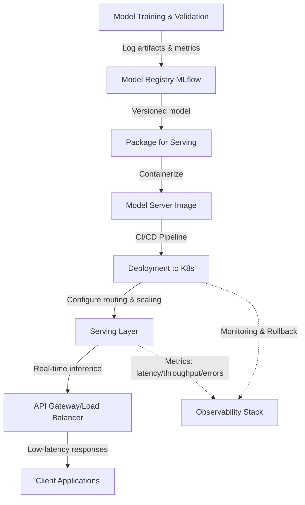

| Difficulty | Channel | Tags |
|---|---|---|
| beginner | devops | mlops, deployment |

Ever wonder why a model that predicts perfectly in your Jupyter notebook suddenly falls apart the moment real users hit it? For Uber, this wasn't a hypothetical question — it was an existential one. As their business scaled globally, they needed to power surge pricing, ETAs, fraud detection, and matching for millions of daily trips, all driven by machine learning [1]. That pressure forced them to learn the hard difference between just getting a model into production and actually serving it reliably under fire. And if you're building ML systems, you'll need to learn that same lesson sooner rather than later.

---

> ### Real-World Case — Uber
>
> Uber needed to power dynamic pricing (surge), ETA predictions, fraud detection, and rider-driver matching with machine learning at global scale. As ML adoption exploded across teams, they faced an exponential increase in models moving to production with diverse latency, throughput, and scaling requirements.
>
> | | |
> |---|---|
> | **Challenge** | Existing ML tooling couldn't support deploying and serving thousands of models with the low-latency, high-availability demands of real-time ride-matching and pricing decisions, leading to brittle, ad-hoc deployment pipelines and inconsistent serving patterns. |
> | **Solution** | Uber built Michelangelo, an end-to-end ML platform that cleanly separates deployment and serving concerns. For deployment, Michelangelo provides model management, versioning, CI/CD workflows, and reproducible pipelines to package and promote models. For serving, it offers a high-performance online prediction service that loads models into memory, handles request routing, supports A/B testing and canary rollouts, and autoscales to meet demand with low-latency inference. |
> | **Outcome** | Michelangelo became mission-critical to Uber's operations, powering over 10,000 models in production across the business and serving real-time predictions at massive scale to support pricing, ETAs, and matching for millions of trips daily with strict latency requirements. |
> | **Lesson** | Separating model deployment (lifecycle, packaging, rollout) from model serving (runtime inference, routing, scaling) enables ML platforms to support extreme scale and velocity while meeting production SLOs for latency and availability. |

---

## Hook — The Night The Model Broke Under Load

Picture this: your freshly trained model just passed all validation tests. The metrics look beautiful. You push it to production with confidence. Then traffic spikes, latency explodes past SLAs, and suddenly your elegant neural net is bringing down critical user flows. Sound familiar? This is the moment many developers realize that training a model and operating it in the wild are entirely different beasts. The stakes couldn't be higher — when ML drives core business logic, poor serving can mean lost revenue, broken trust, and angry users at 2 AM. But before diving into solutions, you need to understand what exactly is breaking.

## Problem — Deployment vs Serving: Two Different Worlds

Many developers think 'model deployment' and 'model serving' are interchangeable terms. They're not. This confusion causes teams to build brittle pipelines, overprovision expensive infrastructure, or worse — ship models that can't meet real-time requirements. The core challenge is that deployment is about getting your model artifact into the right environment safely, while serving is about answering inference requests fast and reliably once it's there. Deployment is the plumbing, CI/CD, and infrastructure. Serving is the runtime that actually responds to user queries. Getting them mixed up leads to systems that either deploy slowly with no rollback safety, or serve requests with high latency and no autoscaling. You need both working in concert. But how do battle-tested teams handle this in practice?

## Real-World Case — Uber's Michelangelo Platform

Uber's story illustrates this perfectly. As ML adoption exploded across the company, they faced an exponential increase in models moving to production with wildly diverse latency, throughput, and scaling needs [1]. Their answer was Michelangelo — an internal ML platform built to standardize how models are trained, deployed, and served. It became mission-critical, ultimately powering over 10,000 models in production and serving real-time predictions at massive scale for pricing, ETAs, and matching across millions of trips daily [1]. The impact was transformative: teams could ship models faster while meeting strict latency SLAs. But more importantly, it proved that treating deployment and serving as distinct concerns with purpose-built tooling is non-negotiable when operating ML at global scale.

## Deep Dive — Key Differences, Tech, and Trade-offs

So what exactly separates deployment from serving? Deployment encompasses the full lifecycle of getting a model ready for production: infrastructure provisioning, CI/CD pipelines, environment configuration, monitoring setup, and rollback strategies [2][3]. It's about reproducibility and safety. Tools like Kubernetes, Docker, Terraform handle orchestration and infrastructure-as-code [4][5]. MLflow tracks experiments and model versions, while SageMaker and Vertex AI provide end-to-end managed workflows [6][7][8]. Serving, on the other hand, is runtime-focused. It handles model loading, request routing, input preprocessing, inference execution, response formatting, and scaling based on load [9][10]. Frameworks like TensorFlow Serving, TorchServe, and BentoML are purpose-built for low-latency inference [10][11][12]. For custom APIs, FastAPI and Flask are common, often fronted by gRPC for high-throughput internal calls [13][14][15]. The trade-offs are critical: batch vs real-time inference, latency vs throughput, cold starts vs always-on, and horizontal vs vertical scaling. For user-facing features like ETA predictions or pricing, you often need sub-100ms latency with high QPS [16]. For offline jobs, throughput matters more. You also need A/B testing, canary rollouts, and gradual traffic shifting. These aren't nice-to-haves — they're essential for de-risking model updates.

## Workflow — From Training to Production at Scale

A robust workflow treats deployment and serving as separate but connected pipelines. First, you train and validate your model, logging artifacts and metrics (MLflow). Next, you package the model in a containerized serving format — this is where serving frameworks shine. Then comes deployment: push the image through CI/CD, provision infrastructure (often Kubernetes), and configure routing. Finally, the serving layer takes over, handling live inference with autoscaling based on load. The diagram below illustrates this flow. As you move from left to right, notice the handoff: deployment sets up the stage, serving performs the show under real traffic.

## Code Example — A Production-Ready Model Serving API

The theory is clear, but code makes it concrete. Below is a minimal but production-minded FastAPI server for model serving. It demonstrates versioned model loading, health checks, request validation, and proper response formatting — all patterns you'd need when moving beyond toy examples. Each section is commented to show why it matters.

## Lessons Learned — Building ML Systems That Actually Work

If there's one lesson from Uber's journey, it's this: model serving and model deployment solve different problems and require different tools [1]. Deployment is your safety net — reproducible builds, rollbacks, and infrastructure automation. Serving is your performance engine — low latency, high throughput, and graceful scaling. The biggest mistake teams make is conflating them. Another common pitfall is ignoring cold starts in serverless serving or under-provisioning for traffic spikes. You also can't skip observability — track latency, error rates, prediction drift, and resource utilization from day one. Most importantly, design for iteration. Models change constantly; your serving infrastructure must support A/B testing, shadow traffic, and instant rollbacks without downtime. The question isn't 'can we get this model to prod?' — it's 'can we serve it reliably at the scale our users demand?' Start treating deployment and serving as first-class concerns, and you'll build ML systems that don't just work in notebooks, but thrive in production.

---

## ML Model Deployment to Serving Flow

<strong>Original Interview Question</strong>

**Q:** Explain the key differences between model serving and model deployment in ML systems, including specific technologies, scaling considerations, and real-world implementation patterns?

**A:** Deployment encompasses CI/CD pipelines, infrastructure setup, and monitoring using tools like Kubernetes, MLflow, and SageMaker. Serving focuses on runtime inference APIs with frameworks like TensorFlow Serving, TorchServe, or BentoML, handling request routing, model versioning, and autoscaling. Key trade-offs include latency vs throughput, batch vs real-time inference, and cold start optimization.

## Conclusion

The difference between deployment and serving isn't academic — it's what separates prototypes from production-grade ML systems. Start by treating them as distinct concerns: use deployment tooling for safe rollouts and reproducibility, and purpose-built serving for low-latency inference at scale. Your models deserve more than just making it to prod; they deserve to serve users reliably when it matters most.

---

## References

1. [Uber incident report](https://eng.uber.com/michelangelo-machine-learning-platform/) — article
2. [What is CI/CD? - Red Hat](https://www.redhat.com/en/topics/devops/what-is-ci-cd) — documentation
3. [Continuous delivery - Wikipedia](https://en.wikipedia.org/wiki/Continuous_delivery) — documentation
4. [Kubernetes Documentation](https://kubernetes.io/docs/home/) — documentation
5. [Docker Documentation](https://docs.docker.com/) — documentation
6. [MLflow Documentation](https://mlflow.org/docs/latest/index.html) — documentation
7. [Amazon SageMaker Documentation](https://docs.aws.amazon.com/sagemaker/) — documentation
8. [Google Vertex AI Documentation](https://cloud.google.com/vertex-ai/docs) — documentation
9. [TensorFlow Serving GitHub Repository](https://github.com/tensorflow/serving) — documentation
10. [TorchServe GitHub Repository](https://github.com/pytorch/serve) — documentation
11. [BentoML Documentation](https://docs.bentoml.com/) — documentation
12. [FastAPI Documentation](https://fastapi.tiangolo.com/) — documentation

---

**Author:** Satishkumar Dhule — [GitHub](https://github.com/satishkumar-dhule) · [LinkedIn](https://linkedin.com/in/satishkumar-dhule) · [Website](https://satishkumar-dhule.github.io)
