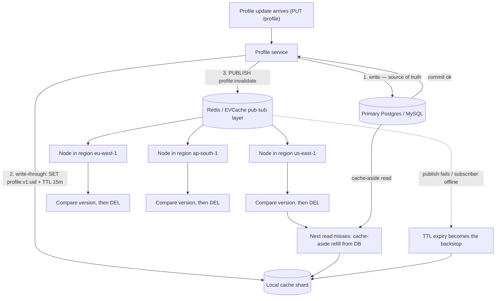

| Difficulty | Channel | Tags |
|---|---|---|
| beginner | backend | redis, memcached, cache-invalidation |

A user changes their display name at 2am on a Tuesday, and for the next six hours every server in every region keeps cheerfully serving the old one. This is not a hypothetical — Netflix hit exactly this wall while running member metadata through EVCache, an open-source distributed cache built almost entirely on plain Memcached [1]. The uncomfortable lesson from that scaling story is that cache invalidation is not a data problem; it is a distributed systems problem wearing a very cheap disguise. Here is how to get it right without shipping stale profiles to millions of users.

---

> ### Real-World Case — Netflix
>
> Netflix caches member data (personalization, viewing history, profile-adjacent metadata) in EVCache, its open-source distributed cache built almost entirely on plain Memcached. As Netflix expanded globally, the same cache entry existed in every region, so a profile/metadata update in one region had to be reflected everywhere — and Memcached has no pub/sub, no persistence, and no cross-node coordination primitives. Their first approach (replicating full key listings so new nodes could warm up) forced them to retain key metadata for the entire TTL, which 'up to a few weeks' and made invalidation dedup extremely painful.
>
> | | |
> |---|---|
> | **Challenge** | Propagating cache invalidation (deletes and overwritten values) across Memcached shards, availability zones and4 regions, without building a pub/sub layer, while hitting ~1ms p99 latency and never serving stale data after a write. |
> | **Solution** | They added invalidation/replication into the topology-aware EVCache client instead of the cache server: on any SET/DELETE/TOUCH the client writes locally, publishes key+TTL metadata (not the value) to Kafka, and a reader service fetches the current value from the local region and writes it into the remote region's cache, with failed mutations parked in SQS for retry. For some caches they deliberately ship only a DELETE to the other regions rather than the new value, so the remote GET becomes a clean cache miss. They later added memcached extstore to spill cold keys to SSD/NVMe instead of evicting them, and replaced the Kafka key-replication cache warmer with an S3 dump/populate pipeline built on Memcached's LRU crawler. |
> | **Outcome** | EVCache runs ~200 Memcached clusters across 22,000 server instances in 4 regions, serving ~400M ops/sec and ~30M cross-region replication events, holding ~2 trillion items totaling 14.3 PB (2016 numbers: 30M req/sec peak, ~2 trillion requests/day, 1.5M+ Kafka messages/sec). Batch Zstandard compression of replication payloads cut cross-region network bandwidth ~35%; replacing NLBs with Eureka DNS-based client-side routing dropped NLB traffic from ~45 GB/s to under 100 MB/s. Cache hit rates typically exceed 99% with single-digit-ms latency. |
> | **Lesson** | Choosing Memcached buys you raw throughput, tiny memory overhead and dead-simple horizontal scaling — but you pay for it with infrastructure you must build yourself. Netflix built Kafka, SQS, reader/writer services and an S3-based warmer purely to get the invalidation/fan-out behavior that Redis pub/sub would have given for free. And their own counter team abandoned Memcached for exactly that reason: EVCache/Memcached 'lacks cross-region replication for the increment operation and does not provide consistency guarantees,' pushing them onto Kafka + Cassandra rollups. The generalizable rule: treat TTL as your staleness safety net, delete-on-write rather than overwrite-everywhere, and never let a cache write be the source of truth. |

---

## Hook — The 2am Profile That Would Not Update

Every developer has a caching bug story. Someone's teammate changed their name, refreshed, and the old name came back like a ghost. In a single-node app that is an embarrassing bug report. In a globally distributed service it becomes an architectural failure with a latency bill attached.

Sound familiar? The instinct is always the same: add a cache, set a TTL, ship on Friday. And that instinct is right about 90% of the time — until the data is written in one place and read in forty.

The uncomfortable question is not "how do I cache a profile?" It is **"who is responsible for deleting the copy of that profile that I cannot see?"** In a single process, that answer is trivially "me." Across regions, hosts, and processes, that answer is "nobody, unless you build it."

Netflix built it. Their write-up on global caching with EVCache [1] is a rare, honest look at what happens when a Memcached-based cache meets 22,000 servers. Here is the thing though: the fix is not exotic infrastructure. It is a handful of small decisions, made deliberately, about write paths, TTLs, and who gets to broadcast.

## Problem — One Write, Forty Copies, Zero Owners

Picture a profile service. Reads dominate — every page render, every personalized recommendation, every session refresh pulls the profile. Writes are rare: a bio change, an avatar upload, a name correction. That asymmetry is exactly why caching works, and exactly why invalidation hurts. A read-heavy service accumulates a huge population of cached copies, and a single write has to reach all of them.

The three classic failure modes that follow:

- **Stale reads** — the user sees the old name. Support tickets arrive. The on-call engineer suspects the database, which is innocent.
- **The thundering herd (cache stampede)** — the moment you delete a hot key, every concurrent request misses simultaneously and stampedes the primary database. The cache, designed to protect you, becomes the weapon.
- **The update race** — a slow node repopulates the cache with data it read *before* your write landed, silently resurrecting the stale value. This is the nastiest one, because the invalidation ran, the log shows a successful DEL, and the bug is still there.

⚠️ **Watch Out:** the race above is why "write the new value into the cache on update" feels safer than "delete the key" but is not. A concurrent read that started earlier will finish later and clobber your fresh write with a stale one. Deleting is boring, and boring is correct here.

Now stack on the fact that your cache is not one process. If you run multiple app instances behind a load balancer, every instance can hold its own copy. If those instances span regions — and Netflix's certainly did, serving ~30M cross-region replication events per day across 4 regions [1] — then a single user update has become a distributed consensus problem wearing a cache API costume.

## Real-World Case — Netflix

Netflix needed a distributed cache that could serve personalization data, viewing history, and profile-adjacent metadata at continental scale. They built **EVCache**, open-sourced and sitting on top of plain Memcached, and it now runs roughly **200 Memcached clusters across 22,000 server instances in 4 regions**, handling on the order of **400M operations per second** and holding about **2 trillion items totaling 14.3 PB**, with hit rates above 99% and single-digit-millisecond latency [1].

The lesson: Memcached scaled beautifully as a *store*. It fell short as a *coordination layer*. Memcached has no pub/sub, no persistence, and no cross-node notification primitives, so a profile or metadata update in one region had no native way to tell the other three that anything changed.

Netflix's first approach for warming newly added nodes was to replicate full key listings. That forced them to retain key metadata for the entire TTL window — reportedly "up to a few weeks" — which made deduplicating invalidations enormously painful [1]. The strategy that stuck was moving replication and invalidation traffic off the data path entirely, and trimming payloads: batch Zstandard compression of replication payloads cut cross-region network bandwidth by roughly **35%**. Separately, replacing network load balancers with Eureka-based DNS client-side routing dropped NLB traffic from about **45 GB/s to under 100 MB/s** [1].

🔥 **Hot Take:** those two numbers — 35% bandwidth and 45 GB/s → 100 MB/s — are not caching wins. They are *coordination* wins. The cache data path was never the bottleneck. The invalidation and discovery plumbing was. If your profiling ever points at "the cache," check whether you actually mean the chatter around the cache.

## Deep Dive — Write-Through, TTLs, and the Delete-vs-Write Question

Let's get concrete about the mechanics, because "just use write-through" is only half an answer and the other half is where outages live.

**The two read patterns.** *Cache-aside* (lazy loading) is the default: read the cache, on miss read the database and populate the cache. It protects the database from cold-start traffic floods because only the requests that actually miss touch it. *Write-through* means the cache is updated as part of the write path, so reads never see a miss caused by your own write. Combining them — cache-aside reads plus write-through writes — is the standard profile-service shape.

**The TTL is your safety net, not your strategy.** Profiles are read-mostly and tolerate staleness in the low-seconds-to-minutes range, so 5–30 minutes is a defensible window. But notice what a TTL actually buys you: it bounds the *damage*, not the correctness. If your invalidation path is broken, a TTL turns "users see stale data forever" into "users see stale data for at most 15 minutes." That is the single most underrated reason to set a TTL even on a cache you think you are invalidating perfectly.

| Approach | Read latency | Stale window | Failure mode |
|---|---|---|---|
| Delete on write | One extra miss | Until next refill | Stampede on hot keys |
| Write-through on write | Lowest | None, in theory | Update race from slow readers |
| Delete + TTL only | One extra miss | Bounded by TTL | Simple, eventual |
| Versioned write-through | Lowest | None | Requires version comparison |

**The version guard is the plot twist.** Memcached exposes `gets`/`cas`, Redis exposes optimistic locking and Lua scripting, and RFC 7234's conditional-request model is the same idea in HTTP form [6]. The point is to never blindly delete on a delayed event. Tag every cached value with a monotonically increasing version (a `updated_at` timestamp in nanoseconds or a per-entity counter), and on receiving an invalidation, compare before you delete. A late subscriber then cannot clobber a newer value.

**Now the trade-off you were actually asked about.**

| Dimension | Redis | Memcached |
|---|---|---|
| Distributed invalidation | Native pub/sub, streams, client-side caching | None — you coordinate it yourself |
| Persistence | Optional (RDB snapshots, AOF) | None, by design |
| Data structures | Strings, hashes, sets, sorted sets, streams | Strings only |
| Memory overhead | Higher per key | Lower per key |
| Raw caching throughput | Excellent | Marginally better on pure get/set |
| Operational complexity | More moving parts | Deliberately boring |

The honest summary: **choose Memcached when caching is the whole job** — pure key/value lookups, no cross-node coordination, lowest memory overhead, simplest horizontal scaling. Netflix's EVCache is the proof that this scales to extraordinary size [1][3]. **Choose Redis when invalidation is part of your job** — because pub/sub and streams give you a built-in way to fan out an invalidation event to every node, and persistence plus sorted sets unlock patterns (versioned keys, distributed locks, rate limiters) that Memcached simply cannot express [2][8].

The counterintuitive part: many teams pick Redis for pub/sub and then never use it, still shipping delete-only invalidation. The choice of datastore does not make your invalidation correct. The code does.

## Workflow — The Invalidation Pipeline, End to End

Putting the pieces together, here is the sequence the code example below implements. The Mermaid diagram (**System Flow: Write Path and Cross-Node Fan-Out**) shows the same path visually — database first, local write-through second, broadcast third, TTL as the backstop.

**Step 1 — Database first, always.** The primary store is the source of truth. If the write fails, you return the error and touch no cache. Never let a cache write succeed against a database write that failed; that is how you get a cache that confidently serves data that does not exist.

**Step 2 — Local write-through.** Write the fresh value into the cache this node serves, with a TTL. This keeps the write path fast for the instance that handles the update. If this write fails, log it and move on — the TTL and the broadcast will still clean up.

**Step 3 — Broadcast the invalidation.** Publish `{key, version, region}` to a channel. Redis pub/sub gives this to you for free [2]; the publish–subscribe pattern in general is the canonical way to decouple a writer from readers it does not know about [7]. At Netflix's scale the equivalent hop is a log-based replication stream rather than raw pub/sub [1].

**Step 4 — Compare, then delete.** Every subscriber fetches the local copy, compares versions, and only deletes if its copy is not newer. This is the guard that kills the update race.

**Step 5 — Repair the stampede.** When a hot key is invalidated, the next N requests will all miss at once. Mitigate with a short randomized TTL jitter, a per-key mutex (single-flight) so only one goroutine refills, or a stale-while-revalidate pattern where the cache briefly serves a slightly stale value while one loader refreshes in the background.

**Step 6 — Watch the numbers.** Hit rate, miss rate, evictions, key size distribution, invalidation publish failures, and DB load during miss spikes. Netflix's own reporting shows hit rates above 99% [1] — below roughly 95%, you are paying for a cache you are not using.

One more architectural note, because it surprised people: **evictions are a signal, not a weather event.** If Redis or Memcached is evicting keys under memory pressure, your TTL is the only thing keeping you correct. Size the cache, or accept that you are running a very expensive database with extra hops.

## Code Example — Write-Through with Version-Gated Pub/Sub Invalidation

Below is a compact Go implementation of the full flow. The interfaces are deliberately narrow (`Cache`, `DB`) so the same service logic runs against Redis in production and an in-memory fake in tests — which is the only practical way to unit-test a race condition you cannot reliably reproduce in staging.

The three design decisions worth stealing are all visible in the code: database write happens before any cache write, invalidation carries a version, and publish failure is logged as an error but never returned as one, because a dead pub/sub channel must degrade to TTL-bounded staleness rather than a failed profile update.

## Lessons Learned — Battle Scars and Tomorrow's To-Do

Here is the distilled playbook, ordered by how much pain each item prevents.

⚠️ **Battle scars:**

- **Deleting the cache after the DB write and returning an error if the delete fails.** You have now made a cache a hard dependency of your primary data path. Invalidation is best-effort by definition; the TTL is the guarantee.
- **Write-through without a version guard.** You will ship the update race, and it will only reproduce in production, under load, intermittently, for weeks.
- **Forgetting TTL jitter.** Every key written in the same second by the same batch expires in the same second. That is a self-inflicted stampede, and it shows up as a periodic latency spike rather than a clean incident.
- **Assuming pub/sub delivery is guaranteed.** Redis pub/sub is fire-and-forget: a subscriber that is briefly disconnected misses the event [2]. If a missed invalidation is unacceptable, use Redis Streams or a log, or lean on the TTL.
- **Unbounded key cardinality.** Caching `profile:uid:{id}:preferences:v{n}` where `n` changes creates a memory leak with a TTL attached. Two trillion items and 14.3 PB at Netflix scale is exactly this failure mode at planetary scale [1].

🎯 **Key points to take back to your team:**

1. TTL is a blast-radius limiter. Set it even if invalidation is perfect.
2. Version your cached values. Compare before you delete, on both the publish and consume side.
3. Pick Memcached for pure caching speed and simplicity; pick Redis when invalidation, durability, or richer data structures are part of the design [2][4][5].
4. Delete beats update for single-key invalidation, because it cannot be clobbered by an in-flight read.
5. Guard the refill, not just the invalidate — stampedes are the most common cache outage.

**The one-sentence version to share with your team:** cache invalidation is not a delete, it is a versioned, version-checked, TTL-bounded broadcast — and the TTL is what keeps you honest when the broadcast fails.

---

## System Flow: Write Path and Cross-Node Fan-Out

<strong>Original Interview Question</strong>

**Q:** You're building a user profile service that caches frequently accessed profiles. How would you implement cache invalidation when a user updates their profile, and what trade-offs would you consider between Redis and Memcached?

**A:** Implement write-through caching with TTL-based expiration. On profile update, invalidate the cache by deleting the key and writing new data to both the database and cache. Redis offers pub/sub for automatic distributed invalidation, while Memcached requires manual coordination across nodes.

## Conclusion

Cache invalidation fails in the gap between what you wrote and what someone else already cached — and that gap is exactly where Netflix lived for years: 22,000 Memcached instances, 4 regions, 2 trillion items, and no primitive in the datastore to say "hey, that key changed."

So what do you do differently tomorrow? Three concrete moves. First, audit your write path: confirm the database write happens before any cache write, and confirm invalidation failures are logged rather than returned. Second, add a monotonic version to your cached values and compare before you delete on the consume side. Third, set a TTL on everything and add jitter — not because your invalidation is broken, but because the day it is, a TTL is the difference between a 15-minute annoyance and a permanently broken profile.

And when someone asks Redis or Memcached, the honest answer is: Memcached if caching is the whole job, Redis if invalidation is part of it. Pick deliberately, then write the code that makes the choice matter.

**The memorable line for your team: a cache delete is not a strategy — a versioned, version-checked, TTL-bounded broadcast is.**

---

## References

1. [Netflix incident report](https://netflixtechblog.com/caching-for-a-global-netflix-7bcc457012f1) — article
2. [Redis Pub/Sub documentation](https://redis.io/docs/latest/develop/pubsub/) — documentation
3. [Netflix EVCache — open-source distributed cache for Memcached](https://github.com/Netflix/EVCache) — documentation
4. [Memcached — Wikipedia](https://en.wikipedia.org/wiki/Memcached) — documentation
5. [facebook/memcached — the reference Memcached implementation](https://github.com/facebook/memcached) — documentation
6. [RFC 7234 — Hypertext Transfer Protocol (HTTP/1.1): Caching](https://datatracker.ietf.org/doc/html/rfc7234) — documentation
7. [Publish–subscribe pattern — Wikipedia](https://en.wikipedia.org/wiki/Publish%E2%80%93subscribe_pattern) — documentation
8. [Redis SET command — key expiration (EX/PX) semantics](https://redis.io/docs/latest/commands/set/) — documentation
9. [Cache — Wikipedia (write-back and write-through caching)](https://en.wikipedia.org/wiki/Cache) — documentation
10. [MDN — Cache-Control HTTP header](https://developer.mozilla.org/en-US/docs/Web/HTTP/Reference/Headers/Cache-Control) — documentation
11. [Amazon ElastiCache — What Is Amazon ElastiCache?](https://docs.aws.amazon.com/AmazonElastiCache/latest/dg/WhatIs.html) — documentation
12. [Cache replacement policies — Wikipedia](https://en.wikipedia.org/wiki/Cache_replacement_policies) — documentation

---

**Author:** Satishkumar Dhule — [GitHub](https://github.com/satishkumar-dhule) · [LinkedIn](https://linkedin.com/in/satishkumar-dhule) · [Website](https://satishkumar-dhule.github.io)
