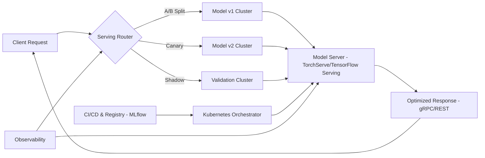

| Difficulty | Channel | Tags |
|---|---|---|
| beginner | devops | mlops, deployment |

Picture this: every time you click play on your favorite show, swipe to the next recommendation, or see a payment attempt get approved, a machine learning model is making a decision in the blink of an eye. For companies operating at global scale, those decisions can happen over one million times per second. This is exactly the challenge that Netflix faced, where their centralized ML model serving platform needed to serve hundreds of model types to over 30 different service clients at a staggering 1M+ RPS [1]. However, the hidden cost of this scale wasn't compute, but the very path that each inference request was forced to take.

---

> ### Real-World Case — Netflix
>
> Netflix built a centralized ML model serving platform so that dozens of domain microservices (recommendations, payment fraud detection, commerce) could get model inference through one API without knowing which model, cluster shard, or A/B cell was behind it. By 2025 the platform served hundreds of model types and versions and was absorbing over 1 million requests per second, with 30+ service clients. The first design put a custom proxy named Switchboard directly in the request path as a mandatory gateway for every inference call.
>
> | | |
> |---|---|
> | **Challenge** | Scale exposed architectural flaws in the serving layer: Switchboard became a shared single point of failure where one noisy tenant or an unintentional bug could degrade multiple ML experiences Netflix-wide, and because it had to deserialize and re-serialize the payload just to make a routing decision, it added 10-20ms of latency plus tail-latency amplification — enough to cause real user-facing timeouts for latency-sensitive clients. It also hid client origin from serving hosts, making it hard to distinguish real production traffic from synthetic/test traffic for retraining and tenant isolation. |
> | **Solution** | Instead of deleting the abstraction, they refactored where the work happened. Switchboard was split into Lightbulb (a decoupled service that resolves only the minimal request context into a routingKey plus an ObjectiveConfig carrying model id) and model-selection config, while actual routing moved into Envoy, the proxy Netflix already ran for all app egress traffic. Envoy reads only the routingKey header to map to the correct cluster VIP and never touches the payload, so the client sends model inputs plus ObjectiveConfig directly to the inference cluster. Serving config and routing rules were also split into separate artifacts, with Switchboard Rules shipped via Netflix's internal pub-sub system (Gutenberg) on an independent release cycle from code, enabling versioning, instant rollback, canary traffic shifts and shadow mode. |
> | **Outcome** | Routing left the hot request path: eliminated the 10-20ms serialization hop and the platform-wide single point of failure, while keeping one integration point, first-class experimentation-platform integration, gRPC endpoints, and domain-specific routing that off-the-shelf API gateways (AWS API Gateway, standalone service mesh proxies) could not provide. The platform continues to serve hundreds of model types and versions at 1M+ RPS across 30+ clients, with real-time A/B traffic splitting, shadow-mode validation against production traffic, and instant rollback to a stable model version. |
> | **Lesson** | The central lesson is that the serving layer's control plane (which model, which experiment, which version) and its data plane (how to get the request there) have different cost and failure characteristics and should be split. Put the expensive, per-payload work — deserialization, enrichment, tenant-specific logic — out of the shared proxy and into the serving host, and let a service-mesh sidecar handle only cheap header-based routing. It also shows the deployment/serving boundary in practice: model lifecycle concerns (versioning, canary, shadow, rollback) live in config published independently of serving code, which is what lets hundreds of model versions ship without touching client apps. |

---

## Hook — When Every Millisecond Becomes Million-Dollar Scale

The secret to high scale engineering isn't always adding more GPUs, but removing unnecessary hops. For Netflix, the initial design placed a custom proxy named 'Switchboard' directly in the hot request path as a mandatory gateway for every inference call [1]. While this may have seemed like a clean abstraction, this single design decision added a 10-20ms serialization hop and created a platform-wide single point of failure for millions of requests. The question then becomes: if the abstraction is slowing you down, is it truly an abstraction worth keeping?

## Problem — The Thin Line Between Deployment and Serving

Before diving into the solution, it's important to understand the root cause of this bottleneck. Many developers think of 'putting a model into production' as one monolithic task, but in reality, two very distinct disciplines are at play: model deployment and model serving. Deployment is the act of shipping, provisioning, and validating models through processes such as CI/CD, infrastructure setup, and monitoring [2][3]. Serving, on the other hand, is the runtime act of answering inference requests, handling routing, versioning, and response optimization under load [4][5]. The confusion between these two realms is what leads to teams overloading their gateways with logic that belongs closer to the serving layer itself.

## Real-World Case — Netflix

Netflix's story perfectly illustrates this divide. With dozens of domain microservices (ranging from recommendations to payment fraud detection and commerce) all needing access to ML models, the engineering team built a centralized ML model serving platform with one unified API [1]. This allowed consumers to integrate without needing to know which model, cluster shard, or A/B test cell was behind it. As the platform grew to serve hundreds of model types and versions for over 30 clients at 1M+ RPS, the mandatory Switchboard proxy began to strain under pressure. By rethinking their routing strategy and moving routing logic out of the hot path, the team eliminated the 10-20ms hop, removed the single point of failure, and still retained first-class experimentation, gRPC endpoints, and domain-specific routing that off-the-shelf gateways simply could not provide [1]. Furthermore, this allowed for real-time A/B traffic splitting, shadow-mode validation against production traffic, and instant rollback to a stable model version [1].

## Deep Dive — The Tradeoffs That Define Production ML

This realignment begs the question: how should teams structure these systems moving forward? When it comes to deployment, tools such as Kubernetes [2], MLflow [3], and Amazon SageMaker [6] allow for reproducible builds, canary releases, and rollback strategies. For serving, purpose-built runtimes like TensorFlow Serving [4], TorchServe [5], and BentoML [7] shine at low-latency request routing, model loading, and batching. However, with these choices come tradeoffs. Latency-sensitive use cases (such as fraud detection) may require sub-50ms real-time inference, whereas offline recommendations can tolerate batch windows [8]. Scaling must be considered both horizontally (through pod replicas) and vertically (by GPU/CPU allocation) [2]. Lastly, protocols matter: while REST may be easy to adopt, gRPC provides significant latency and serialization benefits for high-throughput microservices [6], a factor that directly contributed to Netflix's design decisions [1].

## Workflow — From Build to Inference

So, how can these pieces come together without repeating Netflix's initial bottleneck? A battle-tested workflow looks like this: first, models are trained and versioned, with metadata tracked through a registry such as MLflow [3]. Second, they are containerized and deployed through a CI/CD pipeline onto an orchestrator like Kubernetes [2]. Third, and most critically, a purpose-built model server (e.g., TorchServe [5] or TensorFlow Serving [4]) loads the model, exposing an optimized gRPC or REST endpoint. Fourth, routing decisions such as A/B splits, shadow traffic, or canary rollouts are handled at the serving layer or through a specialized router, not a generic, synchronous proxy in the critical path [1][7]. Finally, observability is implemented to track latency, throughput, error rates, and model drift to enable instant rollbacks [8]. The following architecture visually represents this optimized flow.

## Code Example — A Lightweight Inference Service

Theory is great, but seeing this in practice solidifies the separation of concerns. The code below showcases a minimal, production-minded FastAPI service that loads a model at startup, exposes a gRPC-friendly prediction endpoint, and structures its logic for easy versioning. This pattern keeps business logic out of a generic gateway, allowing for horizontal scaling and tight integration with model servers like TorchServe or BentoML [5][7].

## Lessons Learned — Avoid the Hot Path Trap

After following this journey from a million-request bottleneck to an optimized serving pipeline, a few battle scars are worth sharing. First, don't conflate deployment and serving: automate the former, optimize the latter [2][3][4]. Second, question every abstraction in your hot path. If a proxy adds double-digit milliseconds at scale, consider moving its logic or utilizing purpose-built routers [1]. Third, design for rollback from day one. With features like shadow mode and instant version rollback, failures become recoverable, not catastrophic [1][8]. Finally, pick your protocols with intent. For 1M+ RPS, the efficiency of gRPC paired with the right serving runtime will always triumph over convenience alone [4][5][6]. The true win isn't speed for speed's sake, but the ability to safely experiment at scale without putting your users at risk.

---

## Optimized ML Model Serving Architecture

<strong>Original Interview Question</strong>

**Q:** Explain the key differences between model serving and model deployment in ML systems, including specific technologies, scaling considerations, and real-world implementation patterns?

**A:** Deployment encompasses CI/CD pipelines, infrastructure setup, and monitoring using tools like Kubernetes, MLflow, and SageMaker. Serving focuses on runtime inference APIs with frameworks like TensorFlow Serving, TorchServe, or BentoML, handling request routing, model versioning, and autoscaling. Key trade-offs include latency vs throughput, batch vs real-time inference, and cold start optimization.

## Conclusion

The lesson from Netflix is one that every ML team should carry forward: the path is just as important as the model. By decoupling deployment from serving, removing unnecessary hops from the hot path, and designing for safe experimentation with rollback capabilities, teams can achieve both the speed and safety that production at scale demands. So, the next time you're tempted to route every inference call through a monolithic proxy, ask yourself: are you optimizing for developer convenience, or are you optimizing for the milliseconds that your users actually feel?

---

## References

1. [Netflix incident report](https://netflixtechblog.com/state-of-routing-in-model-serving-16e22fe18741) — article
2. [Kubernetes Documentation](https://kubernetes.io/docs/) — documentation
3. [MLflow Documentation](https://mlflow.org/docs/latest/) — documentation
4. [TensorFlow Serving GitHub Repository](https://github.com/tensorflow/serving) — documentation
5. [TorchServe GitHub Repository](https://github.com/pytorch/serve) — documentation
6. [gRPC Documentation](https://grpc.io/docs/) — documentation
7. [BentoML Documentation](https://docs.bentoml.com/) — documentation
8. [AWS ML Observability Best Practices](https://docs.aws.amazon.com/machine-learning/latest/dg/ml-obs.html) — documentation

---

**Author:** Satishkumar Dhule — [GitHub](https://github.com/satishkumar-dhule) · [LinkedIn](https://linkedin.com/in/satishkumar-dhule) · [Website](https://satishkumar-dhule.github.io)
