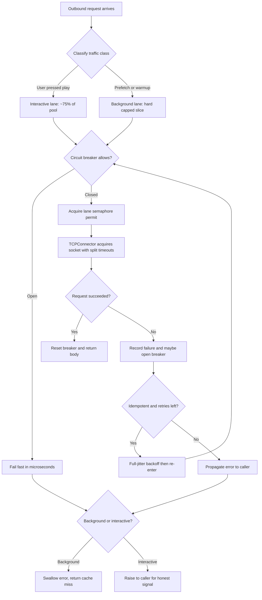

| Difficulty | Channel | Tags |
|---|---|---|
| advanced | backend | asyncio, aiohttp, concurrency |

At Netflix, the throttling system built to protect the backend was the reason playback degraded. A single global concurrency limiter treated a background prefetch and a user pressing play as equals, so bursts of speculative traffic starved the requests people actually cared about — prefetch availability fell to 20% while play requests held above 99.4% [1]. This is the story of designing a connection pool for aiohttp that does the opposite: it protects the work that matters, sheds the work that does not, and survives the downstream service falling over. What Netflix learned about load shedding turns out to apply directly to the async Python code most teams already have running.

---

> ### Real-World Case — Netflix
>
> PlayAPI — the coordination service behind every playback start — used a single concurrency limiter that throttled all incoming traffic indiscriminately, so bursts of low-value prefetch traffic from phones and TV apps ate the same capacity as the user-initiated 'play' requests. Separating the two traffic classes into different clusters would have isolated failures, but the extra compute cost and operational overhead ruled that out.
>
> | | |
> |---|---|
> | **Challenge** | Gracefully degrade under extreme load and backend latency without letting pooled/concurrent request capacity collapse: decide *which* in-flight requests to shed, adapt the concurrency limit automatically instead of hand-tuning it, and do it in a way that doesn't break autoscaling signals or turn buffered retries into a second outage. |
> | **Solution** | Netflix replaced the priority-blind limiter with a partitioned, adaptive concurrency limiter built on their open-source Netflix/concurrency-limits library (TCP-congestion-control-style, measures RTT latency and adjusts the in-flight limit continuously). It's installed as a pre-processing Servlet Filter that reads a criticality header sent by the device — so rejected requests never pay for body parsing — with partitions guaranteeing user-initiated playback a reserved share of the limit and prefetch only leftover capacity. Shedding is progressive across four priority buckets (CRITICAL / DEGRADED / BEST_EFFORT / BULK), and it deliberately begins only *after* the autoscale CPU target is crossed, so autoscaling still sees its saturation signal; a latency-based variant was later added for I/O-bound services and validated on the CDN content-origin service. |
> | **Outcome** | Validated by failure injection (2s injected latency into prefetch calls whose normal p99 is <200ms) and by load tests at 6x the autoscale volume: prefetch availability fell to as low as 20% while user-initiated requests held above 99.4% — even while more than 50% of all requests were being throttled. The real proof came months later: an infrastructure outage caused Android devices to queue their failing prefetch calls, and on recovery the service absorbed a 12x prefetch RPS spike (with ~50% of playback traffic being prefetch) without a second outage. |
> | **Lesson** | Buffering/queueing work when the pool saturates is a trap, not a safety net — the queued retries returned all at once as a 12x thundering herd. Shedding fast and cheaply beats queueing, and graceful degradation isn't about preserving equal availability for every request; it's about making sure the capacity that survives goes to the requests that matter. Corollary: an adaptive, self-tuning limit beats any hardcoded semaphore size, and shedding must not swallow the signal autoscaling depends on. |

---

## Hook — The dashboard was green, the users were not

It was 3am when the pager went off, and the first instinct was disbelief: every dashboard said healthy. Playback was starting. What the graphs did not show was the shape of the traffic — bursts of prefetch calls from phones and TV apps, fired off the moment a user scrolled past a title, each one cheap and speculative and each one consuming exactly the same capacity as a human being deciding to watch something.

Netflix's PlayAPI team eventually discovered that the damage was self-inflicted [1]. The service throttled all incoming traffic indiscriminately through one concurrency limiter, so speculative traffic quietly converted into real congestion. The lesson generalizes far beyond Netflix: a protection mechanism that cannot tell *which* traffic is harmful becomes a protection mechanism against your own users.

This is the uncomfortable truth about connection pooling in async Python. You write `TCPConnector(limit=100)`, you wrap it in a semaphore, you ship it — and you have built a machine that is very good at saying no and completely ignorant about what it says no to. Many developers discover this only in production, usually about ninety seconds before the incident review. Let's build the version that knows.

## Problem — A semaphore is a blunt instrument, and timeouts are a contract

Every production-grade HTTP client hits the same wall. Connections are finite. Downstream services are slow, flaky, or briefly dead. Meanwhile your own event loop is shared by every coroutine in the process, so one unbounded client can starve unrelated work [5]. The naive answer is a concurrency limiter — and it works, right up until it doesn't.

The failure mode is asymmetry. A semaphore treats a 40ms cache-priming call and a 9-second `POST /cancel_subscription` as equivalent citizens because both acquire one permit. When the pool saturates, requests queue in semaphore order — which is arrival order, which is whatever the load balancer happened to route first. You end up with head-of-line blocking: cheap background work sits in front of expensive interactive work, and both wait.

The second failure mode is subtler and more expensive: **timeout configuration as a single number**. `ClientTimeout(total=30)` collapses three very different failure modes into one [3]. Connect timeouts mean the network or the downstream is saturated. Read timeouts mean that specific request is a black hole. Total timeouts mean the whole budget blew — often because retries and redirects ate it. These demand completely different responses, and a single knob cannot express that difference.

And then there is the cascade. When a dependency degrades, retry every failed request and you turn a10% error rate into a 100% one — retry storms amplify load exactly when the system has least capacity to absorb it. This is why the canonical answer is never 'add retries'. It is a coordinated set: limit, shed, retry, recover.

## Real-World Case — Netflix

PlayAPI is the coordination service behind every playback start on Netflix. The team noticed that its concurrency limiter throttled all incoming traffic indiscriminately, letting bursts of low-value prefetch traffic from phones and TV apps consume the same capacity as user-initiated play requests [1]. The obvious architectural fix — running the two traffic classes in separate clusters — was rejected: the extra compute cost and operational overhead did not justify it.

Instead of buying isolation with hardware, Netflix reclassified traffic at the shedding layer. The results were validated by failure injection and load testing rather than opinion. Injecting 2 seconds of latency into prefetch calls whose normal p99 sits under 200ms, and testing at 6x the autoscale volume, produced a striking picture: **prefetch availability fell to as low as 20% while user-initiated requests held above 99.4% — with more than 50% of all requests being throttled** [1].

The proof arrived months later, unplanned. An infrastructure outage caused Android devices to queue their failing prefetch calls. On recovery the service absorbed a **12x prefetch RPS spike** — with roughly 50% of playback traffic being prefetch — without a second outage [1]. Priority-based shedding meant the recovery storm landed on the traffic class designed to absorb it.

This is the shape of the solution you are about to build: not more capacity, but smarter admission. Netflix proved it at scale; your asyncio client needs the same idea, and it costs about forty lines of code.

## Deep Dive — Four mechanisms, and the order they belong in

Graceful degradation is a pipeline, and the order matters. Apply shedding before you acquire, retry before you fail, and recover before you reset.

**1. Priority-aware admission (the limiter).** The default move — one semaphore for everything — is what Netflix showed to be inadequate. Compare the options:

| Approach | Isolation | Cost | Failure blast radius |
|---|---|---|---|
| Single global semaphore | None | Free | Whole service degrades together |
| Per-priority lanes in one pool | Traffic classes only | Negligible | Only the noisy class sheds |
| Separate clusters / services | Full | High (compute + ops) | Isolated, but expensive |

Netflix rejected the third option on cost grounds and got most of the benefit of the second [1]. That is almost always the right trade for a single codebase.

**2. The circuit breaker.** Three states, one counter. Closed means traffic flows; failures increment a counter; past the threshold the breaker opens and requests fail fast in microseconds instead of queueing on a dead socket; after a recovery window it moves to half-open and lets a probe through [6]. Fast failure is the entire point — it returns capacity to callers who can do something useful with it.

**3. Exponential backoff with *jitter*.** This is the plot twist most tutorials get wrong. Plain exponential backoff synchronizes retries across clients: every caller fails at the same instant and retries at the same instant, manufacturing the thundering herd you were trying to avoid. The fix is *full jitter* — wait a random slice of the window rather than the whole window. The Tail at Scale makes the case that tail latency dominates perceived quality at scale, which is exactly why variance reduction beats naive scheduling [7].

**4. Timeout separation.** Configure `connect`, `sock_read`, and `total` independently [3]. A 2-second connect budget, a 5-second read budget, and a 30-second total ceiling tell you *which* stage broke. And respect `aiohttp`'s connector settings — `limit`, `limit_per_host`, `ttl_dns_cache` — because a stale DNS cache is its own outage [2][3].

⚠️ **Watch out:** the single most common bug in pool managers is returning the response object outside its context manager. `async with session.get(...)` releases the connection back to the pool on exit; handing the caller a dead response to read later is a connection leak with a delay fuse.

## Workflow — From request to graceful degradation

Here is the lifecycle the code implements, visualized in the diagram below. Every request is classified first, which is the single most important decision in the whole system.

**Step 1 — Classify before you limit.** Tag each call as interactive or background at the call site. The classifier is your application knowledge, and no generic library can guess it for you. This is the direct translation of Netflix's service-level prioritization [1].

**Step 2 — Check the breaker before acquiring a permit.** Firing fast while the circuit is open avoids burning pool slots on doomed requests.

**Step 3 — Acquire from the class's lane.** Interactive traffic gets the lion's share; background traffic gets a capped slice it can never grow into.

**Step 4 — Execute with separated timeouts,** then record success or failure on the breaker.

**Step 5 — Retry only with full jitter,** and only for idempotent operations. Retrying a non-idempotent `POST` on a timeout is how you double-charge a customer [10].

**Step 6 — Degrade asymmetrically.** For background work, swallow the error and return `None` — a cache miss is a benign outcome. For interactive work, propagate the error loudly so the user gets an honest signal.

**Step 7 — Drain cleanly on shutdown.** Closing the session without draining in-flight work is how you turn a deploy into a burst of `ServerDisconnectedError` on the next service [2].

## Code Example — A priority-aware pool manager in ~90 lines

The implementation below combines every mechanism from the deep dive: a priority-classified semaphore pool, a per-host circuit breaker, full-jitter exponential backoff, layered timeouts, and asymmetric error handling.

Two design decisions deserve emphasis. First, `_lanes` gives background traffic a hard cap of roughly a quarter of the pool — the same priority separation Netflix implemented inside a single service [1]. Second, `prefetch()` never raises. Background failure is a cache miss; interactive failure is a real error. Folding both into one method with a boolean flag is how pool managers end up alerting on noise.

The breaker uses `loop.time()` rather than `time.monotonic()` because it is already bound to the running loop and cannot be moved by system clock adjustments — a subtle but real bug source in long-lived services [12].

Run it inside an application with `async with` semantics or explicit lifecycle management, and remember that the `aiohttp.TCPConnector` DNS cache TTL means stale DNS entries survive for the configured window [2][3]. One more thing worth internalizing: the connector's `limit` and your semaphore are *not* redundant. The connector bounds sockets to the remote host; the semaphore bounds how much of your application is allowed to wait on them.

## Lessons Learned — Battle scars and what to do on Monday

**The scars every pool manager collects.**

- ⚠️ **Connection leaks** — returning responses outside their context manager. The pool silently drains until every request queues.
- ⚠️ **Ignoring SSL context validation** — disabling verification to make TLS errors go away [2].
- ⚠️ **One timeout for everything** — collapsing connect, read, and total budgets into a single number [3].
- ⚠️ **Missing shutdown cleanup** — an unclosed `ClientSession` emits warnings and leaks transports [8].
- ⚠️ **Error propagation mangled across the async stack** — wrapping `CancelledError` in generic exception handling breaks cooperative cancellation [5].
- 🔥 **Hot take:** keepalive tuning matters less than admission control. Before you tune `limit`, ask whether you are shedding the right traffic. Netflix's fix was a classifier, not a bigger pool [1].

**The actionable list.**

1. Classify every outbound call as interactive or background — at the call site, today.
2. Split the semaphore by class. Background gets a fraction it can never exceed.
3. Add a circuit breaker per downstream host with a fast-fail path [6].
4. Replace naive backoff with full jitter [7].
5. Split `connect` / `sock_read` / `total` timeouts [3].
6. Retry only idempotent operations [10].
7. Drain on shutdown; keepalive connections will otherwise die mid-flight [2].

If this feels overwhelming, you are not alone — most teams ship the single-semaphore version first and discover the rest under load. The good news is the fix is incremental: start with the classifier and the two lanes, then add the breaker.

---

## Request Lifecycle and Graceful Degradation Flow

<strong>Original Interview Question</strong>

**Q:** How would you implement a connection pool manager for aiohttp that handles graceful degradation under high load and connection timeouts?

**A:** Implement a connection pool manager for aiohttp using a semaphore to limit concurrent connections, exponential backoff for retrying failed requests, and circuit breaker pattern to gracefully degrade under high load and connection timeouts.

## Conclusion

Netflix did not fix its throttling problem with a bigger pool. It fixed it with a classifier — and the numbers show how well that works: prefetch availability down to 20% while play requests stayed above 99.4%, and a 12x recovery spike absorbed without a second outage [1].

So what should you do differently tomorrow? Not tomorrow-quarter. Tomorrow. Open the one file where your HTTP client is constructed, and split the semaphore into two lanes: one for interactive traffic, one hard-capped for background work. That single change is where90% of the reliability benefit lives, and it takes about fifteen minutes. Add the circuit breaker and full-jitter backoff once the lanes are in place, because retries layered on top of unshaped load are just a faster way to fail.

The memorable insight to take back to your team: *a limit is a policy, not a number — and a policy that cannot tell a user from a prefetch will always throttle the wrong thing.* Watch the traffic classes, not just the total.

---

## References

1. [Enhancing Netflix Reliability with Service-Level Prioritized Load Shedding](https://netflixtechblog.com/enhancing-netflix-reliability-with-service-level-prioritized-load-shedding-e735e6ce8f7d) — article
2. [aiohttp — Advanced Client Usage](https://docs.aiohttp.org/en/stable/client_advanced.html) — documentation
3. [aiohttp — Client Reference (TCPConnector, ClientTimeout)](https://docs.aiohttp.org/en/stable/client_reference.html) — documentation
4. [Python — Synchronization Primitives (asyncio.Semaphore)](https://docs.python.org/3/library/asyncio-sync.html) — documentation
5. [Python — Coroutines and Tasks (asyncio)](https://docs.python.org/3/library/asyncio-task.html) — documentation
6. [Circuit Breaker Design Pattern](https://en.wikipedia.org/wiki/Circuit_breaker_design_pattern) — documentation
7. [The Tail at Scale](https://arxiv.org/abs/1407.3481) — paper
8. [aiolibs/aiohttp — Official Repository](https://github.com/aio-libs/aiohttp) — documentation
9. [Kubernetes — Services (cluster routing and per-service load distribution)](https://kubernetes.io/docs/concepts/services-networking/service/) — documentation
10. [RFC 7231 — Hypertext Transfer Protocol (HTTP/1.1): Semantics and Content, including idempotent methods](https://datatracker.ietf.org/doc/html/rfc7231) — documentation
11. [Quality of Service — Traffic classification and prioritization concepts](https://en.wikipedia.org/wiki/Quality_of_service) — documentation
12. [Python — Event Loop (asyncio.get_running_loop, loop.time)](https://docs.python.org/3/library/asyncio-eventloop.html) — documentation

---

**Author:** Satishkumar Dhule — [GitHub](https://github.com/satishkumar-dhule) · [LinkedIn](https://linkedin.com/in/satishkumar-dhule) · [Website](https://satishkumar-dhule.github.io)
