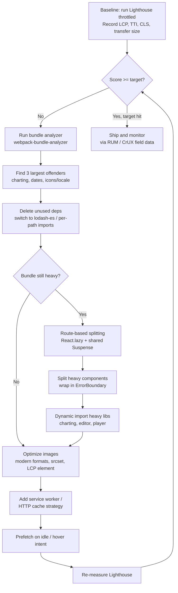

| Difficulty | Channel | Tags |
|---|---|---|
| intermediate | frontend | lighthouse, bundle, lazy-loading |

What Netflix learned in 2016 is the same lesson hiding inside your node_modules folder right now: the page renders, the spinner spins, and something enormous is quietly dragging your app to a halt. After its global launch, Netflix's logged-out homepage — essentially a static landing page — took roughly 7 seconds to become interactive on a throttled 3G connection, and Chrome DevTools traces pointed the finger at one culprit: a ~300kB client-side JavaScript bundle full of React, Lodash, and hydration state [1]. Cut that bundle in half and the page becomes interactive in under 3.5 seconds, verified in Lighthouse. This is the playbook for turning a 65 into a 95 — bundle analysis, route-based splitting, tree shaking, and dynamic imports — and it starts with measuring before you touch a single line.

---

> ### Real-World Case — Netflix
>
> After its 2016 global launch, Netflix saw that new users were signing up predominantly on mobile devices with poor connections, where the logged-out homepage took ~7 seconds to load on a throttled 3G connection — far too slow for what was essentially a static landing page. Chrome DevTools and Lighthouse traces showed the ~300kB client-side JavaScript bundle, including React, Lodash, and hydration state, was the dominant cost, and desktop Time-to-Interactive was the bottleneck metric.
>
> | | |
> |---|---|
> | **Challenge** | Cut Time-to-Interactive on a high-stakes signup funnel page without rewriting the whole frontend or sacrificing the consistent React developer experience the team relied on across Netflix's server-rendered pages. |
> | **Solution** | Netflix audited what actually needed client-side JS by disabling JavaScript and watching which elements still worked. They rebuilt only the truly interactive pieces (language switcher rewritten in ~300 lines of vanilla JS, cookie banner, click handling, analytics) and removed React + utility libraries from the client entirely while keeping React server-side for rendering. Then, instead of lazy-loading per route, they used the browser's native Link Prefetch plus XHR prefetching to warm the cache with the HTML, CSS, and the full React bundle for the *next* page of the signup flow (the SPA) while the user idled on the landing page. |
> | **Outcome** | Desktop loading time and TTI on the logged-out homepage dropped by over 50% (7s → <3.5s verified via Lighthouse); client-side JavaScript shrank by more than 200kB even though React's own runtime was only 45kB; prefetching cut TTI by another 30% on the second page (signup SPA bootstrap), with a 95% cache-hit success rate on XHR prefetches and no regression to the landing page. Field data via Chrome UX Report showed First Input Delay was fast for 97% of desktop users, and users clicked the sign-up button at a higher rate. |
> | **Lesson** | The heaviest dependency in your bundle may not belong there at all. Bundle weight comes as much from app code and hydration state as from the framework itself, so 'lazy load React.lazy()' is the wrong first move — first question whether the page needs a framework, then prefetch what the next route needs. Code splitting is a means, not the goal; the goal is shipping only the JS required to make the *current* view interactive. |

---

## Hook — The spinner that never stops, on a page with nothing to load

Here is a number that should make you uncomfortable: React's entire runtime, minified and gzipped, is about 45kB. Yet most production React apps ship 2MB of JavaScript on the first paint. That gap — roughly 2,055kB of everything *else* — is where your users are staring at a blank screen, tapping the same button twice, and quietly closing the tab.

Sound familiar? A Lighthouse score of 65. A 2.1MB bundle. Time to Interactive stuck at 4.2 seconds. These are the numbers from a classic interview question, but they are also the numbers in roughly half the React codebases on GitHub. The uncomfortable part is not that the app is slow. The uncomfortable part is that most developers have never opened the bundle analyzer to find out *why*.

⚠️ Watch out: the instinct is to blame the framework. It is almost never the framework. React is 45kB. The real weight arrives uninvited — a date library, a charting engine, an icon set, a moment-in-time polyfill for a locale you will never serve. That is where this journey starts: not with a rewrite, but with an autopsy.

The hidden cost of a bundle is not just download time. It is parse time, compile time, and execution time — all three happening before your app can respond to a single tap. That is why a 2.1MB bundle produces a 4.2s TTI rather than something closer to a linear multiple of the byte count.

## Problem — Why a 65 turns into lost signups

Let us name the enemy properly. A Lighthouse performance score of 65 does not fail on its own — it fails as a business metric. Google's Core Web Vitals formally standardized this thinking, defining Largest Contentful Paint, Interaction to Next Paint, and Cumulative Layout Shift as the metrics that correlate with real user experience [2]. When TTI stretches to 4.2 seconds, Interaction to Next Paint is effectively that4.2 seconds for anyone trying to interact with the page.

Many developers discover this the hard way. The QA environment is fine. The developer's laptop, with a warm cache and gigabit fiber, is fine. The user on a mid-range Android phone with a congested cell connection and a cold HTTP cache is not fine — and that user is the majority, not the exception.

Here is the thing though: the problem compounds. A large bundle inflates the download, but it also inflates the JavaScript heap, which slows down hydration, which delays the moment your UI becomes responsive, which means every interaction has to wait behind work that has nothing to do with the user's intent. Meanwhile, mid-range Android devices are disproportionately used by the exact demographic that most web products are trying to reach.

Consequently, the fix cannot be "add a spinner." A spinner is a way of acknowledging the delay, not removing it. The fix has to attack the bytes themselves.

The stakes, stated plainly: 90% of the time budget is often spent before a single meaningful render. Everything in this article is about moving that number down.

## Real-World Case — Netflix, 2016

When Netflix launched globally in 2016, something unexpected happened to their web performance. New users were signing up predominantly on mobile devices with poor connections — and the logged-out homepage, a page with almost no content to show, took roughly 7 seconds to load on a throttled 3G connection [1]. That is not a content problem. That is a code problem.

Chrome DevTools and Lighthouse traces told a very specific story. The dominant cost was a ~300kB client-side JavaScript bundle containing React, Lodash, and hydration state. Desktop Time to Interactive was the bottleneck metric, and the fix was not to remove features — it was to stop shipping React and Lodash to browsers that only needed a landing page.

Here is the counterintuitive part. 🎥 Hot take: the biggest single win came not from deleting features but from *partitioning* them. By serving a lighter bundle to the logged-out homepage and deferring the signup SPA bootstrap to the next page load — with prefetching once the network went idle — TTI dropped by over 50%, from 7 seconds to under 3.5 seconds, verified in Lighthouse. Client-side JavaScript shrank by more than 200kB even though React's own runtime was only 45kB.

And the prefetch payoff: it cut TTI by another 30% on the second page (the signup flow), with a 95% cache-hit success rate on XHR prefetches and no regression to the landing page [1]. Field data confirmed the improvement — the Chrome UX Report showed First Input Delay was fast for 97% of desktop users, and users clicked the sign-up button at a higher rate.

The lesson generalizes beyond Netflix: the bytes that matter are the bytes that arrive *first*. Everything after the first paint is a different conversation, and the browser is a very good conversation partner once you let it help.

## Deep Dive — Four levers, four trade-offs

Netflix's win came from a mechanism every React developer has access to: **code splitting**. But there are four distinct levers here, and confusing them is why many attempts to shrink a bundle fail. Here is the real breakdown.

**1. Route-based splitting.** Each route becomes its own chunk, loaded only when navigated to. This is the highest-leverage change because it turns "download everything" into "download what this page needs." The trade-off: you introduce a loading state, and lazy routes can feel sluggish on first navigation. Mitigation is prefetching during idle time — exactly what Netflix did to shave another 30% off the second page's TTI [1].

**2. Component-based splitting.** Heavy, situational widgets — a charting engine, a rich text editor, a video player — get their own boundary. The trade-off: over-splitting fragments your app into a hundred micro-requests, and HTTP/2 multiplexing only partly saves you. Split on component *weight*, not on component *count*.

**3. Tree shaking.** A production bundler removes exports that are never imported. The critical nuance: tree shaking requires ES modules. A CommonJS dependency cannot be shaken, no matter how modern your config is. Webpack documentation is blunt about this — `sideEffects: false` (or a precise `sideEffects` list) in your `package.json` tells the bundler which files are safe to drop [3]. If you are pulling in Lodash via `import _ from 'lodash'`, you are shipping the whole library. Import from `lodash-es` or import specific paths and you ship only what you touch.

**4. Dynamic imports for non-critical features.** Same mechanism as splitting, different intent: deferring things that are not needed *at all* until the user asks for them.

| Strategy | Bundle impact | First-paint gain | Risk |
|---|---|---|---|
| Route-based splitting | Large | High | Loading-state flicker on navigation |
| Component-based splitting | Medium | Medium | Over-fragmentation, micro-request storms |
| Tree shaking (ES modules only) | Medium | Medium | Silent for CommonJS deps — verify it worked |
| Dynamic import of heavy libs | Large | High | Failure needs an error boundary |
| Image optimization | Large | High | Requires build-pipeline discipline |

⚠️ Watch out: the most common battle scar in this whole space is assuming a split worked. Route-based splitting is only real if the analyzer graph actually shows the heavy component in a *separate* chunk rather than the main bundle. Measure it. Load the page with the DevTools network panel open and watch what arrives on first paint.

🔥 Hot take: code splitting is not primarily a performance technique. It is an *architecture* technique that happens to improve performance. Once your app is split by route, you can cache each route independently and ship improvements to Analytics without invalidating Dashboard.

## Workflow — From65 to 95, step by step

Now let us turn theory into a repeatable process. The order matters enormously — measure first, split second, verify third. Skipping straight to `React.lazy` is like optimizing a database query without reading the execution plan.

**Step 1 — Establish a baseline.** Run Lighthouse in incognito mode, throttled, a few times. Record LCP, TTI/INP, CLS, and total transfer size. Write the numbers down. You cannot prove improvement without a before.

**Step 2 — Run the bundle analyzer.** Add `webpack-bundle-analyzer` (or the Vite/Rollup equivalent) and open the treemap. You are looking for the three biggest offenders. In most real apps they are the same three: a charting library, a date library, and an icon or locale mega-package.

**Step 3 — Delete before you split.** Remove unused dependencies. An unused import costs nothing if it was never installed — but an installed-but-referenced-once library still ships its whole body. Audit `package.json`, replace `lodash` with `lodash-es` or targeted imports, and switch heavy-but-rarely-used dependencies to per-feature dynamic imports.

**Step 4 — Split by route.** Wrap every non-initial route in `React.lazy()` inside a single `Suspense` boundary. This is the change that moves the number most.

**Step 5 — Split heavy components with error boundaries.** A lazy chunk that fails to load throws. Without a boundary, your entire app whites out. This is the detail most blog posts skip and most production incidents teach.

**Step 6 — Optimize images.** Lighthouse's own scoring weighs Largest Contentful Paint heavily [4]. Modern formats, correct dimensions, and responsive `srcset` often move a score more than 200kB of removed JavaScript.

**Step 7 — Add a service worker or HTTP caching.** The [web app manifest and service worker guidance from MDN](https://developer.mozilla.org/en-US/docs/Web/Progressive_web_apps) covers the caching strategy that makes repeat visits instant. Just be precise: over-caching a stale bundle is worse than a slow first load.

The diagram below maps the audit-to-verification loop. Notice it is a loop, not a line — you will run it more than once.

🎯 Key point: after every single change, re-measure. Bundle optimization without measurement is just deleting code and hoping.

## Code Example — Route splitting done the production way

The snippet below is the pattern that actually ships: route-level splitting inside a shared `Suspense` boundary, plus a self-contained error boundary so a failed chunk fetch degrades gracefully instead of white-screening the app.

The important detail that the canonical tutorial version omits: the error boundary sits **outside** `Suspense`, not inside it. `React.lazy` rejections are thrown during render, so a boundary above the tree is what actually catches a chunk that fails to load on a flaky connection.

In the explanation below: `React.lazy` defers the `import()` until first render of that component, `Suspense` provides the fallback while the chunk is in flight, and the class-based `ErrorBoundary` exists because error boundaries cannot yet be written with function components and hooks alone. The `PreloadLink` variant is the Netflix trick — it starts the chunk download on hover or on idle, so by the time the user navigates the chunk is already cached.

## Lessons Learned — What to do differently tomorrow

Netflix cut a 7-second load to under 3.5 and removed over 200kB of JavaScript from a page that React alone accounted for just 45kB of [1]. The tooling was not exotic. The discipline was.

**The takeaways:**

- **Measure before you touch anything.** Bundle analyzers take 60 seconds to install and save days of guessing. Install yours today.
- **Delete before you split.** A lazy chunk still downloads when the user navigates. Code you never ship beats code you ship late.
- **Tree shaking only works on ES modules.** If your heaviest dependency is CommonJS, `import { debounce } from 'lodash'` will still ship the whole thing. Switch to `lodash-es` or per-path imports.
- **Every lazy boundary needs an error boundary.** Failed chunk loads are a real failure mode on real networks.
- **Prefetch on intent.** Netflix's second30% came from prefetching after network idle, hitting a 95% cache-hit rate [1]. A hover-intent preload is the cheap version of this and it works.
- **Do not over-split.** Five route chunks beat one. Seventy chunks is a different (worse) problem.

So what should you do tomorrow? Open DevTools on your production site, run the network throttling preset on a cold cache, and record your TTI. Then run the bundle analyzer and find your single largest dependency. Fix that one thing. Re-measure. That loop is the entire job — and it is much less mysterious than it feels at 2am when someone asks why the site feels slow.

💡 Insight: the highest-leverage optimization is not deleting code. It is *deciding what does not need to load yet*. Netflix proved that reframing turns a performance problem into an architecture one — and that is the insight worth bringing back to your team.

---

## Bundle Optimization Workflow

<strong>Original Interview Question</strong>

**Q:** You're tasked with improving a React app's Lighthouse performance score from 65 to 90+. The bundle size is 2.1MB and Time to Interactive is 4.2s. What specific steps would you take to optimize the bundle and implement lazy loading?

**A:** Implement code splitting with React.lazy() and Suspense, analyze bundle composition with webpack-bundle-analyzer to identify largest chunks, remove unused dependencies and optimize imports, add dynamic imports for heavy components and third-party libraries, implement route-based splitting for better initial load times, and utilize tree shaking with proper ES module configuration.

## Conclusion

Netflix shipped a fix assembled entirely from tools available to any React team: stop shipping what the current page does not need, load the rest on intent, and prefetch once the network goes quiet. The result was a 50%+ reduction in load time and over 200kB of JavaScript removed from a page whose only content was a sign-up form [1].

Tomorrow, do one thing: open DevTools on your production URL, throttle to slow3G, record your Time to Interactive, then run webpack-bundle-analyzer and identify your single largest dependency. Fix that one thing. Re-measure. Repeat until the number moves.

The insight worth sharing with your team: performance work is not about deleting code — it is about deciding what does not need to load yet. Netflix treated that decision as architecture, and the metric followed.

---

## References

1. [Netflix incident report](https://medium.com/dev-channel/a-netflix-web-performance-case-study-c0bcde26a9d9) — blog
2. [Web Vitals — Core Web Vitals metrics (LCP, INP, CLS)](https://developer.mozilla.org/en-US/docs/Web/Performance/Guides) — documentation
3. [webpack production builds and tree shaking / sideEffects](https://webpack.js.org/guides/production/) — documentation
4. [Lighthouse performance scoring documentation](https://developer.chrome.com/docs/lighthouse/performance) — documentation
5. [React.lazy — lazy loading components with code splitting](https://react.dev/reference/react/lazy) — documentation
6. [React Suspense — displaying a fallback while content is loading](https://react.dev/reference/react/Suspense) — documentation
7. [webpack-bundle-analyzer — visualize your bundle composition](https://github.com/webpack-contrib/webpack-bundle-analyzer) — documentation
8. [Using dynamic import() for lazy code loading in webpack](https://webpack.js.org/guides/code-splitting/) — documentation
9. [Progressive web apps — service worker caching and offline strategy](https://developer.mozilla.org/en-US/docs/Web/Progressive_web_apps) — documentation
10. [Code splitting — a guide to splitting JavaScript bundles](https://en.wikipedia.org/wiki/Code_splitting) — documentation

---

**Author:** Satishkumar Dhule — [GitHub](https://github.com/satishkumar-dhule) · [LinkedIn](https://linkedin.com/in/satishkumar-dhule) · [Website](https://satishkumar-dhule.github.io)
