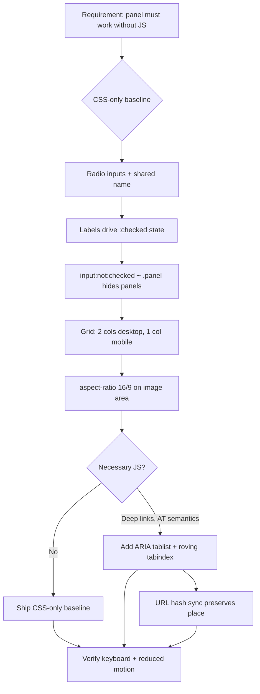

| Difficulty | Channel | Tags |
|---|---|---|
| beginner | frontend | css, flexbox, grid, animations |

Everyone said the tabs needed JavaScript. Then a developer on a live government service asked the only question that mattered: "What is the reason for using JavaScript with this component, when it can be done with just CSS?" [1] That question — raised in the open GOV.UK Design System backlog — became one of the most instructive design debates in the history of the web platform. The result was not a clean victory for either side, and that is exactly what makes it worth studying.

---

> ### Real-World Case — UK Government Digital Service (GOV.UK Design System / GOV.UK Frontend)
>
> When the GOV.UK Design System team (Adam Silver, Trevor Saint and others) proposed a tabs component in 2018, the acceptance criteria explicitly demanded it 'degrade gracefully if JavaScript is not available', support deep-linkable/bookmarkable panels, work on small screens, and pass keyboard + screen-reader testing. In the public backlog discussion, a developer on a live government service asked the obvious question: 'the component uses JavaScript — what is the reasons for using JavaScript with this component, when it can be done with just CSS?' — referring specifically to the radio-input + `:checked` + `~` sibling-selector pattern.
>
> | | |
> |---|---|
> | **Challenge** | Deciding whether a production design-system tab component should be implemented as a pure-CSS radio/label toggle (zero JS) or progressively enhanced with JavaScript — while keeping the ARIA tabs pattern, arrow-key navigation, focus states, history entries and no-JS behaviour intact. |
> | **Solution** | GDS explicitly rejected the CSS-only radio approach. Their reasoning, in the public issue: 'because we're styling something that has a specific intent (an input for a web form) it's difficult to progressively enhance into, say, just headings and content because older browsers will steer towards defaulting to how that element normally looks', plus a fear of 'introducing risk, especially for accessibility, just so that we don't have to ship js' — noting their JS tabs already had a known screen-reader issue. Instead they split the pattern into two deliberately *different-looking* components: `tabs` (JS, deep-linkable, arrow-key navigable, in browser history) and `tabbed navigation` (the no-JS fallback), because 'if they look the same, the expected behaviour is the same, but it isn't.' The no-JS path degrades to plain in-page anchor links to panel IDs, and GOV.UK Frontend's visual regression suite captures screenshots of components with JS disabled so the fallback can never silently rot. |
> | **Outcome** | The pattern shipped as two distinct, documented components in GOV.UK Design System rather than one CSS-only widget, and the reasoning is now codified in GOV.UK Frontend's browser-support policy: an HTML+CSS baseline plus 'necessary' vs 'optional' JS enhancements across browser grades A/B/C. A user-research finding also killed the pure-anchor variant: on the Bereavement service, agents using the non-JS version 'would pop them back to the top and they would lose their place', so the JS tabs were kept even for the small minority of no-JS users. |
> | **Lesson** | A CSS-only radio tab set is clever but semantically wrong — you're hijacking a form control, losing history/deep-linking, and inheriting a screen-reader model that doesn't match the ARIA tabs pattern. Worse, the no-JS fallback is a *different experience*, not a lesser one: research showed users were disoriented when switching tabs jumped the scroll position. The real lesson for design systems is to treat 'works without JS' as a separate, honestly-styled component rather than a clever single-widget trick. |

---

## Hook — The Question That Would Not Go Away

In 2018, a proposal landed in the GOV.UK Design System backlog for a tabs component. The acceptance criteria were refreshingly specific: degrade gracefully if JavaScript is unavailable, support deep-linkable and bookmarkable panels, work on small screens, and pass keyboard and screen-reader testing [1]. All reasonable. All non-negotiable.

Then a developer on a live government service typed something that stopped the room: the component uses JavaScript — what is the reason for using JavaScript with this component, when it can be done with just CSS? [1]

They were not being pedantic. They were pointing at a real, functioning technique. Radio inputs, a shared `name`, `:checked`, and the general sibling combinator. That is the entire technology stack. No build step, no hydration, no bundle, no framework.

And yet the pattern lost anyway. Not because it was technically wrong, but because of something far more interesting than a technique — the gap between a component working and a component being usable. Sound familiar? Every framework engineer who has shipped a beautiful widget that users could not operate has lived this story. The stakes here are not rendering. They are comprehension, focus, and the fact that a user who loses their place simply leaves.

## Problem — The Tabs You Can Build vs. The Tabs People Can Use

Let's frame the actual engineering problem, because the phrase "build tabs in CSS" makes it sound far easier than it is.

A documentation-style tab panel needs, at minimum, four things working in concert. First, state: which panel is active, and how is that state stored? With CSS-only, the state lives inside a radio input's `:checked` pseudo-class — the browser's own form state machine, which already handles keyboard interaction, arrow-key roving, and form submission for free [2]. Second, layout: a 2×2 card grid on desktop, a single column on mobile, which is CSS Grid's entire reason for existing [3]. Third, geometry: each card's image area must hold a fixed 16:9 ratio, which is exactly what `aspect-ratio` was born for [4]. Fourth, motion: a staggered entrance that respects `prefers-reduced-motion`, a user preference that exists because animation can trigger nausea, migraine, and dizziness in real people [5].

Here is the thing though. Each of those four is trivial in isolation. Together they hide a fifth requirement that nobody writes down: the tablist has to be perceivable. Not "looks like tabs." Perceivable. The current tab must be programmatically determinable, the arrow keys should move between tabs, and focus must never vanish into a hidden panel.

And that fifth requirement is where CSS-only tabs start to strain. `:checked` is genuinely state. It is just not *exposed* state. The accessibility tree still sees a radio group, not a tablist with roving tabindex and `aria-selected` semantics. A screen reader announces a list of radio buttons, not tabs with panels. Furthermore — and this is the detail that breaks naive implementations — `display: none` on an inactive panel removes its content from the accessibility tree entirely, which is correct behaviour, but it also means any deep link pointing at a hidden panel resolves to nothing. Bookmarkable panels? Gone.

So the real problem is not rendering a grid. It is rendering state that a user can perceive, reach, and return to.

## Real-World Case — UK Government Digital Service (GOV.UK Design System)

The 2018 GOV.UK Design System backlog discussion is the closest thing this debate has to a laboratory experiment, because it was run in public, with real users, and with a real service attached [1].

The team's own acceptance criteria demanded graceful degradation without JavaScript, deep-linkable panels, small-screen support, and keyboard plus screen-reader verification [1]. Then the CSS question landed. What happened next was not a rubber stamp for either approach. The pattern shipped as two distinct, documented components rather than one CSS-only widget, and the reasoning was codified into GOV.UK Frontend's browser-support policy: an HTML+CSS baseline, with JavaScript split into what is necessary versus optional across browser grades A, B, and C.

Now the plot twist. The pure-anchor variant — tabs as plain links to in-page sections, zero JavaScript — was not killed by an accessibility audit. It was killed by user research. On the Bereavement service, agents using the non-JS version "would pop them back to the top and they would lose their place." Losing your place on a bereavement form is not an inconvenience. It is a person restarting a painful task because a component was clever.

Consequently, the JavaScript tabs were kept, deliberately, even for the small minority of users without JavaScript [1]. This is the lesson that rewrites expectations: the winning pattern was not "the one that works without JS." It was the one where the failure mode was *predictable and non-destructive*. An anchor that scrolls you to the top is confusing. A tab switch that preserves scroll position and focus is merely plain.

## Deep Dive — Why the Sibling Selector Wins on Mechanism and Loses on Meaning

Let's get technical, because the mechanism is genuinely elegant and worth understanding properly.

The trick is structural. A `` is a *label* for ``, which is a *preceding sibling* of the panels. So the selector `input:not(:checked) ~ .panel` reaches the panels through the general sibling combinator, and hides every one of them at once. The magic is that no panel ever needs to know *which* radio hides it. The relationship is entirely positional [6].

| Approach | State lives in | Keyboard model | Screen reader says | Deep linkable |
| --- | --- | --- | --- | --- |
| Radio + `:checked` + `~` | Form state | Arrow keys (radio group) | "Radio button, checked" | No |
| Anchors to sections | URL fragment | Tab key only | "Link" | Yes |
| ARIA tabs + JS | JS variable | Roving tabindex | "Tab, selected, 1 of 4" | Yes |

Now the counterintuitive part, and it is the real payoff. The CSS-only radio pattern wins on *mechanism* because it inherits the browser's native radio group behaviour — arrow keys, form semantics, no event listeners, no hydration cost. On a page with 40 components, that is not a rounding error. It is zero JavaScript shipped and zero accessibility regressions from reimplementing focus management badly.

It loses on *meaning*. The DOM says "radio button." The user needs "tab." That gap is irreducible without ARIA, and ARIA without JavaScript is close to a dead end — you cannot reliably map `aria-selected` to a `:checked` state.

Therefore the honest trade is this: CSS-only tabs are excellent for progressive enhancement, where they provide a functional baseline that JavaScript then upgrades into a semantically correct tablist. They are a poor choice as the *only* implementation when deep links, assistive technology semantics, and focus management matter. The interview answer's code works. The question is what it claims to be.

## Workflow — From Markup to Accessible Tab Panels

Building on this, here is the order of operations that keeps the CSS pattern from collapsing under real use. The diagram below traces the decision path: start with the baseline, decide whether enhancement is *necessary* per GOV.UK's browser-support model, then layer semantics [1].

The flow, mapped in Mermaid, looks like this:

```mermaid
flowchart TD
    A[Requirement: panel must work without JS] --> B{CSS-only baseline}
    B --> B1[Radio inputs + shared name]
    B1 --> B2[Labels drive :checked state]
    B2 --> B3[input:not(:checked) ~ .panel hides panels]
    B3 --> B4[Grid: 2 cols desktop, 1 col mobile]
    B4 --> B5[aspect-ratio 16/9 on image area]
    B5 --> C{Necessary JS?}
    C -->|No| D[Ship CSS-only baseline]
    C -->|Deep links, AT semantics| E[Add ARIA tablist + roving tabindex]
    E --> F[URL hash sync preserves place]
    D --> G[Verify keyboard + reduced motion]
    E --> G
    F --> G
```

Read it top to bottom and the sequence matters. Build the baseline first, because it is what users without JavaScript get. Then ask the GOV.UK question: is the JavaScript *necessary* or merely *optional*? Necessary means the baseline is functionally broken without it — deep links resolving to nothing qualifies. Optional means it works fine.

That single distinction is what turns a clever trick into a defensible component. Every subsequent step — motion, focus outlines, grid — is cheap by comparison, and all three are where beginners actually ship bugs.

## Code Example — The Implementation, With the Battle Scars Marked

Here is the full pattern. The markup uses a fieldset-style grouping so assistive technology announces the set, and the CSS layers grid, motion, and focus on top of the structural trick.

```html
<div class="tabs">
  <!-- Radios carry all state. Shared name = one exclusive group. -->
  <input type="radio" name="tabset" id="tab-overview" class="tabs__radio" checked>
  <label class="tabs__label" for="tab-overview">Overview</label>

  <input type="radio" name="tabset" id="tab-specs" class="tabs__radio">
  <label class="tabs__label" for="tab-specs">Specs</label>

  <!-- Panels follow the labels: ~ only reaches LATER siblings. -->
  <section class="panel" id="panel-overview" role="group" aria-label="Overview">
    <article class="card">
      <div class="card__image" role="img" aria-label="Component preview"></div>
      <h3 class="card__title">Tabs component</h3>
      <p class="card__meta">Updated 2 days ago &middot; v4.2.0</p>
    </article>
    <article class="card">
      <div class="card__image" role="img" aria-label="Component preview"></div>
      <h3 class="card__title">Accordion</h3>
      <p class="card__meta">Updated 1 week ago &middot; v5.0.1</p>
    </article>
    <article class="card">
      <div class="card__image" role="img" aria-label="Component preview"></div>
      <h3 class="card__title">Breadcrumbs</h3>
      <p class="card__meta">Updated 3 weeks ago &middot; v3.1.0</p>
    </article>
    <article class="card">
      <div class="card__image" role="img" aria-label="Component preview"></div>
      <h3 class="card__title">Pagination</h3>
      <p class="card__meta">Updated 1 month ago &middot; v2.4.3</p>
    </article>
  </section>
</div>
```

```css
/* 1. Visually hide the radios but KEEP them focusable.
      display:none would remove them from tab order entirely. */
.tabs__radio {
  position: absolute;
  opacity: 0;
  width: 1px;
  height: 1px;
  pointer-events: none;
}

/* 2. Labels become the tab bar. */
.tabs__label {
  display: inline-block;
  padding: 0.5rem 1rem;
  cursor: pointer;
  border-bottom: 2px solid transparent;
}

/* 3. Active tab styling, driven by state. */
.tabs__radio:checked + .tabs__label {
  font-weight: 700;
  border-bottom-color: currentColor;
}

/* 4. THE core trick: hide every panel when its radio is unchecked.
      The general sibling combinator reaches all panels at once. */
.tabs__radio:not(:checked) ~ .panel {
  display: none;
}

/* 5. Panel grid: 2x2 desktop, single column mobile. */
.panel {
  display: grid;
  grid-template-columns: repeat(2, 1fr);
  gap: 1.5rem;
}

@media (max-width: 48rem) {
  .panel {
    grid-template-columns: 1fr;
  }
}

/* 6. Fixed 16:9 media area. */
.card__image {
  aspect-ratio: 16 / 9;
  background: #eee;
  border-radius: 0.5rem;
}

/* 7. Focus ring on the LABEL, not the hidden radio. */
.tabs__radio:focus-visible + .tabs__label {
  outline: 2px solid currentColor;
  outline-offset: 2px;
}

/* 8. Motion ONLY when the user has not opted out.
      'backwards' fill mode is required, or cards flash before delay. */
@media (prefers-reduced-motion: no-preference) {
  .card {
    animation: fade-slide-in 300ms ease-out backwards;
  }
  .card:nth-child(1) { animation-delay: 0ms; }
  .card:nth-child(2) { animation-delay: 100ms; }
  .card:nth-child(3) { animation-delay: 200ms; }
  .card:nth-child(4) { animation-delay: 300ms; }
}

@keyframes fade-slide-in {
  from { opacity: 0; transform: translateY(10px); }
  to   { opacity: 1; transform: translateY(0); }
}
```

⚠️ Three battle scars worth memorising. First, the `opacity: 0` hide instead of `display: none` on the radios — a hidden radio cannot receive focus, and you just lost your keyboard path. Second, focus styling targets `.tabs__radio:focus-visible + .tabs__label`, the adjacent sibling, because the invisible input is what actually holds focus. Third, `animation-fill-mode: backwards` is non-negotiable; without it, cards render at full opacity during their stagger delay and then jump, which looks like a glitch rather than an animation [7].

## Lessons Learned — What to Do Differently Tomorrow

The GOV.UK question was never really about CSS versus JavaScript. It was about asking *why*, out loud, before shipping [1]. That habit is the transferable lesson.

**Build the CSS baseline first, always.** Radio plus `:checked` plus the sibling combinator costs zero bytes of JavaScript, inherits native arrow-key behaviour from the browser's own radio group [2], and gives you a working component for free. Then decide whether enhancement is necessary or optional — the distinction GOV.UK Frontend codified into its browser-support policy [1].

**Watch the two failure modes that are not accessibility bugs but feel like them.** A deep link to `#panel-specs` renders nothing, because the panel is `display: none`. And the anchor-only variant makes users "lose their place" by scrolling them to the top — the exact regression that user research surfaced on the Bereavement service [1]. Preserve scroll position and focus, or do not ship the shortcut.

⚠️ Never ship motion without a reduced-motion escape hatch. The `prefers-reduced-motion: no-preference` wrapper is a three-word guard that skips the whole animation block when motion sensitivity is set [5]. It costs nothing and it is required for anyone who did not ask to be moved.

💡 Insight for when to actually reach for this: a documentation page, a settings page, a print-friendly content switcher — anywhere the panels are static and the browser can hold the state. Reach for ARIA tabs with roving tabindex when you need deep links, `aria-selected` semantics, or a real tablist. Many developers pick one and regret the choice; the pattern is to ship both, layered.

🔥 The hot take worth taking to your standup tomorrow: **a component's job is not to work, it is to fail predictably.** The team that asked the hard question in public in 2018 shipped two components and a written policy instead of one clever widget [1]. That is the pattern, not the trick.

---

## CSS-Only Tab Panel Decision Flow



<details>
<summary><strong>Original Interview Question</strong></summary>

**Q:** Build a CSS-only tab panel for a design-system docs page. Use radio inputs to switch tabs (no JavaScript). Desktop: a 2x2 grid of cards under each tab; mobile: single column. Each card has a fixed 16:9 image area, a title, and a short meta line. Add a subtle entrance animation with a stagger and keep focus-visible outlines; ensure prefers-reduced-motion is respected?

**A:** Use a set of radio inputs with a shared `name` attribute and corresponding `` elements for each tab section. The `:checked` state of each radio controls visibility of its associated panel via adjacent sibling selectors. Each panel renders a 2×2 card grid on desktop and collapses to a single column on mobile. Cards use `aspect-ratio: 16/9` for fixed image containers, with a title and meta line below.

</details>

## Conclusion

The question a UK government developer asked in 2018 — why JavaScript, when CSS can do this? [1] — is still the sharpest test of any component. It has nothing to do with CSS being able to do it. It has to do with whether anyone has written down why the harder path was chosen.

So what do you do differently tomorrow? Build the CSS-only baseline first: radio inputs, a shared name, `:checked`, one sibling selector, `display: none`. You get a responsive, keyboard-navigable tab panel in about fifteen lines and zero JavaScript shipped. Then ask the necessary-or-optional question before adding anything. If deep links and screen reader semantics are required, layer the ARIA upgrade on top. Either way, gate every animation behind `prefers-reduced-motion: no-preference` and keep `animation-fill-mode: backwards` in your stagger recipe, because those two details are where the bugs actually live.

The memorable insight, worth passing to your team: **the winning implementation was the one that failed predictably.** The anchor-only version scrolled bereavement callers back to the top and made them lose their place, so it was dropped even though it worked without JavaScript. Radio inputs and `:checked` won on mechanism; the ARIA tabs won on meaning; the policy that documents which is which won outright. Ship both, layered, and write down why.

---

## References

1. [UK Government Digital Service (GOV.UK Design System / GOV.UK Frontend) incident report](https://github.com/alphagov/govuk-design-system-backlog/issues/100) — article
2. [MDN Web Docs — Using radio buttons (input type=radio)](https://developer.mozilla.org/en-US/docs/Web/HTML/Element/input/radio) — documentation
3. [MDN Web Docs — CSS grid layout](https://developer.mozilla.org/en-US/docs/Web/CSS/CSS_grid_layout) — documentation
4. [MDN Web Docs — CSS aspect-ratio property](https://developer.mozilla.org/en-US/docs/Web/CSS/aspect-ratio) — documentation
5. [MDN Web Docs — prefers-reduced-motion media query](https://developer.mozilla.org/en-US/docs/Web/CSS/@media/prefers-reduced-motion) — documentation
6. [MDN Web Docs — General sibling combinator (~)](https://developer.mozilla.org/en-US/docs/Web/CSS/Reference/Selectors/General_sibling_combinator) — documentation
7. [MDN Web Docs — animation-fill-mode and animation-delay](https://developer.mozilla.org/en-US/docs/Web/CSS/animation-fill-mode) — documentation
8. [WAI-ARIA Authoring Practices — Tabs pattern](https://www.w3.org/WAI/ARIA/apg/patterns/tabs/) — documentation
9. [GOV.UK Frontend — Browser support policy](https://github.com/alphagov/govuk-frontend/blob/main/docs/contributing/testing/browser-support.md) — documentation
10. [MDN Web Docs — :focus-visible pseudo-class](https://developer.mozilla.org/en-US/docs/Web/CSS/:focus-visible) — documentation

---

**Author:** Satishkumar Dhule — [GitHub](https://github.com/satishkumar-dhule) · [LinkedIn](https://linkedin.com/in/satishkumar-dhule) · [Website](https://satishkumar-dhule.github.io)
