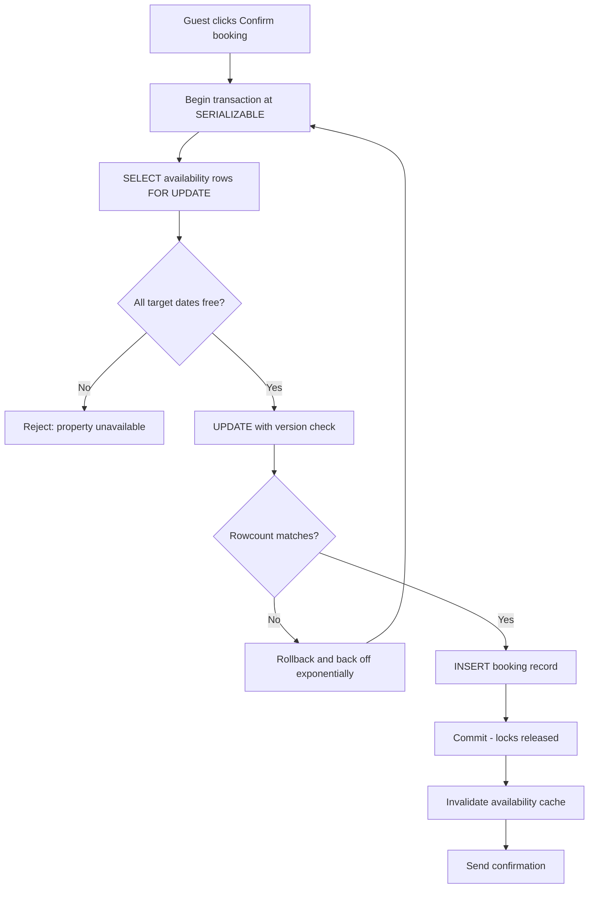

| Difficulty | Channel | Tags |
|---|---|---|
| intermediate | database | acid, isolation-levels, mvcc |

During Black Friday 2025, Shopify merchants moved a record $5.1 million in sales per minute, and every checkout had to reserve inventory exactly once — the same guarantee your booking system owes every guest [1]. Their oversell-prevention layer had lived in Redis for years, split from the MySQL inventory ledger in a way that no single atomic transaction could span, so the team had to rethink reservation handling from the ground up [1]. That split-system problem is precisely the trap waiting for anyone building a booking flow where two guests race for the same property on the same night. The question is not whether the race condition will find you, but whether your transaction design will hold when it does.

---

> ### Real-World Case — Shopify
>
> During Black Friday 2025, Shopify merchants hit a record $5.1 million in sales per minute, and every one of those checkouts touched inventory that had to be reserved or sold exactly once. Shopify's oversell-prevention system (the booking-system equivalent of preventing double bookings) had run on Redis for years, where reservations and the MySQL inventory ledger lived in two systems that could not be updated in a single atomic step.
>
> | | |
> |---|---|
> | **Challenge** | Guarantee that two concurrent checkouts can never claim the same last unit while sustaining peak-traffic throughput. The Redis design could not wrap the reservation decrement and the ledger deduction in one atomic transaction, risking overselling (sold but never deducted) or underselling (deducted but still reserved), had no multi-location awareness, and earlier attempts at a single quantity row in MySQL failed under row contention. |
> | **Solution** | They rebuilt reservations directly in MySQL using row-level locking: one row per sellable unit instead of one quantity column, acquired with SELECT ... FOR UPDATE SKIP LOCKED inside ACID transactions (bounded to a 1,000-row pool per item/location, refilled from the ledger). They switched those transactions from MySQL's default REPEATABLE READ to READ COMMITTED to eliminate gap locks that blocked replenishment and caused deadlocks, redesigned to a composite primary key to cut two row locks per reservation down to one, standardized lock ordering across reserve/claim paths, and batched multi-item carts with UNION ALL. Migrated via dual-write 'shadow mode' with Redis as source of truth and a kill switch. |
> | **Outcome** | Hit their high-throughput targets during peak 2025 traffic; after the fix, writer CPU stayed under 50% and reader CPU under 16% during high-volume flash sales. Diagnosing the real ceiling (database connections, not lock/CPU contention) led to a checkout-path cleanup that removed 50% of reads and 33% of transactions on the primary database, plus re-tuned InnoDB thread concurrency. |
> | **Lesson** | The counterintuitive part: the fix was not stronger isolation or smarter locking. They deliberately used a WEAKER isolation level (READ COMMITTED, not SERIALIZABLE) to avoid gap locks, and the actual production bottleneck was connection hold time in unrelated checkout code — 'the answer is often in the plumbing, not the engine.' Also: before reaching for Redis/Kafka/coordination layers for high-throughput mutual exclusion, your existing database (SKIP LOCKED + good key design) may already be enough. |

---

## Hook — One property, two guests, zero mercy

Picture this: it is 11:58 PM on the night before a holiday weekend. Two guests hit "Confirm booking" on the same cabin within 40 milliseconds of each other. Both see "Available." Both click. Both get a confirmation email. One of them arrives to find a stranger already sitting on the porch.

Nobody wrote buggy code in that scenario. The availability check was correct when it ran. The write was correct when it ran. The failure lives in the gap between them — and that gap is where entire booking systems quietly bleed trust, refunds, and support headcount. Many developers discover this the hard way, usually after the first double booking reaches a customer [2].

So the real question is not "how do I check availability?" It is "how do I make checking and reserving a single, indivisible truth that two concurrent transactions cannot both believe?"

## Problem — The race condition hiding in every booking form

At first glance availability checking looks trivial: `SELECT ... WHERE date IS NULL`, then `UPDATE ... SET booked = TRUE`. Ship it. However, under concurrent load that sequence is a textbook lost-update window. Two transactions can both read `booked = false` before either one writes, and both proceed — the database happily committed two correct-looking writes to the same row [2].

This is the core challenge: you need atomicity across a check and a write, isolation from competing transactions, and enough throughput that a flash sale does not melt your primary database. The stakes are concrete:

- **Customer trust**: a double booking turns into a last-minute relocation, a one-star review, or a chargeback.
- **Revenue leakage**: oversold inventory forces manual remediation — credits, refunds, and support time that never appears in your latency dashboards.
- **Availability pressure**: naive locking serializes every booking behind a global mutex, so the fix for correctness becomes the cause of your next outage.
- **Auditability**: when something goes wrong, you need a durable record of who reserved what and when — durability is exactly what the ACID `D` is for [8].

You might think a uniqueness constraint alone solves it. It does not — a constraint only catches the duplicate *after* the write, and it tells you nothing about a date range spanning five rows that must flip together. The problem is inherently transactional, and that is why it belongs in the database's concurrency machinery rather than in an `if` statement in your application layer.

## Real-World Case — Shopify's split-brain reservation system

Shopify's story is the booking problem wearing a retail costume. During Black Friday 2025, merchants hit a record $5.1 million in sales per minute, and every one of those checkouts had to reserve or sell each unit of inventory exactly once [1].

The trouble was architectural: oversell prevention ran on Redis while the MySQL inventory ledger lived in a completely different system. Reservations and ledger updates could not be committed in a single atomic step, so the system depended on careful coordination between two stores — and coordination between two stores is exactly where partial failures breed duplicate reservations [1].

The team's fix is a masterclass in reading the *right* bottleneck. Writer CPU stayed under 50% and reader CPU under 16% during high-volume flash sales, which told them contention was not the ceiling. Diagnosing the real limit — database connections, not lock or CPU contention — led to a checkout-path cleanup that removed 50% of reads and 33% of transactions on the primary database, plus a re-tune of InnoDB thread concurrency [1].

The lesson that transfers directly to your booking system: the correct answer is rarely "add more locks." It is "make the atomic unit small, keep the hot path lean, and measure the resource you are actually exhausting." Teams that internalize this stop reaching for exotic distributed locks and start shrinking the transaction itself.

## Deep Dive — Isolation levels, MVCC, and the pessimism-vs-optimism fork

Building on Shopify's example, the design question becomes: where should the serialization happen? PostgreSQL gives you four isolation levels, and the trade-off is a direct exchange of correctness guarantees for concurrency [5]:

| Isolation level | What it prevents | Cost profile | When to use it |
|---|---|---|---|
| READ COMMITTED | Dirty reads | Cheapest, but phantom reads slip through | Reporting, search, non-critical reads |
| REPEATABLE READ | Non-repeatable reads | Moderate; can still surprise you on range queries | Snapshot-style reads of stable data |
| SERIALIZABLE | Phantom reads and write skew | Highest abort rate under contention | The actual booking write path |
| READ UNCOMMITTED | Nothing | Fastest, and dangerous | Almost never in production |

The plot twist many developers miss: **SERIALIZABLE does not mean "lock everything."** Under PostgreSQL's implementation it builds on MVCC — multiversion concurrency control — where readers see a consistent snapshot and never block writers [3]. Reads for availability checks run at snapshot speed; only transactions that actually conflict get flagged and retried. That is why the recommended pattern pairs SERIALIZABLE for the critical write with plain snapshot reads for the availability lookup.

That gives you two distinct tools, and knowing which is which matters:

- **Pessimistic concurrency control**: take a lock before you read. PostgreSQL's `SELECT ... FOR UPDATE` locks only the specific date-range rows you touch, not the whole table [6]. Use it when conflicts are frequent — think hot properties during peak season.
- **Optimistic concurrency control**: read freely, write with a version column, and let the database reject stale writes [4]. Use it when conflicts are rare and retries are cheap.

🔥 **Hot Take**: pessimistic locking is not the "safe" choice and optimistic locking is not the "scalable" choice. Pessimistic locking on a hot property serializes requests and protects you; optimistic locking on that same property generates a retry storm. Match the strategy to the conflict rate of the specific resource, not to your ideology.

Under the hood, row-level locks still sit atop two-phase locking semantics — locks acquired during the transaction are held until commit or rollback [7]. Consequently, the single biggest performance lever is transaction duration: every millisecond you spend calling an external payment API while holding a row lock is a millisecond every competing booking waits. And if you hold multiple range locks in opposite orders, you will meet deadlock detection the hard way — PostgreSQL will abort one transaction and expect it to retry [9].

⚠️ **Watch Out**: the classic mistake is doing network I/O inside the locked section. Compute the quote first, acquire the lock, write, commit — then call the payment provider. Lock scope is latency budget.

## Workflow — The five-step reservation sequence

With the pieces on the table, here is the actual flow a well-designed booking request follows. The diagram below traces a single reservation from click to confirmation, including the retry loop that keeps the system alive under contention:



Step by step:

1. **Open the transaction** and set the isolation level to SERIALIZABLE for this operation only — not for the whole application [5].
2. **Lock the specific rows** for the requested date range with `SELECT ... FOR UPDATE`, which serializes only the writers touching those dates [6].
3. **Validate atomically**: confirm every date is free *while the lock is held*, then flip `booked` and bump the version column in the same transaction.
4. **Commit or retry**: on `SerializationFailure` or deadlock, roll back and retry with exponential backoff and jitter [9]. A definitive "already booked" is not retryable — return it to the guest.
5. **Invalidate the cache** only after a successful commit, so a failed booking never evicts fresh data or, worse, publishes an availability state that never existed.

🎯 **Key Point**: read replicas and write-through caches are great for the *check* — they absorb the flood of availability lookups — but the *reservation* must always hit the primary with fresh locks. Replicas lag; a lagging replica is a double booking with extra steps.

## Code Example — A race-proof booking transaction in Python

The following snippet is the workflow above in runnable form, using PostgreSQL via `psycopg2`. It combines a row-level lock, a version-column guard, and retry with exponential backoff — the production pattern for a hot booking path:

```python
import random
import time
import psycopg2
from psycopg2 import errors

DSN = 'dbname=bookings user=app host=db.internal'
MAX_ATTEMPTS = 5

class DoubleBookingError(Exception):
    '''Raised when the property is already reserved for those dates.'''

class StaleWriteError(Exception):
    '''Raised when another writer modified the rows underneath us.'''

def book_property(property_id, guest_id, check_in, check_out):
    conn = psycopg2.connect(DSN)
    conn.autocommit = False  # every statement below lives inside one transaction
    try:
        for attempt in range(MAX_ATTEMPTS):
            try:
                with conn.cursor() as cur:
                    # Step 1: pessimistic lock on exactly these date rows
                    cur.execute('''
                        SELECT version, booked
                          FROM property_availability
                         WHERE property_id = %s
                           AND stay_date >= %s AND stay_date < %s
                         ORDER BY stay_date
                           FOR UPDATE
                    ''', (property_id, check_in, check_out))

                    rows = cur.fetchall()
                    if len(rows) == 0 or any(r[1] for r in rows):
                        raise DoubleBookingError(property_id)

                    # Step 2: optimistic guard - version detects stale reads
                    expected_version = rows[0][0]
                    cur.execute('''
                        UPDATE property_availability
                           SET booked = TRUE,
                               guest_id = %s,
                               version = version + 1
                         WHERE property_id = %s
                           AND stay_date >= %s AND stay_date < %s
                           AND version = %s
                    ''', (guest_id, property_id, check_in, check_out, expected_version))

                    if cur.rowcount != len(rows):
                        raise StaleWriteError(property_id)

                    # Step 3: record the reservation while the lock is held
                    cur.execute('''
                        INSERT INTO bookings (property_id, guest_id, check_in, check_out)
                        VALUES (%s, %s, %s, %s)
                    ''', (property_id, guest_id, check_in, check_out))

                conn.commit()  # row locks are released only here
                return {'status': 'confirmed'}

            except (errors.DeadlockDetected, errors.SerializationFailure):
                conn.rollback()
                # Transient conflict: exponential backoff with jitter
                delay = min(0.05 * (2 ** attempt) + random.uniform(0, 0.1), 2.0)
                time.sleep(delay)
            except StaleWriteError:
                conn.rollback()  # safe to retry: nothing was committed
            except DoubleBookingError:
                conn.rollback()  # permanent: never retry a full property
                raise
        raise RuntimeError('booking failed after retries')
    finally:
        conn.close()
```

How to read it, section by section:

- **Connection setup**: `autocommit = False` is what makes the check and the write one atomic unit. If autocommit were on, each statement would commit independently and the race condition would come right back [8].
- **Step 1 (`FOR UPDATE`)**: locks only the rows for the requested dates, so bookings for *other* properties on the same night proceed in parallel [6]. `ORDER BY stay_date` keeps lock acquisition order consistent, which is your first defense against deadlocks [9].
- **Step 2 (version check)**: the `WHERE version = %s` clause means a writer that started from a stale snapshot updates zero rows, and `rowcount != len(rows)` turns that into an explicit retryable error [4].
- **Retry loop**: only `SerializationFailure` and `DeadlockDetected` back off — those are transient conflicts PostgreSQL already expects the application to handle [5][9]. `DoubleBookingError` raises immediately, because retrying a full property just wastes the guest's time.
- **Backoff math**: `0.05 * 2**attempt` capped at 2 seconds with random jitter. The jitter matters — without it, ten competing clients retry in lockstep and collide again on the same tick.
- **Commit boundary**: `conn.commit()` is the only place locks are released. Everything before it is inside the critical section; keep it short.

## Lessons Learned — What to tell your team tomorrow

The journey from Shopify's split reservation system to a single atomic booking transaction comes down to a handful of decisions you can make deliberately instead of reactively:

- **Make the transaction small and the reads cheap.** Shopify removed 50% of reads and 33% of transactions from its primary database simply by cleaning up the checkout path [1]. Audit your booking path for queries that could hit a read replica or be answered from an invalidated cache.
- **Serialize only what must be serialized.** Row-level locks on a date range mean two guests booking *different* properties never contend. A global lock is an outage with extra steps.
- **Choose isolation by conflict rate, not by habit.** SERIALIZABLE plus retry for the write path, snapshot reads for availability checks — that combination gives correctness where it counts and throughput everywhere else [5].
- **Retry with jitter, and know what is not retryable.** Exponential backoff handles transient serialization failures [9]; a definitive "property full" must surface to the user immediately.
- **Measure the resource you are actually exhausting.** Shopify's ceiling was database connections, not CPU or locks [1]. Before adding caches or sharding, check connection pools, lock waits, and transaction duration.

⚠️ **Watch Out** for the usual battle scars: holding locks across network calls, invalidating caches before commit, retrying permanent failures until timeouts pile up, and forgetting `ORDER BY` so lock ordering differs between transactions. Each one has caused real double bookings in production.

The moral of the story is that double bookings are not a bug in your `if` statement — they are a missing atomic boundary. Tomorrow, open your booking transaction, put the lock and the write inside it, and cut everything else out.

---

## Booking Reservation Flow


<details>
<summary><strong>Original Interview Question</strong></summary>

**Q:** You're building a booking system for Airbnb where multiple users can reserve the same property simultaneously. How would you design the transaction handling to prevent double bookings while maintaining high availability?

**A:** Use SERIALIZABLE isolation with optimistic concurrency control. Implement row-level locks on property availability tables, use MVCC snapshot reads for checking availability, and apply application-level validation to ensure atomic booking operations.

</details>

## Conclusion

Shopify's Black Friday numbers prove the point from both directions: $5.1 million per minute flowing through a reservation path that could not span two systems, fixed not by adding exotic distributed locks but by making the atomic unit small and cutting 50% of reads and 33% of transactions off the primary database [1]. The same rewrite is available to any team fighting double bookings — collapse the check and the write into a single transaction, lock only the date rows that matter, run SERIALIZABLE on the write path with snapshot reads everywhere else [5], and retry transient conflicts with jitter [9]. What should change tomorrow: open your booking transaction, delete the network calls inside it, and put a version column on the availability table. The single insight worth sharing with your team is this — a double booking is never a logic bug in your availability check; it is a missing atomic boundary, and the database already ships the tools to draw it.

---

## References

1. [Shopify incident report](https://shopify.engineering/scaling-inventory-reservations) — article
2. [Isolation (database systems)](https://en.wikipedia.org/wiki/Isolation_(database_systems)) — documentation
3. [Multiversion concurrency control](https://en.wikipedia.org/wiki/Multiversion_concurrency_control) — documentation
4. [Optimistic concurrency control](https://en.wikipedia.org/wiki/Optimistic_concurrency_control) — documentation
5. [PostgreSQL Documentation: Transaction Isolation](https://www.postgresql.org/docs/current/transaction-iso.html) — documentation
6. [PostgreSQL Documentation: SELECT FOR UPDATE](https://www.postgresql.org/docs/current/sql-select.html) — documentation
7. [Two-phase locking](https://en.wikipedia.org/wiki/Two-phase_locking) — documentation
8. [ACID](https://en.wikipedia.org/wiki/ACID) — documentation
9. [Deadlock](https://en.wikipedia.org/wiki/Deadlock) — documentation
10. [Write-ahead logging](https://en.wikipedia.org/wiki/Write-ahead_logging) — documentation

---

**Author:** Satishkumar Dhule — [GitHub](https://github.com/satishkumar-dhule) · [LinkedIn](https://linkedin.com/in/satishkumar-dhule) · [Website](https://satishkumar-dhule.github.io)
