| Difficulty | Channel | Tags |
|---|---|---|
| intermediate | database | explain, query-plan, partitioning |

Picture an hourly crypto prices table quietly growing for eight years until it crosses 1TB — and every query against it starts taking 30+ seconds. That was CoinGecko's reality: p99 latency pinned at 4.13s, daily IOPS breaches dragging replicas into lag, and Apdex scores sagging under the weight of history [1]. Their first instinct — add indexes — hit a wall, because a JSONB-heavy query pattern makes per-key indexing impractical. The fix was range partitioning by month. It worked spectacularly... until one query got *slower* after the switch. That plot twist is where this story gets interesting, and it's exactly the kind of trap an intermediate-level interview question is designed to probe.

---

> ### Real-World Case — CoinGecko
>
> CoinGecko's hourly crypto prices table grew past 1TB over 8 years, and queries against it had degraded to 30+ seconds on average, with p99 latency at 4.13s and daily IOPS breaches causing replica lag and Apdex drops. Their API team first tried adding indexes, but the JSONB-heavy query pattern made per-key indexing impractical, so they chose range partitioning by month on the timestamp column.
>
> | | |
> |---|---|
> | **Challenge** | Diagnose why date-range queries on a huge time-series table were still slow despite indexes, and partition a 1.2TB+ table without downtime while keeping query latency, IOPS, and replica lag under control. |
> | **Solution** | They analyzed query patterns (nearly all queries filter on a timestamp range covering at most 4 months), chose monthly RANGE partitioning on created_at so the planner prunes to ≤4 partitions, built a new partitioned table with a shadow-copy + foreign-data-wrapper backfill (avoiding production IOPS exhaustion), prewarmed partitions, then atomically swapped tables via rename. They verified plans with EXPLAIN ANALYZE and tracked p99/IOPS in monitoring during the switch. |
> | **Outcome** | p99 response time dropped 86% (4.13s → 578ms), IOPS fell 20% (multiplied across replicas), replica lag spikes disappeared, and queries got 6-8x faster. Plot twist: after the switch, one query got WORSE — its date filter lacked a lower bound, so the planner scanned every partition including empty future ones, forcing a query rewrite to restore pruning. |
> | **Lesson** | Partitioning only helps when the EXPLAIN plan proves pruning actually happened — a date-range query missing a lower bound defeats partition elimination entirely, and indexes alone can't rescue a query pattern that doesn't fit them. Always verify partition pruning in the plan, not just the schema. |

---

## Hook — A 1TB Table, a 4-Second p99, and a Fix That Backfired

It starts the way most database nightmares do: nothing is technically broken. Queries return. Users complain, but softly. Then someone runs the numbers and realizes the hourly crypto prices table has ballooned past 1TB over eight years of积累 — no, plainly: eight years of continuous writes. Average query time crept past 30 seconds. p99 latency sat at 4.13 seconds. Daily IOPS spikes were breaching provisioned limits, and because IOPS multiplies across every replica, one hot query was effectively DDoSing the entire read fleet [1].

Here is the stakes-setting part: this is not a hypothetical interview scenario. Degraded Apdex scores and replica lag mean real users staring at spinning loaders while a read replica falls behind the primary. And the clock is ticking, because every day of delay adds another ~720 hourly partitions' worth of rows.

You might think the answer is obvious — just add an index. But wait, it gets better. CoinGecko's team tried that first, and the JSONB-heavy query pattern made per-key indexing impractical: you cannot index your way out of a table where the filtered columns live inside semi-structured documents [1]. So what do you check when the obvious fix fails? That question is the entire game.

## Problem — Why 'It's Partitioned, So It Should Be Fast' Is a Lie You Tell Yourself

Building on that tension: partitioning is sold as a silver bullet. Carve a 100M-row table by date, and the planner should touch only the slices it needs. In practice, many developers discover that partitioned tables can be *slower* than their unpartitioned ancestors — because partitioning doesn't automatically mean less work. It just changes the shape of the work.

The core challenge is that a query plan is a negotiation between four forces, and partitioning only directly helps one of them:

- **Partition pruning** — does the planner even eliminate the irrelevant partitions, or does it open every door in the hallway? [2]
- **Index utilization** — inside the surviving partitions, are you doing an index scan or a sequential scan? [4]
- **Sort and aggregation cost** — a perfect scan followed by an expensive sort still burns CPU and IOPS
- **Physical data layout** — even the right index reads slowly if the matching rows are scattered across random pages

Consequently, the interview question you have been handed — "a query filtering on a specific date range is still slow, what do you check in EXPLAIN?" — is really asking whether you understand *which* of these four is the bottleneck. Guess wrong and you optimize the wrong thing while the p99 chart keeps climbing.

## Real-World Case — CoinGecko's Partitioning Gamble

CoinGecko's engineering team chose range partitioning by month on the timestamp column after concluding that per-key indexing on JSONB was a dead end [1]. The results were dramatic: p99 response time dropped 86%, falling from 4.13s to 578ms. IOPS fell roughly 20% — and because that multiplier applies across every replica, the savings compounded fleet-wide. Replica lag spikes vanished entirely, and queries generally ran 6-8x faster [1].

If the story ended there, it would be a standard victory lap. It did not end there.

After the switch, **one query got worse**. Its date filter lacked a lower bound — something like `WHERE event_date <= '2024-06-01'` with no start of range. Because the planner could not bound the scan on both sides, it walked *every* partition, including empty future partitions that held nothing but schema overhead. Pruning, the very mechanism the migration was meant to exploit, collapsed to zero effectiveness. The fix was not more indexes or more hardware — it was rewriting the query to give the planner a bounded range it could reason about [1].

🔥 **Hot Take:** Partitioning does not fix your queries. It fixes the queries your planner can prove are bounded. Anything unbounded gets *more* expensive, because now you are paying partition-opening overhead on top of a full scan.

That single failure mode is why interviewers ask this question — and why the "just add an index" answer earns a shrug.

## Deep Dive — Reading EXPLAIN Like a Detective, Not a Tourist

However, knowing partitioning has pitfalls is not the same as diagnosing one at 2am. This leads to the actual craft: reading the plan. When a date-range query on a 100M-row partitioned table stays slow, four checks come first, in this order.

**1. Verify partition pruning actually happened.** In a good plan, the `Partitions` detail in EXPLAIN shows a subset — ideally one or two monthly slices, not eighty. If every partition appears in the scan, pruning failed, and no index will save you [2]. This is exactly CoinGecko's unbounded-filter failure, visible in one line of output.

**2. Check index usage versus sequential scans.** Inside the surviving partitions, an `Index Scan` or `Index Only Scan` on a composite index is the goal; a `Seq Scan` on a hot partition means the index is missing, unattractive to the planner, or unusable because of type mismatches (a classic: comparing a `date` column to a string literal through a function, which silently disables the index) [4].

**3. Look for expensive sorts, hash aggregates, and nested loops.** A `Sort` node spilling to disk (check `Disk Usage` in `EXPLAIN (ANALYZE, BUFFERS)`) or a hash aggregate building a hashtable over millions of rows can dwarf the scan itself.

**4. Question the partition key.** If your queries almost always filter on `status` or `user_id` but only occasionally on `event_date`, monthly date partitioning is optimizing for the wrong access pattern [2]. Partition key choice is a bet on your query workload — and like all bets, it can be wrong.

The tradeoffs look like this:

| Approach | Wins | Real cost |
|---|---|---|
| More indexes | Fast point lookups | Write amplification, bloat, planner may ignore them |
| Partition pruning | Skips whole chunks of data | Only works with bounded, sargable predicates |
| CLUSTER / rebuild | Sequential-friendly physical layout | Full table lock unless done into a new table |
| Query rewrite | Often the cheapest, fastest win | Requires knowing your access patterns |

⚠️ **Watch Out:** `ANALYZE` output lies to you in a subtle way — `EXPLAIN` without `ANALYZE` shows the planner's *estimate*, while `EXPLAIN (ANALYZE)` shows *reality*. When estimates and actuals diverge by orders of magnitude, your statistics are stale, and the planner is choosing plans for a table that no longer exists.

## Workflow — The Five-Step Diagnosis Ladder

Therefore, when the alert fires and the date-range query is crawling, resist the urge to `CREATE INDEX` reflexively. Instead, climb this ladder in order — each rung tells you something the previous one could not. The diagram below maps the exact decision flow, from first EXPLAIN to final fix.

```mermaid
flowchart TD
    A[Slow date-range query on 100M rows] --> B[EXPLAIN ANALYZE, BUFFERS]
    B --> C{Partition pruning effective?}
    C -- No: all partitions listed --> D[Add lower + upper bound to date filter]
    D --> B
    C -- Yes --> E{Index scan or seq scan?}
    E -- Seq Scan --> F[Create composite index on date, filtered cols]
    F --> B
    E -- Index Scan --> G{Expensive Sort or HashAggregate?}
    G -- Yes, disk spill --> H[Add covering cols to index / rewrite query]
    H --> B
    G -- No --> I{Partition key matches access pattern?}
    I -- No --> J[Revisit partition strategy]
    I -- Yes --> K[Query optimized &#8212; verify p99]
    K --> L[Monitor IOPS and replica lag]
```



Read the diagram as a story: you start blind (B), prune failure sends you back to the query text (D), index gaps send you to DDL (F), and only when the plan is clean do you ask the strategic question about the partition key itself (I). Many developers jump straight from B to F — creating an index while an unbounded filter is still forcing an eighty-partition scan — and then wonder why the index changed nothing.

## Code Example — Diagnose, Fix, and Verify in One Session

The following session walks the diagnosis ladder against an `events` table partitioned monthly by `event_date`. Run it in `psql`; every command is either a read-only diagnostic or a targeted fix, so it is safe to rehearse on a staging replica.

```bash
# STEP 1: See reality, not estimates. BUFFERS reveals I/O per node.
EXPLAIN (ANALYZE, BUFFERS)
SELECT * FROM events
WHERE event_date BETWEEN '2024-01-01' AND '2024-01-31'
  AND status = 'completed';

# STEP 2: Check pruning. Look at the "Partitions" detail lines:
# GOOD  -> Partition "events_2024_01" is scanned (1 of 96)
# BAD   -> every monthly partition appears, including empty future ones
# If BAD: your date filter likely lacks a lower or upper bound.

# STEP 3: Build the composite index the plan is asking for.
# CONCURRENTLY avoids locking writes during the build.
CREATE INDEX CONCURRENTLY idx_events_date_status
ON events (event_date, status);

# STEP 4: If scans remain scattered across pages, physically reorder rows.
# NOTE: CLUSTER takes an ACCESS EXCLUSIVE lock -- run in a maintenance window.
CLUSTER events USING idx_events_date_status;

# STEP 5: Refresh statistics so the planner knows the new index exists.
ANALYZE events;

# STEP 6: Re-run STEP 1 and compare: Seq Scan -> Index Scan,
# shared read blocks down, execution time down.
```

Walking through it: Step 1 captures ground truth — `ANALYZE` executes the query, `BUFFERS` shows how many pages each node touched, which is the number that maps directly to IOPS [3]. Step 2 is the pruning audit, and it is where CoinGecko's unbounded query would have revealed itself immediately [1]. Step 3 adds the composite index on `(event_date, status)` — composite because the leading column matches the range predicate while the second column satisfies equality, the pattern PostgreSQL's B-tree indexes handle most efficiently [4]. Step 4 (optional) aligns physical row order with that index so matching rows sit on contiguous pages, trading a locking maintenance window for sequential-friendly reads [9]. Steps 5 and 6 close the loop: without `ANALYZE`, the planner may not yet prefer the index it cannot see in its statistics.

## Lessons Learned — Battle Scars Worth Borrowing

So what should you do differently tomorrow? The CoinGecko story and the interview question behind it converge on the same lessons, and each one is a scar someone already earned.

- **Pruning before indexing, always.** An index inside a partition you should never have scanned is decoration. Confirm the partition list in EXPLAIN first [2].
- **Unbounded filters are silent killers.** A missing lower bound on a date predicate can turn a 2-partition query into a 96-partition query, empty ones included [1].
- **Composite indexes mirror your WHERE clause.** Leading column = range key, following columns = equality filters. This is the difference between an index the planner loves and one it ignores [4].
- **Estimates and actuals must agree.** Divergence means stale statistics — run `ANALYZE` after bulk loads, partition creation, or large `CREATE INDEX` operations [3].
- **Your partition key is a hypothesis about your workload.** If most queries do not lead with it, revisit the strategy before adding a single more index [2].
- **Locking operations need a window.** `CLUSTER` and non-concurrent `CREATE INDEX` block writes; schedule them or pay in availability [9].

🎯 **Key Point:** The teams that win at large-table performance are not the ones with the most indexes — they are the ones who can read a query plan and name the bottleneck in one sentence.

The insight worth sharing with your team: **partitioning multiplies the cost of any query the planner cannot prune — it never merely "does nothing."** An unbounded filter after partitioning is worse than no partitioning at all, because you now pay to open every door before finding the room you wanted.

---

## Query Diagnosis Decision Flow


<details>
<summary><strong>Original Interview Question</strong></summary>

**Q:** You have a PostgreSQL table with 100M rows partitioned by date. A query filtering on a specific date range is still slow. What would you check in the EXPLAIN plan and how would you optimize it?

**A:** Check partition pruning effectiveness, index utilization patterns, and expensive sort operations. Create composite indexes on (date, filtered_columns) and evaluate clustering strategies for optimal data access.

</details>

## Conclusion

CoinGecko's 86% p99 improvement came not from more hardware or more indexes, but from making the planner's job provably smaller — and the one regression they hit was a query the planner could not prove was bounded [1]. That is the moral: performance work is diagnosis work. Tomorrow, when a date-range query drags, open `EXPLAIN (ANALYZE, BUFFERS)` before you open a DDL session — check pruning first, index usage second, sorts third, and only then question the partition key itself. Leave your team with one sentence: partitioning amplifies whatever your query plan already does, so give the planner bounded predicates and it will reward you; leave a filter unbounded and every partition in the table becomes your problem.

---

## References

1. [CoinGecko incident report](https://dev.to/coingecko/scaling-postgresql-performance-with-table-partitioning-136o) — article
2. [PostgreSQL Documentation — Table Partitioning](https://www.postgresql.org/docs/current/ddl-partitioning.html) — documentation
3. [PostgreSQL Documentation — Using EXPLAIN](https://www.postgresql.org/docs/current/using-explain.html) — documentation
4. [PostgreSQL Documentation — Indexes](https://www.postgresql.org/docs/current/indexes.html) — documentation
5. [Wikipedia — Query plan](https://en.wikipedia.org/wiki/Query_plan) — documentation
6. [Wikipedia — PostgreSQL](https://en.wikipedia.org/wiki/PostgreSQL) — documentation
7. [DigitalOcean — How To Implement Table Partitioning in PostgreSQL](https://www.digitalocean.com/community/tutorials/how-to-implement-table-partitioning-in-postgresql) — blog
8. [Wikipedia — B-tree](https://en.wikipedia.org/wiki/B-tree) — documentation
9. [PostgreSQL Documentation — CLUSTER](https://www.postgresql.org/docs/current/sql-cluster.html) — documentation

---

**Author:** Satishkumar Dhule — [GitHub](https://github.com/satishkumar-dhule) · [LinkedIn](https://linkedin.com/in/satishkumar-dhule) · [Website](https://satishkumar-dhule.github.io)
