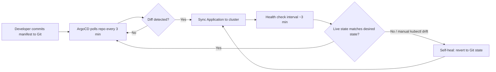

| Difficulty | Channel | Tags |
|---|---|---|
| beginner | devops | argocd, flux, declarative |

Deployments used to take up to 30 minutes, Git servers screamed under 8,300 requests per minute, and hotfixes died in queue behind broken pipelines. Then Cabify, one of Europe's largest ride-hailing platforms, ripped out their pseudo-GitOps deployment tool and pointed ArgoCD at a manifests repository polling every 3 minutes [1]. Git traffic collapsed to roughly 50 requests per deployment event, and deploys dropped to seconds. That 3-minute interval is the textbook auto-sync setting — and the story of how they got there reveals everything wrong with how most teams ship code to Kubernetes.

---

> ### Real-World Case — Cabify
>
> Cabify, one of Europe's largest ride-hailing platforms, replaced their pseudo-GitOps CI deployment tool (which suffered from pipeline concurrency races, cluster-level source-of-truth drift, and hotfix-blocking pipeline failures) with ArgoCD to manage deployments of ~500 services across 50 isolated Kubernetes Testing Environments. Their first working configuration set ArgoCD to poll the manifests repo every 3 minutes — the textbook auto-sync setting — across all instances.
>
> | | |
> |---|---|
> | **Challenge** | At scale, the standard declarative polling model collapsed: 50 ArgoCD instances polling every 3 minutes generated ~8,300 git fetch requests per minute against their GitLab instance, grinding it down. A single ArgoCD instance also couldn't reconcile the resulting 25,000 Applications (50 environments × 500 services), and an ApplicationSet controller bug created a refresh loop firing git fetches every second, which was invisible because the controller exported no metrics. |
> | **Solution** | They disabled automatic polling entirely and moved to an event-driven model: GitLab webhooks triggered syncs, cutting git fetches to ~50 per deployment. They forked ArgoCD to patch the ApplicationSet controller's reconciliation loop, integrated it with the repo-server for caching and metrics (upstreamed as argoproj/argo-cd#12714), added the `argocd.argoproj.io/manifest-generate-paths` annotation to reduce cache invalidation, centralized one dedicated ArgoCD instance per environment, and trimmed reconciliation work via resource exclusions and ignored status updates. |
> | **Outcome** | Git requests dropped from ~8,300/minute to roughly 50 per deployment event. Average deployment times fell from up to 30 minutes (pipeline delays plus manual intervention) to seconds, and developer satisfaction with deployments rose measurably in follow-up surveys. |
> | **Lesson** | The declarative desired-state model was right, but the naive imperative-ish sync mechanism (blind 3-minute polling) became the bottleneck — at scale, GitOps needs event-driven reconciliation (webhooks) plus observability of the reconciliation loop itself. Declarative Git as source of truth solves drift; it does not automatically solve scale. |

---

## Hook — A Deploy That Shouldn't Have Taken 30 Minutes

Picture this: a critical bug fix is ready. The code is merged, tests are green, but the deploy queue is backed up behind three other pipelines, one of which is racing another for the same cluster state. Thirty minutes later — pipeline delays plus manual kubectl patching — the fix finally lands. Sound familiar? This is the reality at scale when your CI pipeline is both the deployer and the source of truth. Every `kubectl apply` is an undocumented mutation, every environment drifts a little further from the last, and nobody can answer a simple question: what is *actually* running right now? The stakes compound fast. With dozens of isolated testing environments, each drift is a bug report you can't reproduce, a demo that fails in front of a client, or a hotfix that silently gets overwritten by the next pipeline run [1]. The deeper you go into this mess, the more you realize the problem isn't your tooling speed — it's your source of truth. Or rather, the fact that you don't have one.

## Problem — The Pseudo-GitOps Trap Nobody Admits They're In

Many developers think they're doing GitOps because their manifests live in a repository. However, there's a chasm between "manifests exist in Git" and "Git is the single source of truth." In pseudo-GitOps, a CI pipeline reads the repo, applies changes directly to the cluster, and hopes nothing else touches the cluster in between. Consequently, three failure modes emerge: pipeline concurrency races (two jobs applying interleaved states), cluster-level drift (manual hotfixes that never made it back to Git), and hotfix-blocking failures (one broken pipeline blocks every deploy behind it). Cabify hit all three while scaling to ~500 services across 50 isolated Kubernetes testing environments [1]. The imperative approach — running `kubectl` commands directly against a cluster — makes each of these worse, because the change is invisible to version control the moment it executes [2]. You might think "we're careful about documentation," but humans are terrible documentation. Every imperative change is a future archaeology dig. The question isn't whether drift will happen; it's whether you'll find out before your users do.

## Real-World Case — Cabify's 8,300 Requests-a-Minute Problem

Building on that failure pattern, consider what happened when Cabify's engineering team decided to quantify their pain. Their pseudo-GitOps CI deployment tool was generating approximately 8,300 Git requests per minute just to keep deployments flowing — a number that scales badly when you multiply environments. Deployments averaged up to 30 minutes end-to-end, dragged down by pipeline queuing and manual intervention. The fix was a structural one: replace the pipeline-as-deployer with ArgoCD watching a manifests repository, polling every 3 minutes across all instances [1]. The results were dramatic. Git requests dropped from ~8,300/minute to roughly 50 per deployment event. Average deployment times fell from up to 30 minutes to seconds, and developer satisfaction with deployments rose measurably in follow-up surveys [1]. The plot twist: their first working configuration used the *default-looking* 3-minute poll interval — the setting most teams never think twice about. The magic wasn't an exotic configuration. It was the architectural shift from imperative pipeline pushes to declarative reconciliation. That shift is exactly where the declarative/imperative debate stops being academic and starts saving you 29 minutes per deploy.

## Deep Dive — Declarative vs Imperative: The Real Tradeoff

At its core, the declarative approach means you describe the *desired state* — a complete YAML manifest, Helm chart, or Kustomize overlay in Git — and a controller like ArgoCD continuously reconciles the actual cluster state toward it [3]. The imperative approach means you issue commands (`kubectl scale`, `kubectl patch`, `kubectl apply` of an ad-hoc file) that mutate the current state directly [2]. Here's what that difference actually buys you:

- **Auditability**: Every declarative change is a Git commit with an author, diff, and review. Imperative changes exist only in shell history.
- **Drift detection**: ArgoCD notices when live state diverges from Git and either warns or auto-reverts (self-healing).
- **Rollbacks**: `git revert` versus reconstructing what you ran at 2am from memory.
- **Collaboration**: Pull requests versus SSH sessions that only one engineer understands.
- **Blast radius**: A bad Helm values file affects one Application; a bad imperative script can mutate 50 environments at once.

However, imperative isn't inherently evil — it's how you debug. `kubectl describe pod` is imperative and essential. The danger is when imperative commands become the *delivery mechanism* rather than the investigation tool. 🔥 **Hot Take**: The teams that get burned hardest are the ones who do both — Git for "normal" deploys and a quiet `kubectl set image` for emergencies — because the quiet path becomes the default under pressure. You might think auto-sync with a 3-minute interval sounds aggressive; in practice, it's a sweet spot between responsiveness and Git server load, which is precisely why Cabify's first working config settled there [1].

💡 **Insight**: Declarative doesn't mean "no action" — it means every action starts as a statement of intent in version control, and the controller does the imperative work on your behalf.

## Workflow — From Git Commit to Self-Healed Cluster

Therefore, the working GitOps loop looks like this: you commit a change to the manifests repository; ArgoCD polls (or receives a webhook), detects the diff, syncs the Application, runs health checks, and — critically — keeps watching afterward so that any manual `kubectl` mutation outside Git gets reverted automatically. The diagram below traces that full reconciliation cycle, including the self-healing path that turns drift into a non-event:



Concretely, the step-by-step is:

1. Create a Git repository holding Kubernetes manifests, Helm charts, or Kustomize overlays — this is your source of truth.
2. Define an ArgoCD `Application` CRD pointing at that repository, target cluster, and destination namespace.
3. Enable auto-sync with `--sync-policy automated` and a health check interval (1–5 minutes; 3 is the common default-ish choice [4]).
4. Turn on self-healing (`automated.selfHeal`) so unauthorized cluster changes get reverted.
5. Optionally enable pruning so resources removed from Git disappear from the cluster.
6. Repeat the Application per environment — this is how one repo fans out to 50 isolated testing environments without 50 pipelines [1].

⚠️ **Watch Out**: Enabling `prune` without understanding it will delete resources removed from Git. Turn it on in a non-production environment first — it is the one auto-sync feature with a真正的 teeth-baring failure mode.

## Code Example — A Production-Shaped Application CRD

The following bash script applies a complete ArgoCD Application with auto-sync, self-healing, and a 3-minute health check — the same shape of configuration that carried Cabify's testing environments [1]. Each comment explains why the field matters:

```bash
#!/usr/bin/env bash
# Create an ArgoCD Application that treats Git as the single source of truth.
# Auto-sync + self-heal = manual kubectl changes get reverted automatically.

kubectl apply -f - <<'EOF'
apiVersion: argoproj.io/v1alpha1
kind: Application
metadata:
  name: payments-service-staging
  namespace: argocd          # ArgoCD only watches Applications in its own namespace
  finalizers:
    - resources-finalizer.argocd.argoproj.io  # cascade deletes to child resources
spec:
  project: default
  source:
    repoURL: https://github.com/acme/k8s-manifests.git
    targetRevision: main     # Git ref = the branch you review and merge to
    path: services/payments/overlays/staging
  destination:
    server: https://kubernetes.default.svc
    namespace: payments-staging
  syncPolicy:
    automated:
      prune: true            # remove resources deleted from Git
      selfHeal: true         # revert manual kubectl mutations (drift protection)
      allowEmpty: false      # refuse to sync an empty path (guard against bad merges)
    syncOptions:
      - CreateNamespace=true # declarative namespace creation, no imperative kubectl
    retry:
      limit: 5               # transient API-server errors won't fail the sync
      backoff:
        duration: 30s        # matches the ~3 min reconciliation rhythm Cabify used [1]
        factor: 2
        maxDuration: 5m
EOF

# Force an immediate sync instead of waiting for the poll interval
cubectl -n argocd wait --for=condition=Synced application/payments-service-staging

# Show live vs desired state side by side — your drift-detection dashboard
cubectl -n argocd get applications -o custom-columns=\
  'NAME:.metadata.name,SYNC:.status.sync.status,HEALTH:.status.health.status'
```

Walking through it: the `source` block pins the repo, branch, and overlay path, which is how one repository serves many environments without duplication. The `destination` maps that desired state to a specific cluster namespace. Under `syncPolicy.automated`, `selfHeal: true` is the setting that closes the imperative backdoor — any `kubectl edit` outside Git gets overwritten on the next reconciliation, which is exactly the anti-drift behavior Cabify needed across 50 environments [1]. `prune: true` handles the opposite direction: deletions in Git cascade to the cluster. The `retry` block acknowledges reality — API servers fail transiently — while `allowEmpty: false` prevents a botched merge from wiping everything. Finally, the two `kubectl` commands give you the operational view: one forces an immediate sync for urgent hotfixes, and one surfaces sync/health status across all Applications so drift becomes visible instead of silent.

## Lessons Learned — Battle Scars and What to Do Tomorrow

So what should you take from Cabify's 8,300-requests-a-minute-to-50 story [1] and the declarative/imperative divide?

- **Git is the source of truth or it isn't.** Half-declarative setups — Git plus emergency kubectl — are where drift hides. Self-heal closes that door [4].
- **Start with a 3-minute poll.** It's not glamorous, but it balances responsiveness against Git load; Cabify's first working config proved it at scale [1]. Webhooks reduce latency further once you're stable.
- **Imperative tools are for diagnosis, not delivery.** Keep `kubectl` for debugging; route every production change through a commit and PR [2].
- **Sync, health, and prune are separate concerns.** Teams that conflate them enable `prune` on day one and lose resources on day two. ⚠️ Enable features incrementally in a sandbox environment.
- **One repo, many environments.** Kustomize overlays or Helm values files let a single manifests repository drive 50 isolated environments without pipeline fan-out [5][6].
- **Measure what Cabify measured.** Track Git request rate, deploy lead time, and drift incidents before and after — otherwise you won't know whether the migration worked.

The moral of the story: your CI pipeline should build and test, not mutate production state. Tomorrow, pick one service, declare its full desired state in Git, point an ArgoCD Application at it with auto-sync and self-heal, and watch what happens the next time someone tries a manual `kubectl patch`. The cluster will quietly correct itself — and that, more than any dashboard, is the feeling of GitOps working. The memorable bit to share with your team: **imperative changes are memories; declarative changes are records. Memories fade under pressure — records don't.**

---

## GitOps Reconciliation Loop with Self-Healing


<details>
<summary><strong>Original Interview Question</strong></summary>

**Q:** You're setting up GitOps for a microservices deployment. How would you configure ArgoCD to automatically sync changes from your Git repository to Kubernetes, and what's the difference between declarative and imperative approaches in this context?

**A:** I'd configure ArgoCD by setting up a Git repository containing Kubernetes manifests or Helm charts, creating an Application CRD that points to the Git repository, enabling auto-sync with a health check interval of 3 minutes, and implementing self-healing to automatically revert any manual changes. The declarative approach involves defining the desired state in Git through YAML manifests, Helm charts, or Kustomize configurations, where ArgoCD continuously reconciles the actual state with the desired state. In contrast, the imperative approach uses kubectl commands to make direct changes to the cluster, bypassing the Git repository as the single source of truth.

</details>

## Conclusion

Cabify's journey — from 8,300 Git requests per minute and 30-minute deploys down to ~50 requests per event and seconds-long rollouts [1] — wasn't about a clever ArgoCD flag. It was about choosing one source of truth and letting a controller enforce it. The declarative/imperative split is really a choice between records and memories: Git commits are records that survive pressure, while kubectl sessions are memories that vanish at 2am. Tomorrow, pick one service, declare its desired state in Git, enable auto-sync with self-heal on a 3-minute interval, and watch manual drift get quietly reverted. That single change shifts your team from firefighting mutations to reviewing intentions — and it's the difference between deploying in seconds and explaining in standups why the hotfix got stuck for half an hour.

---

## References

1. [Cabify incident report](https://tech.cabify.com/blog/engineering/scaling-argocd-to-dozens-testing-environments/) — article
2. [Kubernetes — Declarative Management of Kubernetes Objects Using Configuration Files](https://kubernetes.io/docs/tasks/manage-kubernetes-objects/declarative-config/) — documentation
3. [ArgoCD Documentation](https://argo-cd.readthedocs.io/en/stable/) — documentation
4. [ArgoCD — Automated Sync Policy](https://argo-cd.readthedocs.io/en/stable/user-guide/auto_sync/) — documentation
5. [Kustomize — Kubernetes-native Configuration Customization](https://kustomize.io/) — documentation
6. [Helm Documentation](https://helm.sh/docs/) — documentation
7. [OpenGitOps — CNCF GitOps Principles](https://opengitops.dev/) — documentation
8. [Flux — Continuous Delivery Toolkit for Kubernetes](https://fluxcd.io/) — documentation
9. [Kubernetes — kubectl Reference](https://kubernetes.io/docs/reference/kubectl/) — documentation
10. [Pro Git Book (Version Control Fundamentals)](https://git-scm.com/book/en/v2) — documentation

---

**Author:** Satishkumar Dhule — [GitHub](https://github.com/satishkumar-dhule) · [LinkedIn](https://linkedin.com/in/satishkumar-dhule) · [Website](https://satishkumar-dhule.github.io)
