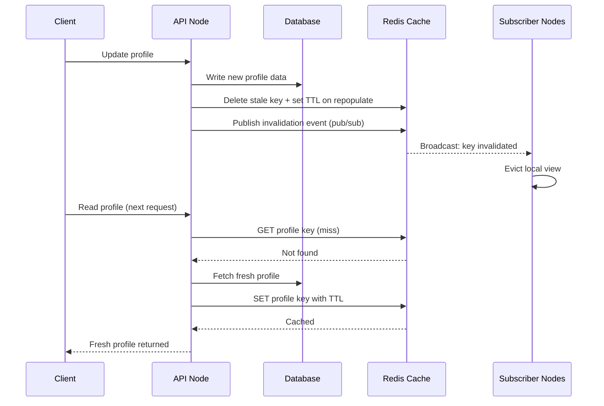

| Difficulty | Channel | Tags |
|---|---|---|
| beginner | backend | redis, memcached, cache-invalidation |

Netflix's EVCache layer — built on Memcached — holds petabytes of profile and playback data across three active-active AWS regions, serving 30+ million requests per second at cache hit rates above 99% [1]. The catch? Every profile update in one region had to propagate to every other region within seconds, without shipping full objects across continents or breaking the local read path [1]. That's the problem lurking behind every user profile service you build: writing is easy, but invalidating stale data fast enough that nobody notices is where systems quietly rot. So how do you pull it off — and what changes when you pick Redis over Memcached?

---

> ### Real-World Case — Netflix
>
> Netflix runs EVCache, its Tier-1 caching layer built on Memcached, holding petabytes of user/profile and playback data across three active-active AWS regions. Every profile or metadata update in one region had to be reflected in caches in every other region within seconds, without shipping full objects across continents or breaking the local read path.
>
> | | |
> |---|---|
> | **Challenge** | Memcached has no pub/sub, no persistence, and no built-in distributed invalidation — so a write (or delete) in us-east-1 left stale keys serving users in eu-west-1 and ap-southeast-1. They needed cross-region cache invalidation that wouldn't block or degrade local cache operations even when the replication pipeline lagged or failed. |
> | **Solution** | Netflix built its own Kafka-based replication and invalidation layer on top of Memcached: the EVCache client writes to the local region and publishes the key metadata to Kafka; remote regions receive it and either SET the value or, for invalidation-only caches, issue a plain DELETE of that key — exactly the 'delete the key on update' pattern. All replication is asynchronous and fire-and-forget, so local reads/writes never block on it, and a TTL on every key serves as the correctness backstop. They later added a cache-warming system so new clusters could be pre-filled instead of relying purely on TTL expiration during scaling events. |
> | **Outcome** | EVCache at peak routinely serves 30+ million requests/sec — just under 2 trillion requests per day — across tens of thousands of Memcached instances holding hundreds of billions of objects, with typical cache hit rates above 99%, while tolerating replication lag and regional failures without affecting local operations. |
> | **Lesson** | Memcached's simplicity is a real trade-off: you get lower overhead and fast pure caching, but you must build distributed coordination (pub/sub equivalent, Kafka streams, TTL backstops) yourself — and designing invalidation as asynchronous key-DELETE messages rather than synchronous full-object replication is what makes it scale globally. Netflix also proves you can choose eventual consistency deliberately: for most caches, a short staleness window beats a blocked write path. |

---

## Hook — One Stale Profile Away From a Support Ticket

Picture this: a user updates their phone number, refreshes the page, and the old number is still there. They try again. Still stale. Now imagine that happening at Netflix's scale — profile updates, playback progress, ratings — across three regions and tens of thousands of cache nodes [1]. At 30+ million requests per second, even a few seconds of staleness means millions of users staring at wrong data [1]. The stakes aren't theoretical: stale caches erode trust, trigger support tickets, and at scale, they turn a one-line bug into a full-blown incident. Cache invalidation sounds like a boring backend chore until the day it isn't. Here is the thing though — the solution isn't more caching, it's smarter invalidation.

## Problem — The Update Happened. So Why Does the Cache Still Lie?

Every profile service eventually hits the same wall. Reads are fast because you cache frequently accessed profiles. Writes are rare — until they aren't. And every write opens a window where the database says one thing and the cache says another. The core challenge: how do you invalidate the cache the moment a user updates their profile, across multiple servers, without introducing latency or race conditions? Specifically, three failure modes haunt teams: stale reads after a write (the classic), invalidation storms when a hot key expires everywhere at once, and cross-node divergence where server A refreshed the cache but server B still serves the old copy. Many developers discover this the painful way — a cache-aside pattern works beautifully in a single-node demo, then falls apart the moment you horizontally scale. The question isn't whether to cache. It's how to keep the cache honest when writes race reads across a fleet of machines.

## Real-World Case — Netflix's EVCache at Global Scale

Netflix faced exactly this problem at a scale most teams never imagine. EVCache, its Tier-1 caching layer built on Memcached, holds petabytes of user/profile and playback data across three active-active AWS regions [1]. Every profile or metadata update in one region had to be reflected in caches in every other region within seconds — without shipping full objects across continents or breaking the local read path [1]. The numbers are staggering: EVCache at peak routinely serves 30+ million requests/sec, just under 2 trillion requests per day, across tens of thousands of Memcached instances holding hundreds of billions of objects, with typical cache hit rates above 99% [1]. The hard part wasn't the reads — it was tolerating replication lag and regional failures without affecting local operations [1]. Netflix solved this by separating the invalidation signal from the data itself: propagate a lightweight invalidation event across regions, let each region evict locally, and let the next read repopulate from the local database. The lesson? You don't need to move the data everywhere — you need to move the *fact that the data changed* everywhere. That single insight is what separates a beginner cache strategy from one that survives planetary scale.

## Deep Dive — Write-Through, TTLs, and the Redis vs Memcached Fork

Building on Netflix's insight, the pattern for a user profile service is straightforward: write-through caching with TTL-based expiration. On profile update, you delete the cache key and write new data to both the database and the cache. Deleting (rather than updating in place) avoids a classic race where a slow read repopulates the cache with stale data right after your update — a battle scar many teams carry. You also set a TTL of 5-30 minutes as a safety net: even if an invalidation is missed, the stale entry self-destructs [2].

Now the fork in the road. Redis and Memcached both do distributed caching, but they diverge on exactly the axis that matters for invalidation:

- **Redis**: native pub/sub for automatic distributed invalidation, persistence, advanced data structures [3]
- **Memcached**: simpler architecture, faster for pure caching, no persistence [4]
- **Redis**: better for complex invalidation patterns and durability when you need a cache that can survive restarts [3]
- **Memcached**: lower memory overhead and simpler horizontal scaling for pure read-through workloads [4]

The trade-off, distilled: Redis gives you a built-in broadcast channel so one node can tell every other node "key X is dead" — perfect for the Netflix-style multi-node invalidation problem. Memcached has no such channel; you must coordinate invalidation manually across nodes, typically via an external pub/sub layer or by versioning keys [4]. Moreover, Redis's persistence means a restart doesn't empty your cache, while Memcached's simplicity means every restart is a cold start. For a profile service where invalidation correctness matters more than raw throughput, Redis's pub/sub is the pragmatic default. However, if you're pure read-heavy and can tolerate a broadcast via an external message bus, Memcached's lower overhead is genuinely attractive [4]. Fire Hot Take: the "Redis vs Memcached" debate is really a "do you need built-in invalidation plumbing?" question in disguise.

## Workflow — Invalidating Across a Distributed Fleet, Step by Step

Here is the end-to-end flow when a user updates their profile, tying together the write-through pattern and distributed invalidation. The sequence diagram below walks through the client, API, database, Redis, and subscriber nodes — note how the invalidation event travels on a separate path from the data itself, mirroring Netflix's approach [1].

1. The client sends a profile update to the API layer.
2. The API writes the new profile to the database (source of truth) and deletes the stale cache key in the same logical operation.
3. A TTL of 5-30 minutes is applied to any repopulated key as a safety net [2].
4. The API publishes an invalidation event over Redis pub/sub so other application nodes evict their local views immediately.
5. The next read for that profile is a cache miss, which repopulates the cache from the local database — no cross-region data shipping required [1].
6. Cache hit rates are monitored; a sudden drop signals either an invalidation bug or a cold-start storm.



The crucial design decision: the invalidation *signal* is tiny and fans out globally, while the *data* only moves on the next local read. That's what keeps read latency flat even as your node count grows.

## Code Example — Write-Through Invalidation With Redis Pub/Sub

The snippet below implements the workflow in Python using `redis-py`. It shows the write path (delete + republish), the read path (cache-aside with TTL), and a subscriber that evicts locally when a remote invalidation arrives.

```python
import json
import redis
from typing import Optional, Dict

# Single connection shared for cache + pub/sub
r = redis.Redis(host="localhost", port=6379, db=0, decode_responses=True)

PROFILE_TTL = 900  # 15 minutes: safety net for missed invalidations [2]
INVALIDATION_CHANNEL = "profile:invalidate"

def cache_key(user_id: str) -> str:
    return f"profile:{user_id}"

def get_profile(user_id: str) -> Optional[Dict]:
    """Cache-aside read: check cache first, fall back to DB."""
    key = cache_key(user_id)
    cached = r.get(key)
    if cached:
        return json.loads(cached)  # cache hit

    # Cache miss: load from database (source of truth)
    profile = db_fetch(user_id)
    if profile:
        # Write-through with TTL so stale data self-expires [2]
        r.set(key, json.dumps(profile), ex=PROFILE_TTL)
    return profile

def update_profile(user_id: str, fields: Dict) -> None:
    """Write-through invalidation + distributed notification."""
    # 1. Persist to database first (source of truth)
    db_update(user_id, fields)

    # 2. Delete the stale key — NOT update it.
    #    Deleting avoids a race where a slow read repopulates
    #    stale data right after the write.
    r.delete(cache_key(user_id))

    # 3. Publish invalidation so every app node evicts locally.
    #    This is the pub/sub advantage Redis has over Memcached [3].
    r.publish(INVALIDATION_CHANNEL, json.dumps({"user_id": user_id}))

def invalidate_listener():
    """Run on every app node. Evicts local view on remote updates."""
    pubsub = r.pubsub()
    pubsub.subscribe(INVALIDATION_CHANNEL)
    for message in pubsub.listen():
        if message["type"] != "message":
            continue
        data = json.loads(message["data"])
        # Best-effort local eviction — TTL covers missed events
        r.delete(cache_key(data["user_id"]))
        print(f"Evicted stale cache for user {data['user_id']}")

# --- Placeholder DB adapters (replace with your ORM/driver) ---
def db_fetch(user_id: str) -> Optional[Dict]:
    return None  # e.g. SELECT * FROM profiles WHERE id = %s

def db_update(user_id: str, fields: Dict) -> None:
    pass  # e.g. UPDATE profiles SET ... WHERE id = %s
```

Walking through it: `get_profile` implements cache-aside — check Redis, and on a miss, load from the database and cache with a TTL so even a missed invalidation self-heals [2]. `update_profile` performs the critical sequence: persist first, then delete the key (never update in place — that's where stale-read races breed), then publish an invalidation event over pub/sub so every node evicts immediately [3]. Finally, `invalidate_listener` runs on each application node and reacts to remote invalidation events. Notice the deliberate layering: pub/sub handles the fast path, and the TTL handles everything pub/sub misses. Defense in depth, not defense in hope.

## Lessons Learned — What to Tell Your Team Tomorrow

The journey from Netflix's petabyte-scale problem to your profile service reveals a handful of truths worth internalizing:

- **Delete, don't update.** Updating a cache key in place invites the stale-repopulate race. Deleting forces the next read to fetch fresh data from the source of truth.
- **TTL is your safety net, not your strategy.** A 5-30 minute TTL catches missed invalidations, but it should never be the primary mechanism for correctness [2].
- **Redis wins when invalidation is distributed.** Pub/sub gives you a built-in broadcast channel; Memcached requires manual coordination across nodes [3][4]. If you can't answer "how does node B learn node A changed a key?" you don't have a strategy yet.
- **Monitor hit rates like a heartbeat.** A sudden drop in cache hit rate is often the first symptom of an invalidation bug — before users complain [1].
- **Move the signal, not the data.** Netflix's core insight: propagate a tiny invalidation event globally and let each region refetch locally [1]. Shipping full objects across continents is how you burn bandwidth and lose the latency budget.

⚠️ Watch Out: the most common battle scar is a cache-aside implementation that works on one node and silently diverges on three. Test invalidation across your full fleet before you ship.

🎯 Key Point: cache invalidation isn't a feature you add — it's a consistency protocol you design. Tomorrow, audit one service: can you prove that a write is visible in every node's cache within your stated SLA? If not, that's your first ticket.

The moral? Caching fast is easy. Caching *honestly*, at scale, is the real engineering. Share that distinction with your team — it's the one that separates a demo from a system that survives a Netflix-sized load.

---

## Profile Update Invalidation Flow


<details>
<summary><strong>Original Interview Question</strong></summary>

**Q:** You're building a user profile service that caches frequently accessed profiles. How would you implement cache invalidation when a user updates their profile, and what trade-offs would you consider between Redis and Memcached?

**A:** Implement write-through caching with TTL-based expiration. On profile update, invalidate the cache by deleting the key and writing new data to both the database and cache. Redis offers pub/sub for automatic distributed invalidation, while Memcached requires manual coordination across nodes.

</details>

## Conclusion

Netflix's EVCache proves the point at planetary scale: at 30+ million requests per second and 99%+ hit rates across three regions, consistency came from moving tiny invalidation signals globally and refetching data locally — not from shipping objects across continents [1]. The same principle applies to your profile service at a thousandth of the scale. Tomorrow, pick one cached endpoint and answer two questions honestly: what happens to the cache the instant a write lands, and how does *every* node find out? If your answer relies on TTL alone, you have a ticking clock, not a strategy. Delete on write, broadcast the invalidation, layer a TTL as a safety net, and watch your hit rate like a heartbeat. That's the difference between a cache that's fast and a cache you can trust — and it's the one insight worth sharing with your team over coffee.

---

## References

1. [Netflix incident report](https://techblog.netflix.com/2016/03/caching-for-global-netflix.html) — article
2. [Expiration policies — Redis documentation](https://redis.io/docs/latest/develop/reference/expiration/) — documentation
3. [Redis pub/sub — Redis documentation](https://redis.io/docs/latest/develop/pubsub/) — documentation
4. [Memcached — Wikipedia](https://en.wikipedia.org/wiki/Memcached) — blog
5. [Caching strategies — AWS ElastiCache User Guide](https://docs.aws.amazon.com/AmazonElastiCache/latest/dg/Strategies.html) — documentation
6. [Cache-aside pattern — Microsoft Azure Architecture Center](https://learn.microsoft.com/en-us/azure/architecture/cache-aside/) — documentation
7. [Fluentd: Open Source Data Collector — GitHub](https://github.com/fluent/fluentd) — documentation
8. [Redis — GitHub](https://github.com/redis/redis) — documentation
9. [memcached — GitHub](https://github.com/memcached/memcached) — documentation

---

**Author:** Satishkumar Dhule — [GitHub](https://github.com/satishkumar-dhule) · [LinkedIn](https://linkedin.com/in/satishkumar-dhule) · [Website](https://satishkumar-dhule.github.io)
