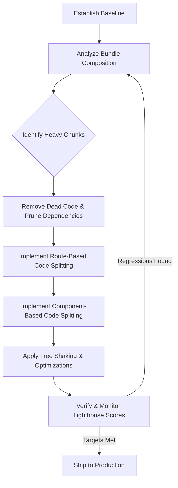

| Difficulty | Channel | Tags |
|---|---|---|
| intermediate | frontend | lighthouse, bundle, lazy-loading |

Picture this: your React application just crawled across the finish line with a Lighthouse score of 65. Time to Interactive sits at 4.2 seconds. Your JavaScript bundle weighs in at a hefty 2.1MB. For most teams, this is the moment panic sets in. For Dropbox's web performance team, however, this was not an edge case for a coding interview. It was their daily reality. Faced with an in-house bundler that lacked automatic code splitting or tree shaking, their engineers were forced to manually maintain a 6,000+ line packaging map to dictate which modules went into which bundles [1]. The stakes could not be higher. Every kilobyte parsed and executed directly steals attention from your users. Every extra second of wait time pushes them closer to closing their tab. So the question becomes: how do you systematically claw your way from a sluggish 65 all the way to a blazing 90+ without sacrificing the features that make your product great?

---

> ### Real-World Case — Dropbox
>
> Dropbox's web performance team discovered their React-heavy frontend was suffering from massive JavaScript bundles and slow page loads. Their in-house bundler had no automatic code splitting or tree shaking, forcing engineers to manually maintain a 6,000+ line packaging map dictating which modules went into which bundle.
>
> | | |
> |---|---|
> | **Challenge** | Manual code splitting meant every page download pulled in huge amounts of unused code (especially from third-party libraries and Protobuf observability instrumentation), and without tree shaking, bundles were bloated with dead code. The legacy toolchain had accumulated tech debt since 2014 and slowed development velocity. |
> | **Solution** | They migrated from their custom bundler to Rollup to get automatic code splitting (so only the chunks needed for a page are downloaded) and tree shaking (eliminating unused exports). This removed the manual packaging map and let the bundler handle optimization. They also learned the hard way that shipping too many chunks hurt performance — more chunks meant more module-discovery time and worse compression — so they tuned chunk granularity rather than splitting maximally. |
> | **Outcome** | JavaScript bundle sizes dropped by 33%, total script count dropped by 15%, and they saw meaningful Time-to-Visible-Content (TTVC) improvements. Development velocity improved since engineers no longer hand-managed bundle definitions, and years of bundling tech debt were eliminated. |
> | **Lesson** | The counterintuitive plot twist: HTTP/2 multiplexing does NOT automatically make aggressive chunk splitting free — too many chunks costs more browser module-discovery time and degrades compression ratio (zlib works better on one large file than many small ones). There's a sweet spot for chunk count that you must tune by measuring, not assume. |

---

## Hook — When Megabytes Become Milliseconds of Rage

You do not lose users because your application lacks features. You lose them because it feels slow. Research surrounding web performance has consistently shown that even small increases in load times have an outsized impact on user engagement and conversion rates [2]. For developers, this creates an uncomfortable truth: the code that you spent months perfecting can become the very thing holding your product back. Many developers discover this the hard way when they first run Lighthouse against their production build and watch their hard work score a dismal 65. Sound familiar? If so, you are not alone. The real enemy is not your ambition, but unoptimized JavaScript. The more JavaScript a browser must parse, compile, and execute, the longer it takes for your interface to become interactive [3]. With that in mind, let us look at what happens when an entire engineering team decides that 'good enough' is no longer an option.

## Problem — The Hidden Tax of Bloated Bundles

The issue runs far deeper than a single number on a Lighthouse report. Modern React applications often pull in an ecosystem of dependencies. Without discipline, third-party libraries can account for the vast majority of your bundle. This is known as 'bundle bloat', and it creates a compounding tax on your users. Each network request, each byte transferred, and each millisecond spent on script execution directly delays Time to Interactive. Many developers think that minification alone will save the day. However, that could not be further from the truth. Minification removes whitespace, but it does nothing to eliminate dead code or split your application into smaller, on-demand chunks [4]. This is precisely the problem that Dropbox was facing. With no automatic code splitting or tree shaking in their custom bundler, their only solution was to maintain an enormous, error-prone packaging manifest. The consequences were severe. Development velocity plummeted, as engineers spent their time hand-managing bundles rather than shipping features. More importantly, end users were paying the price with painfully slow load times. With that level of technical debt, a change was not a luxury. It was a necessity.

## Real-World Case — How Dropbox Cut 33% of Its JavaScript in One Sweep

When technical debt becomes unmanageable, the best engineering teams treat it as an architectural problem, not a one-off fix. This is exactly what the Dropbox web performance team did. Their custom in-house bundler lacked two critical features that are considered standard today: automatic code splitting and tree shaking. As a result, they were left manually maintaining a 6,000+ line packaging map that dictated module placement across bundles [1]. The impact speaks for itself. By re-architecting their bundling strategy, Dropbox reduced their JavaScript bundle sizes by 33%, dropped their total script count by 15%, and saw meaningful improvements to Time-to-Visible-Content (TTVC) [1]. However, the numbers only tell half of the story. Perhaps the most profound win was the elimination of years of bundling tech debt. Engineers no longer needed to hand-manage these definitions, freeing up valuable development velocity to focus on what truly mattered: building a better product for their users. This story serves as a powerful reminder: sometimes the most impactful optimization is not a clever micro-optimization, but removing a manual process entirely.

## Deep Dive — The Weapons of Mass Optimization

So, how can you replicate this success for your own application? The journey to a 90+ Lighthouse score relies on a handful of battle-tested techniques. First and foremost, you must understand what you are shipping. Tools such as webpack-bundle-analyzer allow you to visualize the composition of your bundles and identify your true 'bundle villains' [5]. Once identified, tree shaking becomes your greatest ally. By leveraging proper ES module syntax and modern bundler configurations, unused exports are automatically pruned from your final output, preventing dead code from ever reaching your users [4]. However, analysis and pruning alone are not enough. Code splitting is the secret to loading only what is necessary, when it is necessary. With React.lazy() and Suspense, you can split your application at the route level, as well as at the component level for heavier, non-critical interfaces such as charts, modals, or editors [6][7]. Additionally, dynamically importing third-party libraries for features that are conditionally rendered can yield massive savings. These strategies work in unison to shrink your initial payload, drastically improving metrics such as Time to Interactive and First Contentful Paint [3]. The plot twist? Smaller payloads do not just make your app faster. They also make it cheaper to serve, more resilient on flaky networks, and far more accessible to users across the globe.

## Workflow — A Battle Plan From 65 to 90+

Theory is worthless without execution. To systematically optimize your application, you should approach it as a measured, iterative process rather than a weekend hack. Start by establishing a baseline. Run Lighthouse in a consistent, throttled environment and record your critical metrics. Next, analyze. Use a bundle visualizer to pinpoint your largest chunks and establish targets for reduction. From here, eliminate the easy wins. Remove unused dependencies, audit your imports, and leverage tree shaking by ensuring your code utilizes ES modules. Then, the real magic begins: split. Implement route-based splitting for your top-level pages, and utilize component-based splitting for any heavy, lazy-loaded experiences. Finally, verify. Re-measure your scores, test on real network conditions, and continuously monitor for regressions. This feedback loop, visualized below, is the same philosophy that allowed Dropbox to obliterate years of manual work. After all, what gets measured, gets optimized [2].

## Code Example — Putting Lazy Loading Into Action

Enough talk. Let us look at a production-ready pattern that you can implement today. The following example showcases route-based code splitting with React.lazy() and Suspense, whilst also demonstrating component-based splitting for a particularly heavy analytics chart. It even includes an error boundary, a critical addition to gracefully handle network failures when fetching chunks on slower connections.

## Lessons Learned — Battle Scars From The Frontlines

Optimizing performance is as much about discipline as it is about tooling. Many developers fall into the trap of over-splitting, creating an excessive number of tiny chunks that can actually hurt performance due to request overhead. Others neglect to provide Suspense fallbacks, leaving users staring at a blank screen. The key is finding balance. Aim for meaningful splits around logical boundaries, such as routes and large, infrequently used features. Furthermore, do not optimize in a vacuum. Always benchmark your changes against real-world network and device profiles, as lab scores can be misleading [3]. Perhaps the greatest lesson, echoing Dropbox's success, is to automate what you can. If a task requires a 6,000-line manual map, it is not sustainable. Embrace the tooling that modern bundlers provide for automatic code splitting and tree shaking [4][5]. Most importantly, tie these optimizations back to user value. Faster applications lead to better retention, higher conversions, and happier users. That is a metric worth chasing for 90+.

---

## Performance Optimization Workflow

<strong>Original Interview Question</strong>

**Q:** You're tasked with improving a React app's Lighthouse performance score from 65 to 90+. The bundle size is 2.1MB and Time to Interactive is 4.2s. What specific steps would you take to optimize the bundle and implement lazy loading?

**A:** Implement code splitting with React.lazy() and Suspense, analyze bundle composition with webpack-bundle-analyzer to identify largest chunks, remove unused dependencies and optimize imports, add dynamic imports for heavy components and third-party libraries, implement route-based splitting for better initial load times, and utilize tree shaking with proper ES module configuration.

## Conclusion

The journey from 65 to 90+ is not about chasing vanity metrics. It is about respecting your users' time. Just as Dropbox discovered, the most impactful optimizations often stem from removing manual, unsustainable processes and embracing the automated tooling that modern bundlers provide [1]. By establishing a baseline, analyzing your bundles, pruning dead code, and strategically splitting your application, you can systematically transform a sluggish React app into a snappy, delightful experience. The next time Lighthouse hands you a disappointing score, do not despair. Pull up your bundle analyzer, start splitting, and measure the results. That one afternoon of optimization may very well be the change that keeps your users engaged for years to come.

---

## References

1. [Dropbox incident report](https://dropbox.tech/frontend/how-we-reduced-the-size-of-our-javascript-bundles-by-33-percent) — article
2. [Why Performance Matters](https://web.dev/why-speed-matters/) — documentation
3. [Time to Interactive (TTI)](https://web.dev/tti/) — documentation
4. [Tree Shaking - webpack](https://webpack.js.org/guides/tree-shaking/) — documentation
5. [webpack-bundle-analyzer](https://github.com/webpack-contrib/webpack-bundle-analyzer) — documentation
6. [Code-Splitting - React](https://react.dev/learn/code-splitting) — documentation
7. [React.lazy() - MDN](https://developer.mozilla.org/en-US/docs/Web/JavaScript/Reference/Operators/import#react.lazy) — documentation
8. [Lighthouse Documentation](https://developer.chrome.com/docs/lighthouse/overview/) — documentation

---

**Author:** Satishkumar Dhule — [GitHub](https://github.com/satishkumar-dhule) · [LinkedIn](https://linkedin.com/in/satishkumar-dhule) · [Website](https://satishkumar-dhule.github.io)
