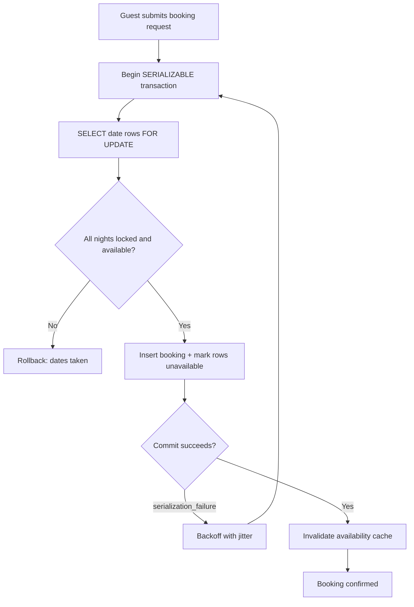

| Difficulty | Channel | Tags |
|---|---|---|
| intermediate | database | acid, isolation-levels, mvcc |

Black Friday 2025, Shopify merchants were ringing up a record $5.1 million in sales per minute — and every single transaction was racing for the same last unit of inventory [1]. Two checkouts hitting the same product at the same millisecond is the exact same race condition as two guests reserving the same Airbnb property on the same night. This is the story of how that race gets won, why your first instinct (just add a lock) usually breaks something else, and how to design transaction handling that stays correct under pressure without melting your database.

---

> ### Real-World Case — Shopify
>
> Shopify's oversell-protection system must stop two concurrent checkouts from claiming the same last unit—a race condition identical in shape to a double booking. Reservations had run on Redis for years while the inventory ledger lived in MySQL, and on Black Friday 2025 merchants hit a record $5.1 million in sales per minute, with every transaction touching inventory.
>
> | | |
> |---|---|
> | **Challenge** | Reserve (hold stock during payment) and claim (deduct from the ledger) spanned two systems and could not be wrapped in one atomic step, so depending on ordering the system could oversell (item sold but never deducted) or undersell (deducted but still reserved). Earlier MySQL prototypes using a single row with a quantity column collapsed under lock contention, and they needed ACID correctness plus peak-throughput latency without dropping requests. |
> | **Solution** | They moved reservations into MySQL next to the ledger and rebuilt on row-level locking: one row per sellable unit in a bounded pool (capped at 1,000 per item/location), acquired with SELECT ... FOR UPDATE SKIP LOCKED inside single transactions so concurrent buyers skip locked rows instead of waiting. They switched those transactions from REPEATABLE READ to READ COMMITTED to avoid gap locks blocking replenishment, redesigned to a composite primary key to cut two row locks per reservation down to one, standardized lock ordering to eliminate deadlocks, and rolled out in 'shadow mode' dual-writing to Redis and MySQL with a kill switch. Tagging SQL with connection holders exposed that the real ceiling was connection hold time elsewhere in checkout: cleanup removed 50% of reads and 33% of transactions on the primary. |
> | **Outcome** | Met high-throughput targets during peak 2025 traffic; during high-volume flash sales writer CPU stayed under 50% and reader CPU under 16% with headroom to spare; eliminated entire classes of oversell/undersell bugs by putting reserve and claim under one ACID transaction; migrated pod-by-pod with zero downtime and an instant revert path. |
> | **Lesson** | The relational database you already run may be all the mutual exclusion you need (SKIP LOCKED replaced a whole Redis cluster), and the counterintuitive part: after weeks of optimizing locks and queries, the actual bottleneck was connection usage in code nobody was looking at—if CPU is low but queuing is high, instrument the full path, because the answer is usually in the plumbing, not the engine. |

---

## Hook — The 3 a.m. Pager Nobody Wants to Answer

Picture this: a guest books a beachfront cabin for July 4th. Then another guest books the same cabin, same dates. Both get confirmation emails. One of them lands in Miami to find a stranger already grilling on the deck. Sound familiar? This is the double booking problem, and it is older than databases themselves — airlines, hotels, and marketplaces have all bled money over it.

Here is the uncomfortable part: the bug almost never shows up in staging. It needs two requests landing within microseconds of each other, which means it shows up for your highest-value customer on your busiest day. The stakes are not abstract — oversells mean refunds, support tickets, chargebacks, and a trust tax you pay for years.

Many developers assume "the database will handle it." But the database only handles it if you explicitly tell it how, and the default settings on most systems are quietly optimizing for throughput over correctness. So what actually happens when two transactions collide? That question is where the real journey starts.

## Problem — Why "Just Check, Then Insert" Always Loses

The classic buggy flow looks innocent: read the availability table, see the date is free, insert the booking. Building on that naive pattern, the flaw emerges the moment you have two concurrent requests — call them Request A and Request B. Both read `is_available = TRUE` before either one writes, both conclude the property is free, and both insert. The check and the write are not atomic, so the guarantee you thought you had never existed [6].

This is a race condition, and it is a category error, not a coding typo: you tried to enforce a business rule (one booking per night) using operations that the database is allowed to interleave [6].

You have three levers, and each costs you something:

- **Isolation level** — how aggressively the database blocks concurrent reads and writes of the same rows [2].
- **Locking strategy** — pessimistic (lock first, ask later) versus optimistic (version-stamp rows, fail on conflict) [5].
- **Application-level validation** — a final authoritative check inside the same transaction that does the write.

The tension is real: stronger isolation means fewer oversells but more blocking, more retries, and lower throughput. Weaker isolation keeps your p99 latency beautiful until the day it silently sells the same cabin twice. And here is the plot twist that trips up even experienced backend engineers — turning isolation up to SERIALIZABLE does not eliminate the problem, it just converts oversells into retries. You still need a retry strategy, or your booking endpoint starts returning 409s to paying customers during a flash sale [3].

So how do teams running at real scale thread this needle?

## Real-World Case — Shopify's Oversell Shield

This is not hypothetical. Shopify's oversell-protection system has to stop two concurrent checkouts from claiming the same last unit — a race condition identical in shape to a double booking. For years, reservations lived on Redis while the inventory ledger lived in MySQL, and that split meant reserve and claim were never under one atomic umbrella. On Black Friday 2025, merchants hit a record $5.1 million in sales per minute, with every transaction touching inventory [1].

The fix was structural: move reserve and claim under a single ACID transaction so an oversell becomes impossible by construction rather than prevented by a wall of application-level if-statements. The results were concrete — during high-volume flash sales, writer CPU stayed under 50% and reader CPU under 16% with headroom to spare; the team eliminated entire classes of oversell and undersell bugs, and migrated pod-by-pod with zero downtime and an instant revert path [1].

Notice what Shopify did not do: they did not bolt on a distributed lock service and hope. They collapsed a cross-system consistency problem into one transactional boundary. That same move — putting the check, the write, and the guard rails inside one atomic unit — is exactly what your booking system needs. The question becomes: which transaction boundary, and which isolation level, lets you do it without stalling every concurrent booking on the property?

That leads directly into the trade-off most interview answers gloss over.

## Deep Dive — Isolation Levels, MVCC, and the Retry Tax

Postgres gives you four isolation levels, and each one is a different bet about which anomalies you are willing to tolerate [3]. For booking writes, SERIALIZABLE is the honest choice: it guarantees that concurrent transactions behave as if they ran one at a time, so a "read availability, then write booking" pair can never both succeed against the same row [2][3].

However — and this is the part many developers discover the hard way — SERIALIZABLE in modern Postgres is implemented on top of MVCC with predicate locks, not with brute-force table locking [4]. Readers using snapshot isolation keep flowing; the cost lands on writers whose write sets overlap, who get a `40001 serialization_failure` and must retry [3]. In other words, you are trading oversell risk for retry risk. Concurrency control becomes an availability feature, not just a correctness one.

Here is the real trade-off, laid bare:

| Approach | Guarantees | Cost | When to use it |
|---|---|---|---|
| READ COMMITTED + app check | Almost nothing under concurrency | Lowest latency | Never, for money-moving writes |
| READ COMMITTED + `SELECT FOR UPDATE` | Row-level mutual exclusion | Writers block on hot rows | Narrow, single-row bookings |
| SERIALIZABLE + optimistic retry | Full serializability | Retry storms on contention | Booking, payments, inventory claims |
| Optimistic version column only | Detects lost updates, not phantoms | Cheap reads, retries on write | Read-heavy calendars with sparse conflicts |

Two refinements separate production systems from interview answers:

- **Lock only the rows you need.** `SELECT ... FOR UPDATE` on the exact date-range rows (not the whole property row, and certainly not the whole table) confines blocking to the specific nights in dispute [7]. A hot property in July blocks other July bookings — August bookings sail through.
- **Retry with exponential backoff plus jitter.** Without jitter, a burst of conflicting transactions retries in lockstep and thundering-herd the same hot row all over again. A small random delay decorrelates them and lets the winner commit first [3].

⚠️ Watch Out: the most common battle scar in this space is a retry loop with no upper bound. Under a flash sale, an unbounded retry can turn a slow property into a cascading outage as connection pool slots fill with transactions waiting to commit. Cap retries, fail fast with a clear "someone just took those dates" message, and monitor lock-wait time as a first-class metric.

🔥 Hot Take: many teams reach for Redis or a distributed lock as the first fix, exactly as Shopify's architecture once did. But a lock in Redis and a write in Postgres are two systems, and two systems cannot share a transaction boundary — which is precisely why Shopify's oversell class of bugs vanished only after reserve and claim moved under one ACID transaction [1].

## Workflow — The Booking Transaction, Step by Step

Pulling the pieces together, a correct booking write follows a tight choreography where every step happens inside one transaction:

1. **Begin** a SERIALIZABLE transaction on a connection dedicated to this booking attempt.
2. **Lock the date-range rows** with `SELECT ... FOR UPDATE`, ordered by date so every concurrent writer acquires locks in the same order and deadlocks are structurally avoided [7].
3. **Validate** that every requested night exists and is still available. If any night is taken, roll back immediately — no partial claims.
4. **Write** the booking and flip the availability rows, optionally bumping a `version` column so optimistic readers elsewhere can detect the change [5].
5. **Commit.** If Postgres raises a serialization failure, sleep with exponential backoff and jitter, then replay from step 1 [3].
6. **Invalidate the cache** only after a successful commit — never before, or a stale cached "available" will resurrect the race you just closed [1].

The sequence looks like this:



🎯 Key Point: the lock is acquired *before* the availability decision, and the cache is invalidated *after* the commit. Reverse either order and the race condition reappears — just now it is hiding in your cache layer instead of your SQL.

## Code Example — A Booking Function That Cannot Oversell

Below is a production-shaped Python implementation using `psycopg2`. It combines row-level locking, a version column for optimistic readers, bounded retries with jitter, and post-commit cache invalidation:

```python
import random
import time

import psycopg2
from psycopg2 import errors

MAX_RETRIES = 5
BACKOFF_BASE = 0.01  # 10ms, doubled each attempt

class BookingUnavailable(Exception):
    """Requested nights are already reserved."""

class BookingConflict(Exception):
    """Could not win the race after MAX_RETRIES attempts."""

def invalidate_availability_cache(property_id, check_in, check_out):
    # Stub for your Redis/memcached invalidation path.
    pass

def book_property(conn, property_id, check_in, check_out, guest_id):
    """Reserve every night in [check_in, check_out) atomically."""
    for attempt in range(MAX_RETRIES):
        try:
            # `with conn` commits on success and rolls back on any exception,
            # so a failed validation never leaves half a booking behind.
            with conn:
                with conn.cursor() as cur:
                    # Lock ONLY the disputed date rows, in a stable order.
                    # FOR UPDATE blocks competing writers until we commit [7].
                    cur.execute(
                        """
                        SELECT date, is_available, version
                          FROM property_availability
                         WHERE property_id = %s
                           AND date >= %s AND date < %s
                      ORDER BY date
                           FOR UPDATE
                        """,
                        (property_id, check_in, check_out),
                    )
                    rows = cur.fetchall()

                    # Application-level validation INSIDE the lock: every
                    # night must exist and be open before anything is claimed.
                    if not rows or any(not row[1] for row in rows):
                        raise BookingUnavailable(property_id)

                    # Flip availability and bump the version so optimistic
                    # readers can detect the change without locking [5].
                    cur.execute(
                        """
                        UPDATE property_availability
                           SET is_available = FALSE,
                               version = version + 1,
                               updated_at = now()
                         WHERE property_id = %s
                           AND date >= %s AND date < %s
                        """,
                        (property_id, check_in, check_out),
                    )

                    # The booking row is written in the SAME transaction,
                    # giving you one atomic reserve+claim boundary [1].
                    cur.execute(
                        """
                        INSERT INTO bookings
                            (property_id, guest_id, check_in, check_out, status)
                        VALUES (%s, %s, %s, %s, 'confirmed')
                        """,
                        (property_id, guest_id, check_in, check_out),
                    )

            # Runs only after COMMIT succeeds - invalidating earlier would
            # let a stale "available" answer sneak back into the cache.
            invalidate_availability_cache(property_id, check_in, check_out)
            return True

        except errors.SerializationFailure:
            # SERIALIZABLE conflict: another tx committed first [3].
            # Exponential backoff WITH jitter decorrelates the losers.
            delay = (BACKOFF_BASE * (2 ** attempt)) + random.uniform(0, BACKOFF_BASE)
            time.sleep(delay)

        except BookingUnavailable:
            conn.rollback()
            return False

    raise BookingConflict(property_id)
```

**Walkthrough:**

- **The transaction boundary** — `with conn` guarantees the lock, the validation, the availability update, and the booking insert all commit or all roll back. That single property is what eliminates the oversell class of bugs rather than one specific bug [1].
- **The lock scope** — `SELECT ... FOR UPDATE` with an `ORDER BY date` acquires row locks in deterministic order, which prevents deadlocks between overlapping date ranges [7]. Locking only the requested nights keeps unrelated dates writable.
- **The validation** — checking `is_available` *after* the lock is what makes the check trustworthy; the same check performed before locking would be advisory at best.
- **The version bump** — optimistic readers elsewhere (reporting dashboards, calendar endpoints) can compare `version` values and skip re-reading hot rows [5].
- **The retry** — `SerializationFailure` is a normal outcome of SERIALIZABLE, not an error state. Bounded exponential backoff with jitter converts contention into a short delay instead of an oversell or a 500 [3].
- **The cache invalidation** — happening strictly post-commit keeps the cache a follower of the database's truth, never a competing source of it.

## Lessons Learned — What to Change Tomorrow

The journey from "check then insert" to an oversell-proof booking write is really a shift in mindset: correctness under concurrency is designed, not inherited. Concretely:

- **Put the check and the write in the same transaction.** If your reserve lives in one store and your ledger in another, you have built the exact split that forced Shopify to rebuild its oversell protection [1].
- **For money-moving writes, prefer SERIALIZABLE and budget for retries.** Isolation buys you correctness; retries are the premium you pay for it [2][3].
- **Lock narrowly and in a consistent order.** Date-range row locks with `ORDER BY` give you mutual exclusion where you need it and concurrency everywhere else [7].
- **Bound every retry loop.** Unbounded retries plus a hot property equals a connection-pool outage. Cap attempts, add jitter, and alert on lock-wait time [3].
- **Invalidate caches only after commit.** Post-commit invalidation is the difference between a fast cache and a race condition with a TTL.
- **Measure the contention you assume away.** Track serialization failure rates and lock waits per property; they are your earliest warning that a flash sale is straining the design.

If this feels overwhelming, you are not alone — every team that ships a booking or inventory system walks this exact path, usually one production incident at a time.

The single insight worth sharing with your team: **the last-unit problem is not solved by checking harder, it is solved by making the check and the claim impossible to separate.** Do that, and whole categories of oversell bugs stop being your problem.

---

## Booking Transaction Flow


<details>
<summary><strong>Original Interview Question</strong></summary>

**Q:** You're building a booking system for Airbnb where multiple users can reserve the same property simultaneously. How would you design the transaction handling to prevent double bookings while maintaining high availability?

**A:** Use SERIALIZABLE isolation with optimistic concurrency control. Implement row-level locks on property availability tables, use MVCC snapshot reads for checking availability, and apply application-level validation to ensure atomic booking operations.

</details>

## Conclusion

Shopify's Black Friday numbers — $5.1 million per minute, writer CPU under 50%, zero downtime during the migration [1] — are not a story about scale so much as a story about boundaries: reserve and claim finally lived inside one transaction, and the oversell bug class disappeared with them [1]. Your booking system reaches the same destination by refusing to let the availability check and the booking write exist apart: SERIALIZABLE isolation for the write path, narrow date-range row locks ordered to avoid deadlocks [7], bounded retries with jitter for serialization failures [3], version columns for lock-free readers [5], and cache invalidation strictly after commit. Tomorrow, start with one change: audit your booking or checkout write path and confirm that the check and the claim share a transaction — if they do not, every other optimization is decorating a race condition. The memorable line to bring to your next team meeting: you cannot check your way out of a race, you can only design your way out of one.

---

## References

1. [Shopify incident report](https://shopify.engineering/scaling-inventory-reservations) — blog
2. [ACID - Wikipedia](https://en.wikipedia.org/wiki/ACID) — documentation
3. [PostgreSQL: Transaction Isolation Levels](https://www.postgresql.org/docs/current/transaction-iso.html) — documentation
4. [Multiversion concurrency control - Wikipedia](https://en.wikipedia.org/wiki/Multiversion_concurrency_control) — documentation
5. [Optimistic concurrency control - Wikipedia](https://en.wikipedia.org/wiki/Optimistic_concurrency_control) — documentation
6. [Race condition - Wikipedia](https://en.wikipedia.org/wiki/Race_condition) — documentation
7. [PostgreSQL: SELECT FOR UPDATE clause](https://www.postgresql.org/docs/current/sql-select.html) — documentation
8. [Isolation (computer science) - Wikipedia](https://en.wikipedia.org/wiki/Isolation_(computer_science)) — documentation
9. [Two-phase locking - Wikipedia](https://en.wikipedia.org/wiki/Two-phase_locking) — documentation

---

**Author:** Satishkumar Dhule — [GitHub](https://github.com/satishkumar-dhule) · [LinkedIn](https://linkedin.com/in/satishkumar-dhule) · [Website](https://satishkumar-dhule.github.io)
