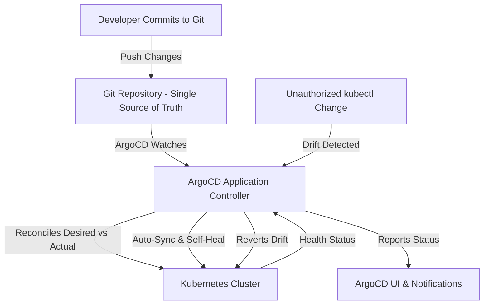

| Difficulty | Channel | Tags |
|---|---|---|
| beginner | devops | argocd, flux, declarative |

Imagine your infrastructure growing so fast that the very tools meant to keep it stable start to crumble under the weight of scale. This is exactly the reality that Okta (Auth0) faced as their private-cloud platform exploded in popularity [1]. What started as a handful of hand-managed clusters quickly spiraled into a monumental operational challenge, and the answer they found would reshape how you think about managing Kubernetes at scale.

---

> ### Real-World Case — Okta (Auth0)
>
> Okta's Auth0 private-cloud platform originally hosted customer infrastructure on a handful of hand-managed clusters with snowflake configurations, manual operator-driven updates, and code running in VMs. As demand grew, they bet on a cloud-native architecture heavily using the Argo project and scaled from about 12 clusters to over 1,000 Kubernetes clusters across a five-year journey, detailed in their KubeCon talk 'One Dozen To One Thousand Clusters: How Argo Kept up as We Scaled.'
>
> | | |
> |---|---|
> | **Challenge** | Scale the GitOps platform while supporting customer-specific deployment windows, Terraform-generated infrastructure and secrets that must apply BEFORE Kubernetes manifests, release bundles that couple images + Terraform + manifests per customer cluster, and Argo CD controller crashes, slow UI, race conditions and plugin subprocess overhead at high application counts. |
> | **Solution** | They adopted Argo CD for service provisioning, Argo Workflows for deployments, and Terraform with a custom provider for IaC, all orchestrated by control-plane services. Critically, they could NOT use Argo CD's built-in auto-sync — it can't honor Terraform ordering dependencies or per-customer deployment windows — so they implemented a custom 'auto-sync' using Argo Workflows plus their control plane, and built a CLI wrapper that classifies transient failures (crash loops, sync conflicts, stuck syncs), enforces timeouts, and controls retries. |
> | **Outcome** | Scaled from ~12 to 1,000+ Kubernetes clusters; each release-customer-cluster maps to one Argo application driven by their custom orchestration. They also upstreamed fixes for an application-controller race condition and untracked-resource performance issues, and needed controller scaling, infrastructure upgrades, and ignore-resource settings to keep status reporting accurate at scale. |
> | **Lesson** | Declarative GitOps and auto-sync are the right default, but at enterprise scale with coupled infrastructure dependencies and regulated deployment windows, the pure 'commit and let ArgoCD auto-sync' model breaks down — you may need to orchestrate syncs imperatively around the declarative core. The exact auto-sync feature most tutorials recommend was the thing Okta had to replace. |

---

## Hook — The Breaking Point No One Saw Coming

You have likely felt the weight of a late-night page that signals something has gone terribly wrong. Now, picture an engineering team tasked with maintaining customer infrastructure across a mere dozen Kubernetes clusters. On paper, this sounds manageable. However, as demand skyrocketed, each new cluster brought with it a new flavor of snowflake configuration, manual operator-driven updates, and inconsistent environments [1]. The stakes were immense: one misconfiguration could ripple across thousands of customer workloads. This begs the question: how do you grow without sacrificing stability?

## Problem — When Manual Becomes Catastrophic

As you scale your infrastructure, the cracks in an imperative, manual approach begin to show. Making direct changes with `kubectl` commands may feel fast in the moment, but speed comes at a steep cost. Without a single source of truth, configuration drift runs rampant between environments [2]. Moreover, rollbacks become a game of guesswork, auditing changes becomes nearly impossible, and your team drowns in toil. The harsh reality is this: what works for 12 clusters is a recipe for disaster at 1,000. This leads to a critical decision that every growing platform must make: will you continue fighting fires, or will you declare your desired state and let automation do the heavy lifting?

## Real-World Case — Okta (Auth0)

Okta (Auth0)'s engineering journey perfectly illustrates this tipping point. Originally hosting customer infrastructure on just a handful of clusters, their platform was plagued by snowflake configurations and manual updates [1]. As adoption surged over a five-year period, they scaled from roughly 12 clusters to over 1,000 Kubernetes clusters. To meet this challenge, they leaned heavily into the Argo project, modeling each release-customer-cluster as its own Argo Application driven by custom orchestration [1]. However, this explosive growth came with growing pains. Their team had to upstream fixes for an application-controller race condition and untracked-resource performance issues, all while tackling controller scaling, infrastructure upgrades, and ignore-resource settings to keep status reporting accurate at scale [1]. This monumental effort proved one thing: at scale, GitOps isn't just a nice-to-have, it's a necessity.

## Deep Dive — Declarative vs Imperative in a GitOps World

Building on Okta's experience, you must understand the core philosophy that allowed them to succeed. At the heart of GitOps lies the battle between imperative and declarative approaches [3]. **The imperative approach** is what many developers know best: executing commands like `kubectl apply` or `kubectl patch` to directly mutate your cluster's state. While this gives you immediate control, it bypasses version control entirely, making it difficult to track, audit, or reproduce changes [2]. **The declarative approach**, on the other hand, flips the script. Instead of telling Kubernetes *how* to do something, you define *what* the desired end state should be within Git, using tools like YAML manifests, Helm charts, or Kustomize [4][5][6]. ArgoCD then acts as your relentless reconciler, continuously comparing the live cluster state against your declared desired state and correcting any drift [3]. This is the very principle that allowed Okta to enforce consistency across 1,000 clusters without needing to manually babysit each one. Therefore, the choice is clear: if you want resilience at scale, declarative is the path forward.

## Workflow — How ArgoCD Brings GitOps to Life

Now that you understand the 'why', it's time to explore the 'how'. To replicate the success seen at scale, you need a well-defined workflow that ArgoCD can automate for you [3]. Here's the step-by-step process you'll want to follow: **1. Establish Your Source of Truth** - Store all of your Kubernetes manifests, Helm charts, or Kustomize configurations inside a Git repository [4][5]. This becomes immutable history for every change. **2. Define Your Application** - Create an ArgoCD Application Custom Resource (CRD) that points to your Git repo, target branch, and the path containing your manifests [3]. **3. Enable Auto-Sync** - Turn on automatic synchronization with a health check interval (commonly 1-5 minutes). This is what allows changes merged to Git to flow to your clusters without manual intervention. **4. Configure Self-Healing** - Enable self-healing to automatically revert any unauthorized manual changes. This enforces the desired state and prevents configuration drift [3]. **5. Monitor and Scale** - As Okta discovered, you'll need to tune controller settings, manage ignore-resources, and scale your ArgoCD controllers to keep status reporting accurate as your cluster count grows [1]. The entire flow can be visualized below, showing how Git acts as the single source of truth that continuously reconciles with your Kubernetes clusters.

## Code Example — Declaring Your First ArgoCD Application

Theory is powerful, but nothing beats seeing it in action. To put this workflow into practice, you can define an ArgoCD Application using a declarative manifest. The following example shows how you would point ArgoCD to a Git repository and configure automatic syncing with self-healing enabled [3]. This is the exact pattern that scales across large fleets, just as Okta demonstrated [1].

## Lessons Learned — The Battle Scars Worth Heeding

As you embark on your own GitOps journey, it's important to learn from the scars of those who have walked this path before you. Here are the key takeaways to carry forward: **Embrace the declarative mindset** - If you're still making imperative changes, you're fighting the system. Treat Git as your source of truth and let reconciliation do the work [2][3]. **Scale requires tuning** - What works for a dozen clusters won't cut it for a thousand. As Okta learned, you need to account for controller scaling, race conditions, and untracked resources early on [1]. **Automation is your safety net** - Auto-sync paired with self-healing doesn't just save time, it prevents human error and enforces compliance across your fleet [3]. **Tooling matters** - Whether you choose Helm, Kustomize, or raw manifests, pick what fits your team's workflow and stick to it [4][5][6]. Most importantly, remember that GitOps isn't just about technology, it's about building trust in your delivery pipeline. So, as you prepare for your next deployment, ask yourself: will you continue to push commands, or will you pull your desired state from Git?

---

## ArgoCD GitOps Reconciliation Flow

<strong>Original Interview Question</strong>

**Q:** You're setting up GitOps for a microservices deployment. How would you configure ArgoCD to automatically sync changes from your Git repository to Kubernetes, and what's the difference between declarative and imperative approaches in this context?

**A:** I'd configure ArgoCD by setting up a Git repository containing Kubernetes manifests or Helm charts, creating an Application CRD that points to the Git repository, enabling auto-sync with a health check interval of 3 minutes, and implementing self-healing to automatically revert any manual changes. The declarative approach involves defining the desired state in Git through YAML manifests, Helm charts, or Kustomize configurations, where ArgoCD continuously reconciles the actual state with the desired state. In contrast, the imperative approach uses kubectl commands to make direct changes to the cluster, bypassing the Git repository as the single source of truth.

## Conclusion

The journey from manual firefighting to automated reconciliation isn't just a technical upgrade, it's a transformation in how you approach scale. As Okta (Auth0) proved, GitOps with ArgoCD can turn an unmanageable sprawl of 1,000 clusters into a predictable, auditable, and self-healing system [1]. The path forward is simple: declare your desired state in Git, let ArgoCD do the reconciliation, and reclaim your nights from endless pager alerts. Your future self—and your team—will thank you for it.

---

## References

1. [Okta (Auth0) incident report](https://thenewstack.io/how-okta-scaled-from-12-to-1000-kubernetes-clusters-with-argo-cd/) — article
2. [Kubernetes Documentation - Declarative Management](https://kubernetes.io/docs/tasks/manage-kubernetes-objects/declarative-config/) — documentation
3. [ArgoCD Documentation - Core Concepts](https://argo-cd.readthedocs.io/en/stable/core_concepts/) — documentation
4. [Helm Documentation - Getting Started](https://helm.sh/docs/chart_template_guide/getting_started/) — documentation
5. [Kustomize Documentation - Introduction](https://kubectl.docs.kubernetes.io/references/kustomize/) — documentation
6. [Kubernetes Documentation - Managing Resources](https://kubernetes.io/docs/concepts/cluster-administration/manage-deployment/) — documentation
7. [ArgoCD Documentation - Application CRD](https://argo-cd.readthedocs.io/en/stable/operator-manual/declarative-setup/#applications) — documentation
8. [GitOps - What is GitOps?](https://github.com/open-gitops/documents/blob/main/PRINCIPLES.md) — documentation

---

**Author:** Satishkumar Dhule — [GitHub](https://github.com/satishkumar-dhule) · [LinkedIn](https://linkedin.com/in/satishkumar-dhule) · [Website](https://satishkumar-dhule.github.io)
