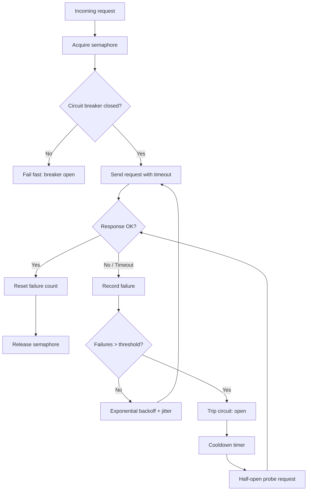

| Difficulty | Channel | Tags |
|---|---|---|
| advanced | backend | asyncio, aiohttp, concurrency |

In 2012, a single AWS S3 outage rippled through Netflix's microservice architecture and threatened to take down streaming for millions of users — until a resilience pattern called the circuit breaker tripped, contained the damage, and served fallbacks instead of cascading failures [1]. Before those improvements, Netflix measured roughly 80% of user-perceived latency as coming from RPC dependencies [1]. That same math applies to your Python service every time it waits on a slow downstream API. Here is the uncomfortable question: what is your aiohttp client doing while that dependency crawls?

---

> ### Real-World Case — Netflix
>
> Netflix's architecture relies heavily on distributed microservices calling dozens of downstream dependencies (internal services, AWS S3, etc.) per request. During AWS outages and other dependency failures, a single slow or failing service could cause cascading failures that brought down entire request flows and impacted millions of users.
>
> | | |
> |---|---|
> | **Challenge** | Prevent cascading failures and graceful degradation when dependent services are slow or unavailable, while still enforcing timeouts and concurrency limits on outbound connections. |
> | **Solution** | Netflix developed and open-sourced Hystrix, a resilience library that implements circuit breakers, bulkheads (via thread pools and semaphores to limit concurrent calls), request timeouts, fallbacks, and metrics. Hystrix isolates each dependency so failures are contained and requests fail fast or degrade gracefully instead of queuing indefinitely. |
> | **Outcome** | Hystrix allowed Netflix to contain failures during AWS outages (including the 2012 S3 outage) by tripping circuits on failing dependencies and serving fallbacks, preventing system-wide collapse. Netflix reported that ~80% of user-perceived latency came from RPC dependencies prior to resilience improvements, and Hystrix was deployed across critical call paths handling billions of daily requests. |
> | **Lesson** | Bulkheading with semaphores/connection limits, aggressive timeouts, and circuit breakers are essential for graceful degradation at scale—fail fast and fall back rather than letting slow dependencies cascade into full outages. |

---

## Hook — The 3 a.m. Pager You Built Yourself

Picture this: your deploy looks fine, dashboards are green, and then a single downstream service starts taking 8 seconds instead of 80 milliseconds. Your aiohttp clients pile up waiting. The event loop saturates. Retries multiply the load. Within minutes, a problem owned by one team becomes an outage owned by everyone. Many developers discover this the hard way — the connection pool they shipped was a default `ClientSession` with no semaphore, no timeout budget, and no idea when to stop trying. The stakes are not abstract: every blocked coroutine holds memory, every unbounded retry multiplies traffic, and every missing timeout is a future incident report. So the first honest admission is that most "connection pools" in production are really just hope with a TCP socket attached.

## Problem — Why a Default ClientSession Is a Ticking Time Bomb

Building on that failure mode, the core challenge has three tangled parts. First, concurrency: aiohttp will happily open as many connections as you ask for, so a burst of 5,000 requests can exhaust file descriptors or trigger remote rate limits. Second, timeouts: without explicit `total`, `connect`, and `sock_read` budgets, a half-open socket can park a coroutine indefinitely. Third, and most dangerous, cascade — when one service degrades, well-meaning retries amplify the very load that caused the failure. The tension is that you cannot simply refuse to retry (flaky networks are real) and you cannot simply retry harder (that is how outages spread). Therefore the design problem is really about controlled degradation: knowing how much load to shed, when to back off, and when to stop talking to a dependency entirely. Sound familiar? Every team that has ever "fixed" a slow API by adding more retries has walked this road.

## Real-World Case — Netflix and Hystrix

This leads directly to the incident that made resilience engineering a discipline. During AWS outages — including the 2012 S3 outage — Netflix's architecture, which leans on dozens of downstream dependencies per request, was one slow dependency away from system-wide collapse [1]. Their answer was Hystrix: trip a circuit on failing dependencies, stop hammering them, and return a fallback. Netflix deployed it across critical call paths handling billions of daily requests, and reported that ~80% of user-perceived latency stemmed from RPC dependencies before these resilience improvements [1]. Moreover, the insight generalizes far beyond Netflix: the goal was never to make dependencies faster, it was to stop one broken dependency from consuming your entire request budget. That is the exact pattern you are about to port from a distributed Java ecosystem into a single Python event loop — and the tradeoffs change when everything runs in one process.

## Deep Dive — Four Mechanisms, One Job

With the stakes established, consider the four mechanisms that carry the load, and the real tradeoffs between them.

**Semaphore-based limiting** caps concurrent in-flight requests. It is cheap and exact, but it is not a queue with fairness guarantees — coroutines contend on release order, and a semaphore alone will not prevent a thundering herd when it opens up [2].

**Exponential backoff with jitter** spreads retries so clients do not resynchronize into a synchronized stampede. Plain doubling without jitter famously produces lockstep retries [3]; adding full jitter — randomizing within the backoff window — is the version that actually works.

**Circuit breaker** moves beyond "retry harder" to "stop entirely." Its three states are the whole idea:

| Mechanism | Handles | Failure mode if skipped |
|---|---|---|
| Semaphore | Load spikes | Resource exhaustion, fd limits |
| Backoff + jitter | Transient faults | Retry stampede, amplified load |
| Circuit breaker | Sustained dependency failure | Cascade, cascading timeouts |
| Health checks / keepalive | Stale sockets | Failures on first real request |

⚠️ Watch Out: a timeout is not an error you should swallow — it is a signal that must propagate up the async stack. Silent `except Exception: pass` around a pooled request is how connection leaks and zombie coroutines are born. aiohttp's timeout handling spans connect, sock read, and total budgets, and ignoring it is one of the classic pitfalls [4].

🔥 Hot Take: retrying without a deadline is indistinguishable from a denial-of-service attack on your own dependencies. If you cannot state the total retry budget in seconds, you do not have a retry policy — you have a loaded gun.

## Workflow — From Request to Fallback

Here is the step-by-step path a request takes through a production-grade pool manager, and it matches the architecture below:

1. **Acquire the semaphore.** If the pool is saturated, the coroutine waits in the queue rather than opening another socket.
|2. **Check the circuit.** If the breaker is open and the cooldown has not elapsed, fail fast with a typed error instead of joining a doomed wait.
3. **Attempt the request** under a strict timeout budget.
4. **On success**, record health, reset the failure counter, and release.
5. **On timeout or client error**, record the failure; once the threshold is crossed within the rolling window, trip the circuit.
6. **Wait, then probe.** After the cooldown, allow one half-open trial request; success closes the circuit, failure re-opens it.
7. **On shutdown**, close the session and drain in-flight work so no coroutine leaks.



## Code Example — A Pool Manager That Knows When to Quit

The following implementation ties every mechanism together: a semaphore for concurrency control, a strict timeout budget, exponential backoff with full jitter, and a circuit breaker that fails fast while open.

```python
import asyncio
import random
import time
from typing import Optional

import aiohttp

class CircuitOpenError(aiohttp.ClientError):
    """Typed error so callers can distinguish fail-fast from real failures."""

class ConnectionPoolManager:
    def __init__(
        self,
        max_connections: int = 100,
        failure_threshold: int = 5,
        reset_timeout: float = 60.0,
        max_retries: int = 3,
    ):
        # Semaphore bounds concurrent in-flight requests (load shedding)
        self.semaphore = asyncio.Semaphore(max_connections)
        self.session: Optional[aiohttp.ClientSession] = None
        # Explicit budget: connect + read + total, not aiohttp defaults
        self._timeout = aiohttp.ClientTimeout(total=30, connect=5, sock_read=10)
        self._failures = 0
        self._last_failure = 0.0
        self._failure_threshold = failure_threshold
        self._reset_timeout = reset_timeout
        self._max_retries = max_retries
        self._lock = asyncio.Lock()

    async def start(self) -> None:
        # Reuse one session: keepalive avoids TCP/TLS handshake overhead
        self.session = aiohttp.ClientSession(timeout=self._timeout)

    async def close(self) -> None:
        # Always drain on shutdown; leaked sessions leak sockets and tasks
        if self.session:
            await self.session.close()

    def _circuit_is_open(self) -> bool:
        # Open circuit fails fast until cooldown elapses (half-open probe next)
        return (
            self._failures >= self._failure_threshold
            and time.monotonic() - self._last_failure < self._reset_timeout
        )

    def _record_failure(self) -> None:
        self._failures += 1
        self._last_failure = time.monotonic()

    def _record_success(self) -> None:
        self._failures = 0

    async def make_request(self, url: str) -> bytes:
        async with self.semaphore:  # queue rather than open unbounded sockets
            if self._circuit_is_open():
                raise CircuitOpenError(f"circuit open for {url}")

            delay = 0.25
            last_error: Exception = CircuitOpenError("unreachable")
            for attempt in range(self._max_retries):
                try:
                    assert self.session is not None, "call start() first"
                    async with self.session.get(url) as response:
                        response.raise_for_status()
                        body = await response.read()
                    self._record_success()
                    return body
                except (asyncio.TimeoutError, aiohttp.ClientError) as exc:
                    last_error = exc
                    self._record_failure()
                    if self._circuit_is_open():
                        raise CircuitOpenError(f"circuit tripped during {url}") from exc
                    # Full jitter: sleep in [0, delay], then grow exponentially
                    await asyncio.sleep(random.uniform(0, delay))
                    delay = min(delay * 2, 8.0)
            raise last_error
```

Walking through it: `start()` opens a single `ClientSession` so TCP keepalive is reused across calls, cutting handshake overhead significantly [5]. The semaphore is acquired *before* the circuit check, so a saturated pool never even evaluates a doomed request. The timeout tuple gives separate connect, read, and total budgets — a design aiohttp supports precisely because lumping them together hides which phase is slow [4]. The retry loop uses full jitter rather than bare exponential growth, following the backoff guidance AWS published after their own retry storms [3]. Finally, `_record_success()` resets the breaker, so recovery is automatic rather than a manual dashboard toggle.

💡 Insight: notice the circuit check runs *twice* — once before the attempt and again after each failure. Retries inside an open circuit are wasted work; checking between attempts is what turns a naive retry loop into a self-limiting one.

## Lessons Learned — What to Ship Tomorrow

So what should change in your codebase after reading this? Start with three concrete moves: pin explicit timeouts on every session, cap retries with jittered backoff, and put a circuit breaker in front of any dependency that can fail slowly. Beyond that, the battle scars are consistent across teams — connection leaks from sessions never closed, SSL verification disabled to "just make it work," no cleanup path on application shutdown, and errors swallowed instead of propagated through the async stack [6]. Moreover, monitor what you build: track pool saturation, breaker state, and p99 latency per dependency, because an unobserved circuit breaker is just a mysterious boolean [7]. If this feels like a lot, remember that the whole pattern exists for one reason — you are choosing to degrade gracefully rather than collapse dramatically. The takeaway worth repeating in your next design review: a fast failure you control beats a slow cascade you do not. Netflix's answer was Hystrix [1]; yours is a few dozen lines of disciplined Python — and the next dependency outage will tell you which one you had.

---

## Connection Pool Request Flow


<details>
<summary><strong>Original Interview Question</strong></summary>

**Q:** How would you implement a connection pool manager for aiohttp that handles graceful degradation under high load and connection timeouts?

**A:** Implement a connection pool manager for aiohttp using a semaphore to limit concurrent connections, exponential backoff for retrying failed requests, and circuit breaker pattern to gracefully degrade under high load and connection timeouts.

</details>

## Conclusion

The journey from Netflix's 2012 S3 outage to a single Python file is shorter than it looks: both are answering the same question — how do you fail on purpose instead of by accident? What to do tomorrow: audit every `ClientSession` in your codebase for explicit timeouts, add a semaphore around burst-prone call paths, and put a circuit breaker in front of the dependency most likely to slow down. The memorable insight to share with your team is simple: the strongest systems are not the ones that never fail, they are the ones that decide quickly how to fail — and then recover before anyone files a ticket.

---

## References

1. [Netflix incident report](https://netflixtechblog.com/introducing-hystrix-for-resilience-engineering-13531c1ab362) — article
2. [asyncio — Asynchronous I/O — Python documentation](https://docs.python.org/3/library/asyncio-sync.html) — documentation
3. [Exponential Backoff And Jitter — AWS Architecture Blog](https://aws.amazon.com/blogs/architecture/exponential-backoff-and-jitter/) — blog
4. [Timeouts — aiohttp documentation](https://docs.aiohttp.org/en/stable/client_quickstart.html#timeouts) — documentation
5. [HTTP client — aiohttp documentation](https://docs.aiohttp.org/en/stable/client.html) — documentation
6. [High-performance asyncio servers — Python documentation](https://docs.python.org/3/library/asyncio.html) — documentation
7. [Circuit Breaker — Wikipedia](https://en.wikipedia.org/wiki/Circuit_breaker_pattern) — documentation
8. [Managing connections with HTTP/2 — MDN Web Docs](https://developer.mozilla.org/en-US/docs/Web/HTTP/Connections_and_reuse) — documentation
9. [aio-libs/aiohttp — GitHub](https://github.com/aio-libs/aiohttp) — documentation

---

**Author:** Satishkumar Dhule — [GitHub](https://github.com/satishkumar-dhule) · [LinkedIn](https://linkedin.com/in/satishkumar-dhule) · [Website](https://satishkumar-dhule.github.io)
