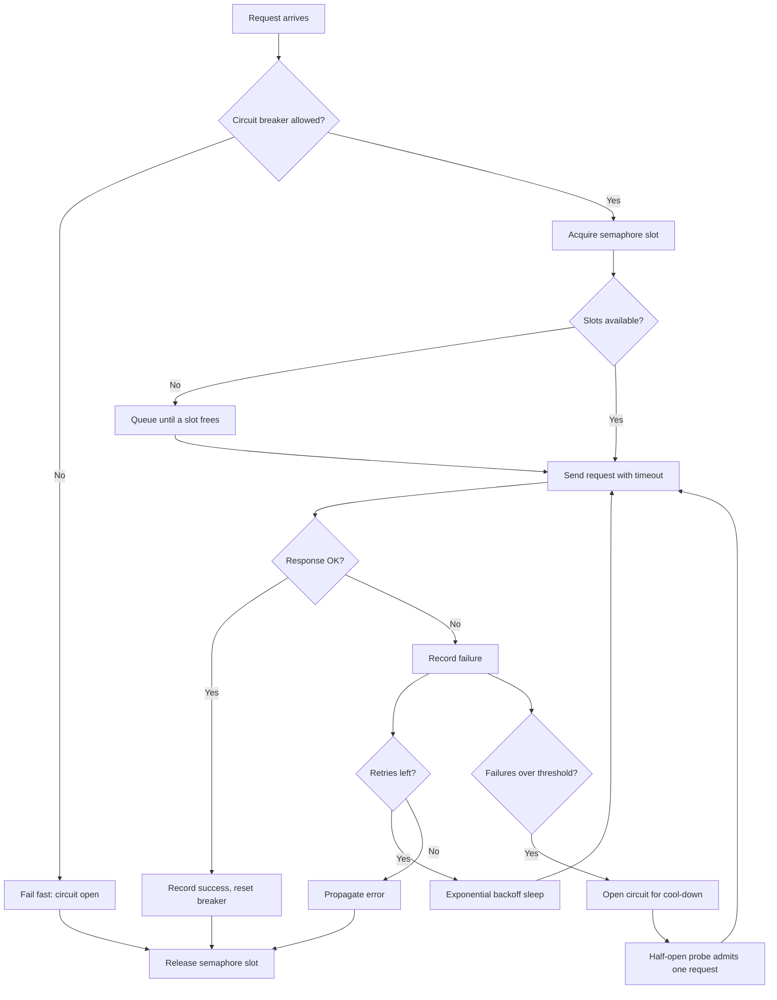

| Difficulty | Channel | Tags |
|---|---|---|
| advanced | backend | asyncio, aiohttp, concurrency |

Netflix's API was taking more than a billion incoming calls a day, each fanning out to roughly six downstream requests, when a single slow dependency began saturating every available request thread within seconds [1]. More servers would not have helped; the fix was learning to say no — bound the concurrency, fail fast, and stop the cascade at the edge [1]. That is exactly the discipline a production connection pool manager for aiohttp has to encode. This is the story of how that machinery works, why the obvious implementation is subtly broken, and how to build one that degrades gracefully instead of collapsing [5].

---

> ### Real-World Case — Netflix
>
> The Netflix API received more than 1 billion incoming calls per day, each fanning out to roughly 6 downstream calls against dozens of services (peaks over 100k dependency requests/second). A single backend dependency that became slow or failed would stall and pile up connections/threads, saturating all available Tomcat request threads within seconds and taking the entire API down.
>
> | | |
> |---|---|
> | **Challenge** | Prevent one latent or failing dependency from cascading into a full outage: cap concurrent connections per dependency, fail fast on timeouts instead of letting requests pile up, and keep sick services from exhausting the request handler pool. |
> | **Solution** | Netflix built Hystrix (originally DependencyCommand), combining per-dependency thread pools and tryable semaphores to limit concurrency to each backend (bulkheading), aggressive network timeouts with bounded retries, and circuit breakers that trip at ~50% error rate in a 10-second window to shed load and fail fast, plus fallbacks (cache, stale data, fail-silent) for graceful degradation. Crucially, they kept pools small and refused to enlarge them under pressure. |
> | **Outcome** | Sustained 1B+ incoming / several billion outgoing calls per day with 100k+ dependency requests per second without cascading failures; Netflix reports a 'dramatic improvement in uptime and resilience', eventually reaching tens of billions of thread-isolated and hundreds of billions of semaphore-isolated executions per day. Their math showed 30 dependencies at 99.99% uptime each would mean 99.7% aggregate uptime (2+ hours downtime/month) without such isolation. |
> | **Lesson** | When a dependency goes latent, scaling up connection pools, queues and timeouts is the opposite of the right move - it lets a sick service consume all resources and 'DDOS yourself'. Fail fast, shed load, and let the circuit breaker release pressure so the backend can actually recover. |

---

## Hook — 3 a.m., one slow dependency, zero threads left

Picture this: the deploy looked fine. Traffic is normal. Then a payment service starts answering in 8 seconds instead of 80 milliseconds — not down, just slow. Slow is worse than down, because slow requests pile up instead of failing. Within a minute, every worker thread in your API is parked waiting on that one dependency, and real user traffic queues behind it. The service is technically healthy and completely unavailable.

Sound familiar? This is the classic saturation failure, and it is the reason "just add more connections" is a trap rather than a fix. Every connection you add is another thread you can lose. The question that matters at scale is not how many requests you can accept, but how many you are willing to let block at once — and what happens to the rest.

Many developers discover this the hard way: concurrency without a ceiling is not capacity, it is a loaded gun. So how do you build a client layer that survives a dependency having a bad day?

## Problem — Why "just add more connections" makes everything worse

Here is the thing though: an async HTTP client feels infinite until it isn't. aiohttp will happily open sockets as fast as you can await them, and asyncio.Semaphore-based limits only work if you remember to acquire one on every path — including retries, redirects, and background health checks [2]. The failure modes stack up quietly:

- **Fan-out amplification.** One incoming request becomes six outbound calls. A 10x traffic spike downstream is a 60x event at your edge.
- **Timeout mismatch.** A 30-second total timeout against a dependency that answers in 80 ms means each dead service holds a slot 375x longer than usual [4].
- **Retry storms.** Ten clients retrying five times each turns a blip into a 50x thundering herd against a service that is already struggling [6].
- **Connection leaks.** A response read outside its context manager, or a session that never closes on shutdown, leaves sockets in TIME_WAIT until your file descriptor limit quietly explodes [8].
- **No fast path to failure.** Without a circuit breaker, every single request pays the full timeout cost for a dependency that is obviously dead [5].

The math gets brutal at scale. Netflix's own numbers showed that 30 dependencies each running at 99.99% availability combine to roughly 99.7% aggregate uptime — more than two hours of effective downtime per month [1]. You do not fix compounding failure rates by buying a bigger machine; you fix them by isolating failures so they cannot spread. That is the core challenge: build a pool that bounds damage, not just throughput.

## Real-World Case — Netflix: a billion calls a day and a math problem they could not ignore

This is not hypothetical. The Netflix API was sustaining over a billion incoming calls per day, fanning out to several billion outgoing calls, with peaks above 100,000 dependency requests per second [1]. When one backend dependency went slow or failed, connections and threads stalled and piled up, saturating all available Tomcat request threads within seconds and taking the entire API down with it [1].

The insight that changed everything: throughput and isolation are separate problems. Adding threads raises throughput; it does nothing for isolation. Netflix's answer was to stop treating threads as the unit of protection. They moved to bulkheading — first with thread isolation, then with lighter-weight semaphore isolation — so that a failure in one dependency could only consume the resources explicitly allocated to it [1].

The results were dramatic. The system scaled to tens of billions of thread-isolated and hundreds of billions of semaphore-isolated executions per day, which Netflix reported as a dramatic improvement in uptime and resilience [1]. Note the progression there: threads first because they were simple, semaphores later because they were cheap. Semaphore-based limiting is not an academic nicety — it is the technique that let one of the world's largest streaming platforms absorb billions of daily calls without cascading failures.

That is the bar. Your aiohttp pool manager does not need Netflix's traffic, but it needs Netflix's posture: assume a dependency will fail, and decide in advance exactly how much damage it is allowed to do.

## Deep Dive — Four mechanisms, one philosophy

Building on Netflix's isolation model, a production aiohttp pool needs four cooperating pieces. Each solves a different failure mode, and removing any one of them reintroduces a specific class of outage.

**1. Semaphore-based bulkheading.** An asyncio.Semaphore caps how many coroutines hold a live connection at once [2]. Excess requests wait in a queue instead of opening sockets. This is the mechanism that converts "unbounded pile-up" into "bounded, observable backlog."

**2. Aggressive timeouts.** aiohttp's ClientTimeout applies to the whole request lifecycle, and a TCPConnector separately caps real sockets [3][4]. The subtle part: a total timeout of 30 seconds is fine for a general client but fatal under degradation — you usually want a connect timeout in the low seconds and a total budget just above your p99 [4].

**3. Exponential backoff.** Retrying immediately against a struggling service is aggression, not resilience. Doubling the delay between attempts — 250 ms, 500 ms, 1 s — gives the dependency room to recover and spreads your clients out so they stop synchronizing into a herd [6]. Note that HTTP already has vocabulary for this: Retry-After tells clients when to come back [7], and 503 with proper semantics is a valid, honest response under overload [10].

**4. Circuit breaker.** This is the piece most implementations get wrong. A breaker tracks failures and, past a threshold, stops sending requests entirely for a cool-down window, then admits a single probe to test the waters [5]. States matter: closed (normal), open (fail fast), half-open (probe carefully).

Here is the real trade-off, laid out plainly:

| Mechanism | Failure it stops | Cost you pay | Miss it and... |
| --- | --- | --- | --- |
| Semaphore | Resource exhaustion | Added latency under load | One burst exhausts the pool |
| Timeout | Slow-loris dependency holding slots | Risk of killing slow-but-valid calls | Slow service = total outage |
| Exponential backoff | Retry storms / thundering herd | Higher latency for legitimate retries | Recovery triggers a second outage |
| Circuit breaker | Paying full timeout cost on dead service | Temporary hard failure for callers | Every request pays the worst-case price |

🔥 **Hot Take:** Most teams implement retries first and the circuit breaker never. That is backwards — retries multiply load on a broken dependency, while a breaker is the only mechanism that actively reduces it.

⚠️ **Watch Out:** The trap many developers hit is treating these as independent features. A semaphore without a breaker just queues requests destined to fail; a breaker without backoff produces synchronized probe stampedes. They only work as a system.

## Workflow — From request to response without the stampede

So how does a single request actually travel through this system? The order of operations matters more than any individual piece. Specifically, the circuit breaker check must happen *before* you consume a semaphore slot — otherwise a failing dependency still burns your capacity just to be rejected.

Follow the flow in the diagram below: the request arrives, gets triaged by the breaker, acquires a slot from the bulkhead, and only then touches the network. On success the breaker resets; on failure the request backs off and retries until its budget is exhausted, at which point the failure propagates rather than being swallowed [9]. If enough failures accumulate, the breaker opens and the whole cycle short-circuits to a fast failure for the next cool-down window.



💡 **Insight:** Notice that the semaphore slot is released on *every* exit path, including failures. A bulkhead that leaks slots during errors degrades into a smaller, mysterious pool over the course of an afternoon — one of the most common production battle scars in async Python.

## Code Example — A pool manager you would actually deploy

Here is the pattern in runnable Python. It wires all four mechanisms together, plus the lifecycle discipline that keeps sockets from leaking across deploys:

```python
import asyncio
import time
import aiohttp

class CircuitBreaker:
    """Fails fast while a dependency is unhealthy, then probes carefully."""

    def __init__(self, failure_threshold: int = 5, reset_timeout: float = 60.0):
        self.failure_threshold = failure_threshold
        self.reset_timeout = reset_timeout
        self.failures = 0
        self.opened_at = 0.0
        self.state = "closed"  # closed -> open -> half-open

    def allow(self) -> bool:
        if self.state == "closed":
            return True
        # After the cool-down, admit a single probe request
        if time.monotonic() - self.opened_at >= self.reset_timeout:
            self.state = "half-open"
            return True
        return False

    def record_success(self) -> None:
        self.failures = 0
        self.state = "closed"  # fully recovered, close the breaker

    def record_failure(self) -> None:
        self.failures += 1
        self.opened_at = time.monotonic()
        if self.state == "half-open" or self.failures >= self.failure_threshold:
            self.state = "open"  # trip: stop all traffic for reset_timeout

class ConnectionPoolManager:
    """Bulkheaded aiohttp pool with backoff and circuit breaking."""

    def __init__(self, max_connections: int = 100,
                 timeout_total: float = 30.0, retries: int = 3):
        self._semaphore = asyncio.Semaphore(max_connections)  # the bulkhead
        self._timeout = aiohttp.ClientTimeout(total=timeout_total)
        self._retries = retries
        self._breaker = CircuitBreaker()
        self._session: aiohttp.ClientSession | None = None

    async def __aenter__(self) -> "ConnectionPoolManager":
        connector = aiohttp.TCPConnector(
            limit=100,             # hard cap on open sockets
            ttl_dns_cache=300,     # skip DNS on hot paths
            enable_cleanup_closed=True,
        )
        self._session = aiohttp.ClientSession(
            connector=connector, timeout=self._timeout
        )
        return self

    async def __aexit__(self, exc_type, exc, tb) -> None:
        if self._session is not None:
            await self._session.close()  # no leaked sessions on shutdown

    async def get(self, url: str) -> str:
        # Check the breaker BEFORE consuming a pool slot
        if not self._breaker.allow():
            raise aiohttp.ClientError("circuit open: dependency unhealthy")

        async with self._semaphore:  # queue instead of opening more sockets
            delay = 0.25  # start at 250ms, double on every failure
            for attempt in range(self._retries + 1):
                try:
                    async with self._session.get(url) as response:
                        response.raise_for_status()
                        body = await response.text()  # read INSIDE the context
                    self._breaker.record_success()
                    return body
                except (asyncio.TimeoutError, aiohttp.ClientError):
                    self._breaker.record_failure()
                    if attempt == self._retries:
                        raise  # budget exhausted: fail loudly, not silently
                    await asyncio.sleep(delay)  # exponential backoff
                    delay *= 2
```

A few deliberate choices worth calling out before you copy this into a service:

- The breaker is consulted **before** `async with self._semaphore`, so a tripped circuit costs zero capacity.
- The body is read **inside** the `async with self._session.get(...)` block — the single most common aiohttp bug is returning a response whose payload has already been released.
- Failures are re-raised after the retry budget is spent, preserving the original exception type through the async stack rather than collapsing everything into a generic error [9].
- `ClientSession` lives as long as the pool, because creating a session per request defeats the entire point of connection keepalive [3].

## Lessons Learned — What to tell your team on Monday

The journey from "aiohttp will handle it" to a pool that survives a bad afternoon comes down to a handful of hard-won rules:

- **Bound everything, including retries.** A semaphore that covers the happy path but not the retry path is a bulkhead with a hole in it [2].
- **Fail fast is a feature.** A circuit open for 60 seconds is not an error — it is your service refusing to donate its threads to a dependency that cannot use them [5].
- **Timeouts are budgets, not defaults.** Configure connect, sock_read, and total separately; a single blanket 30 s timeout hides which stage is actually slow [4].
- **Release on every exit path.** Slots leaked during exceptions turn a 100-connection pool into a 40-connection pool with no error message to explain why.
- **Shut down cleanly.** Close the session on application exit or you will accumulate sockets across deploys until the OS complains [8].
- **Measure the queue, not just the p99.** Time spent waiting for a semaphore slot is invisible in response-time histograms unless you instrument it explicitly.

⚠️ **Watch Out:** Battle scars worth stealing from other teams — ignoring SSL context validation on custom connectors, propagating `CancelledError` as a normal failure and killing unrelated tasks, and "fixing" a flaky dependency by raising the pool size, which converts a slow-service incident into a resource exhaustion incident.

The counterintuitive bit: the best-performing version of this code is the one that does *less* work under load. Throwing a fast, honest error at 5% of traffic is how you keep the other 95% serving.

🎯 **Key Point:** Isolation is a budget, not a feature. Decide how much of your capacity each dependency is allowed to consume, write that number down, and enforce it in code.

---

## Graceful Degradation Request Flow


<details>
<summary><strong>Original Interview Question</strong></summary>

**Q:** How would you implement a connection pool manager for aiohttp that handles graceful degradation under high load and connection timeouts?

**A:** Implement a connection pool manager for aiohttp using a semaphore to limit concurrent connections, exponential backoff for retrying failed requests, and circuit breaker pattern to gracefully degrade under high load and connection timeouts.

</details>

## Conclusion

The Netflix story is not really about Netflix. It is about the moment teams realize that availability at scale is not bought with more threads — it is negotiated, one bounded resource at a time [1]. You started with a 3 a.m. failure caused by one slow dependency, walked through why fan-out math makes "add more connections" actively dangerous, watched a billion-call-a-day system solve it with bulkheads and circuit breakers [5], and then built that same posture into an aiohttp pool with a semaphore, timeouts, exponential backoff [6], and a three-state breaker. The transformation to take away: your HTTP client should be designed to fail on purpose, in small doses, rather than by accident, all at once. Tomorrow, pick your most critical outbound dependency and answer three questions — how many concurrent calls is it allowed to consume, how fast do you want to hear that it is dead, and what happens to everyone else when it is. Write those numbers into code. The memorable insight to share with your team: isolation is a budget, not a feature — and a fast, honest error at 5% of traffic is how you keep the other 95% online.

---

## References

1. [Netflix incident report — Fault Tolerance in a High Volume Distributed System](https://netflixtechblog.com/fault-tolerance-in-a-high-volume-distributed-system-91ab4faae74a) — blog
2. [Python asyncio synchronization primitives — Semaphore](https://docs.python.org/3/library/asyncio-sync.html) — documentation
3. [aiohttp Client Quickstart — making requests and sessions](https://docs.aiohttp.org/en/stable/client_quickstart.html) — documentation
4. [aiohttp Advanced Client Usage — timeouts and connectors](https://docs.aiohttp.org/en/stable/client_advanced.html) — documentation
5. [Circuit breaker design pattern](https://en.wikipedia.org/wiki/Circuit_breaker_design_pattern) — documentation
6. [Exponential backoff](https://en.wikipedia.org/wiki/Exponential_backoff) — documentation
7. [MDN Web Docs — HTTP Retry-After header](https://developer.mozilla.org/en-US/docs/Web/HTTP/Headers/Retry-After) — documentation
8. [aio-libs/aiohttp — asynchronous HTTP client for Python](https://github.com/aio-libs/aiohttp) — documentation
9. [Python asyncio — tasks, cancellation and exception propagation](https://docs.python.org/3/library/asyncio-task.html) — documentation
10. [RFC 9110 — HTTP Semantics (status codes and overload responses)](https://datatracker.ietf.org/doc/html/rfc9110) — documentation

---

**Author:** Satishkumar Dhule — [GitHub](https://github.com/satishkumar-dhule) · [LinkedIn](https://linkedin.com/in/satishkumar-dhule) · [Website](https://satishkumar-dhule.github.io)
