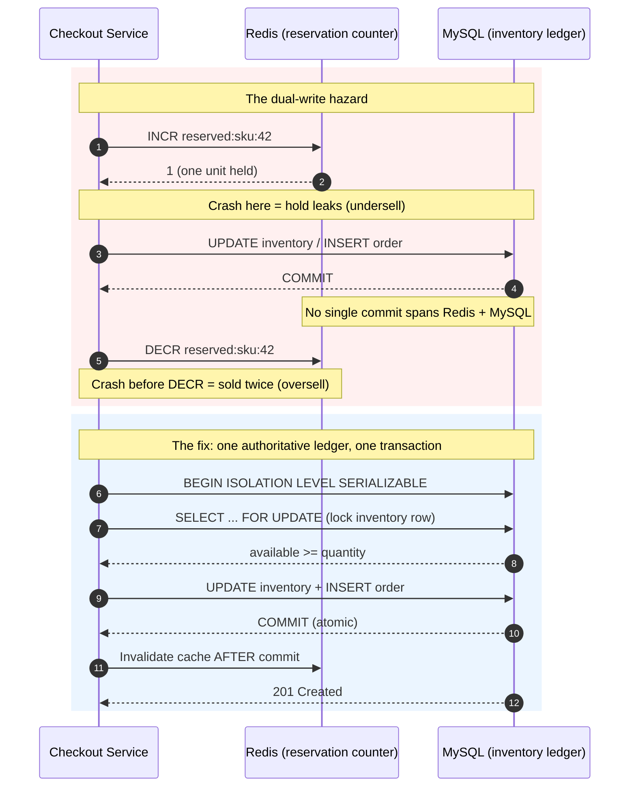

| Difficulty | Channel | Tags |
|---|---|---|
| intermediate | database | acid, isolation-levels, mvcc |

During Black Friday 2025, Shopify merchants hit a record $5.1 million in sales per minute — an 11% jump over the previous year — on a platform powering over 14% of U.S. ecommerce [1]. That number is breathtaking, but it hides a quiet nightmare: for years, a purchase required writing to two different systems that could never commit together. A crash between those writes could either hide stock that was actually available or make sold units reservable all over again [1]. This is the story of the gap between two writes — and why the database feature you reach for first may not be the one that saves you.

---

> ### Real-World Case — Shopify
>
> Shopify's oversell protection stored temporary inventory reservations in Redis using INCR/DECR counters, while the authoritative inventory ledger lived in MySQL. Completing a purchase required writing to both systems, and those two writes could not be committed atomically, so a crash between them could either hide available stock (undersell) or make already-sold units reservable again (oversell).
>
> | | |
> |---|---|
> | **Challenge** | Guarantee that two concurrent checkouts can never claim the same last unit, while keeping temporary reservations and the permanent inventory ledger perfectly consistent under burst traffic such as a flash sale or Black Friday. |
> | **Solution** | They moved reservations into the same MySQL database as the ledger and modeled availability as one row per sellable unit in a bounded pool of 1,000 rows per item/location. Reserving three units selects and moves three rows inside a single ACID transaction using MySQL 8's SELECT ... FOR UPDATE SKIP LOCKED, so concurrent buyers claim different rows without lock contention. They switched isolation from MySQL's default REPEATABLE READ to READ COMMITTED to avoid gap/supremum locks that blocked replenishment, adopted a composite primary key (shop_id, inventory_item_id, inventory_group_id, id) to reduce InnoDB from two locks to one lock per row, standardized lock ordering (DELETE units, then INSERT reserved_quantities) to eliminate deadlocks, and batched line items with UNION ALL to cut round trips. |
> | **Outcome** | The Redis-to-MySQL migration ran in shadow mode and then cut over gracefully. During Black Friday 2025, Shopify merchants hit a record $5.1 million in sales per minute at peak (an 11% increase over the prior year, across a platform powering 14%+ of U.S. ecommerce), with writer CPU under 50% and reader CPU under 16%. After adding per-caller connection tagging at the app and ProxySQL layers, they found the true ceiling was not their reservation queries; cleaning up the surrounding checkout path removed 50% of reads and 33% of transactions on the primary database. |
> | **Lesson** | Redis INCR is atomic, but a Redis-plus-MySQL dual write is not, so cross-system reservations can never be truly ACID; keeping reservations and the ledger in one database and letting row locks (SKIP LOCKED) arbitrate correctness beats a distributed lock. The bigger twist: the throughput wall wasn't the database engine or the reservation query at all, it was unrelated checkout code holding connections too long — as Shopify put it, when numbers don't add up (low CPU but high queuing), instrument the whole path, because the answer is often in the plumbing, not the engine. |

---

## Hook — The Minute That Moved $5.1 Million

Picture the dashboards lighting up at 12:00:01 on Black Friday. Traffic is climbing, conversion is spiking, and somewhere in the stack two counters are supposed to agree on how many units of a single SKU remain. One counter lives in Redis, incremented and decremented in microseconds. The other lives in MySQL, the authoritative ledger of record [1]. When they agree, everything is fine. When they disagree — even for a few milliseconds — you get one of two disasters. Either a customer sees 'sold out' on inventory you still have, or two customers both pay for the same last unit. The stakes are not theoretical: at $5.1 million per minute, a bad concurrency model is not a rounding error. It is revenue and trust evaporating in real time. Ever wondered why distributed systems engineers obsess over atomicity? This is why. 🔥

## Problem — When Two Systems Guard the Same Shelf

The core challenge is deceptively simple: you must decrement inventory and record a purchase as one indivisible action. The trouble is that those two facts often live in different places. A common design keeps temporary reservations in a fast in-memory store like Redis using INCR/DECR counters, while the durable inventory ledger lives in a relational database such as MySQL [1]. Each system is excellent on its own — Redis for speed, MySQL for durability — but neither can offer you a transaction that spans both. Consequently, completing a purchase becomes a two-phase operation with a dangerously wide window in the middle. If the process crashes after the Redis hold but before the MySQL write, the hold leaks and stock looks scarcer than it is (an undersell). If the process crashes after the MySQL write but before releasing or decrementing the Redis hold, units become reservable again (an oversell). This is the classic dual-write problem, and it is the same check-then-act race condition that plagues every booking system, whether it reserves hotel rooms, airline seats, or concert tickets. Many developers assume the answer is a distributed lock. However, locks simply move the failure point: what happens when the lock holder dies mid-transaction, or the network partitions? The real question is not 'how do I lock two systems?' but 'why do two systems own the same truth at all?'

## Real-World Case — Shopify

Shopify ran headfirst into this exact split: temporary inventory reservations in Redis, the authoritative ledger in MySQL, and no way to commit both atomically [1]. A crash between the two writes could hide available stock or resurrect already-sold units. The team did not panic-rewrite. Instead, they built a Redis-to-MySQL migration that ran in shadow mode — quietly comparing the new path against the old one — before a graceful cutover. The results speak for themselves. During Black Friday 2025, the platform sustained a record $5.1 million in sales per minute at peak, an 11% year-over-year increase, with writer CPU under 50% and reader CPU under 16% [1]. Then came the plot twist. After adding per-caller connection tagging at both the application and ProxySQL layers, Shopify discovered their true ceiling was not the reservation queries at all. Cleaning up the surrounding checkout path removed 50% of reads and 33% of transactions on the primary database [1]. The lesson is humbling: teams often optimize the glamorous part of the system while the real bottleneck hides three function calls away. ⚠️

## Deep Dive — Isolation Levels, Locks, and the Myth of the Atomic Two-Phase Write

To fix a dual-write problem, you first have to understand what a database transaction can and cannot promise. The ACID guarantees — atomicity, consistency, isolation, durability — are the foundation [5]. Atomicity says a transaction either fully commits or fully rolls back; isolation says concurrent transactions should not corrupt each other. Crucially, atomicity only applies within a single transactional resource. It does not extend across Redis and MySQL, no matter how carefully you order the calls. That is why the authoritative state should live in one place. Now consider isolation, which is where most booking bugs hide. PostgreSQL offers four levels, and only the strongest eliminates every concurrency anomaly [3].

| Isolation Level | Dirty Read | Non-repeatable Read | Phantom Read | Good For |
|---|---|---|---|---|
| Read Uncommitted | Possible | Possible | Possible | Almost nothing |
| Read Committed (default) | No | Possible | Possible | General CRUD |
| Repeatable Read | No | No | Possible* | Reporting snapshots |
| Serializable | No | No | No | Bookings, payments, inventory [3] |

Under the default Read Committed level, two concurrent transactions can both read the same row, both see stock as available, and both proceed to write. The database dutifully records both, and you have oversold [6]. Serializable prevents this by guaranteeing that concurrent transactions produce a result equivalent to some serial ordering; when a conflict is detected, one transaction aborts with SQLSTATE 40001 and your application retries [3]. But isolation alone is not the whole story — you also need the right locking behavior. SELECT ... FOR UPDATE acquires row-level locks so a second transaction waits instead of racing ahead [4]. Meanwhile, Multi-Version Concurrency Control (MVCC) lets ordinary read queries take consistent snapshots without blocking writers, so your high-throughput availability lookups stay fast while only the critical write path pays the locking tax [2]. This leads to the counterintuitive insight at the heart of the problem: the best way to make two systems consistent is often to stop having two systems. Put the reservation counter and the ledger in the same database, and a single Serializable transaction makes the whole class of crash-window bugs vanish.

💡 Insight: Optimistic concurrency control — a version column plus a conditional update — is a lightweight alternative to heavy locking when contention is low, and it pairs naturally with retry logic [7]. Serializability is the formal guarantee that transactions can be ordered without interference [8], and concurrency control is the toolbox of techniques that get you there [9].

## Workflow — Anatomy of a Crash-Safe Reservation

The following Mermaid sequence diagram tells the visual story of the dual-write hazard and its fix. First, notice the failure mode: the checkout service increments the Redis counter, then writes to MySQL, then decrements Redis. Because no single commit spans both systems [1], each arrow is a place where a crash creates either an undersell or an oversell. Now watch the fix at the bottom: the reservation is validated and written inside one Serializable transaction on the authoritative ledger, and the cache is only invalidated after commit.

Step by step, a safe purchase looks like this:

1. Begin a Serializable transaction against the authoritative ledger database [3].
2. Re-check availability by locking the specific inventory row with SELECT ... FOR UPDATE [4], which blocks competing writers.
3. If stock is insufficient, roll back and return a clean 409 'sold out' — no partial write, no leaked hold.
4. Otherwise, decrement inventory and insert the order within the same transaction [5].
5. Commit. At this instant the ledger and the order become durable together.
6. Only after commit, invalidate or refresh the Redis cache, so readers never see stale 'available' data after a sale.
7. If the database aborts with 40001, retry with exponential backoff and jitter [7].

Notice how the two-system dance collapses into one atomic step. That single change is what turns a fragile dual write into a reliable reservation.

## Code Example — One Ledger, One Transaction, Zero Oversell

Here is the production pattern in TypeScript. The reservation and the purchase share the same transaction and the same row lock, while Redis is demoted to a pure cache that gets invalidated only after a successful commit.

## Lessons Learned — What Every Developer Should Take From This

First, every additional system that owns a piece of your state doubles your failure surface. Shopify's oversell and undersell risk existed precisely because two databases could not commit together [1]. Before splitting state for speed, ask whether the speed is worth a whole new class of inconsistency. Second, know your isolation levels cold. Serializable is the only level that eliminates phantom reads, which is why it belongs on booking, payment, and inventory paths [3], and SELECT ... FOR UPDATE is the tool that makes concurrent writers queue politely instead of racing [4]. Third, let MVCC do the heavy lifting on reads. Snapshot reads keep availability checks fast and non-blocking [2] while your critical section stays small. Fourth, measure before you optimize. Shopify assumed reservations were the bottleneck, yet cleaning up the checkout path removed 50% of reads and 33% of transactions on the primary database [1]. Fifth, assume crashes. Design so that every mid-flight failure leaves data in a consistent state, and build retry logic around serialization failures [7]. And finally, optimize for the boring path: the fastest transaction is the one you never had to run. Your database has more power than you think — ACID [5], serializability [8], and MVCC [2] are mature, battle-tested features. Use them before reaching for distributed coordination [9]. The next time you write a check-then-act sequence, ask what happens when two requests arrive in the same millisecond [10]. If the answer is not 'one succeeds and the other gets a clean conflict,' you have a reservation bug waiting for your busiest day.

---

## Dual-Write Hazard vs Single-Ledger Atomic Commit

<strong>Original Interview Question</strong>

**Q:** You're building a booking system for Airbnb where multiple users can reserve the same property simultaneously. How would you design the transaction handling to prevent double bookings while maintaining high availability?

**A:** Use SERIALIZABLE isolation with optimistic concurrency control. Implement row-level locks on property availability tables, use MVCC snapshot reads for checking availability, and apply application-level validation to ensure atomic booking operations.

## Conclusion

Shopify's story is a reminder that the hardest bugs are rarely in the code you are staring at. Their oversell protection spanned Redis and MySQL, and no amount of careful ordering could make two systems commit as one [1]. The fix that carried them through a $5.1 million-per-minute Black Friday was not exotic — it was consolidation onto one authoritative ledger wrapped in Serializable transactions with row-level locking. So what should you do differently tomorrow? Audit every place where your code writes to two systems and assumes both succeed. If you find a check-then-act gap, ask whether those two truths can live in one transactional store. Reach for Serializable isolation and SELECT ... FOR UPDATE on the critical write path [3][4], keep MVCC snapshot reads for the fast path [2], and always invalidate caches after commit, never before. The memorable insight to share with your team: consistency is not a feature you bolt on with a lock — it is a property you design in by refusing to let two systems own the same fact. 🎯

---

## References

1. [Shopify incident report](https://shopify.engineering/scaling-inventory-reservations) — article
2. [PostgreSQL Concurrency Control (MVCC) Documentation](https://www.postgresql.org/docs/current/mvcc.html) — documentation
3. [PostgreSQL Transaction Isolation](https://www.postgresql.org/docs/current/transaction-iso.html) — documentation
4. [PostgreSQL Explicit Locking](https://www.postgresql.org/docs/current/explicit-locking.html) — documentation
5. [ACID (Atomicity, Consistency, Isolation, Durability)](https://en.wikipedia.org/wiki/ACID) — paper
6. [Isolation (Database Systems)](https://en.wikipedia.org/wiki/Isolation_(database_systems)) — paper
7. [Optimistic Concurrency Control](https://en.wikipedia.org/wiki/Optimistic_concurrency_control) — paper
8. [Serializability](https://en.wikipedia.org/wiki/Serializability) — paper
9. [Concurrency Control](https://en.wikipedia.org/wiki/Concurrency_control) — paper
10. [Race Condition](https://en.wikipedia.org/wiki/Race_condition) — paper

---

**Author:** Satishkumar Dhule — [GitHub](https://github.com/satishkumar-dhule) · [LinkedIn](https://linkedin.com/in/satishkumar-dhule) · [Website](https://satishkumar-dhule.github.io)
