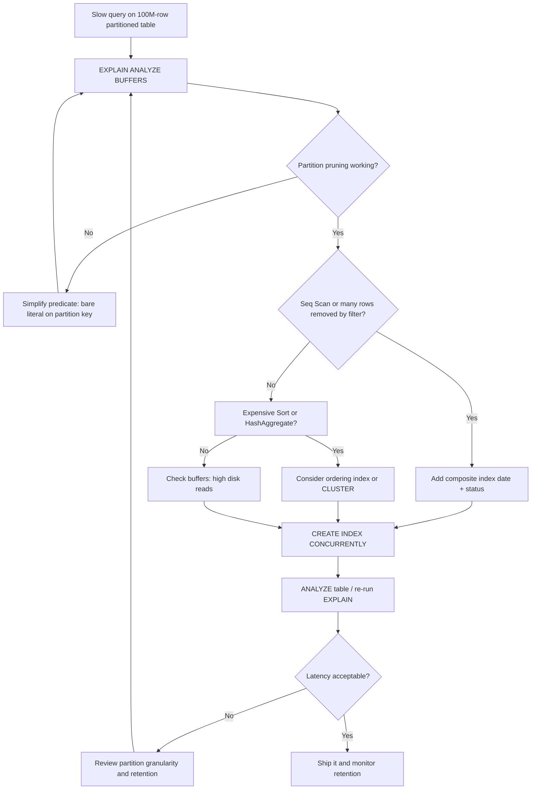

| Difficulty | Channel | Tags |
|---|---|---|
| intermediate | database | explain, query-plan, partitioning |

GitLab's CI/CD pipeline tables were supposed to stay under 100 GB each. Instead, the ci_builds table ballooned to roughly 3.5 TB with nearly 1 TB of indexes, turning simple queries into slow, unpredictable slogs and VACUUM into a losing battle [1]. The fix wasn't a bigger server — it was partitioning done right. This is the story of how to read an EXPLAIN plan like a detective, spot the real culprit hiding in your query, and fix a 100M-row PostgreSQL table before it fixes you.

---

> ### Real-World Case — GitLab
>
> GitLab's CI/CD tables on GitLab.com had grown far beyond their 100 GB-per-table design limit — the ci_builds table reached ~3.5 TB with a ~1 TB index, causing slow queries, bloated indexes, painful VACUUMs, and retention deletes that could not keep up with growth.
>
> | | |
> |---|---|
> | **Challenge** | They tried to fix this by partitioning these huge tables, but declarative partitioning in PostgreSQL only pays off when queries actually filter on the partition key. Many application queries (generated via ActiveRecord) didn't include the key, so PostgreSQL scanned every partition and the queries stayed slow — partitioning alone didn't fix the problem, and PostgreSQL also forbids a single index across all partitions and requires the partition key in every unique/primary key. |
> | **Solution** | GitLab chose logical partition IDs as the partition key and built a custom queries analyzer to detect application queries that omitted the partitioning key (the exact failure that breaks partition pruning). They rebuilt primary/unique keys as composite keys including the partition key, created matching per-partition indexes, and designed time-decay 'active/inactive' partition routing (WHERE partition_id IN (SELECT id FROM ci_partitions WHERE active = true)) so archived partitions are pruned entirely. |
> | **Outcome** | The design converted a multi-terabyte ci_builds table (up to ~3.5 TB with ~1 TB of indexes) into manageable partitions under the 100 GB target, enabling cheap bulk deletes by dropping partitions and making index maintenance, VACUUM, and query planning tractable on GitLab.com. |
> | **Lesson** | Partitioning is not a magic performance switch: if the query's WHERE clause doesn't include the partition key, PostgreSQL cannot prune and will scan every partition — often slower than the original table. You must verify pruning in EXPLAIN, ensure queries and composite indexes (and even unique keys) include the partition key, and pick the key based on query patterns, not storage convenience. |

---

## Hook — Your Query Looks Fine. Your Query Is Not Fine.

Picture the scene: you built a table partitioned by date, exactly as the blog posts told you to. You have 100M rows, but any given month only touches a sliver of them. So why does a simple date-range filter still take 40 seconds to return?

You stare at the SQL. It looks innocent. There's a WHERE clause on the partition key (event_date), there's a secondary filter (status), and there's an index. Nothing screams "problem." Yet the query crawls, and your pager does not care about your good intentions.

Here is the thing though: a partitioned table is a promise, not a guarantee. Postgres promises to skip partitions it doesn't need — but only if it can prove they're irrelevant. It promises to use your index — but only if the index matches how you filter. When those promises break, you don't get an error. You get a slow query and a mountain of I/O.

The stakes are real. At GitLab, unmanaged growth didn't just slow queries — it broke retention, bloated indexes, and made routine maintenance expensive enough to force an architectural rethink [1]. If you run a table that only grows, you're on the same clock.

## Problem — Why Partitioned Tables Still Go Slow

Partitioning is one of the most misunderstood optimizations in PostgreSQL. Many developers assume that declaring PARTITION BY RANGE (event_date) magically makes every date-filtered query fast. It doesn't. Partitioning is a query-planning hint wrapped in a storage strategy, and it only pays off when three things line up: pruning works, indexes fit the predicate, and the data layout matches the access pattern [2].

Start with pruning. When you write WHERE event_date BETWEEN '2024-01-01' AND '2024-01-31', Postgres compares that predicate against each partition's bounds at planning time. If it can prove a partition can't match, it prunes it. However, this proof is fragile. If the predicate uses a function, a volatile expression, or a cast that hides the literal, the planner may give up and scan every partition. That's called a full partition scan, and on a 100M-row table spanning years, it's the database equivalent of checking every drawer in the house for your keys.

Next is index utilization. A plain index on (event_date) helps, but if your query also filters on status = 'completed', Postgres may read the date range from the index and then heap-fetch thousands of rows to check status — a pattern that murders your buffer cache. A composite index on (event_date, status) lets the engine satisfy both predicates inside the index itself, skipping the heap entirely for many plans [3].

The third problem is physical layout and sorts. Even with pruning and indexes, a mismatched data layout forces expensive sorts or bitmap heap scans. Consequently, the same query can swing from 40 ms to 40 seconds depending on which partition saw recent inserts. Who does this hurt most? Anyone running event streams, audit logs, time-series metrics, or CI/CD build records — exactly the tables that grow forever and get deleted in bulk. This leads directly to what happens when nobody watches the curve.

## Real-World Case — GitLab's CI Tables Outgrew Their Own Design

GitLab.com's CI/CD data was designed around a 100 GB-per-table boundary. That boundary was a deliberate choice: it keeps indexes small, VACUUM fast, and query planning tractable. But growth doesn't respect design documents. The ci_builds table climbed to roughly 3.5 TB, with an index footprint near 1 TB [1]. At that size, several things broke at once.

Queries against build records slowed as the planner wrestled with enormous index traversals and heap lookups. Indexes bloated because retention policies couldn't delete rows fast enough. And VACUUM — the background process that reclaims dead tuples — became so expensive it struggled to keep up with churn [1]. Deletes were especially painful: removing old CI data meant issuing massive DELETE statements, each generating dead tuples and triggering more vacuuming. It was a feedback loop where cleanup created the very bloat it was trying to remove.

The transformation came from partitioning the pipeline tables so each partition stayed under the 100 GB target. Once data was split by time, retention changed shape entirely: instead of DELETE, teams could DROP an entire partition — a metadata operation that reclaims space instantly without dead tuples [1]. Index maintenance and VACUUM became scoped to individual partitions rather than one monolithic table, and query planning could prune irrelevant partitions instead of considering the whole multi-terabyte space.

The lesson is blunt. Partitioning isn't just a performance trick — it's an operational strategy. So how do you actually diagnose whether your own partitioned table is living up to its promise? The answer is one command, read carefully.

## Deep Dive — Reading EXPLAIN Like a Detective

EXPLAIN is your autopsy report. Run EXPLAIN (ANALYZE, BUFFERS) and you get the actual plan, real timings, row estimates versus actuals, and buffer activity [4]. Reading it well means asking four questions in order.

First: did pruning happen? Look for the number of partitions referenced. In PostgreSQL 12+, EXPLAIN may collapse many partitions into a single "Append" node, which makes this harder to eyeball. You can force detail with SET enable_partition_pruning = on and check whether the plan lists only the expected child tables, or temporarily disable it to compare cost [2]. If every partition appears, your predicate is opaque to the planner — often because of a function on the partition key like WHERE date_trunc('day', event_date) = '2024-01-15'.

Second: index versus sequential scan. A Seq Scan on a large partition is a red flag, unless the predicate genuinely matches a huge fraction of rows. Look at "Rows Removed by Filter" — a large number means you scanned a lot only to throw most of it away. That's an indexing opportunity screaming at you [3].

Third: sorts and aggregates. Nodes like Sort, HashAggregate, and GroupAggregate with high memory or disk spills tell you the planner couldn't avoid work. Sometimes a composite index eliminates a sort by returning rows pre-ordered. Sometimes it doesn't, and adding an index just for ordering is not worth the write cost.

Fourth: buffers. "Buffers: shared hit" means served from cache; "read" means disk. A plan with millions of reads explains why the query is slow even when the index is used. The following table frames the core tradeoff developers face:

| Strategy | Best For | The Real Tradeoff |
|---|---|---|
| Composite index (date, status) | Selective multi-column filters | Extra write amplification; only helps matching predicates |
| CLUSTER on index | Range scans needing physical locality | Rewrites the table; subsequent inserts scatter rows again |
| More partitions | Faster bulk deletes, smaller indexes | Too many partitions inflates planning time |
| Covering index with INCLUDE | Index-only scans | Larger index footprint, slower writes |

💡 Insight: The fastest query is the one that touches the fewest pages. Every optimization above is really about reducing pages touched, whether through pruning, index-only scans, or physical ordering [7]. This leads to a repeatable workflow you can run the moment a query misbehaves.

## Workflow — From Slow Query to Shipped Fix

Optimization is a loop, not a leap. Here's the sequence that turns a mystery into a fix. It's the same narrative GitLab followed at multi-terabyte scale, just applied to your table [1].

1. Measure honestly. Run EXPLAIN (ANALYZE, BUFFERS) on the real query with production-like data. Estimated costs lie; actual times and buffers don't [4].
2. Confirm pruning. Verify only the relevant partitions appear. If not, simplify the predicate so the partition key stays a bare, comparable literal.
3. Audit scans. Identify Seq Scans and high "Rows Removed by Filter" values — these point to missing or mismatched indexes [3].
4. Design the index. Build a composite index matching the WHERE clause order, ideally starting with the partition key.
5. Create it safely. Use CREATE INDEX CONCURRENTLY to avoid locking writes in production [5].
6. Fix physical locality. If range scans dominate, consider CLUSTER on the chosen index, accepting that future inserts will scatter [6].
7. Re-measure and compare. Same query, same data, new numbers. If latency still isn't acceptable, revisit partition granularity or retention.

The flow below captures this loop visually — including the branches where pruning fails and where the fix isn't an index at all.

The critical branch is step 2. Prematurely adding indexes when pruning is actually broken is the most common mistake — you pay write costs forever to fix a symptom, not the disease.

## Code Example — The Diagnostic Script That Actually Tells You Something

Theory is cheap; a script you can paste into a terminal is priceless. The following bash script runs the core diagnostic loop against a live database: it measures, checks pruning, builds a composite index safely, clusters, and re-measures. It's deliberately boring — boring is what you want in production.

## Lessons Learned — What to Do Differently Tomorrow

The GitLab story isn't about a clever index. It's about respecting the cost curve of data that never stops growing. The table that reaches 3.5 TB with a 1 TB index didn't fail overnight — it failed because nobody watched the trajectory [1].

Here's what to carry forward:

- ⚠️ Watch Out: Partitioning without verifying pruning is theater. Always confirm the plan only touches the partitions it should [2].
- 🎯 Key Point: A composite index should mirror your predicate order. (event_date, status) is not the same as (status, event_date) when the partition key leads the query [3].
- ⚠️ Watch Out: CLUSTER rewrites the table and takes a lock. Schedule it, and know that inserts will re-scatter rows over time [6].
- 🔥 Hot Take: If retention means dropping old data, partitions make DROP a metadata operation instead of a DELETE storm. That alone can justify partitioning [1].
- 💡 Insight: Too many partitions hurt planning. Thousands of tiny partitions can make the planner the bottleneck — measure planning time, not just execution time [7].

So what should you do differently tomorrow? Pull your biggest table, run EXPLAIN (ANALYZE, BUFFERS), and answer one question: is my query slow because of what it reads, or because of what it scan-and-discards? The answer dictates the fix. Many developers reach for an index first; the evidence often points elsewhere. Read the plan before you touch the schema — and remember the one line worth sharing with your team: the fastest query is the one that touches the fewest pages.

---

## Query Optimization Workflow

<strong>Original Interview Question</strong>

**Q:** You have a PostgreSQL table with 100M rows partitioned by date. A query filtering on a specific date range is still slow. What would you check in the EXPLAIN plan and how would you optimize it?

**A:** Check partition pruning effectiveness, index utilization patterns, and expensive sort operations. Create composite indexes on (date, filtered_columns) and evaluate clustering strategies for optimal data access.

## Conclusion

Partitioning a table is a promise to your future self — and GitLab learned the hard way that unmanaged growth turns that promise into a 3.5 TB liability [1]. The fix wasn't exotic: verify pruning, match your index to your predicate, and treat retention as a design concern, not an afterthought. Tomorrow, take your slowest query and run EXPLAIN (ANALYZE, BUFFERS). Ask whether it's slow because of what it reads or because of what it scans and discards. Read the plan before you touch the schema, and you'll avoid the multipart tragedy that slows down everyone else. The one insight worth passing around your team: the fastest query is the one that touches the fewest pages.

---

## References

1. [GitLab incident report](https://handbook.gitlab.com/handbook/engineering/architecture/design-documents/ci_data_decay/pipeline_partitioning/) — article
2. [PostgreSQL Documentation: Table Partitioning](https://www.postgresql.org/docs/current/ddl-partitioning.html) — documentation
3. [PostgreSQL Documentation: Indexes](https://www.postgresql.org/docs/current/indexes.html) — documentation
4. [PostgreSQL Documentation: Using EXPLAIN](https://www.postgresql.org/docs/current/using-explain.html) — documentation
5. [PostgreSQL Documentation: CREATE INDEX](https://www.postgresql.org/docs/current/sql-createindex.html) — documentation
6. [PostgreSQL Documentation: CLUSTER](https://www.postgresql.org/docs/current/sql-cluster.html) — documentation
7. [PostgreSQL Documentation: VACUUM](https://www.postgresql.org/docs/current/sql-vacuum.html) — documentation
8. [Wikipedia: Partition (database)](https://en.wikipedia.org/wiki/Partition_(database)) — blog
9. [pg_partman: Partition Management Extension for PostgreSQL](https://github.com/pgpartman/pg_partman) — documentation

---

**Author:** Satishkumar Dhule — [GitHub](https://github.com/satishkumar-dhule) · [LinkedIn](https://linkedin.com/in/satishkumar-dhule) · [Website](https://satishkumar-dhule.github.io)
