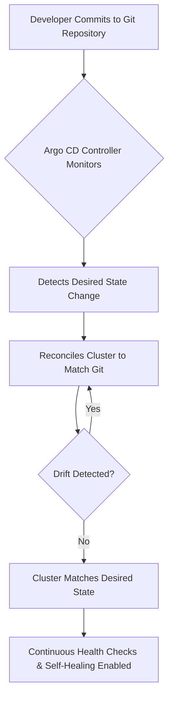

| Difficulty | Channel | Tags |
|---|---|---|
| beginner | devops | argocd, flux, declarative |

Picture this: thousands of microservices humming across hundreds of clusters, all managed by over 5,000 engineers. For teams at Intuit, this scale became a ticking time bomb. As adoption of their internal Kubernetes platform exploded, their existing deployment processes simply could not keep up. To solve this, they turned to Git as their single source of truth, but no existing tool could reconcile changes at their magnitude. This is the story of how the limitations of imperative workflows sparked a GitOps revolution [1].

---

> ### Real-World Case — Intuit
>
> Intuit built a Kubernetes-based internal platform (the 'Answer' platform behind Argo) to host thousands of microservices for ~5,000 engineers. As adoption exploded across hundreds of clusters, they needed continuous delivery that treated Git as the single source of truth, but no GitOps tool existed that could operate at that scale.
>
> | | |
> |---|---|
> | **Challenge** | Their initial Argo CD implementation only worked for a couple of clusters and a few dozen applications. A single large app (e.g., Istio) could take almost a minute to reconcile, imperative kubectl changes caused configuration drift that nobody could audit, and manual rollbacks were slow and error-prone. |
> | **Solution** | They built Argo CD around a declarative reconciliation loop: an Application CRD points at a Git repo (YAML/Helm/Kustomize), and the Application Controller continuously diffs live state against desired state, auto-syncs, and self-heals drift. They then re-engineered the controller to use the Kubernetes watch API with lightweight in-memory caching, moved config lookups to informers, and added a shared Redis manifest cache plus request throttling to the repo server. |
> | **Outcome** | Reconciliation for a giant app dropped from ~60 seconds to ~0.5 seconds, and ~150 applications reconciled in under 5 seconds. Intuit now runs 40,000+ Argo CD applications across 140+ Argo CD instances, 350 clusters and 15,000 nodes, with ~1,000 deployments per day and a 3x improvement in release velocity—saving roughly 1 million developer hours annually. |
> | **Lesson** | The plot twist: after the major controller redesign, production sync still took ~40 seconds—the culprit was lightweight configmap queries silently throttled by the Kubernetes Go client's default 5 QPS limit. Fixing that simply moved the bottleneck downstream, causing the repo server to OOM. A declarative GitOps loop is only as fast as the hidden defaults underneath it, so you must measure the whole pipeline, not just the visible controller. |

---

## Hook — When Scale Becomes Your Worst Enemy

It is a feeling that many developers know all too well: the deploy looked perfect. Then, the pagers started going off. As infrastructure grows, the margin for human error shrinks exponentially. What works for a single cluster with ten services, begins to crumble when you are managing hundreds of clusters and tens of thousands of nodes. The stakes are no longer just a broken build, but the livelihood of an entire engineering organization. For teams facing this wall, the question becomes: how do you maintain stability without grinding velocity to a halt?

## Problem — The Configuration Drift Epidemic

The true villain here is not failure itself, but configuration drift. When you allow changes to be made directly to a live cluster, the actual state begins to diverge from what is documented. Before you know it, you are left with a cluster that no one can reliably reproduce. This is exactly where the battle between imperative and declarative approaches begins [2]. 

Many developers discover that running `kubectl apply` or similar commands feels fast in the moment, however, this speed comes at the cost of traceability. Without version control acting as the source of truth, rollbacks become a guessing game, audits become nearly impossible, and on-call engineers are left praying that they can remember every command that was run. This leads to slower releases, higher burnout, and an overall lack of confidence in deployments [3].

## Real-World Case — Intuit

This is precisely the battle that Intuit found themselves fighting. As adoption for their 'Answer' platform grew to host thousands of microservices across 350 clusters and 15,000 nodes, they desperately needed a continuous delivery solution that treated Git as the single source of truth. With no GitOps tool on the market capable of operating at this scale, they turned to Argo CD to bridge the gap [1]. 

The results were staggering. Reconciliation times for their largest applications dropped from ~60 seconds all the way down to ~0.5 seconds. In total, ~150 applications could now reconcile in under 5 seconds. Today, Intuit runs over 40,000 Argo CD applications across 140+ Argo CD instances, deploying roughly 1,000 times per day. This led to a 3x improvement in release velocity, saving an estimated 1 million developer hours annually [1]. These numbers alone speak volumes, but the greatest win was not speed. It was trust.

## Deep Dive — Declarative vs Imperative in the GitOps Era

So, how exactly did this transformation occur? It all boils down to a fundamental shift in philosophy. 

The **declarative approach** is one where you define the desired end state of your system within version control. Tools, such as Argo CD, act as controllers that continuously reconcile the live cluster state to match this declared state [4]. This creates an immutable audit trail, allows for self-healing capabilities, and ensures that Git remains the single source of truth. 

On the flip side, the **imperative approach** focuses on the step by step instructions to reach a state. Commands such as `kubectl create`, `kubectl patch`, or `kubectl scale` directly mutate the cluster. While this grants flexibility, it completely bypasses version control. This opens the door to configuration drift, making it incredibly difficult to reproduce environments or roll back failures safely [5]. 

This is not to say that imperative workflows are evil. They can be extremely useful for debugging or one off operations. However, for production grade, continuous delivery at scale, the declarative model is far more resilient. This is due to its convergence based nature, which relies on a consistent source of truth, such as etcd, to guarantee the desired state is met [6].

## Workflow — Automating the Journey to Desired State

With the philosophy established, the next question is: how can you apply this to your own workflows using Argo CD? The beauty lies in its simplicity. You can take the exact strategy that allowed Intuit to scale, and implement it for your own services. 

Here is the battle tested workflow that teams utilize to achieve GitOps at any scale: 

- **Define your desired state:** Store all Kubernetes manifests, Helm charts, or Kustomize overlays within a Git repository. This becomes your contract [7]. 
- **Bootstrap Argo CD:** Deploy Argo CD onto your cluster. This installs the controller that will be responsible for reconciliation. 
- **Create an Application CRD:** Define an Argo CD `Application` Custom Resource that points to your Git repository, the target branch, and the path containing your manifests [2]. 
- **Enable Auto-Sync & Self-Healing:** Configure automatic synchronization with a reasonable interval, as well as self-healing to automatically revert any manual changes made outside of Git [2]. 
- **Continuously Reconcile:** From here on out, any commit to your Git repository will automatically be reflected in the cluster. If drift occurs, Argo CD will correct it. 

This entire flow can be visualized below, showcasing how Git acts as the true north for your deployments.

## Code Example — Declaring Your First Argo CD Application

Theory is powerful, but implementation is where the magic happens. Let's take a look at how you would declare an Argo CD `Application` to automate the synchronization of your microservice. This YAML manifest is a direct reflection of the workflow above, and is a pattern utilized in production environments [2].

## Lessons Learned — The Keys to Winning the GitOps Battle

After witnessing the transformation from both the industry and Intuit's massive success, a few hard earned lessons begin to surface: 

- **Git is non-negotiable:** Treating Git as the single source of truth is the greatest form of insurance that you could ever provide to your on-call engineers. It creates an immutable paper trail for every single change [7]. 
- **Speed scales with safety:** As shown with Intuit's drop to 0.5 second reconciliations, GitOps does not have to be slow. When implemented correctly, it massively accelerates velocity without sacrificing stability [1]. 
- **Automate your guardrails:** Features such as auto-sync and self-healing are your first line of defense. They prevent configuration drift, all whilst removing the need for manual intervention during off peak hours [4]. 
- **Pick the right tools for the job:** While Argo CD shines at scale, alternatives such as Flux also follow GitOps principles. Evaluate your team's needs, but never sacrifice the declarative model for short term convenience [8]. 

Most importantly, remember this: you do not need 40,000 applications to reap the benefits. Even starting with a single service, this shift will grant your team confidence, traceability, and most importantly, a good night's sleep.

---

## GitOps Reconciliation Flow with Argo CD

<strong>Original Interview Question</strong>

**Q:** You're setting up GitOps for a microservices deployment. How would you configure ArgoCD to automatically sync changes from your Git repository to Kubernetes, and what's the difference between declarative and imperative approaches in this context?

**A:** I'd configure ArgoCD by setting up a Git repository containing Kubernetes manifests or Helm charts, creating an Application CRD that points to the Git repository, enabling auto-sync with a health check interval of 3 minutes, and implementing self-healing to automatically revert any manual changes. The declarative approach involves defining the desired state in Git through YAML manifests, Helm charts, or Kustomize configurations, where ArgoCD continuously reconciles the actual state with the desired state. In contrast, the imperative approach uses kubectl commands to make direct changes to the cluster, bypassing the Git repository as the single source of truth.

## Conclusion

The war against configuration drift does not have to be fought at 3 AM. The shift from imperative commands to a declarative, Git driven model is what allowed Intuit to go from 60 second reconciliations, to half a second at massive scale [1]. This is a lesson that any team, big or small, can take to heart. Start small. Pick just one of your services, store its manifests in Git, and let Argo CD reconcile it. You may be surprised to find that the greatest deployment superpower is not speed alone, but the unshakeable trust that your source of truth has never lied to you.

---

## References

1. [Intuit incident report](https://blog.argoproj.io/doing-gitops-at-scale-6313f5889775) — article
2. [Argo CD Documentation](https://argo-cd.readthedocs.io/en/stable/) — documentation
3. [Kubernetes Concepts Overview](https://kubernetes.io/docs/concepts/overview/what-is-kubernetes/) — documentation
4. [Kubernetes Controllers](https://kubernetes.io/docs/concepts/architecture/controller/) — documentation
5. [Declarative Management of Kubernetes Objects](https://kubernetes.io/docs/tasks/manage-kubernetes-objects/declarative-config/) — documentation
6. [etcd - Distributed Reliable Key-Value Store](https://etcd.io/) — documentation
7. [OpenGitOps - GitOps Principles](https://opengitops.dev/) — documentation
8. [Flux - GitOps for Kubernetes](https://fluxcd.io/) — documentation

---

**Author:** Satishkumar Dhule — [GitHub](https://github.com/satishkumar-dhule) · [LinkedIn](https://linkedin.com/in/satishkumar-dhule) · [Website](https://satishkumar-dhule.github.io)
