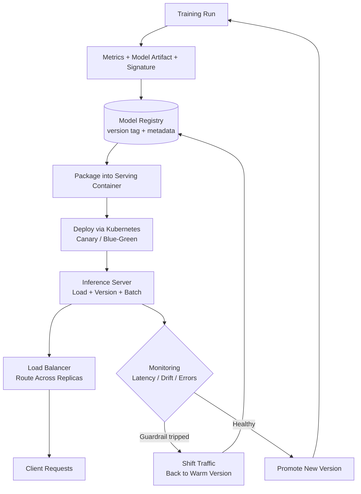

| Difficulty | Channel | Tags |
|---|---|---|
| beginner | devops | mlops, deployment |

By 2016, hundreds of Uber data science teams were each hand-rolling their own training scripts, bespoke deployment servers, and monitoring dashboards [1]. The result was a brutal 'cold start' problem: taking a single model from a laptop to production could take months, and data scientists reportedly spent around 80% of their time on infrastructure plumbing instead of actual modeling [1]. That gap between building a model and running it reliably is exactly where the difference between deployment and serving lives — and it is the difference between shipping once and shipping thousands of times a day.

---

> ### Real-World Case — Uber
>
> By 2016 Uber had hundreds of data science teams each hand-rolling their own training scripts, bespoke deployment servers, and monitoring, creating what Uber called a 'cold start' problem where it took months to take a single model from a laptop to production. Data scientists reportedly spent ~80% of their time on manual infrastructure plumbing rather than modeling.
>
> | | |
> |---|---|
> | **Challenge** | Unify the entire ML lifecycle—deployment (training pipelines, model packaging, CI/CD, monitoring, rollback) and serving (low-latency, high-throughput real-time prediction)—behind one platform. Early Michelangelo serving was tightly coupled to Spark MLlib with a custom protobuf model format, so loading native Spark PipelineModels was far too slow for millisecond-scale online serving, and adding new model frameworks was invasive. |
> | **Solution** | Uber built Michelangelo as an end-to-end platform: a standardized 'conveyor belt' that deploys the same packaged artifact to either scheduled batch (Spark) or online containers serving real-time request/response predictions via Thrift. Models and their library dependencies are preloaded and served from memory, with a small-cluster-in-a-host Spark session replaced by a lightweight per-row scoring API to hit real-time SLAs. During Uber's cloud-native modernization, all ML artifacts (jobs, pipelines, clusters) became Kubernetes CRDs; because standard etcd struggled with high-cardinality relational ML metadata, they added a transparent persistence layer syncing CRD state to a horizontally scalable MySQL backend for millisecond filtering. |
> | **Outcome** | Michelangelo grew from ~1 million predictions/second to 30+ million predictions/second, powering 40 million trips/day and 450 trips/second across 70+ countries and 15,000+ cities. Most models achieve P95 latency under 5 ms, and under 10 ms when pulling features from the Cassandra feature store, with a reproducible identical model runnable both online and offline. Modernization work (Ray on Kubernetes + DeepSpeed ZeRO) also delivered 10x training throughput gains. |
> | **Lesson** | Deployment and serving are separate engineering problems that still need one shared artifact and contract: the same package must flow to batch and online paths to eliminate training-serving skew, and serving latency SLAs force in-memory model loading and framework-agnostic runtimes. The counterintuitive part is that standard Kubernetes/etcd can become the bottleneck for ML deployment metadata, not the compute—so platforms must rethink the control plane, not just the model servers. |

---

## Hook — The Model Worked on Friday. Production Disagreed.

Picture the moment every ML engineer eventually faces: a model trains beautifully, hits 0.94 AUC, and gets handed off to production with a fist bump. Two weeks later, it is serving predictions with 400ms latency, nobody knows which version is live, and the on-call engineer is grepping through three different repos just to find the weights file. The model was never the hard part — the hard part was everything wrapped around it. At Uber, this exact chaos scaled into a company-wide problem [1]. Hundreds of teams, hundreds of bespoke pipelines, and a deployment lifecycle so manual that a single model could take months to reach users [1]. Here is the uncomfortable truth: most teams obsess over the model artifact and treat the surrounding system as an afterthought. That is backwards. The Model is a small node in a much larger graph of infrastructure, and understanding that graph is what separates a demo from a product. Sound familiar?

## Problem — Deployment and Serving Are Usually Conflated, and That Costs You

Developers routinely use 'model deployment' and 'model serving' interchangeably, but they describe two different disciplines with different failure modes, different tools, and different scaling strategies. **Deployment** is the lifecycle problem: how a trained artifact travels safely from a notebook to production — CI/CD pipelines, containerization, infrastructure provisioning, model registries, canary rollouts, and rollback strategies [2]. It answers the question, 'How do we get this thing out there and undo it if it breaks?' **Serving** is the runtime problem: how that artifact actually answers requests at scale — inference APIs, request routing, model loading and versioning, batching, and autoscaling [3]. It answers the question, 'How do we answer 10,000 requests per second without melting?' Conflating the two creates predictable pain. If you treat serving as just 'the last step of deployment,' you end up with no traffic-splitting, no warm pools to fight cold starts, and no way to run an A/B test without redeploying everything. If you treat deployment as 'just spin up a container,' you end up with no rollback path and no audit trail when a bad model quietly degrades revenue for a week. The stakes are concrete: a real-time fraud model that slips from 40ms to 400ms changes user behavior, and a broken rollout without a rollback can cost millions before anyone notices. So how do the companies that got this right actually structure the two halves? That is where Uber's story becomes instructive.

## Real-World Case — Uber and Michelangelo

Uber's answer to its cold-start nightmare was Michelangelo, an internal ML platform built to standardize the entire path from data to prediction [1]. Before Michelangelo, the company described a landscape where each data science team maintained its own training scripts, deployment servers, and monitoring — a combinatorial explosion of inconsistency [1]. After centralizing the platform, the numbers tell the story. Michelangelo grew from roughly 1 million predictions per second to over 30 million predictions per second, powering about 40 million trips per day and 450 trips per second across more than 70 countries and 15,000+ cities [1]. Most models achieve P95 latency under 5 ms, and under 10 ms when pulling features from the Cassandra-backed feature store, with the same reproducible model runnable both online and offline [1]. 🔥 **Hot Take:** The most important result there is not the throughput — it is the phrase 'identical model runnable both online and offline.' Uber closed the train/serve skew gap by treating deployment and serving as one coordinated system, not two disconnected stages. Modernization work with Ray on Kubernetes plus DeepSpeed ZeRO later delivered another 10x training throughput gain [1], but the foundational win was standardizing the lifecycle itself. This is the plot twist: the fix was not a fancier model server. It was a shared contract between deployment and serving that every team could rely on.

## Deep Dive — The Real Trade-offs Behind the Buzzwords

Now that you have seen the payoff of unifying these disciplines, it helps to understand exactly what each side owns and where the hard trade-offs live. **Deployment owns the artifact lifecycle.** That means versioned model registries, reproducible builds with Docker, orchestration through Kubernetes [2], and CI/CD automation that can promote or revert a model the same way it promotes or reverts application code [4]. **Serving owns the request path.** That means an inference server, request routing, dynamic batching, model versioning at runtime, and autoscaling based on the right signal — because CPU utilization is often the wrong autoscaling metric for GPU-bound inference [5]. The trade-offs fall into a few repeating buckets. First, **latency versus throughput**: dynamic batching raises throughput dramatically but adds queueing delay, so you have to pick a max batch size and a timeout budget. Second, **batch versus real-time inference**: batch scoring is cheap and forgiving of seconds of latency, while online inference obeys a hard P95 budget. Third, **cold-start optimization**: loading a multi-gigabyte model into GPU memory takes time, so production systems keep warm pools, preload weights, or use smaller distilled models for the tail. A useful mental model is this: deployment decides *what* should run, serving decides *how* it runs right now.

| Dimension | Model Deployment | Model Serving |
|---|---|---|
| Primary concern | Lifecycle & safety | Runtime performance |
| Core tools | Kubernetes, MLflow, Terraform [2][6] | TensorFlow Serving, TorchServe, BentoML [3][7][8] |
| Scaling signal | Replica count of the workload | QPS, queue depth, GPU utilization [5] |
| Failure mode | Bad rollout, no rollback | High latency, cold starts, skew |
| Rollback approach | Revert to prior registry version | Shift traffic to a warm version |
| Typical latency target | Minutes to hours (pipeline) | <100ms real-time, <1s batch |

💡 **Insight:** Notice that the two columns share one dependency — the model registry. Without a single source of truth for versions, serving has nothing trustworthy to route to, and deployment has nothing meaningful to roll back to. Consequently, the registry becomes the seam where both disciplines must agree on a contract.

## Workflow — From Notebook to Live Prediction, Step by Step

Building on that contract, here is the practical workflow that stitches deployment and serving together. The diagram below shows how a single artifact flows through both halves and how feedback loops from serving feed back into deployment. Each stage has a clear owner and a clear exit condition, which is exactly what Uber was missing before Michelangelo [1].

1. **Commit and train.** A training run produces metrics, a model artifact, and a signature that describes expected inputs and outputs.
2. **Register.** The artifact is pushed to a model registry with a version tag and metadata — this is the contract that serving will consume [6].
3. **Package.** The model is baked into a container image alongside its serving runtime, so the environment is reproducible [2].
4. **Deploy.** Kubernetes rolls out the new version using a canary or blue-green strategy, keeping the previous version warm for instant rollback [2][4].
5. **Serve.** The inference server loads the model, applies dynamic batching, and exposes a stable API; the load balancer routes traffic across replicas [3][9].
6. **Observe.** Latency, throughput, error rate, and prediction drift are monitored; if a guardrail trips, traffic shifts back automatically [5].
7. **Loop.** Drift or performance degradation triggers retraining, closing the cycle back at step one.

⚠️ **Watch Out:** Steps 4 and 5 must share the same health signals. A deployment that reports 'healthy' while serving is secretly returning stale cache results is worse than an obvious crash — it is a silent failure that monitoring was never built to catch.

## Code Example — A Minimal Serving Layer with Versioning and Batching

With the workflow clear, here is what the serving half looks like in practice. The following FastAPI service exposes a versioned prediction endpoint, implements a simple dynamic batching queue, and reports the metrics the deployment layer needs to make safe rollout decisions. It directly addresses the problem of running multiple model versions behind one stable API — the exact pattern that lets you do canary rollouts and A/B tests without redeploying.

## Lessons Learned — What to Do Differently Tomorrow

The journey from Uber's cold-start chaos to 30+ million predictions per second [1] comes down to a handful of durable lessons. **Treat deployment and serving as one system with one contract** — the model registry is the handshake, and without it both halves break. **Pick the right scaling signal**: autoscale serving on queue depth or GPU utilization, not just CPU [5]. **Design for rollback before you design for speed**, because the moment you need it is the moment you cannot afford to improvise [4]. **Warm your cold starts** with preloaded models or distilled variants, and measure the tail latency, not the average [3]. **Unify online and offline feature logic** so training and inference see the same world — this alone eliminates a huge class of silent production bugs [1]. If this feels overwhelming, you are not alone; even Uber needed a dedicated platform team to get here. So what should you do tomorrow? Write down the exit condition for every stage of your pipeline, put your model versions in a registry, and add a canary rollout with an automatic rollback guardrail. 🎯 **Key Point:** The model is never the product. The system that reliably delivers the model's predictions, thousands of times a second, is the product — and that system is what deployment and serving together are for.

---

## Deployment-to-Serving Lifecycle

<strong>Original Interview Question</strong>

**Q:** Explain the key differences between model serving and model deployment in ML systems, including specific technologies, scaling considerations, and real-world implementation patterns?

**A:** Deployment encompasses CI/CD pipelines, infrastructure setup, and monitoring using tools like Kubernetes, MLflow, and SageMaker. Serving focuses on runtime inference APIs with frameworks like TensorFlow Serving, TorchServe, or BentoML, handling request routing, model versioning, and autoscaling. Key trade-offs include latency vs throughput, batch vs real-time inference, and cold start optimization.

## Conclusion

Uber's cold start did not end because someone wrote a smarter model. It ended when deployment and serving were treated as two halves of one system with a shared contract [1]. Yes, deployment owns the safe path to production — the pipelines, containers, and rollbacks. Yes, serving owns the runtime — the batching, routing, and autoscaling. But the magic happens where they meet: in the model registry and the health signals they both trust. So do not wait for a platform team to save you. Tomorrow, pick one model, register its version, wrap it in a stable endpoint, and add a canary rollout with an automatic rollback guardrail. The single insight worth sharing with your team: the model is never the product — the system that reliably serves it, millions of times a second, is the product.

---

## References

1. [Uber incident report](https://www.uber.com/blog/michelangelo-machine-learning-platform/) — article
2. [Kubernetes Documentation: Deployments](https://kubernetes.io/docs/concepts/workloads/controllers/deployment/) — documentation
3. [TensorFlow Serving - GitHub](https://github.com/tensorflow/serving) — documentation
4. [CI/CD - Wikipedia](https://en.wikipedia.org/wiki/CI/CD) — article
5. [Kubernetes Documentation: Horizontal Pod Autoscaling](https://kubernetes.io/docs/tasks/run-application/horizontal-pod-autoscale/) — documentation
6. [MLflow - GitHub](https://github.com/mlflow/mlflow) — documentation
7. [TorchServe - GitHub](https://github.com/pytorch/serve) — documentation
8. [BentoML - GitHub](https://github.com/bentoml/BentoML) — documentation
9. [MLOps - Wikipedia](https://en.wikipedia.org/wiki/MLOps) — article
10. [Machine Learning Operations (MLOps): Overview, Definition, and Architecture](https://arxiv.org/abs/2205.02302) — paper

---

**Author:** Satishkumar Dhule — [GitHub](https://github.com/satishkumar-dhule) · [LinkedIn](https://linkedin.com/in/satishkumar-dhule) · [Website](https://satishkumar-dhule.github.io)
