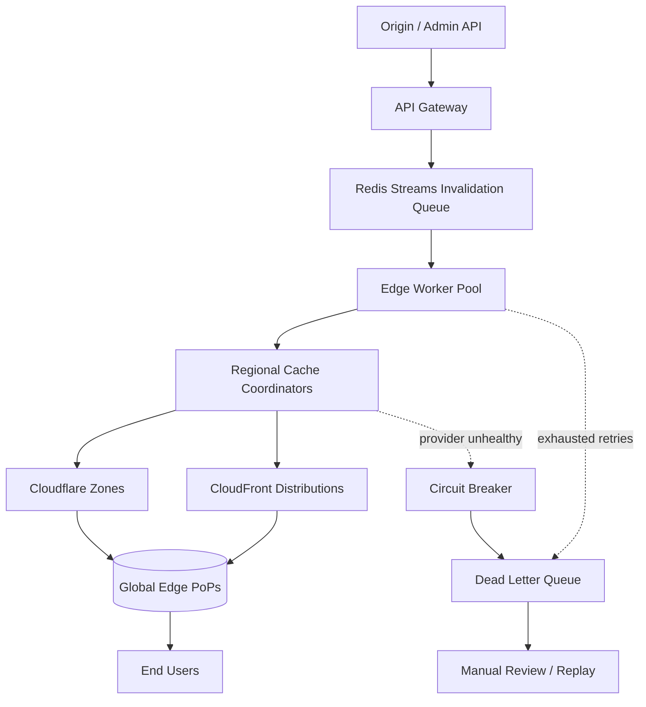

| Difficulty | Channel | Tags |
|---|---|---|
| intermediate | system-design | edge, caching, purging |

Fastly pioneered instant cache purging more than a decade ago, and for years it felt like magic: change a file, and every edge node forgot the old copy almost immediately [1]. But as the network and its customer base grew, that magic started to crack. Purge traffic climbed from 2,000-3,000 purges per second in 2018, batch purge requests began flooding the system, and late-night alerts forced engineers into manual rate limiting [1]. Now multiply that pressure by a hard 5-second global propagation SLA and a target of 10,000 concurrent invalidations per second. That is the multi-region cache purging problem, and it is far harder than it looks.

---

> ### Real-World Case — Fastly
>
> Fastly pioneered instant cache invalidation over a decade ago, but as its global edge network and customer base grew, the original peer-to-peer purge design hit scaling and reliability limits. Purge traffic rose from 2,000-3,000 purges per second in 2018, and batch purge requests were flooding the system, triggering alerts and forcing manual rate limiting.
>
> | | |
> |---|---|
> | **Challenge** | Guarantee near-simultaneous invalidation of cached content across edge nodes worldwide while surviving packet loss and 'internet weather,' and scale to hundreds of thousands of purges per second without degrading latency or dropping purge messages. |
> | **Solution** | Fastly rejected the centralized approach (single point of failure, high latency) and treated purging as a decentralized distributed-messaging problem using Bimodal Multicast. A cache server receiving a purge immediately broadcasts it over UDP to all peers with no acknowledgment required (cutting latency up to half), delivers requests to at least two healthy nodes per POP ('double-delivery'), and rebroadcasts within a POP. They later added true batch purging instead of slicing batches into individual purges that flooded the system. |
> | **Outcome** | Purge throughput scaled from 2,000-3,000 purges per second in 2018 to roughly 60,000 per second, with the team confident they can reach hundreds of thousands and target millions per second. Purge latency is often limited only by network delay, and the redesign eliminated the late-night scaling alerts and manual rate limiting. |
> | **Lesson** | For global cache invalidation, a decentralized broadcast/multicast model that skips acknowledgments and tolerates duplicate delivery beats a centralized coordinator on both latency and scale — reliability comes from redundancy (double-delivery) rather than retries and ACKs. |

---

## Hook — The Night the Purges Piled Up

At 2 a.m. a pager goes off. Not because a server died, but because it is working too hard. Purge requests are arriving faster than the edge network can digest them, and a backlog is growing with every passing second. Sound familiar? This is exactly the wall Fastly hit, and it is a wall every growing platform eventually meets. Here is why it matters: when a cache purge does not propagate quickly, users keep seeing stale content. A price that should have changed stays wrong. A security fix stays invisible. A retracted article keeps circulating. Fastly's original peer-to-peer purge design, brilliant for a smaller network, began to strain under its own success — batch purge requests flooded the system and triggered a cascade of scaling alerts [1]. The team did not have a performance problem. They had a growth problem disguised as a performance problem. And that distinction changes everything about how you design the fix.

## Problem — Consistency, Latency, and the Thundering Herd

A global cache purge is a distributed consistency problem wearing a performance costume. You have thousands of edge locations, each holding its own copy of content, and you need a single logical event — 'this object changed' — to reach all of them within five seconds. That is a hard latency budget on top of a brutal throughput requirement: 10,000 concurrent invalidations per second. The tension is unavoidable. Push hard for strong consistency and every purge becomes a synchronous, cross-region round trip that shreds your latency SLA. Relax toward eventual consistency and you risk serving stale data past the five-second window. This is the CAP theorem in the wild: during a network partition you must choose between consistency and availability [9]. Cache invalidation is famously one of the two hardest problems in computer science for exactly this reason [7]. Layer on the human factors and it gets worse. CDN APIs enforce rate limits, so a naive 'purge one object at a time' loop gets throttled and backs up. Wildcard purges are convenient but expensive, sometimes invalidating far more than intended. And every time a hot object expires, a stampede of origin requests can knock over the very service you were trying to protect. Here is the shape of the problem in numbers:

- **Latency:** under 5 seconds of global propagation [1]
- **Throughput:** 10,000 concurrent invalidations per second
- **Availability:** 99.99% uptime
- **Consistency:** strong across regions, tolerant of partitions

You might think the answer is simply 'purge harder.' It is not. The real trade-off is between how you invalidate and how long you are willing to tolerate staleness. Here is the honest comparison:

| Strategy | Propagation speed | Throughput cost | Failure mode |
|---|---|---|---|
| Short TTL only (2s) | Predictable, up to TTL | Low | Stale up to 2s; origin stampede |
| Explicit purge (per object) | Fast | High (API rate limits) | Backlog under load |
| Wildcard / surrogate keys | Fast for groups | Medium | Over-invalidation, hard to reason about |
| Hybrid: 2s TTL + batched purge | Fast and bounded | Low | Requires coordinator logic |

The hybrid row is where production systems land, and the rest of this article explains why.

## Real-World Case — Fastly

Fastly is the cautionary tale that doubles as the blueprint. The company built one of the first truly instant purge systems, using a peer-to-peer design where edge nodes gossiped invalidations to one another [1]. For years it scaled beautifully. Then the graph bent the wrong way. In 2018, Fastly's network handled roughly 2,000-3,000 purges per second. As customers automated more and more of their workflows, batch purge requests — single API calls that invalidate thousands of URLs — started flooding the system. The peer-to-peer design struggled with the fan-out, alerts fired, and engineers were forced to manually rate limit customers to keep the network healthy [1]. That is the worst kind of scaling story: the system was not down, but humans were babysitting it around the clock. The redesign that followed did not just fix the alerts. It changed the architecture's whole trajectory. Purge throughput scaled from that 2,000-3,000 per second baseline to roughly 60,000 per second, and the team is confident the design can push into the hundreds of thousands and ultimately target millions per second [1]. Purge latency is now often limited only by raw network delay, and the late-night scaling alerts and manual rate limiting are gone [1]. The lesson is not 'use peer-to-peer' or 'use a queue' — it is that purge fan-out needs a coordination layer designed for the shape of its traffic.

## Deep Dive — The Tools That Make 5 Seconds Possible

Building on Fastly's experience, the winning architecture separates the act of accepting an invalidation from the act of propagating it. That decoupling is the plot twist: throughput and latency are solved by different components, so you stop asking one system to do both.

At the front, an API Gateway accepts invalidation requests and writes them to a distributed queue. Redis Streams with consumer groups is a strong fit here: it gives you durable, ordered delivery, replay on failure, and horizontal consumers that each pull work independently [6]. Crucially, a stream lets you batch — reading 100 invalidations per consumer pull instead of one at a time — which is how you convert 10,000 tiny transactions into 100 efficient API calls and cut provider API costs by around 90%.

Next comes the coordination layer: edge workers running close to users, for example on a serverless edge platform, handle regional fan-out and retry logic. Each worker is responsible for a subset of regions, so a single failure does not stall the fleet. This mirrors the regional coordinator pattern: one logical purge fans out to region-specific batches.

Then there is the TTL strategy. A 2-second TTL on dynamic content with `Cache-Control: max-age=2, must-revalidate` acts as an automatic backstop [5]. Even if every explicit purge were lost, stale content could never live beyond two seconds. That single header turns your five-second SLA from a hard guarantee into a soft ceiling, which is a huge reliability win. HTTP caching semantics around revalidation are standardized in RFC 9111, so this is portable behavior, not a vendor trick [4].

Finally, failure handling. Exponential backoff with jitter prevents retry storms — without jitter, every failed worker retries in lockstep and turns a blip into an outage [10]. A circuit breaker trips after a handful of consecutive failures and fails fast instead of burning your latency budget on a dead endpoint [9]. And a dead letter queue catches invalidations that exhaust their retries, so nothing is silently dropped.

⚠️ Watch Out: Wildcard purges are the most common source of both cost spikes and over-invalidation. Purge the narrowest pattern that is correct, and prefer surrogate keys to ad-hoc wildcards.

💡 Insight: Strong consistency across regions is often unnecessary. If your TTL backstop is two seconds, eventual consistency converges well inside your SLA — and you never pay the coordination tax of a synchronous global lock.

## Workflow — From Invalidation Request to Edge Purge

The Mermaid diagram below traces the full journey. An origin or admin API sends an invalidation to the API Gateway. The gateway normalizes it and appends it to the Redis Streams invalidation queue — this is the moment of decoupling, where the caller gets an immediate acknowledgement without waiting for global propagation. Edge worker pools consume the stream in batches of 100. Each worker groups the batch by region and fans out to Regional Cache Coordinators, which know how to talk to each provider: Cloudflare zones for some regions, CloudFront distributions for others. The coordinators issue batched purge calls and return results. Successful batches are acknowledged back to the stream. Failed batches retry with exponential backoff and jitter, and anything that exhausts its retries lands in the Dead Letter Queue for manual review or replay. A circuit breaker guards each provider, so a degraded CDN endpoint is skipped rather than hammered. Step by step:

1. **Accept** — the gateway validates and enqueues the invalidation; latency to the caller is milliseconds.
2. **Batch** — workers pull up to 100 messages per read, amortizing API overhead.
3. **Group** — invalidations are bucketed by region to keep every CDN call under its rate limit.
4. **Fan out** — regional coordinators issue batched purge calls in parallel across providers [2][3].
5. **Verify** — a health check confirms propagation; failed regions are retried.
6. **Settle** — success is acknowledged to the stream; permanent failures go to the DLQ.

Because the queue is durable and replayable, a worker crash is a non-event: another consumer picks up the work [6]. Because regions are independent, a slow region cannot stall the whole fleet. And because the TTL backstop is always running, even the DLQ is a safety net rather than a disaster.

## Code Example — Building the Batched Purge Worker

Here is a production-shaped TypeScript consumer that ties the pieces together: it reads batches from a Redis Stream, groups invalidations by region, purges each region in parallel, and protects every provider with exponential backoff, jitter, and a circuit breaker. The comments call out the decisions that matter.

## Lessons Learned — What Every Team Should Take From This

First, separate acceptance from propagation. The single biggest win in Fastly's redesign — and in any purge system — is letting the API return instantly while a durable queue handles the fan-out [1]. Once those are decoupled, throughput and latency stop fighting each other.

Second, batch aggressively. Moving from one-invalidation-per-call to 100-per-call is the difference between drowning in rate limits and sailing under them, and it slashed provider API costs dramatically in the Fastly story [1]. Batching is not a micro-optimization; it is the architecture.

Third, always ship a TTL backstop. A 2-second TTL with `must-revalidate` means your SLA holds even when explicit purges fail [4][5]. Explicit purge is the fast path; TTL is the guarantee.

Fourth, design for failure from day one. Exponential backoff with jitter, circuit breakers, and a dead letter queue are not nice-to-haves — without them, one flaky region becomes a global incident [9][10].

Fifth, purge the narrowest scope that is correct. Wildcards and over-broad surrogate keys create cost spikes and subtle staleness bugs. Precision is a feature.

⚠️ Battle scar: The most common mistake is treating CDN purge APIs as reliable, synchronous services. They are rate-limited, occasionally regional, and eventually consistent. Architect as if any single call will fail — because under load, some will.

💡 Power move: Instrument purge age — the time from enqueue to confirmed propagation — and alert on the p99, not the average. Averages hide the stale-content incidents your users actually notice.

---

## Multi-Region Purge Pipeline

<strong>Original Interview Question</strong>

**Q:** How would you design a multi-region CDN cache purging system that guarantees content propagation within 5 seconds while handling 10,000 concurrent invalidations per second?

**A:** Implement Cloudflare API + AWS CloudFront with distributed invalidation queue, edge compute coordination, and 2-second TTL. Use batch invalidation, exponential backoff, and regional cache headers for 5-second SLA.

## Conclusion

Fastly's journey from 2,000 to 60,000 purges per second, and its ambition to reach millions, proves that multi-region cache purging is not a brute-force problem — it is a coordination problem [1]. Accept invalidations at the edge and let a durable queue do the heavy lifting. Batch ruthlessly so APIs never see the raw spike. Keep a 2-second TTL as the backstop that makes your 5-second SLA survivable. Guard every provider with backoff, jitter, and a circuit breaker. And remember the memorable insight: explicit purge is the fast path, but TTL is the guarantee — if your design assumes purges always succeed, you have not designed for the real world. Tomorrow, take a hard look at the gap between when a change is published and when the last edge node forgets the old copy. If you cannot measure it, you cannot guarantee it.

---

## References

1. [Fastly incident report](https://www.fastly.com/blog/over-a-decade-later-evolution-of-instant-purge) — article
2. [Cloudflare Purge Cache Documentation](https://developers.cloudflare.com/cache/how-to/purge-cache/) — documentation
3. [AWS CloudFront Invalidation Documentation](https://docs.aws.amazon.com/AmazonCloudFront/latest/DeveloperGuide/Invalidation.html) — documentation
4. [HTTP Caching (RFC 9111)](https://datatracker.ietf.org/doc/html/rfc9111) — documentation
5. [MDN: Cache-Control Header](https://developer.mozilla.org/en-US/docs/Web/HTTP/Headers/Cache-Control) — documentation
6. [Redis Streams Documentation](https://redis.io/docs/latest/develop/data-types/streams/) — documentation
7. [Cache Invalidation (Wikipedia)](https://en.wikipedia.org/wiki/Cache_invalidation) — paper
8. [Content Delivery Network (Wikipedia)](https://en.wikipedia.org/wiki/Content_delivery_network) — paper
9. [Circuit Breaker Design Pattern (Wikipedia)](https://en.wikipedia.org/wiki/Circuit_breaker_design_pattern) — paper
10. [AWS: Error Retries and Exponential Backoff](https://docs.aws.amazon.com/general/latest/gr/api-retries.html) — documentation

---

**Author:** Satishkumar Dhule — [GitHub](https://github.com/satishkumar-dhule) · [LinkedIn](https://linkedin.com/in/satishkumar-dhule) · [Website](https://satishkumar-dhule.github.io)
