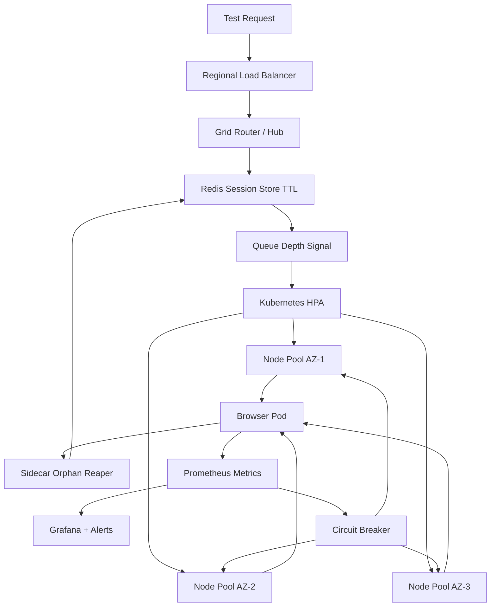

| Difficulty | Channel | Tags |
|---|---|---|
| advanced | system-design | selenium, webdriver, grid |

Salesforce once ran one of the largest private Selenium farms on the planet: a 50,000-VM data center executing roughly 1,000,000 browser tests per day for about 120 engineering teams [1]. The twist that made it work was that they never trusted a long-lived hub/node grid — their infrastructure continuously provisioned and destroyed VM instances per test batch instead [1]. That single design choice is the difference between a grid that scales to 10,000 concurrent sessions and one that quietly leaks memory until the pager screams at 3 a.m. Here is how you build the former.

---

> ### Real-World Case — Salesforce
>
> Salesforce built one of the largest private Selenium farms in the industry: a dedicated 50,000-VM data center running roughly 100,000 unique Selenium/WebDriver tests across IE6–IE11, Firefox, Chrome, and Safari for ~120 engineering teams shipping ~500 commits per day. Instead of a long-lived hub/node grid, their infrastructure continuously provisioned and destroyed VM instances per test batch across the farm.
>
> | | |
> |---|---|
> | **Challenge** | At that scale a persistent Selenium Grid became unmanageable: JVM/node memory crept up across thousands of sessions, Selenium jar and browser version upgrades broke node compatibility, test failures had to be routed back to the responsible engineer, and non-deterministic 'flapper' tests plus capacity planning threatened to make UI testing the release bottleneck. |
> | **Solution** | Salesforce treated node lifecycle as ephemeral infrastructure — continuously provisioning and tearing down Selenium VMs rather than nursing long-lived nodes (an early precursor to today's one-pod-per-session, auto-scaled cloud grids). They layered strict Page Object encapsulation, fail-fast setup, screenshot/HTML capture at failure points, re-run of non-deterministic tests, run-frequency tuning, and versioning tests with app code to keep the farm healthy. |
> | **Outcome** | Sustained ~50,000 unique Selenium tests (7,500 WebDriver) running across a 50,000-VM data center, executing ~1,000,000 browser tests per day, with full IE6–IE11/Firefox/Chrome/Safari coverage for ~120 teams. |
> | **Lesson** | At grid scale, session/node lifecycle management matters more than raw node count — continuously recycling instances sidesteps the memory leaks that force periodic restarts, and the dominant cost shifts from infrastructure to flaky tests and version drift, so test hygiene is as critical as the runtime platform. |

---

## Hook — The Night the Grid Ate Itself

A browser test passes in CI. Then it passes again. Then, on the 4,000th run of the night, a node runs out of memory, the hub keeps routing work to it anyway, and the queue backs up until the whole grid turns red. Sound familiar?

Scaling Selenium is not really about adding more browsers. It is about treating every browser as disposable and every failure as inevitable. At 10,000 concurrent sessions, your test grid stops being a test tool and starts being a distributed system — with all the split-brain, resource-exhaustion, and cascading-failure gremlins that distributed systems love to bring to the party.

Here is the uncomfortable truth many teams learn the hard way: the moment you cache a session, pin a node, or trust a single hub, you have planted the seed of your next outage. The rest of this story is about pulling those seeds out by the roots.

## Problem — Why a 'Simple' Hub and Nodes Breaks at Scale

The classic Selenium Grid is a hub that accepts test requests and a herd of nodes that run browsers [2]. It works beautifully for fifty tests and betrays you at fifty thousand.

Concretely, four things go wrong in predictable, expensive ways:

- **The hub becomes a single point of failure.** If it dies, the entire grid stops accepting work, and there is no automatic replacement.
- **Memory leaks compound silently.** Browser processes, Docker layers, and leftover temp profiles accumulate. A node that needs 2 GB drifts to 6 GB over a week, and eventually the kernel OOM-killer arrives uninvited.
- **Sessions outlive their tests.** When a test crashes mid-run, the browser keeps holding RAM and a slot. Multiply that by hundreds of abandoned sessions and your effective capacity quietly evaporates.
- **One slow node poisons the queue.** A node with a stuck browser still advertises itself as healthy, so the scheduler keeps handing it work that will never finish.

However, the math is what makes this urgent. At 10,000 concurrent sessions and a sane 50 sessions per node, you need **200 nodes minimum** [2]. At 2 GB of RAM each, that is 400 GB baseline, plus a 30% buffer for leaks and spikes, landing near 520 GB of cluster memory. Now multiply that by multiple data centers and the coupling between them, and it becomes obvious: you cannot solve this with a bigger VM and good intentions.

## Real-World Case — Salesforce's 50,000-VM Selenium Farm

Salesforce did not just flirt with this problem — they lived it at a scale most teams will never see [1].

Their dedicated Selenium farm spanned a **50,000-VM data center**, running sustained batches of roughly **100,000 unique Selenium tests** (with about 7,500 written directly in WebDriver), covering the brutal browser matrix of **IE6 through IE11, Firefox, Chrome, and Safari**. All of it served around **120 engineering teams** shipping approximately **500 commits per day**, executing on the order of **1,000,000 browser tests per day** [1].

The plot twist is how they architected it. Instead of running a long-lived hub with persistent nodes, Salesforce continuously **provisioned and destroyed VM instances per test batch** [1]. Capacity was not a fixed pool of pets you nursed back to health — it was cattle you spun up, used, and threw away.

That pattern — ephemeral nodes, constant churn, zero sentimental attachment to any single instance — is exactly the mental model Kubernetes was built for. Salesforce proved the thesis at absurd scale: the grid that survives is the grid that expects every node to die.

## Deep Dive — Ephemeral Nodes, TTLs, and Circuit Breakers

Building on Salesforce's cattle-not-pets philosophy, the architecture comes down to three interlocking ideas: stateless compute, a shared session store, and aggressive failure isolation.

**1. Ephemeral browser nodes as stateful, disposable pods.** Kubernetes StatefulSets give each browser node a stable identity and stable storage, while still letting you recreate nodes at will [3]. Each pod gets explicit CPU and memory limits — 2 GB RAM and 1 CPU is a reasonable starting point — so a runaway browser can be killed long before it drags down its neighbors. Horizontal Pod Autoscaling then adds or removes nodes based on queue depth rather than naive CPU percentage, because a busy test grid often looks idle on CPU while the queue is on fire [4].

**2. Redis as the single source of truth for session state.** Instead of tracking sessions inside the hub's process memory, you write each session to a Redis cluster with a TTL [5]. That TTL is the anti-memory-leak guarantee: even if your cleanup code never runs, the key expires and the node becomes reclaimable. This is the difference between hoping cleanup works and making leaks structurally impossible.

**3. Circuit breakers for node isolation.** Unhealthy nodes should fail fast and stop receiving traffic. A circuit breaker trips after three consecutive health-check failures and stops routing to that node for a 30-second cooldown [7][9]. Meanwhile, Kubernetes liveness and readiness probes do the coarse-grained work of removing pods that are outright dead [7], and Pod Disruption Budgets keep at least 85% of capacity alive during rolling updates [6].

Here is the trade-off table worth remembering:

| Approach | Failure Behavior | Memory Risk | Recovery Time |
|---|---|---|---|
| Long-lived hub + nodes | Hub is a SPOF; one bad node drags the queue | High — leaks accumulate for weeks | Manual, minutes to hours |
| Ephemeral pods + Redis TTL | Node loss is routine and invisible | Low — TTL enforces a ceiling | Automatic, seconds |

Additionally, memory does not just leak into nothing — it walks out with CPU too. The reason this works at scale is that you monitor the trend, not the snapshot. Prometheus scrapes per-pod memory and session duration, and Grafana dashboards surface the slow climb that precedes an OOM kill [8]. Alerts fire at 80% usage, and weekly rolling restarts drain the last stubborn bytes. For example, Salesforce-scale churn proves that if a node cannot be safely killed on a schedule, it is a pet — and pets die at the worst possible moment.

## Workflow — The Session Lifecycle, Step by Step

So how does a single test request travel through this machine without ever becoming a zombie? Follow the diagram below, which traces one session from arrival to cleanup.

The workflow in plain steps:

1. **A test request lands at a regional load balancer.** Latency-aware routing keeps P99 session initiation under 2 seconds by sending work to the nearest healthy region.
2. **The grid router claims a browser.** Weighted round-robin picks a node based on real capacity and observed response time, not a static list [2].
3. **A session key is written to Redis with a TTL.** This is the atomic claim that prevents two schedulers from double-booking the same node [5].
4. **The node runs the browser and renews its heartbeat.** A live browser keeps extending its lease; a crashed one stops calling home and silently expires.
5. **A sidecar container watches for orphans.** Every five minutes it scans for keys missing a TTL and force-cleans them, while Kubernetes init containers remove stale Docker volumes.
6. **Prometheus observes everything.** Metrics flow to Grafana, alerts fire at 80% memory, and unhealthy nodes trip their circuit breaker into a 30-second penalty box [7][8][9].
7. **Failed nodes are recreated, not repaired.** Because nodes are cattle, a bad one is terminated and replaced by autoscaling — no late-night SSH session required.

Split-brain risk during network partitions is handled with leader election, canary deployments limit blast radius for new node versions, and Pod Disruption Budgets ensure you never voluntarily fall below 85% capacity [6].

## Code Example — A Session Lifecycle Manager with TTL and Circuit Breaking

Enough theory. The code below is a compact, production-flavored Python sketch of the exact guarantees described above: hard TTLs, heartbeat renewal, orphan reaping, and a circuit breaker. It uses Redis for shared state [5] and Prometheus client metrics for observability [8].

## Lessons Learned — What to Take Into Your Next Outage

The journey from a fragile hub to a resilient grid is really a journey from hope to invariants. Here is what to carry forward:

- **Treat nodes as cattle, not pets.** Salesforce's willingness to destroy VMs per batch at 50,000-VM scale is the whole lesson in one sentence [1]. If you cannot kill it on a schedule, it will kill you on a Friday.
- **Make leaks impossible, not just unlikely.** A TTL in Redis [5] is stronger than any cleanup script, because it does not depend on your code executing correctly after a crash.
- **Scale on the right signal.** Queue depth beats CPU for test grids [4]; a paused test suite looks idle while your backlog grows.
- **Isolate failures fast.** Probes [7] and circuit breakers [9] convert a slow cascade into a bounded, boring blip.
- **Protect capacity during change.** Pod Disruption Budgets [6] keep rolling updates from becoming self-inflicted outages.

⚠️ Watch Out: Memory leaks in Selenium rarely announce themselves. They show up as a graph that is *slightly* higher than last week, right up until the OOM killer makes it very obvious [8]. Alert on the trend, not the threshold.

💡 Insight: The teams that survive scale are the ones who assume every component will fail and design recovery as the default path — not the exception handler.

---

## Grid Session Lifecycle

<strong>Original Interview Question</strong>

**Q:** Design a scalable Selenium Grid architecture to handle 10,000 concurrent test sessions with 99.9% uptime, ensuring zero memory leaks through automatic session lifecycle management, real-time monitoring, and graceful node failure recovery across multiple data centers?

**A:** Deploy Kubernetes cluster with auto-scaling node pools, Redis session store with TTL policies, Prometheus metrics for memory monitoring, circuit breakers for node isolation, and sidecar containers for session cleanup. Implement health checks, resource quotas, and rolling updates.

## Conclusion

Salesforce's 50,000-VM farm proves an uncomfortable but liberating truth: the grid that survives scale is the one that assumes every node will die [1]. Do not nurse nodes back to health — make them disposable, give every session a hard TTL, isolate failures in seconds, and watch the memory trend instead of the snapshot. Tomorrow, go find the one component in your test infrastructure you are afraid to kill on a schedule. That fear is your next outage, and eliminating it is your next great improvement. The memorable version for your team: pets leak, cattle renew.

---

## References

1. [Selenium at Salesforce scale](https://speakerdeck.com/gwestr/selenium-at-salesforce-scale) — article
2. [Selenium Grid documentation](https://www.selenium.dev/documentation/grid/) — documentation
3. [Kubernetes StatefulSets](https://kubernetes.io/docs/concepts/workloads/controllers/statefulset/) — documentation
4. [Kubernetes Horizontal Pod Autoscaling](https://kubernetes.io/docs/tasks/run-application/horizontal-pod-autoscale/) — documentation
5. [Redis](https://en.wikipedia.org/wiki/Redis) — documentation
6. [Kubernetes Pod Disruption Budgets](https://kubernetes.io/docs/tasks/run-application/configure-pdb/) — documentation
7. [Kubernetes liveness, readiness, and startup probes](https://kubernetes.io/docs/tasks/configure-pod-container/configure-liveness-readiness-startup-probes/) — documentation
8. [Prometheus (software)](https://en.wikipedia.org/wiki/Prometheus_(software)) — documentation
9. [Circuit breaker design pattern](https://en.wikipedia.org/wiki/Circuit_breaker_design_pattern) — documentation
10. [Selenium (software)](https://en.wikipedia.org/wiki/Selenium_(software)) — documentation

---

**Author:** Satishkumar Dhule — [GitHub](https://github.com/satishkumar-dhule) · [LinkedIn](https://linkedin.com/in/satishkumar-dhule) · [Website](https://satishkumar-dhule.github.io)
