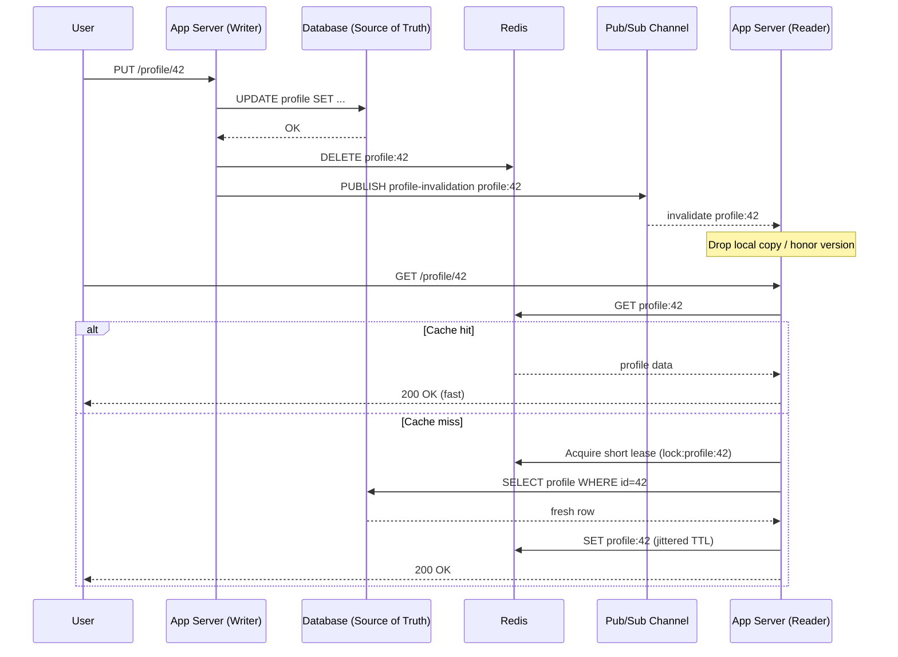

| Difficulty | Channel | Tags |
|---|---|---|
| beginner | backend | redis, memcached, cache-invalidation |

When Facebook's engineering team scaled beyond a billion users, a single line of code sat between a fast page load and a stale profile that could mislead millions [1]. Every write to the database triggered a cache delete, and on paper the logic was perfect — yet subtle races, thundering herds, and cross-region drift threatened to grind the entire social graph to a crawl [1]. This is the story of how the world's largest memcache deployment was tamed, and what its hard-won lessons mean for the profile service you are about to build.

---

> ### Real-World Case — Facebook (Meta)
>
> Facebook's memcache layer cached profile and social-graph data for over a billion users across thousands of web servers and multiple geographic regions. After every database write, web servers deleted the corresponding cache key to invalidate stale profile data — the exact write-through/delete-on-update pattern most engineers implement.
>
> | | |
> |---|---|
> | **Challenge** | The seemingly correct 'update DB, then delete the cache key' approach had a hidden race condition. Concurrent readers could fetch old data before a write was visible and then replay it into the cache *after* the delete happened (a 'stale set'), permanently poisoning profile data. Separately, popular keys that expired triggered 'thundering herds' — thousands of web servers simultaneously hammering the database for the same key, driving peak query rates to 17K/s. |
> | **Solution** | Facebook extended the memcached protocol with 'leases': on a cache miss, memcached returns a 64-bit lease token bound to that key. A client can only write the value back if its token is still valid; any 'delete' invalidates all outstanding tokens, so a stale reader's late write is rejected. Leases also let memcached throttle thundering herds by electing a single client to recompute the value while others wait briefly or serve slightly stale data. For cross-region consistency, they tailed the MySQL commit log to issue invalidations and used 'remote markers' to avoid racing cache deletes against database replication lag. |
> | **Outcome** | Leases cut the peak database query rate on thundering-herd-prone keys from 17K/s to 1.3K/s, and stale sets dropped from 6% of requests to 0.3% without hurting the cache hit rate. The system went on to serve billions of requests per second, hold trillions of items, and support over a billion users. |
> | **Lesson** | The textbook 'delete the key on write' invalidation strategy is not race-free at scale — cache invalidation is genuinely hard because read, write, and delete operations interleave. You often need server-side coordination primitives (leases/tokens) rather than trusting clients, and this is exactly where Redis's pub/sub and single-node atomic operations give it an advantage over Memcached's stateless, client-coordinated model. |

---

## Hook — The Delete That Hides a Race Condition

Picture a profile update firing at 2AM: the database write succeeds, the cache key gets deleted, and everything looks fine. Then, microseconds earlier, a read on another web server had already fetched the old row and is about to repopulate the cache with stale data. Congratulations — your "fresh" profile now has a ghost from the past. This exact pattern, delete-on-update or write-through invalidation, is the one most engineers reach for first, and it is precisely the pattern Facebook deployed across thousands of servers for over a billion users [1].

The stakes are not academic. A stale profile is a wrong avatar, an outdated privacy setting, a phone number that should never have been visible. Multiply that by billions of requests per second and cache invalidation stops being a footnote in your design doc and becomes the difference between a healthy system and a very loud pager. So how do teams actually make this work at scale? That journey starts with understanding why caching is so seductive and so treacherous.

## Problem — Caching Is Easy, Correctness Is Hard

Caching exists to cheat physics: reading from memory is orders of magnitude faster than hitting a database, so you keep hot data close and serve it in microseconds. The catch, as the old joke goes, is that cache invalidation is one of the two hard problems in computer science. You are constantly trading freshness against speed, and every optimization opens a new failure mode [2].

The core challenge for a user profile service is straightforward to state and brutal to solve: when a user updates their profile, how do you guarantee that no server anywhere serves the old version, while still keeping your hit rate high enough that the database does not fall over?

Three failure modes dominate this space:

- **Stale reads** — a cache holds data that the source of truth has already changed, usually because an invalidation message was lost, delayed, or raced.
- **Thundering herds** — a hot key expires and thousands of simultaneous requests all stampede the database at once, creating a self-inflicted denial of service [8].
- **Inconsistency across nodes** — multiple app servers and regions each hold their own copy, so invalidating one does nothing for the others.

If this feels overwhelming, you are not alone. Many developers discover caching the easy way (add a TTL, move on) and then learn the hard way that TTL alone is a bandage, not a strategy. The real question is how the biggest systems in the world confronted this — and that answer lives in a paper Facebook published about its memcache layer.

## Real-World Case — How Facebook Tamed Its Memcache Layer

Facebook's memcache layer cached profile and social-graph data for more than a billion users, spread across thousands of web servers and multiple geographic regions [1]. The invalidation logic was deliberately simple: after every database write, the web server deleted the corresponding cache key. If you have implemented write-through with delete-on-update, you have implemented exactly what Facebook ran in production at colossal scale.

However, simplicity at that scale exposed two nasty problems. First, stale sets kept creeping in — a combination of races and delayed database replication meant readers occasionally repopulated keys with outdated data. Second, hot keys triggered thundering herds: when a popular key was invalidated, a surge of concurrent requests hammered the database at the worst possible moment.

Their fix was elegant. They introduced **leases** — a short-lived token that lets only one client recompute a missing value while others wait briefly and retry — and they routed all writes through a dedicated invalidation pipeline that also cleaned up stale copies. The results were dramatic: leases cut the peak database query rate on thundering-herd-prone keys from roughly **17,000 queries per second down to 1,300**, and stale sets dropped from **6% of requests to 0.3%**, all without hurting the cache hit rate [1]. The system went on to serve billions of requests per second, hold trillions of items, and support over a billion users [1].

The lesson is a plot twist for anyone who thinks a TTL is enough: freshness and protection from stampedes require an explicit coordination mechanism, not just an expiry timer. So how do you choose the right tool to build that mechanism? The answer hinges on a genuine trade-off between Redis and Memcached.

## Deep Dive — Redis vs Memcached, and the Patterns That Bind Them

Building on Facebook's experience, the next decision is which cache engine carries your invalidation logic. Both Redis and Memcached are in-memory key/value stores, but the resemblance ends there [3][4].

| Dimension | Redis | Memcached |
|---|---|---|
| Invalidation | Built-in pub/sub for distributed invalidation [7] | Manual coordination required |
| Data structures | Strings, hashes, sets, sorted sets, streams | Strings only |
| Persistence | Optional RDB/AOF snapshots | None — pure volatile cache |
| Memory overhead | Higher per-key overhead due to features | Lower overhead, very memory-efficient |
| Scaling | Cluster mode with sharding | Simpler, linear horizontal scaling |
| Best fit | Complex invalidation, durability, coordination | Straightforward pure caching at high throughput |

The most important row is invalidation. Redis pub/sub lets one node broadcast an invalidation event and every subscriber drop its local understanding of a key [7]. Memcached has no such channel, so teams must build their own coordination — a message bus, a versioned key scheme, or short TTLs as a safety net. For a profile service that spans multiple servers, that difference is decisive.

💡 **Insight:** Redis is not "better" — it is *differently capable*. If you only need to serve cached blobs as fast as possible and can tolerate short staleness windows, Memcached's leaner memory profile may win on cost [4]. If you need pub/sub, durability, or sophisticated invalidation, Redis earns its keep [3].

Two patterns sit on top of whichever engine you choose. **Cache-aside** (lazy loading) reads miss, fetches from the database, then populates the cache — simple and resilient. **Write-through** writes to the database and then invalidates or updates the cache synchronously, giving stronger consistency at the cost of write latency. Most production profile services combine both: cache-aside on reads, delete-on-update on writes, and a TTL as the final backstop [2].

⚠️ **Watch Out:** The classic delete-then-read race is real. A safer approach is delete-first, then write the database, or use versioned keys so stale writers cannot clobber fresh data. Facebook solved this with leases and a dedicated invalidation pipeline [1] — you can solve it with locks and versions.

With the trade-offs clear, the practical question becomes: what does the full invalidation workflow actually look like, end to end?

## Workflow — From Update to Guaranteed Freshness

This leads to the workflow that ties everything together. Think of it as a relay race where the baton is "truth," and any dropped baton means a stale profile. The diagram below tells that visual story:

The flow is a sequence, and each step matters:

1. **Writer updates the source of truth.** The database is always authoritative — the cache is a mirror, never the original [2].
2. **Writer deletes the cache key.** Deleting rather than overwriting avoids a subtle race where two concurrent writers interleave and an older value wins.
3. **Writer publishes an invalidation event.** In Redis, a pub/sub channel fans this out to every app server [7]. In Memcached, you must replicate this with your own bus or a versioned-key scheme.
4. **Readers consult the cache first.** A hit returns immediately; a miss falls through to the database.
5. **The first miss acquires a short lease or lock.** This is the Facebook-inspired trick: one worker rebuilds the hot value while others wait a few milliseconds and retry, collapsing the thundering herd [1][8].
6. **Rebuilt values get a jittered TTL.** Adding randomness prevents thousands of keys from expiring in lockstep, spreading the rebuild load.
7. **Metrics close the loop.** Track hit rate, stale-set incidents, and rebuild latency so you can prove the strategy works [1].

Notice that this workflow deliberately layers defenses: delete-on-update for correctness, pub/sub for distributed coordination, leases for stampede protection, and TTL jitter for decay. No single mechanism does everything — the strength comes from combining them, exactly as Facebook did. Here is what that looks like in code.

## Code Example — A Production-Shaped Profile Cache

The following Python example implements the full pattern: cache-aside reads, delete-on-update writes, Redis pub/sub invalidation, jittered TTLs, and a short lease to prevent thundering herds. It is illustrative but shaped like real production code.

The explanation after the snippet walks through each decision. The key mental model: the database owns the truth, the cache is disposable, and coordination prevents stampedes.

## Lessons Learned — What to Do Differently Tomorrow

Facebook's journey from stale profiles and database stampedes to trillions of cached items offers lessons that apply to a five-server startup as much as a billion-user platform [1].

- **A TTL is a backstop, not a strategy.** Expiry bounds staleness but does nothing for correctness races or thundering herds. Combine it with explicit invalidation.
- **Delete, do not overwrite, on update.** Overwriting invites interleaving races where an older write wins. Deletion plus a coordinated rebuild is safer [1].
- **Coordinate invalidation across nodes.** Redis pub/sub gives you a broadcast channel for free [7]; Memcached forces you to build coordination yourself, so budget for it.
- **Protect hot keys with leases or locks.** Facebook's leases dropped peak query rates ~13x on vulnerable keys [1]. Even a simple lock collapses a stampede into a single rebuild [8].
- **Always add TTL jitter.** Synchronized expiry is a self-inflicted thundering herd. Randomness spreads the pain.
- **Pick the engine for the job.** Redis for complex invalidation and durability, Memcached for lean, pure caching [3][4].
- **Instrument everything.** You cannot tune hit rate, staleness, or latency without metrics [1].

The memorable insight worth sharing with your team: **freshness and speed are not opposites — they are two independent problems, and the best systems solve each one explicitly.** Cache invalidation only feels impossible when you try to solve both with a single TTL. Layer your defenses, and the 2AM false alarm becomes a non-event.

---

## Cache Invalidation and Rebuild Flow

<strong>Original Interview Question</strong>

**Q:** You're building a user profile service that caches frequently accessed profiles. How would you implement cache invalidation when a user updates their profile, and what trade-offs would you consider between Redis and Memcached?

**A:** Implement write-through caching with TTL-based expiration. On profile update, invalidate the cache by deleting the key and writing new data to both the database and cache. Redis offers pub/sub for automatic distributed invalidation, while Memcached requires manual coordination across nodes.

## Conclusion

Facebook's memcache layer proved that cache invalidation at scale is not about a cleverer TTL — it is about treating freshness and stampede prevention as separate, explicit problems [1]. Start tomorrow by doing three things: switch your writes to delete-on-update with pub/sub broadcast, add a short lease or lock around hot-key rebuilds, and put jitter on every TTL. Then measure stale-set rate and peak database load, because those numbers are how you will know it worked. Freshness and speed were never enemies — they just needed different tools. Do this, and the next 2AM alert will be someone else's story.

---

## References

1. [Facebook (Meta) incident report](https://www.usenix.org/system/files/conference/nsdi13/nsdi13-final170_update.pdf) — article
2. [Cache invalidation — Wikipedia](https://en.wikipedia.org/wiki/Cache_invalidation) — documentation
3. [Redis — Wikipedia](https://en.wikipedia.org/wiki/Redis) — documentation
4. [Memcached — Wikipedia](https://en.wikipedia.org/wiki/Memcached) — documentation
5. [HTTP caching — MDN Web Docs](https://developer.mozilla.org/en-US/docs/Web/HTTP/Caching) — documentation
6. [Caching strategies — Amazon ElastiCache for Redis](https://docs.aws.amazon.com/AmazonElastiCache/latest/red-ug/Strategies.html) — documentation
7. [Redis Pub/Sub documentation](https://redis.io/docs/latest/develop/interact/pubsub/) — documentation
8. [Thundering herd problem — Wikipedia](https://en.wikipedia.org/wiki/Thundering_herd_problem) — documentation

---

**Author:** Satishkumar Dhule — [GitHub](https://github.com/satishkumar-dhule) · [LinkedIn](https://linkedin.com/in/satishkumar-dhule) · [Website](https://satishkumar-dhule.github.io)
