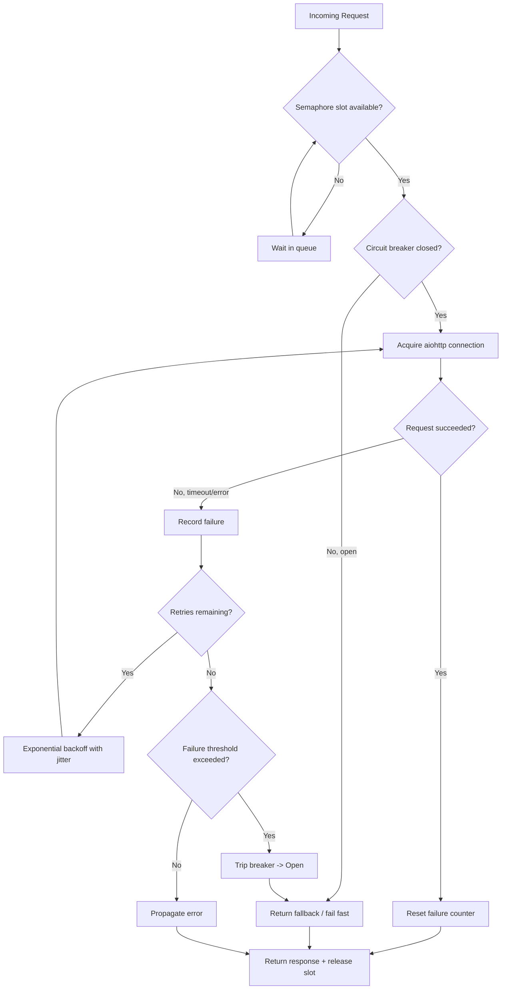

| Difficulty | Channel | Tags |
|---|---|---|
| advanced | backend | asyncio, aiohttp, concurrency |

In 2011, Netflix's API was a monolithic gateway sitting in front of a sprawling service-oriented architecture — and every single member request fanned out to dozens of upstream systems before it could return a page [1]. When a bug forced the API to bypass its shared cache and hit the database directly, database throttling kicked in within seconds, and the failure began to cascade through the entire stack. The saving grace? Circuit breakers tripped automatically, and on one incident 157 of 200 server instances quietly served fallback responses from a local query cache — a 20% error rate on a single circuit while the rest stayed perfectly healthy [1]. That story is the difference between graceful degradation and a full outage, and it is exactly the lesson hiding inside the humble aiohttp connection pool you are about to build.

---

> ### Real-World Case — Netflix
>
> By 2011–2012, the Netflix API was a monolithic gateway in front of a service-oriented architecture, talking to dozens of upstream systems on every request. Because every member request fanned out to many dependencies, a single slow or failing service could block request threads and cascade into a full API outage in seconds or sub-second.
>
> | | |
> |---|---|
> | **Challenge** | A dependent service becoming latent (slow) rather than outright failing would saturate per-dependency thread pools and the Tomcat request pool, while retry loops amplified load on the already-struggling system — a classic cascading-failure and connection-pool-exhaustion problem. |
> | **Solution** | Netflix built Hystrix, wrapping each dependency call with isolated thread pools, non-blocking semaphore acquisition, network timeouts plus retries, and a circuit breaker that tracks errors over a 10-second rolling window. When a dependency crosses the error threshold, the circuit opens and all calls are short-circuited to a fallback (custom, fail-silent, or fail-fast), then a single probe request periodically tests recovery (half-open state). |
> | **Outcome** | During a real incident, a bug forced the API to bypass its shared cache and hit the database directly, which quickly triggered database throttling. The circuit breakers automatically tripped — on one incident 157 of 200 server instances served fallback responses from a local query cache — and the dashboard showed a 20% error rate on a single circuit while the others stayed healthy. Overall impact on video views was minimal, and the API continued serving traffic at ~20,000 requests/sec peak (roughly 1,000,000+ upstream calls per 10-second window). |
> | **Lesson** | The counterintuitive insight from Netflix: when a dependency is struggling, do NOT give it more resources. Adding thread pools, queues, and timeouts during an incident only DDOSes yourself harder. Shed load, short-circuit, and fail fast via a circuit breaker so the downstream system gets breathing room to recover — exactly the graceful-degradation behavior a production aiohttp pool manager needs. |

---

## Hook — When Your Pool Becomes a Domino Line

Picture this: traffic spikes, and your aiohttp client is happily opening connections to a downstream service that just got slow. Nothing is crashing yet. The event loop is busy, memory is climbing, and every new request adds another waiting coroutine to a queue nobody is watching. Then the downstream service times out — and instead of shedding load, your pool keeps piling on retries. Within seconds, the slowness of one dependency has metastasized into the slowness of your entire application. Sound familiar? Many developers assume that because asyncio is non-blocking, they cannot be overwhelmed. They are wrong. Non-blocking I/O does not mean unlimited concurrency — it means you now own the responsibility of deciding how much concurrency is safe. The stakes are brutal: a single unmanaged connection pool can take down a healthy service, and the recovery cost is measured in pager alerts and lost trust.

## Problem — Unlimited Concurrency Is a Loaded Gun

Here is the core tension. A connection pool must do four things at once, and they fight each other. It must limit concurrent connections so downstream services are not crushed. It must retry transient failures so you survive blips. It must fail fast when a dependency is genuinely down so you do not waste resources. And it must degrade gracefully — serving something useful — rather than propagating errors all the way to the user. When you get this wrong, the failure mode is not a clean crash; it is a slow, cascading degradation. A slow upstream service holds connections open, the pool saturates, incoming requests queue, memory grows, the event loop spends more time scheduling than working, and eventually healthy requests that never touched the broken service start timing out too. This is a cascade failure, and it is the single most common way backend systems die under load. The key insight is that concurrency limits, retries, and circuit breakers are not independent features — they are interlocking controls that must be designed together.

## Real-World Case — Netflix's Graceful Degradation

By 2011–2012, the Netflix API was a monolithic gateway in front of a service-oriented architecture, talking to dozens of upstream systems on every request [1]. Because every member request fanned out to many dependencies, a single slow or failing service could block request threads and cascade into a full API outage in seconds or sub-second. During a real incident, a bug forced the API to bypass its shared cache and hit the database directly, which quickly triggered database throttling. The circuit breakers automatically tripped — on one incident 157 of 200 server instances served fallback responses from a local query cache — and the dashboard showed a 20% error rate on a single circuit while the others stayed healthy. Overall impact on video views was minimal, and the API continued serving traffic at roughly 20,000 requests per second at peak, which translates to over 1,000,000 upstream calls per 10-second window [1]. This is the pattern in action: isolate failure, fall back locally, and keep the healthy majority of traffic flowing. Netflix later formalized this into Hystrix, and the mental model maps directly onto the pool you are about to write.

## Deep Dive — Semaphores, Backoff, and the Circuit Breaker

The solution has three cooperating mechanisms, and understanding why each exists is what separates a toy pool from a production one. First, a semaphore enforces a hard cap on concurrent connections — it is the bouncer at the door, not a suggestion [2]. When slots run out, coroutines wait, which applies backpressure upstream instead of letting the pool expand without bound. Second, exponential backoff with jitter spreads retries out over time, so a recovering service is not immediately hammered by a synchronized thundering herd [3]. Jitter matters because without it, all your retries fire in lockstep. Third, a circuit breaker tracks recent failures and, once a threshold is crossed, stops sending traffic to a known-bad dependency for a cooldown window [4]. This converts a slow, thread-blocking timeout into an instant fail-fast, freeing capacity. Here is the trade-off table developers should internalize before choosing defaults.\n\nControls Comparison\n\nLimit concurrency (semaphore): prevents overload, but too low a limit throttles your own throughput.\nRetry with backoff: improves resilience to blips, but amplifies load if unbounded.\nCircuit breaker: fails fast and sheds load, but adds state and must be tuned per dependency.\nHealth checks and pruning: removes dead connections, but costs periodic probes.\n\nThe subtlety: these compose in order. You acquire a semaphore slot first, then consult the breaker, then attempt the request, then record the outcome. Getting the order wrong — for example, retrying without a breaker — is how you turn a small outage into a self-inflicted DDoS against a struggling dependency.

## Workflow — The Request Journey Through the Pool

Tracing a single request reveals the whole system. An incoming call first tries to acquire a semaphore slot; if none are free, it waits rather than opening a new connection. Once admitted, it checks the circuit breaker state for that dependency. If the circuit is open, the request fails fast or returns a cached fallback instead of touching the network. Otherwise, a connection is pulled from the aiohttp session and the request fires under a strict total timeout. On success, the failure counter resets. On timeout or client error, the failure is recorded and, if retries remain, the coroutine sleeps for an exponentially growing, jittered delay before trying again. When the failure count crosses the threshold within the observation window, the breaker trips open and subsequent requests short-circuit until the cooldown elapses, at which point a single probe decides whether to close it again. The diagram below visualizes this loop end to end — notice that every path eventually releases its semaphore slot, which is the discipline that prevents connection leaks under load.

## Code Example — A Production-Grade aiohttp Pool

The implementation below combines the semaphore, circuit breaker, and retry logic into a single request path. Read it top to bottom, then run it against a deliberately slow endpoint to watch the breaker trip.\n\nKey design decisions: the session is created once and reused so TCP keepalive actually pays off; the timeout is a ClientTimeout on the whole operation; the breaker uses a rolling failure count with a cooldown timestamp; and every acquisition is wrapped in try/finally so a slot can never leak. The retry loop uses full jitter — random between zero and the capped exponential value — which is the pattern AWS recommends for retries against distributed systems [3].

## Lessons Learned — Design for the Degraded Path

The biggest lesson from Netflix's incident is that the fallback path is not an afterthought — it is the product. Serving a slightly stale cached response at a 20% error rate on one circuit beat serving nothing at all, and it kept the platform healthy for the 80% of requests that never touched the broken dependency [1]. For your own systems, that means deciding up front what 'degraded' looks like: a cached value, a default, or an explicit partial failure. Beyond that, here are the battle scars worth remembering. Never open a new session per request — connection setup will dominate your latency. Always set a total timeout, because relying on the default can leave coroutines hanging indefinitely. Never retry without a circuit breaker, or a struggling dependency gets buried. Always release semaphore slots in a finally block, or a single exception leaks capacity forever. And remember that a pool tuned to a single service is a guess, not a guarantee — instrument queue depth, wait time, failure rate, and trip count, then tune from metrics rather than intuition [5]. The pool is not a limiter you bolt on; it is the control surface that keeps one bad dependency from writing checks your whole application has to cash.

---

## Request Lifecycle Through the Pool

<strong>Original Interview Question</strong>

**Q:** How would you implement a connection pool manager for aiohttp that handles graceful degradation under high load and connection timeouts?

**A:** Implement a connection pool manager for aiohttp using a semaphore to limit concurrent connections, exponential backoff for retrying failed requests, and circuit breaker pattern to gracefully degrade under high load and connection timeouts.

## Conclusion

The moral of Netflix's story is not that circuit breakers are magic — it is that losing one dependency gracefully beats losing your whole platform. A connection pool that limits concurrency, retries with jitter, and trips a breaker is how you decide, in advance, what happens when something downstream inevitably breaks. Tomorrow, audit your client: is there a hard cap on concurrent connections, a total timeout set, and a fallback ready when a dependency goes dark? If any answer is 'not really,' you are one slow upstream service away from a domino line. The one insight to share with your team: non-blocking I/O does not protect you from overload — it hands you the controls, and if you do not set them, the load sets them for you.

---

## References

1. [Netflix incident report](https://github.com/Netflix/Hystrix/wiki/Operations) — article
2. [Python asyncio synchronization primitives (Semaphore)](https://docs.python.org/3/library/asyncio-sync.html) — documentation
3. [AWS: Exponential Backoff and Jitter](https://docs.aws.amazon.com/general/latest/gr/api-retries.html) — documentation
4. [Circuit breaker design pattern](https://en.wikipedia.org/wiki/Circuit_breaker_design_pattern) — documentation
5. [Connection pool](https://en.wikipedia.org/wiki/Connection_pool) — documentation
6. [aiohttp asynchronous HTTP client/server framework](https://github.com/aio-libs/aiohttp) — documentation
7. [Python asyncio: Coroutines and Tasks](https://docs.python.org/3/library/asyncio-task.html) — documentation
8. [Exponential backoff](https://en.wikipedia.org/wiki/Exponential_backoff) — documentation
9. [MDN: async function](https://developer.mozilla.org/en-US/docs/Web/JavaScript/Reference/Statements/async_function) — documentation

---

**Author:** Satishkumar Dhule — [GitHub](https://github.com/satishkumar-dhule) · [LinkedIn](https://linkedin.com/in/satishkumar-dhule) · [Website](https://satishkumar-dhule.github.io)
