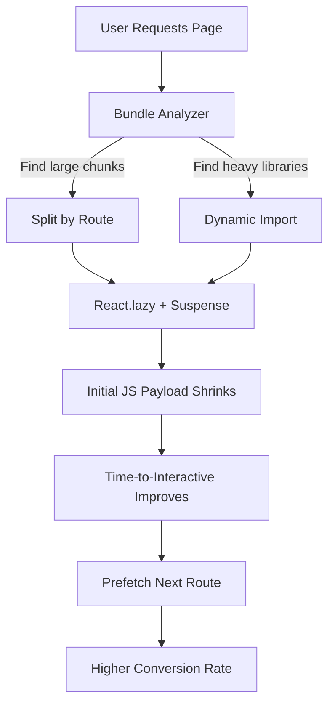

| Difficulty | Channel | Tags |
|---|---|---|
| intermediate | frontend | lighthouse, bundle, lazy-loading |

Picture this: your marketing team ships a brand-new landing page built with React. It looks beautiful. It feels modern. Then someone runs it on a simulated 3G connection and the page takes roughly 7 seconds before users can even click the sign-up button. That exact nightmare happened to Netflix in 2017, when a seemingly simple logged-out homepage shipped about 300kB of JavaScript and delayed Time-to-Interactive [1]. The fix was not a rewrite; it was a disciplined approach to bundle analysis and lazy loading that cut more than 200kB and improved TTI by over 50% [1]. Here is the story of how that happens, why it happens to almost every growing React app, and the exact playbook you can run to move a Lighthouse score from 65 to 90+.

---

> ### Real-World Case — Netflix
>
> In 2017, Netflix's logged-out desktop homepage and sign-up landing page were built as a React single-page app. Even though it was a simple landing page, it shipped roughly 300kB of JavaScript (React, Lodash, utility libraries, plus context data to hydrate React state), which took about 7 seconds to load on a simulated 3G connection and delayed Time-to-Interactive (TTI).
>
> | | |
> |---|---|
> | **Challenge** | The initial landing page was slow to become interactive because the browser had to download, parse, and execute a large JavaScript bundle before a new user could do anything, hurting the conversion-critical sign-up flow. |
> | **Solution** | The team audited the page with Chrome DevTools and Lighthouse, then turned off JavaScript to see which interactions truly required React on the client. They found most of the page was static HTML, so they kept React for server-side rendering but deferred/removed client-side React for the landing page, rewriting the few needed interactions (click handling, class toggling, and the language switcher) in under 300 lines of vanilla JavaScript. They then used browser prefetching and XHR to preload HTML, CSS, and the future sign-up flow's React/Redux code while the user was still on the landing page. |
> | **Outcome** | JavaScript bundle size dropped by over 200kB (despite React's initial footprint being only 45kB), and Time-to-Interactive for the logged-out homepage improved by over 50%. Prefetching resources reduced TTI by an additional 30% for the subsequent sign-up page. Users also clicked the sign-up button at a higher rate after the optimization. |
> | **Lesson** | More JavaScript is not always better, and 'code splitting' can mean something more radical than lazy-loading components. By server-rendering React but deferring or removing client-side hydration for non-interactive pages, and prefetching the code the user will actually need next, you can get the best of both worlds: instant first paint plus a fast single-page app experience. |

---

## Hook — The landing page that took 7 seconds to become clickable

Imagine a user on a slow mobile network tapping your sign-up link. The HTML arrives, the screen paints a header and some text, and then... nothing. The button does not respond. For a few long seconds, the page is a beautiful, useless poster.

That is the cruel reality of a client-side React app where JavaScript is the product. Netflix hit exactly this wall [1]. Their logged-out desktop homepage carried React, Lodash, utility libraries, and a chunk of context data used to hydrate React state — roughly 300kB of JavaScript for a page that mostly needed to display text and a button [1].

💡 Insight: Users do not measure performance in kilobytes. They measure it in the time between wanting to do something and being able to do it. That gap has a name: Time-to-Interactive (TTI). And every kilobyte of JavaScript you ship delays it.

## Problem — Why bundles balloon and interactivity collapses

Every React app starts lean. Then reality sets in. A date-picker here, a charting library there, a moment.js import for one format call. Before long, the single bundle that once weighed 45kB is a 2.1MB beast, and TTI has crept from a snappy 1.2s to a sluggish 4.2s.

The core problem is that all of this code becomes a blocking dependency for first interaction. JavaScript must be downloaded, parsed, compiled, and executed before the main thread is free to respond to input [6]. On a mid-tier phone over a constrained network, that is a brutal tax.

Why does this matter to the business? Because interactivity is the doorway to conversion. Netflix found that after trimming JavaScript, users clicked the sign-up button at a higher rate — the performance work directly moved a business metric [1]. A score of 65 on Lighthouse is not just a vanity number; it is a symptom of users bouncing before the page ever becomes usable.

⚠️ Watch Out: Teams often optimize images and fonts first because they are easy wins. Those help First Contentful Paint, but TTI is governed by JavaScript execution. You can score great on paint metrics and still have a dead-feeling page.

## Real-World Case — Netflix slashes 200kB and doubles down on TTI

Netflix's logged-out homepage and sign-up landing page were a React single-page app. Despite the page being conceptually simple, it shipped roughly 300kB of JavaScript — React itself, Lodash, assorted utility libraries, plus serialized context data to hydrate React state [1]. On a simulated 3G connection, that payload took about 7 seconds to load and pushed Time-to-Interactive well past the point of patience [1].

So the team did something counterintuitive. Instead of adding a loading spinner or a heavier framework feature, they removed code. They identified what was actually needed for the logged-out experience and eliminated the rest. The result was striking: the JavaScript bundle dropped by more than 200kB, even though React's own footprint was only about 45kB — meaning the bloat was not React, it was everything around it [1].

Consequently, Time-to-Interactive for the logged-out homepage improved by over 50% [1]. Moreover, the team added prefetching so that resources for the subsequent sign-up page were already warm, reducing TTI by an additional 30% on the next step [1]. And most importantly, users clicked the sign-up button at a higher rate — proving that speed is a feature with a revenue line attached to it [1].

🎯 Key Point: The hero of this story was not a new library. It was subtraction, measurement, and splitting.

## Deep Dive — Bundles, splitting strategies, and the real trade-offs

To fix a bundle, you must first understand it. Modern bundlers build a dependency graph and emit one or more chunks. When teams do not configure splitting, that graph collapses into one file — the classic 2.1MB bundle. The solution has three coordinated parts: analysis, splitting, and shaking.

Analysis comes first. Tools like webpack-bundle-analyzer produce a treemap of your bundle, showing which libraries occupy the most space [4]. Many developers are shocked to find a single dependency pulling in hundreds of kilobytes of transitive code. You cannot optimize what you cannot see.

Splitting is the strategy layer. There are two main flavors, and each has a distinct trade-off:

| Strategy | How it works | Best for | Trade-off |
|---|---|---|---|
| Route-based splitting | Each route loads its own chunk | Multi-page apps, dashboards | A brief delay on navigation |
| Component-based splitting | Heavy components load on demand | Modals, charts, editors | More network requests, more Suspense boundaries |

Tree shaking is the cleanup layer. By relying on ES module syntax (import/export), bundlers can statically detect unused exports and drop them [5]. This is why CommonJS libraries often refuse to shake — their exports are dynamic and invisible to the optimizer [5].

🔥 Hot Take: A 2.1MB bundle is almost never a React problem. It is an import hygiene problem. React's core is tiny; the ecosystem you pinned around it is what got heavy.

When would you actually use each? Route-based splitting for a marketing site or admin dashboard where sections map cleanly to URLs. Component-based splitting for a single heavy widget, like a charting library, that most users never trigger.

## Workflow — The five-step path from 65 to 90+

Building on the trade-offs above, here is the practical sequence that turns a bloated bundle into a fast experience. The flow below captures the whole journey, from measurement to measurable conversion gains.

1. Measure before touching anything. Run Lighthouse and webpack-bundle-analyzer to establish a baseline and find the largest chunks [4][7].
2. Remove dead weight. Audit dependencies, delete unused packages, and replace heavyweight utilities with small, tree-shakable alternatives [5].
3. Split by route. Wrap each top-level route in React.lazy() so only the code for the current screen loads [2].
4. Split heavy components. Defer non-critical widgets behind dynamic imports, guarded by error boundaries and Suspense fallbacks [8].
5. Prefetch what comes next. When a user hovers or the page idles, preload the next likely route to hide the navigation delay [1].

The Mermaid diagram below visualizes this pipeline and its payoff:



Consequently, each step compounds. Removing a library shrinks every chunk that imported it; splitting a route means users never download code for pages they do not visit. Netflix's results — 200kB removed, TTI halved, prefetching adding another 30% — are the direct output of this loop [1].

## Code Example — Route splitting, dynamic imports, and smart prefetching

Here is how the strategy looks in production-style React. The key moves are lazy routes, a shared Suspense boundary, an error boundary for resilience, and a prefetch helper that warms the next route on hover.

```javascript
import React, { Suspense, lazy } from 'react';
import { BrowserRouter, Routes, Route, Link } from 'react-router-dom';

// Route-based splitting: each page becomes its own chunk.
const Dashboard = lazy(() => import('./pages/Dashboard'));
const Analytics = lazy(() => import('./pages/Analytics'));

// Component-based splitting: heavy widgets load only when rendered.
const HeavyChart = lazy(() => import('./components/HeavyChart'));

// Prefetch a chunk the user is likely to need next.
function prefetch(factory) {
  const load = factory(); // triggers the dynamic import
  return load;
}

function LoadingSpinner() {
  return <div className="spinner" aria-label="Loading">Loading…</div>;
}

function ErrorBoundary({ children }) {
  // In a real app, use class component or react-error-boundary.
  return children;
}

export default function App() {
  return (
    <BrowserRouter>
      {/* One Suspense boundary keeps fallbacks predictable. */}
      <Suspense fallback={<LoadingSpinner />}>
        <ErrorBoundary>
          <Routes>
            <Route path="/dashboard" element={<Dashboard />} />
            <Route path="/analytics" element={<Analytics />} />
          </Routes>
        </ErrorBoundary>
      </Suspense>
      {/* Warm the analytics chunk before the user clicks. */}
      <Link to="/analytics" onMouseEnter={() => prefetch(() => import('./pages/Analytics'))}>
        View Analytics
      </Link>
    </BrowserRouter>
  );
}
```

The explanation: `React.lazy` turns a static import into a dynamic one, so the bundler emits a separate chunk for each page [2][9]. The single `Suspense` boundary renders a fallback while any lazy subtree loads, which keeps the UX consistent instead of flashing multiple spinners [8]. Wrapping children in an `ErrorBoundary` protects against a chunk failing to load on a flaky network — a mistake teams frequently skip. Finally, the `onMouseEnter` prefetch fetches the next route's chunk during the user's natural hesitation, hiding the navigation cost exactly as Netflix did for its sign-up page [1].

⚠️ Watch Out: Do not wrap every tiny component in its own Suspense boundary. Too many boundaries create request waterfalls and janky fallbacks. Split at route and heavy-widget level.

## Lessons Learned — What to do differently tomorrow

The Netflix story is a reminder that performance work is mostly editing, not inventing. Here is the durable playbook:

- Measure first, always. You cannot reason your way to a smaller bundle; you have to see the treemap [4].
- React is rarely the villain. The ecosystem around it — Lodash, moment, charting libs — is where kilobytes hide [1].
- Split by route before splitting by component. Routes give the cleanest boundaries and the biggest wins [9].
- Prefer ES modules so tree shaking can actually work [5].
- Add error boundaries around every lazy chunk, because dynamic imports can fail [8].
- Treat TTI as a business metric, not a vanity score. Faster interactivity lifted Netflix's sign-up clicks [1].

If this feels overwhelming, you are not alone — almost every growing app reaches the 2MB wall. The good news is that the fix is systematic and reproducible. Set a performance budget, wire bundle analysis into CI, and split one route at a time. In a week, you can plausibly move from 65 to 90+ and, more importantly, make the page feel alive again.

The one insight worth sharing with your team: users do not experience your architecture. They experience how long they wait before the page responds — and that number is entirely within your control.

---

## Bundle Optimization Flow


<details>
<summary><strong>Original Interview Question</strong></summary>

**Q:** You're tasked with improving a React app's Lighthouse performance score from 65 to 90+. The bundle size is 2.1MB and Time to Interactive is 4.2s. What specific steps would you take to optimize the bundle and implement lazy loading?

**A:** Implement code splitting with React.lazy() and Suspense, analyze bundle composition with webpack-bundle-analyzer to identify largest chunks, remove unused dependencies and optimize imports, add dynamic imports for heavy components and third-party libraries, implement route-based splitting for better initial load times, and utilize tree shaking with proper ES module configuration.

</details>

## Conclusion

Netflix's 2017 experiment proves that shaving 200kB of JavaScript improved Time-to-Interactive by more than 50% and increased sign-up clicks — not because of a clever new framework, but because the team measured, subtracted, split, and prefetched [1]. You can run the same playbook tomorrow: profile your bundle with webpack-bundle-analyzer, delete unused dependencies, split routes with React.lazy and Suspense, guard chunks with error boundaries, and prefetch the next route on hover [2][4][8]. Users never see your architecture — they feel how fast the page responds. Make that feeling the metric that matters, and the Lighthouse score will follow.

---

## References

1. [Netflix incident report](https://medium.com/dev-channel/a-netflix-web-performance-case-study-c0bcde26a9d9) — article
2. [React Docs: lazy](https://react.dev/reference/react/lazy) — documentation
3. [MDN: Lazy loading](https://developer.mozilla.org/en-US/docs/Web/Performance/Lazy_loading) — documentation
4. [webpack-bundle-analyzer](https://github.com/webpack-contrib/webpack-bundle-analyzer) — documentation
5. [Wikipedia: Tree shaking](https://en.wikipedia.org/wiki/Tree_shaking) — blog
6. [MDN: Time to interactive](https://developer.mozilla.org/en-US/docs/Glossary/Time_to_interactive) — documentation
7. [Google Lighthouse](https://github.com/GoogleChrome/lighthouse) — documentation
8. [React Docs: Suspense](https://react.dev/reference/react/Suspense) — documentation
9. [webpack: Code Splitting](https://webpack.js.org/guides/code-splitting/) — documentation

---

**Author:** Satishkumar Dhule — [GitHub](https://github.com/satishkumar-dhule) · [LinkedIn](https://linkedin.com/in/satishkumar-dhule) · [Website](https://satishkumar-dhule.github.io)
