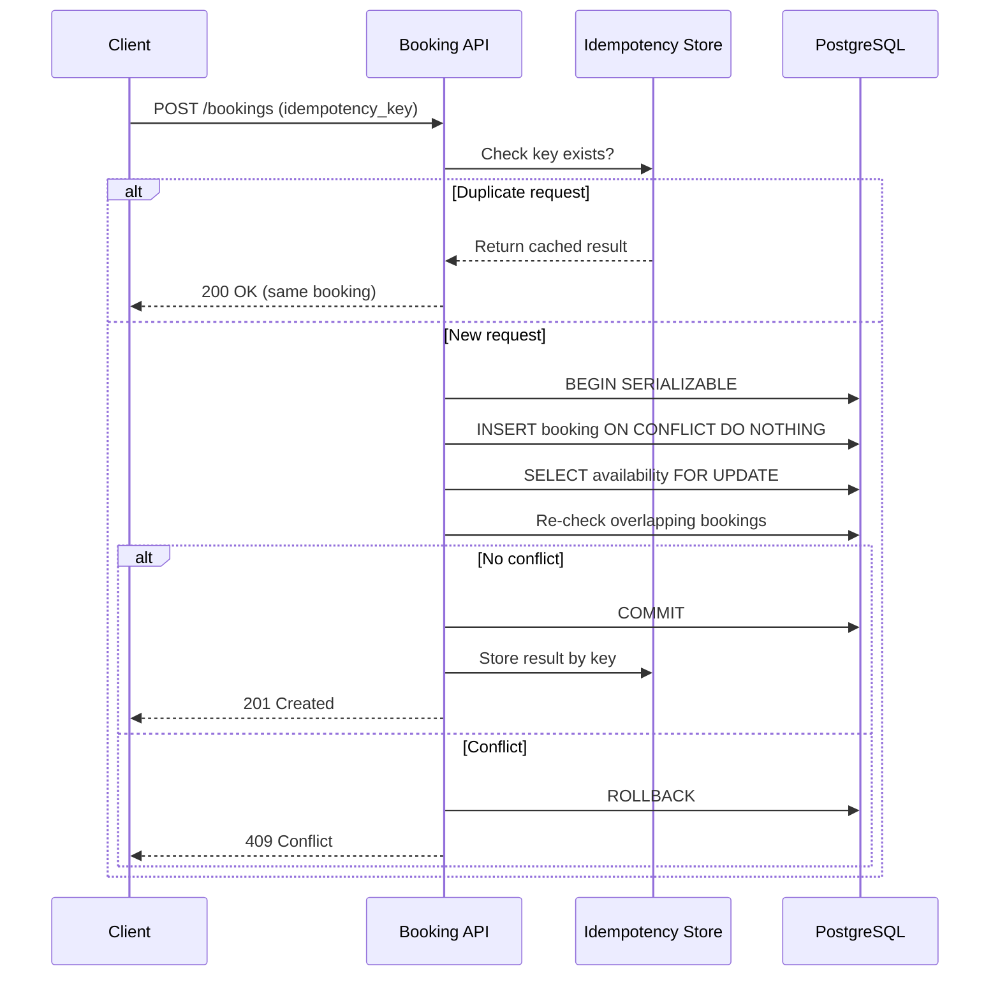

| Difficulty | Channel | Tags |
|---|---|---|
| intermediate | database | acid, isolation-levels, mvcc |

Picture two guests tapping "Confirm Reservation" on the same beach house at the exact same millisecond. Both see a success screen. Both get charged. Only one gets the keys. This is the double-booking nightmare that haunts every reservation platform, and it nearly derailed one of the biggest booking systems on the planet. Airbnb discovered that identical requests routinely arrive from double-clicks, aggressive client retries, and dropped network responses — and processing the same logical request twice meant charging a guest twice for a single reservation [1]. The fix wasn't a bigger server or a faster database. It was a fundamental rethink of how transactions, isolation, and idempotency work together.

---

> ### Real-World Case — Airbnb
>
> Airbnb's payment services run as distributed microservices, and identical requests routinely occur from users double-clicking, aggressive client retries, and network failures that drop responses. In a payment/booking flow, processing the same logical request twice means charging a guest twice for a single reservation.
>
> | | |
> |---|---|
> | **Challenge** | Distributed services can't rely on clients retrying safely: retries plus race conditions meant the same logical operation (e.g., a charge or refund) could execute more than once, violating the atomic, exactly-once behavior that ACID transactions guarantee on a single database but not across microservices. Reads from lagging replicas (MVCC snapshot staleness) made it worse by showing stale operation state. |
> | **Solution** | Airbnb built 'Orpheus', a general-purpose idempotency framework used across multiple payments services. Each incoming request gets a unique, deterministic idempotency key (e.g., 'payment-1234-refund'); the framework tracks the request's lifecycle state and uses write-repair to reconcile outcomes. Crucially, idempotency records are stored and read from a strongly consistent master MySQL database rather than read replicas, because using eventually-consistent replicas would itself reintroduce duplicate operations. |
> | **Outcome** | Orpheus was adopted across Airbnb's payment microservices to make retries safe and achieve eventual consistency and correctness. Airbnb subsequently reported five 9s (99.999%) consistency for payments, and the idempotency framework became the foundation of its redesigned payment orchestration system, also converting Kafka's at-least-once delivery into exactly-once processing. |
> | **Lesson** | The subtle trap is that 'prevent duplicates' can't be bolted on with an application-level check-then-act, and you can't use stale replica reads to enforce it — the idempotency/consistency state must be read from a strongly consistent master and enforced atomically at the database layer. The very cache/replica strategy that buys high availability is what reintroduces double operations if applied to the wrong read path. |

---

## Hook — Two Guests, One Cabin, Zero Vacancies

It always starts the same way. A popular property goes live for a holiday weekend, thousands of users hit refresh, and the booking endpoint gets hammered. Somewhere in that thundering herd, two requests for the same dates slip through simultaneously. Your availability check says "open" to both, your insert fires twice, and now you have a confirmed reservation with no place to sleep. The support tickets roll in, refunds pile up, and trust evaporates. Here is the uncomfortable truth: the race condition you are fighting isn't rare, it is guaranteed under load. The moment concurrency meets shared state without proper isolation, correctness collapses. Airbnb learned this the hard way at planetary scale, and the lessons from their payment and booking systems map directly onto your own architecture — whether you run a homestay marketplace, a concert ticketing service, or a humble internal tool that assigns shared resources.

## Problem — When "Available" Is a Lie

The core challenge is deceptively simple: prevent two transactions from claiming the same resource while keeping the system fast and highly available. The trap is that most developers reach for the intuitive fix — "just check availability, then insert" — which is exactly the pattern that fails. That check-then-act sequence is a classic time-of-check-to-time-of-use (TOCTOU) bug [2]. Between reading the availability row and writing the booking, another transaction can commit, and your read is instantly stale.

Why does this matter so much in booking systems specifically? Because bookings are stateful, long-lived, and financially binding. Unlike a cache miss, you cannot shrug off a double booking — you have taken money and made a promise. The stakes are threefold:

- **Money**: Duplicate charges require refunds, chargebacks, and sometimes legal exposure.
- **Trust**: A guest who arrives to a double-booked property never returns, and they tell everyone.
- **Availability**: Naive locking schemes serialize every request, turning a high-throughput system into a queue.

The real problem is a tension between two competing goals: strong consistency (never double-book) and high availability (never make users wait). Getting one is easy. Getting both is the art.

## Real-World Case — Airbnb's Distributed Payments

Airbnb's payment services run as distributed microservices, and identical requests routinely occur from users double-clicking, aggressive client retries, and network failures that drop responses. In a payment or booking flow, processing the same logical request twice means charging a guest twice for a single reservation [1]. This is not a hypothetical edge case — it is the steady-state behavior of any system exposed to flaky networks and impatient humans.

To solve it, Airbnb built and adopted an idempotency framework internally known as Orpheus across its payment microservices. The goal was to make retries inherently safe, so that resubmitting the same request could never produce a duplicate charge. The results were striking: Airbnb reported five nines — 99.999% — of consistency for payments, and the idempotency framework became the foundation of a redesigned payment orchestration system [1]. Perhaps the most elegant outcome was converting Kafka's at-least-once delivery semantics into effectively exactly-once processing at the application layer.

The lesson is profound: you cannot rely on the network to deliver exactly once, and you cannot rely on the client to behave. You must design for duplicates and make repetition harmless.

## Deep Dive — Isolation Levels, Locks, and MVCC

To understand the fix, you need to understand what the database is actually doing under the hood. Transaction isolation is a spectrum, and the level you choose determines which anomalies are possible [3].

| Isolation Level | Dirty Read | Non-Repeatable Read | Phantom Read | Typical Use |
|---|---|---|---|---|
| READ UNCOMMITTED | Possible | Possible | Possible | Rarely useful |
| READ COMMITTED | Prevented | Possible | Possible | PostgreSQL default |
| REPEATABLE READ | Prevented | Prevented | Possible (prevented in PG) | Analytical reads |
| SERIALIZABLE | Prevented | Prevented | Prevented | Financial/bookings |

The strongest level, SERIALIZABLE, guarantees that concurrent transactions produce the same result as if they had run one after another [4]. But here is the plot twist many developers miss: SERIALIZABLE in PostgreSQL does not lock rows aggressively. It uses a technique called Serializable Snapshot Isolation (SSI), which detects conflicts at commit time and aborts one transaction with a serialization failure [3]. Your application must be prepared to retry.

Meanwhile, MVCC (Multiversion Concurrency Control) is the engine that makes high-read-concurrency possible [5]. Instead of blocking readers when writers modify data, MVCC keeps multiple versions of each row, so a reader sees a consistent snapshot without waiting. This is why availability checks can run against read replicas cheaply. The catch: MVCC snapshots are point-in-time views, and a snapshot that says "available" can be outdated by the time you write.

💡 Insight: Strong consistency and high read availability are not enemies if you separate the paths — snapshot reads for checking, row-level locks for committing.

⚠️ Watch Out: Jumping straight to SERIALIZABLE everywhere is a performance landmine. Use it surgically on the critical booking transaction, and let ordinary reads stay at READ COMMITTED.

## Workflow — The Two-Phase Booking Protocol

The resilient pattern combines several ideas: optimistic concurrency control, row-level locks, and idempotency keys. Here is how the pieces fit together into a workflow that never double-books and rarely blocks.

The flow proceeds in these steps:

1. **Receive the request with an idempotency key.** The client generates a unique key per logical booking attempt and reuses it on retries [6].
2. **Attempt an idempotent insert.** Write the booking row guarded by a unique constraint on the idempotency key. If a duplicate arrives, the write is silently ignored and the original result is returned.
3. **Lock the availability range.** Inside the transaction, acquire row-level locks on the specific date rows for that property using SELECT ... FOR UPDATE [7]. This serializes only the competing bookings for that property, not the entire table.
4. **Re-validate availability under the lock.** Now that concurrent writers are blocked, re-run the overlap check against committed bookings.
5. **Confirm or abort.** If no overlap exists, confirm the booking and invalidate cached availability. If a conflict is detected, roll back.
6. **Retry on serialization failure.** If the database aborts with a serialization error, retry with exponential backoff and jitter until success or a bounded limit.

The sequence diagram below traces the interaction between the client, the booking API, the idempotency store, and the database.



🎯 Key Point: The idempotency key handles duplicate deliveries, while the row lock handles genuinely distinct concurrent bookings. You need both — they solve different failure modes.

## Code Example — A Production-Grade Booking Transaction

The following Python example wires together idempotency, row-level locking, overlap re-validation, and retry-with-backoff against PostgreSQL. It is deliberately close to real production shape rather than a toy.

```python
import time
import random
import psycopg2
from psycopg2 import errors

# Step 1: Idempotent insert. The unique constraint on idempotency_key
# guarantees that retried requests never create a second booking row.
INSERT_BOOKING = """
INSERT INTO bookings (idempotency_key, property_id, guest_id, start_date, end_date, status)
VALUES (%(key)s, %(property)s, %(guest)s, %(start)s, %(end)s, 'PENDING')
ON CONFLICT (idempotency_key) DO NOTHING
RETURNING id;
"""

# Step 2: Lock the specific availability rows for this property and date range.
# FOR UPDATE blocks other writers on these rows without blocking unrelated properties.
LOCK_RANGE = """
SELECT 1 FROM availability
WHERE property_id = %(property)s AND day BETWEEN %(start)s AND %(end)s
FOR UPDATE;
"""

# Step 3: Re-check for overlaps now that we hold the lock. MVCC snapshots can
# be stale, so this read happens *after* locking for a truthful verdict.
CHECK_OVERLAP = """
SELECT COUNT(*) AS conflicts FROM bookings
WHERE property_id = %(property)s
  AND status IN ('PENDING', 'CONFIRMED')
  AND start_date <= %(end)s AND end_date >= %(start)s;
"""

# Mark the booking confirmed only once the range is proven free.
CONFIRM = "UPDATE bookings SET status = 'CONFIRMED' WHERE id = %(id)s;"

def create_booking(conn, key, property_id, guest_id, start, end, max_retries=5):
    params = dict(key=key, property=property_id, guest=guest_id, start=start, end=end)
    delay = 0.05  # start small; grow with jitter to avoid retry storms

    for attempt in range(max_retries):
        try:
            with conn:  # auto-commit on success, rollback on exception
                with conn.cursor() as cur:
                    # Use SERIALIZABLE so phantom overlaps cannot slip through.
                    cur.execute("SET TRANSACTION ISOLATION LEVEL SERIALIZABLE;")

                    # Idempotency guard: if the key already exists, DO NOTHING
                    # and fall through to fetch the existing booking id.
                    cur.execute(INSERT_BOOKING, params)
                    row = cur.fetchone()
                    if row is None:
                        # Duplicate request: return the already-created booking.
                        cur.execute(
                            "SELECT id FROM bookings WHERE idempotency_key = %(key)s;",
                            params,
                        )
                        return cur.fetchone()[0]
                    booking_id = row[0]

                    # Acquire row locks on the date range for this property only.
                    cur.execute(LOCK_RANGE, params)

                    # Now safely re-validate that nothing overlaps this range.
                    cur.execute(CHECK_OVERLAP, params)
                    if cur.fetchone()[0] > 0:
                        raise ValueError("DATES_UNAVAILABLE")

                    # Lock held and range free -> promote to CONFIRMED.
                    cur.execute(CONFIRM, dict(id=booking_id))
                    return booking_id

        except (errors.SerializationFailure, errors.DeadlockDetected):
            # Transient conflict: back off with jitter and try again.
            time.sleep(delay + random.uniform(0, delay))
            delay = min(delay * 2, 2.0)
        except ValueError:
            # Genuine business conflict: do not retry, surface to caller.
            raise

    raise RuntimeError("Booking failed after retries due to lock contention")
```

Walking through it: the INSERT ... ON CONFLICT DO NOTHING turn duplicate deliveries into a no-op, which is precisely how Airbnb's Orpheus framework makes retries safe [1][6]. The SET TRANSACTION ISOLATION LEVEL SERIALIZABLE clause ensures that phantom overlaps — brand new rows inserted by a competing transaction — cannot appear between your check and your commit [3]. The SELECT ... FOR UPDATE serializes only the date rows for the target property, so hot properties are protected while the rest of the catalog stays fully available [7]. Finally, the retry loop catches SerializationFailure and DeadlockDetected exceptions and retries with exponential backoff plus jitter, which prevents the thundering-herd retry storm that plagues naive implementations [8]. Notice the deliberate distinction: transient errors retry, but a genuine DATE_UNAVAILABLE conflict raises immediately — retrying a business conflict just wastes cycles.

## Lessons Learned — Building Systems That Forgive Chaos

The Airbnb case is a masterclass in a mindset shift: stop trying to prevent duplicates and start making duplicates harmless. Here is what to carry into your next system design.

- **Idempotency is non-negotiable.** Every mutating endpoint that can be retried needs an idempotency key. This is the single highest-leverage change you can make [6].
- **Lock surgically, not globally.** Row-level locks on the specific resource (a property's date range) beat table locks and SERIALIZABLE-everywhere by orders of magnitude in throughput.
- **Re-check after you lock.** Checking availability before acquiring the lock is the classic TOCTOU bug; the read must happen while the lock is held [2].
- **Embrace optimistic control plus retries.** Optimistic concurrency with version columns avoids lock contention in high-read workloads [9].
- **Separate read and write paths.** Snapshot reads via MVCC on replicas keep availability checks fast without weakening the commit path [5].
- **Monitor lock contention.** Hot properties are your canary. Track lock waits and add circuit breakers so one viral listing cannot degrade the whole platform.

🔥 Hot Take: If your availability check runs outside the lock, you have not actually solved double booking — you have merely made it less frequent and harder to reproduce.

⚠️ Watch Out: Retry loops without jitter are self-inflicted denial-of-service attacks. Always add randomized backoff.

Many developers think SERIALIZABLE is too slow to use in production. The nuance they miss is that PostgreSQL's SSI does not block readers, and by combining it with a targeted row lock and idempotency, you pay almost nothing in latency while gaining absolute correctness. That tradeover — correctness at near-zero cost — is exactly what Airbnb achieved with five nines of consistency [1].

---

## Booking Transaction Sequence


<details>
<summary><strong>Original Interview Question</strong></summary>

**Q:** You're building a booking system for Airbnb where multiple users can reserve the same property simultaneously. How would you design the transaction handling to prevent double bookings while maintaining high availability?

**A:** Use SERIALIZABLE isolation with optimistic concurrency control. Implement row-level locks on property availability tables, use MVCC snapshot reads for checking availability, and apply application-level validation to ensure atomic booking operations.

</details>

## Conclusion

Airbnb's five-nines payment consistency did not come from expensive hardware or exotic databases — it came from a design philosophy that assumes the network will fail, clients will retry, and duplicates will happen [1]. The double-booking race condition is not something you eliminate with a bigger machine; you tame it with idempotency keys, surgical row locks, correct isolation levels, and disciplined retries. So here is what to do differently tomorrow: audit every mutating endpoint in your system and ask, "What happens if this exact request arrives twice?" If the answer is "bad things," add an idempotency key today. Then move your availability checks inside the lock, and watch your support tickets for double bookings quietly disappear. The one insight worth sharing with your team: you cannot make a distributed system reliable by trusting it — you make it reliable by making its failures harmless.

---

## References

1. [Airbnb incident report](https://medium.com/airbnb-engineering/avoiding-double-payments-in-a-distributed-payments-system-2981f6b070bb) — article
2. [Time-of-check to time-of-use (Wikipedia)](https://en.wikipedia.org/wiki/Time-of-check_to_time-of-use) — article
3. [PostgreSQL Documentation — Transaction Isolation](https://www.postgresql.org/docs/current/transaction-iso.html) — documentation
4. [Isolation (database systems) — Wikipedia](https://en.wikipedia.org/wiki/Isolation_(database_systems)) — article
5. [Multiversion concurrency control — Wikipedia](https://en.wikipedia.org/wiki/Multiversion_concurrency_control) — article
6. [Idempotence — Wikipedia](https://en.wikipedia.org/wiki/Idempotence) — article
7. [PostgreSQL Documentation — SELECT (FOR UPDATE)](https://www.postgresql.org/docs/current/sql-select.html) — documentation
8. [MDN Web Docs — Idempotent](https://developer.mozilla.org/en-US/docs/Glossary/Idempotent) — documentation
9. [Optimistic concurrency control — Wikipedia](https://en.wikipedia.org/wiki/Optimistic_concurrency_control) — article
10. [ACID — Wikipedia](https://en.wikipedia.org/wiki/ACID) — article

---

**Author:** Satishkumar Dhule — [GitHub](https://github.com/satishkumar-dhule) · [LinkedIn](https://linkedin.com/in/satishkumar-dhule) · [Website](https://satishkumar-dhule.github.io)
