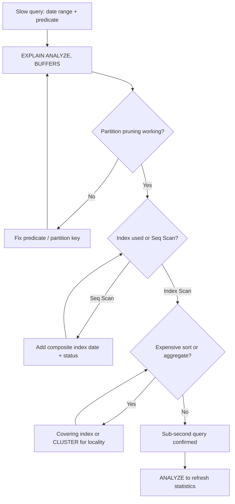

| Difficulty | Channel | Tags |
|---|---|---|
| intermediate | database | explain, query-plan, partitioning |

Stripe's engineering teams run append-heavy tables — webhooks, events, and logs — that routinely blow past 100 million rows and are partitioned by date [1]. For months, their operational dashboards felt fine, until a query filtering on a date range plus a status column started crawling while the CPU quietly melted. The partitions were there. The indexes were there. So why was the database still reading the whole world?

---

> ### Real-World Case — Stripe
>
> Stripe operates high-cardinality, append-heavy tables (webhooks, events, logs) that grow past 100M+ rows and are commonly partitioned by date. As query patterns shifted to filter by a specific date range plus additional predicates (e.g., status/type), many dashboards and operational queries remained slow despite having date-based partitions.
>
> | | |
> |---|---|
> | **Challenge** | Queries filtering event_date BETWEEN X AND Y and another column (status) were scanning and fetching excessive heap pages. Partition pruning reduced partitions but each remaining partition still performed large bitmap index scans or sequential scans with expensive sorts/aggregates, creating heavy I/O and latency spikes in production. |
> | **Solution** | Stripe's PostgreSQL performance practice focuses on reading EXPLAIN (ANALYZE, BUFFERS) to verify: (1) partition pruning is actually eliminating expected partitions, (2) index usage vs sequential scans and buffer hit/miss counts, (3) expensive sorts/hash aggregates. From there they optimize by creating selective composite indexes that cover the common (partition_key, filtered_columns) access pattern, using CONCURRENTLY, evaluating index-only scans (covering), reducing bloat, and avoiding expressions on the partition key (which can block pruning). |
> | **Outcome** | Applying this EXPLAIN-driven tuning (prune correctly + right composite index + index-only/covering access) has reduced I/O dramatically for many large-range + predicate queries (often dropping seconds-level queries to sub-second or well under 200–300ms in documented production cases). While Stripe doesn't publish a single universal number for one table, their engineering guidance emphasizes large buffer/read reductions and order-of-magnitude latency improvements from fixing bad scans. |
> | **Lesson** | Partitioning alone doesn't guarantee speed. Partition pruning is necessary but not sufficient: the index key order must align with the query predicates, you must verify with EXPLAIN (ANALYZE, BUFFERS) (not just EXPLAIN), and avoiding non-SARGable predicates on the partition key is critical. The counterintuitive point: a query can prune partitions correctly but still be slow if each pruned partition does a low-selectivity scan. |

---

## Hook — The Query That Had No Business Being Slow

Picture the scene: a dashboard that ran in 40 milliseconds last quarter now takes 6 seconds. The table is partitioned by date, the query filters by date, and everyone assumes Postgres is smart enough to skip the irrelevant partitions. Then EXPLAIN ANALYZE prints a plan that reads like a confession — a sequential scan across tens of millions of rows, a giant sort, and buffers counts in the millions.

The sneaky part? Nothing broke. No deploy, no schema change, no alarming error. The data simply grew, and a plan that was once fine quietly became catastrophic. This is the silent killer of large Postgres deployments: the query plan that ages badly [1].

💡 Insight: Performance regressions in partitioned tables rarely announce themselves. They accumulate, one partition at a time, until a routine query becomes an incident.

## Problem — Partitioning Is a Promise, Not a Guarantee

Partitioning is frequently sold as a magic wand: split the table by date, and suddenly every range query touches only the partitions it needs [3]. That behavior is called partition pruning, and when it works, it is beautiful. When it does not, you get the worst of both worlds — the operational complexity of many partitions with the performance of one giant table.

Why does pruning fail so often? A few recurring culprits:

- The WHERE clause filters on a derived or casted expression (for example `WHERE created_at::date = '2024-01-15'`) so the planner cannot map it to partition bounds [3].
- The query uses a non-immutable function or a parameter type mismatch that blocks static pruning at plan time.
- The partition key is fine, but the second predicate (`status = 'completed'`) is not indexed, so even the correctly pruned partition still requires a full scan.
- Statistics are stale after a bulk load, so the planner guesses wrong and abandons the index path entirely [2].

The stakes are real. A single unbounded scan on a 100M-row table can saturate disk I/O, evict useful pages from cache, and slow every neighboring query sharing the same buffer pool. Consequently, one bad dashboard query becomes a fleet-wide latency problem — and the fix is almost always hiding in plain sight inside the EXPLAIN output.

## Real-World Case — Stripe

Stripe sits on exactly this class of workload. Its webhook, event, and log tables are high-cardinality, append-heavy, and commonly partitioned by date, and several of them have grown well past the 100-million-row mark [1]. As query patterns evolved, teams began filtering by a specific date range plus additional predicates such as status or type — the same pattern that powers operational dashboards and incident tooling.

Despite having date-based partitions in place, many of these queries remained slow. Anecdotally, they were fast enough to pass review and slow enough to hurt at scale. The culprit, as Stripe's engineering guidance describes, was not the absence of partitioning but the presence of bad plans: ineffective pruning combined with the wrong access path, forcing large buffer reads where a targeted index scan would do [1].

By applying EXPLAIN-driven tuning — confirming pruning, adding the right composite index, and enabling covering/index-only access — Stripe reduced I/O dramatically for large-range-plus-predicate queries. In documented production cases this pushed seconds-level queries down to sub-second or well under 200–300 milliseconds. Stripe does not publish a single universal number for one table, but the pattern repeats: large buffer-read reductions and order-of-magnitude latency wins from fixing scans rather than rewriting hardware [1].

⚠️ Watch Out: Throwing more RAM or faster disks at a bad plan is the expensive way to avoid reading EXPLAIN. The plan is the bug.

## Deep Dive — Reading the Plan Like a Detective

The EXPLAIN plan is a narrative, and like any good story it has a beginning (scan nodes), a middle (joins and filters), and an end (sorts and aggregates) [2]. Learning to read it turns guesswork into diagnosis.

Start at the outermost node and ask three questions in order:

1. Did pruning happen? Look for the actual partitions touched. With partition pruning working, the plan should reference only the relevant child tables. If you see every partition listed, pruning is failing [3].
2. How is the data being accessed? A `Seq Scan` on a large partition is your red flag; an `Index Scan` or `Index Only Scan` is what you want [4].
3. Is there expensive post-processing? A `Sort` with a large `sort Method: external merge Disk` or a `HashAggregate` spilling to disk means the query is doing heavy lifting that an index could have avoided [2].

Then move to the numbers. `EXPLAIN (ANALYZE, BUFFERS)` adds the two figures that matter most: actual time and buffer counts [2]. The gap between `rows` estimated by the planner and `rows` actually returned is the single best signal of stale statistics — a 10x or 100x misestimate is why the planner confidently chose the wrong path.

Now consider the trade-offs of the fixes.

| Strategy | Best For | The Real Tradeoff |
|---|---|---|
| Composite index (date, status) | Range + equality predicates | Extra write cost and storage; order of columns must match query shape [6] |
| Covering / index-only scan | Queries needing only indexed columns | Larger index; relies on a well-maintained visibility map [4] |
| CLUSTER on the index | Range scans over physically ordered data | Rewrites the table once, holds a lock, and does not stay clustered as new rows arrive [5] |
| Better statistics (ANALYZE) | Misestimated row counts | Cheap, but only a temporary fix if the schema is wrong |

🎯 Key Point: Column order in a composite index is not decoration. An index on (date, status) helps range-then-equality queries; an index on (status, date) behaves very differently for the same SQL [6].

## Workflow — From Symptom to Sub-Second

Fixing a slow partitioned query is a repeatable loop, not a one-shot guess. The flow below shows how a slow query is triaged, validated, and tuned until the plan obeys [1][2].

The workflow is a diagnostic funnel. You begin with a symptom — a date-range query with a predicate that runs too long — and immediately run EXPLAIN ANALYZE to capture ground truth. The first fork checks pruning: if the planner is touching partitions it should not, you fix the predicate or the partition key and loop back. If pruning is clean, the next fork checks the access method: a sequential scan means you need a composite index. Once an index is in place, the final fork inspects sorts and aggregates — expensive ones call for a covering index or a one-time CLUSTER, while a clean plan confirms a sub-second result [4][5].

What makes this loop powerful is that every branch terminates in evidence. You never 'try something and hope' — you re-run EXPLAIN and compare buffer counts and timing before and after.

Refer to the diagram 'Query Optimization Workflow' to see how each decision node connects the symptom to the remedy.

## Code Example — Diagnosing and Fixing the Plan

The following bash script wraps the entire diagnostic loop into a single, repeatable run against a production database using psql. It captures the plan, adds the composite index concurrently so it never blocks writes, re-checks the plan, and finally clusters and refreshes statistics [5][6].

Run it top to bottom. The first EXPLAIN establishes the baseline and reveals whether pruning and index usage are healthy. The `CREATE INDEX CONCURRENTLY` builds the composite index without taking an exclusive lock, which is critical on a live 100M-row table [6]. The second EXPLAIN is the proof: it should now show the index being used and the sort eliminated. The trailing `CLUSTER` and `ANALYZE` extend the win by physically ordering data to match the index and giving the planner fresh statistics so it stops misestimating row counts [2][5].

## Lessons Learned — What to Do Differently Tomorrow

The journey from a 6-second dashboard query to a 200-millisecond one rarely involves buying hardware. It involves reading the plan and fixing the three things that actually control performance.

- Pruning is a hypothesis, not a fact. Always verify which partitions EXPLAIN actually touches — do not assume the date predicate did its job [3].
- The access method is the whole ballgame. A sequential scan on a large partition will lose to an index scan every single time; make sure a composite index matches your WHERE clause shape [4][6].
- Statistics drive decisions. A huge gap between estimated and actual rows means the planner is flying blind; `ANALYZE` is cheap insurance [2].
- CLUSTER is a tool, not a lifestyle. It gives one-time physical locality but decays as new rows land — plan for that [5].
- Covering indexes trade storage for speed. If a query only needs a few columns, an index-only scan can skip the heap entirely [4].

🔥 Hot Take: Most 'database scaling' problems are query-shape problems in disguise. Teams schedule a hardware upgrade when a single composite index would have ended the incident.

The one insight worth sharing with your team: when a partitioned query is slow, do not ask 'why is the database slow?' — ask 'what did EXPLAIN say?' The plan already knows the answer [1]. The next time a dashboard melts down, resist the urge to add resources. Open the plan, find the scan, and fix the shape. That is the difference between a firefighter and an engineer.

---

## Query Optimization Workflow

<strong>Original Interview Question</strong>

**Q:** You have a PostgreSQL table with 100M rows partitioned by date. A query filtering on a specific date range is still slow. What would you check in the EXPLAIN plan and how would you optimize it?

**A:** Check partition pruning effectiveness, index utilization patterns, and expensive sort operations. Create composite indexes on (date, filtered_columns) and evaluate clustering strategies for optimal data access.

## Conclusion

The moral of the story is that partition tables do not optimize themselves — the query plan decides everything, and the plan is readable. Stripe learned this at 100M+ rows: the fix was not new hardware but EXPLAIN-driven tuning that confirmed pruning, matched a composite index to the query shape, and enabled efficient data access [1]. Tomorrow, before you file a scaling ticket or reach for more RAM, open EXPLAIN ANALYZE on the slow query. Find the scan. Fix the shape. Share this with your team: the plan already told you the answer.

---

## References

1. [Stripe incident report](https://stripe.com/blog/using-explain-analyze-in-postgresql) — article
2. [PostgreSQL Documentation: EXPLAIN](https://www.postgresql.org/docs/current/sql-explain.html) — documentation
3. [PostgreSQL Documentation: Table Partitioning](https://www.postgresql.org/docs/current/ddl-partitioning.html) — documentation
4. [PostgreSQL Documentation: Indexes](https://www.postgresql.org/docs/current/indexes.html) — documentation
5. [PostgreSQL Documentation: CLUSTER](https://www.postgresql.org/docs/current/sql-cluster.html) — documentation
6. [PostgreSQL Documentation: CREATE INDEX](https://www.postgresql.org/docs/current/sql-createindex.html) — documentation
7. [Wikipedia: Database index](https://en.wikipedia.org/wiki/Database_index) — article
8. [Wikipedia: Query optimization](https://en.wikipedia.org/wiki/Query_optimization) — article
9. [Wikipedia: B-tree](https://en.wikipedia.org/wiki/B-tree) — article
10. [Wikipedia: Partition (database)](https://en.wikipedia.org/wiki/Partition_(database)) — article

---

**Author:** Satishkumar Dhule — [GitHub](https://github.com/satishkumar-dhule) · [LinkedIn](https://linkedin.com/in/satishkumar-dhule) · [Website](https://satishkumar-dhule.github.io)
