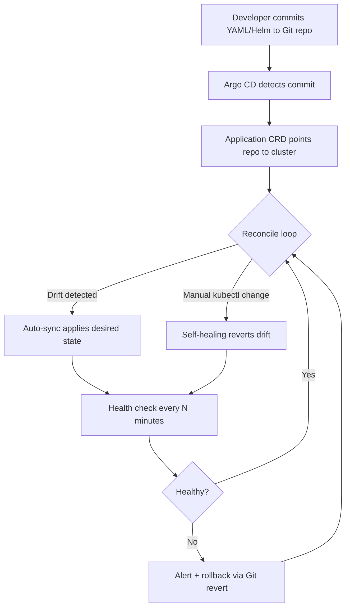

| Difficulty | Channel | Tags |
|---|---|---|
| beginner | devops | argocd, flux, declarative |

Intuit's cloud-native platform team literally built Argo CD — and then watched their own 'straightforward' declarative GitOps setup buckle under the weight of hundreds of microservices spread across dozens of clusters [1]. Their reconciliation cycles slowed to a crawl, and the very tool designed to tame Kubernetes was becoming the bottleneck. Their eventual fix didn't just save the day — it scaled to 40,000 applications, cut Istio reconciliation from roughly a minute down to about half a second, and saved an estimated one million developer hours a year [1]. Here's what that journey teaches every team wiring up GitOps for the first time.

---

> ### Real-World Case — Intuit
>
> Intuit's cloud-native platform team — the engineers who created Argo CD itself — adopted standard declarative GitOps to deploy hundreds of microservices across dozens of Kubernetes clusters: YAML/Helm in Git, Application CRDs pointing at repos, auto-sync, and self-healing to revert drift. As adoption exploded, their 'straightforward implementation' that 'only worked well for a couple clusters and a few dozen applications' collapsed under the load.
>
> | | |
> |---|---|
> | **Challenge** | Real-time reconciliation became impossible at scale. A single Istio application took almost a minute to reconcile (its generated manifests exceeded the 1 MB etcd object-size limit), and once ~150 applications were onboarded, a Git commit still took ~40 seconds to refresh apps. They needed sub-second reconciliation across thousands of applications and hundreds of clusters. |
> | **Solution** | They moved cached resource state into an in-memory cache to handle giant manifests, then hunted down a hidden bottleneck where tiny per-reconciliation configmap lookups were being throttled by the Kubernetes Go client to the default 5 QPS — migrating those calls to the informers framework. They scaled out with controller sharding (by cluster) and additional repo-server replicas. Critically, they later found pure declarative auto-sync didn't fit multi-environment promotion, so for the vast majority of their ~30,000 applications they turned auto-sync OFF and let Jenkins (an imperative pipeline) trigger Argo CD syncs and debug, mixing paradigms. |
> | **Outcome** | Istio application reconciliation dropped from ~1 minute to ~0.5 seconds, and ~150 applications reconciled in under 5 seconds (real-time status). The platform scaled to 40,000 applications across 140+ Argo CD instances, 375+ clusters, 15,500+ nodes, used by 5,000 engineers — with release velocity up 3x, deployment time 5x faster, MTTR/MTTD improved 5-10x, and roughly 1 million developer hours saved annually. |
> | **Lesson** | Declarative GitOps is not a universal silver bullet: the team that built Argo CD discovered auto-sync + self-heal excels at infrastructure and drift prevention but breaks down for multi-environment application promotion, where they quietly reverted to imperative Jenkins-triggered syncs (auto-sync off for most apps). Git as the single source of truth must be paired with the right reconciliation strategy per workload, and scaling the reconciler itself requires sharding and batching, not just more YAML. |

---

## Hook — The Day GitOps Almost Broke Its Own Creators

Imagine building the tool that the entire industry uses to keep Kubernetes clusters in sync, then discovering that your own favorite pattern stops working the moment you actually use it at scale. That is exactly what happened at Intuit. The platform team that created Argo CD adopted what they called a 'straightforward implementation' of declarative GitOps: YAML and Helm in Git, Application CRDs pointing at repositories, auto-sync enabled, and self-healing to squash drift [1]. It worked beautifully — for a couple of clusters and a few dozen applications. Then adoption exploded, and the cracks started showing. If the people who wrote the reconciliation engine can get blindsided by scale, what hope does your team have? The good news is that their story contains the exact playbook you need, and it starts with understanding why the 'obvious' approach quietly hides a scaling trap.

## Problem — Why 'Git as the Single Source of Truth' Gets Complicated

GitOps sounds almost too good to be true. You store the desired state of your cluster in Git, an agent continuously reconciles reality against that state, and manual kubectl pokes get reverted automatically [4]. Developers get auditability, rollbacks, and a single source of truth. So where is the catch?

The catch is that reconciliation is a control loop running on a finite machine. Every Application CRD, every watched Git repository, and every resource in the cluster adds work to that loop. Many developers assume that because Kubernetes is distributed and 'self-healing,' adding more applications is basically free. It is not. As Argo CD watches more repositories and compares more manifests, the cost of a single reconcile pass grows — and when the loop takes longer than your sync interval, drift accumulates faster than it can be corrected.

There is also a subtler problem: the declarative-versus-imperative distinction is often taught as a simple morality tale. Declarative good, imperative bad. But the reality is more nuanced. Imperative kubectl commands are fast, immediate, and perfect for a quick hotfix in a fire [3]. Declarative Git-managed state is auditable, reproducible, and reviewable — but it introduces a reconciliation latency that imperative commands never had. Choosing between them is not about purity; it is about understanding what each one costs you when the numbers get big. That tension is precisely what the Intuit team ran into.

## Real-World Case — Intuit Scales From a Few Dozen to 40,000 Applications

At Intuit, the cloud-native platform team — the engineers who authored Argo CD — rolled out standard declarative GitOps across hundreds of microservices and dozens of Kubernetes clusters [1]. The initial design was textbook: manifests and Helm charts in Git, Application CRDs referencing the repos, auto-sync turned on, and self-healing reverting any unauthorized manual changes. Then the platform's own success became its problem.

As adoption spread, the 'straightforward implementation' that had 'only worked well for a couple clusters and a few dozen applications' began to collapse under the load [1]. Reconciliation times ballooned, and the platform team realized their architecture had a scaling wall baked into it. Their response was a deep re-architecture of how Argo CD handled synchronisation and monitoring. The results were dramatic: Istio application reconciliation dropped from around one minute to roughly half a second, and about 150 applications converged to healthy status in under five seconds [1].

Zoom out, and the platform grew to 40,000 applications running across 140-plus Argo CD instances, more than 375 clusters, and 15,500-plus nodes — serving 5,000 engineers [1]. The business impact followed: release velocity tripled, deployment time was five times faster, MTTR and MTTD improved by 5-10x, and the team estimates roughly one million developer hours saved every year [1]. The lesson is not that GitOps is fragile. It is that GitOps has a scaling cliff, and you want to know where it is before you fall off it.

## Deep Dive — Declarative vs. Imperative, and the Reconciliation Tax

To understand why Intuit hit a wall, you need to understand what Argo CD actually does. Argo CD follows the Kubernetes controller pattern [9]: it stores a desired state, observes the actual state, and runs a loop to close the gap. In GitOps, the desired state lives in Git, and Argo CD's Application CRD tells it which repo, path, and cluster to watch [2]. On each sync interval, it fetches manifests — or renders Helm charts and Kustomize overlays [5][6] — diffs them against the live cluster, and applies corrections.

That loop is where the 'reconciliation tax' hides. Every extra application, repo, and resource increases the work per pass. When the loop time approaches your sync interval, self-healing starts chasing its own tail. This is why 'just turn on auto-sync and self-heal' is not a scaling strategy — it is a starting point.

Now consider the two approaches side by side.

## Workflow — Wiring Up Argo CD Without Walking Into the Cliff

Here is a workflow that mirrors the safe path Intuit eventually converged on: define desired state in Git, register it with an Application CRD, enable controlled automation, and monitor the loop.

The diagram shows the closed loop that makes GitOps powerful — and that also becomes the bottleneck at scale. Each pass through the loop costs CPU and API calls, so the workflow must be designed with sharding, sync waves, and pruning in mind [2][5]. Notice the 'rollback' path: because Git is the source of truth, recovery is just a revert, which is one of the biggest practical wins over imperative changes [4].

## Code Example — A Production-Shaped Application CRD

The following bash script applies an Argo CD Application that points at a Git repository, enables automated sync with pruning and self-healing, and sets a retry policy so transient failures do not leave the cluster stuck. This is the declarative configuration that replaces ad-hoc kubectl deployments [2][3].

Walking through it: the `syncPolicy.automated` block is what turns on auto-sync, `prune: true` deletes resources removed from Git, and `selfHeal: true` reverts manual drift — the exact trio that becomes dangerous without sharding at scale. The `retry` block makes the controller resilient to flaky API calls, and `CreateNamespace` lets Argo CD bootstrap a namespace without a separate imperative step.

## Lessons Learned — What to Do Differently Tomorrow

Intuit's story is not a cautionary tale about GitOps failing — it is a masterclass in what it takes to make GitOps succeed when the numbers get real [1]. Here is what to carry into your next deployment.

- **Treat reconciliation as a finite resource.** Monitor loop time and shard Applications across multiple Argo CD instances before you hit the cliff, the way Intuit scaled to 140-plus instances [1][2].
- **Auto-sync and self-heal are defaults, not strategies.** They are wonderful for small clusters and dangerous as a thoughtless fleet-wide setting [4].
- **Git is your rollback button.** Because desired state lives in version control, recovery is a revert — far safer than imperative hotfixes that never make it back into a repo [3].
- **Know when imperative wins.** For a 2 a.m. incident, a targeted kubectl command can buy time; just make sure the fix lands in Git afterward [3].
- **Measure the payoff, not just the pattern.** Intuit saw 3x release velocity, 5x faster deploys, and 5-10x better MTTR/MTTD [1]. Those numbers come from scaling discipline, not the mere presence of GitOps.

The one insight worth sharing with your team: GitOps does not eliminate operational complexity — it moves it into the reconciliation loop, where it will happily hide until scale finds it.

---

## GitOps Reconciliation Loop

<strong>Original Interview Question</strong>

**Q:** You're setting up GitOps for a microservices deployment. How would you configure ArgoCD to automatically sync changes from your Git repository to Kubernetes, and what's the difference between declarative and imperative approaches in this context?

**A:** I'd configure ArgoCD by setting up a Git repository containing Kubernetes manifests or Helm charts, creating an Application CRD that points to the Git repository, enabling auto-sync with a health check interval of 3 minutes, and implementing self-healing to automatically revert any manual changes. The declarative approach involves defining the desired state in Git through YAML manifests, Helm charts, or Kustomize configurations, where ArgoCD continuously reconciles the actual state with the desired state. In contrast, the imperative approach uses kubectl commands to make direct changes to the cluster, bypassing the Git repository as the single source of truth.

## Conclusion

Intuit's team built Argo CD, trusted the standard GitOps playbook, and still hit a scaling wall that forced them to re-architect reconciliation from the ground up [1]. The takeaway is not to avoid GitOps — it is to adopt it with your eyes open about the reconciliation tax. Start small, watch your loop times, shard before you scale, and treat Git as the rollback button you always wanted. Tomorrow, when you flip on auto-sync and self-heal, ask yourself one question: at what application count does this loop stop keeping up? Answer that early, and you will scale smoothly from a few dozen apps to tens of thousands without ever becoming the cautionary tale.

---

## References

1. [Intuit incident report](https://blog.argoproj.io/doing-gitops-at-scale-6313f5889775) — article
2. [Argo CD Documentation](https://argo-cd.readthedocs.io/en/stable/) — documentation
3. [Kubernetes: Managing Resources with kubectl](https://kubernetes.io/docs/concepts/overview/working-with-objects/) — documentation
4. [OpenGitOps Principles](https://opengitops.dev/) — documentation
5. [Helm Documentation](https://helm.sh/docs/) — documentation
6. [Kubernetes: Declarative Management with Kustomize](https://kubernetes.io/docs/tasks/manage-kubernetes-objects/kustomization/) — documentation
7. [argo-cd on GitHub](https://github.com/argoproj/argo-cd) — documentation
8. [Flux: Continuous Delivery for Kubernetes](https://fluxcd.io/) — documentation
9. [Kubernetes Controllers and Declarative Reconciliation](https://kubernetes.io/docs/concepts/architecture/controller/) — documentation

---

**Author:** Satishkumar Dhule — [GitHub](https://github.com/satishkumar-dhule) · [LinkedIn](https://linkedin.com/in/satishkumar-dhule) · [Website](https://satishkumar-dhule.github.io)
