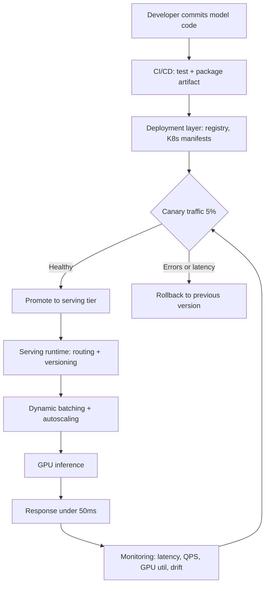

| Difficulty | Channel | Tags |
|---|---|---|
| beginner | devops | mlops, deployment |

Superhuman's AI email assistant answers more than 200,000 inference requests per second at peak — and its original do-it-yourself serving stack couldn't keep up [1]. The company had the models. It had the GPUs. What it lacked was a clean boundary between deployment and serving. The result: months of manual tuning per model iteration, diurnal traffic spikes that threatened four-nines reliability, and a sub-second P99 target hanging by a thread [1]. Here's the distinction that turned that chaos into a 60% throughput gain — and why it matters for every ML system you'll ever ship.

---

> ### Real-World Case — Superhuman (with Databricks)
>
> Superhuman's AI-powered email product runs a custom LLM for real-time spelling and grammar correction, serving over 200,000 queries per second at peak with strict four-nines (99.99%) reliability guarantees and a sub-second P99 latency target. Their original DIY serving stack based on L40S GPUs required months of manual tuning per model iteration and could not keep up with diurnal traffic spikes that sometimes exceeded 200K QPS.
>
> | | |
> |---|---|
> | **Challenge** | They needed to separate the concerns of deployment (CI/CD, quality validation, progressive rollout, SLO definition) from serving (runtime inference, load balancing, autoscaling, cold-start handling) - and hit sub-second P99 latency on a small, fast model without regressing output quality, while shedding the operational burden of managing their own inference infrastructure. |
> | **Solution** | Superhuman migrated to the Databricks Model Serving platform, which split responsibilities: Superhuman retained model training/quantization/quality, Databricks owned runtime performance. Serving optimizations included replacing the default Kubernetes round-robin load balancer (which created hotspots at high QPS) with a power-of-two-choices algorithm via an Endpoint Discovery Service, asymmetric autoscaling (aggressive scale-up, conservative scale-down), FP8/per-channel quantization, and a multiprocessing runtime to remove the CPU serialization bottleneck. Deployment-side, they added warm node pools, fast parallel model downloads, provisioned concurrency, and gated cutovers validated by A/B testing under live traffic. |
> | **Outcome** | Sustained 200K+ QPS with sub-second P99 (4 nines reliability), a 60% per-GPU throughput gain (750 to 1,200 QPS per H100 pod), and up to 25% more throughput from eliminating CPU bottlenecks - all with zero quality regressions. |
> | **Lesson** | The counterintuitive insight: for small, fast models the bottleneck is often the CPU, not the GPU, and Kubernetes' default round-robin load balancer silently degrades at high QPS by creating hotspots that spike tail latency. Separating deployment (rollout/quality governance) from serving (runtime scaling) lets teams specialize - and you cannot optimize cold starts away, since physics imposes a floor that only provisioned warm capacity can fix. |

---

## Hook — The Night 200,000 Requests Per Second Hit the Fan

It starts the way most production incidents do: a graph that looks fine until it suddenly doesn't. For Superhuman, the graph was inference traffic. During business hours, a relentless wave of spelling and grammar checks sweeps across the Americas, then Europe, then Asia. At peak, that wave becomes more than 200,000 queries per second [1]. Four-nines reliability (99.99%) is the contract. Sub-second P99 latency is the bar. Miss either one and a product whose entire pitch is speed feels fundamentally broken.

💡 Insight: When your product promise is milliseconds, your serving infrastructure isn't a supporting actor — it's the headline.

Now picture the person on call. The pager fires at 3am because the Europe morning rush collided with a stuck batch job and the GPU pods are pegged at 100%. The model is fine. The infrastructure around it is gasping. Sound familiar? This is the moment many ML teams discover, painfully, that "deploying a model" and "serving a model" are not two names for the same thing — they're two distinct engineering disciplines with different failure modes, different tooling, and different on-call runbooks.

## Problem — The Vocabulary Trap That Costs Teams Months

Here's the trap. Teams say "we deployed the model" to mean everything from "the artifact is in the registry" to "a user just got a prediction in 40ms." That single fuzzy verb hides two very different jobs, and conflating them is why so many ML systems rot in production.

- **Deployment** is everything that gets a model from a notebook to a running, monitored, rollback-capable workload. It's CI/CD pipelines, infrastructure-as-code, artifact registries, environment promotion, and observability wiring. Think Kubernetes, MLflow, SageMaker, Terraform, GitHub Actions.
- **Serving** is the runtime that answers requests. It's the inference API, request routing, model loading, dynamic batching, version selection, and autoscaling. Think TensorFlow Serving, TorchServe, BentoML, FastAPI behind NGINX or Envoy.

Why does the confusion cost so much? Because the skills, the bottlenecks, and the blast radius are completely different. A deployment bug usually means a bad rollout — annoying but recoverable. A serving bug means users stare at a spinner while your GPUs idle at 12% utilization. Many developers think performance is a model problem; more often it's a serving-runtime problem. Superhuman's original stack proved exactly that: months of manual tuning per model iteration, with throughput and latency that couldn't survive the next traffic spike [1].

⚠️ Watch Out: If your team has one person responsible for "the ML pipeline" end to end, you've quietly merged an infrastructure role and a systems-performance role. That's a recipe for burnout and blind spots.

## Real-World Case — Superhuman (with Databricks)

Superhuman builds an AI-powered email product, and its custom LLM for real-time spelling and grammar correction sits directly in the user's typing path. That placement raises the stakes dramatically: the model has to be scored on essentially every keystroke-scale interaction, at scale, without ever making the product feel slow.

The numbers were unforgiving. Peak load exceeded 200,000 queries per second. The reliability target was four nines — 99.99% — and the latency target was a sub-second P99 [1]. Their original do-it-yourself serving stack, built on L40S GPUs, required months of manual tuning for every model iteration and simply couldn't absorb diurnal spikes that sometimes blew past 200K QPS [1].

That's the classic DIY-serving failure pattern: great models, fragile runtime. The team needed a serving platform that treated throughput, batching, and autoscaling as first-class concerns rather than hand-tuned afterthoughts. The result, built with Databricks, tells the transformation story in hard numbers:

- Sustained **200K+ QPS** with **sub-second P99** and four-nines reliability
- A **60% per-GPU throughput gain**, from **750 to 1,200 QPS per H100 pod**
- Up to **25% more throughput** simply by eliminating CPU bottlenecks
- **Zero quality regressions** — the acceleration didn't cost accuracy [1]

🔥 Hot Take: The biggest win wasn't a fancier model. It was recognizing that the serving layer is a product in its own right, deserving its own SLOs, experiments, and roadmap.

## Deep Dive — Two Jobs, One Confusing Name

Building on Superhuman's story, the cleanest way to separate these disciplines is to ask two questions. Deployment answers: "How does this artifact reach production safely?" Serving answers: "How does a request get a fast, correct answer right now?" Everything else follows from those two questions.

**Deployment's job:** CI/CD pipelines, infrastructure setup, artifact versioning, monitoring and rollback strategy. The tools are Kubernetes, Docker, Terraform, MLflow, SageMaker, and Vertex AI [2][6].

**Serving's job:** runtime inference APIs, request routing, model loading, response optimization, and version selection. The tools are FastAPI, gRPC, and dedicated model servers like TensorFlow Serving, TorchServe, and BentoML [3][4][5].

| Concern | Deployment | Serving |
|---|---|---|
| Primary goal | Safe release + rollback | Low-latency, high-throughput answers |
| Key metric | Rollout success, MTTR | P50/P99 latency, QPS, GPU utilization |
| Failure mode | Bad rollout, config drift | Queue buildup, cold starts, OOM |
| Scaling axis | Environment promotion | Horizontal pod + GPU autoscaling |
| Typical tools | K8s, MLflow, Terraform | TorchServe, TF Serving, BentoML |

The trade-offs are where beginners get humbled. **Latency vs throughput:** batching more requests per GPU pass raises throughput but adds wait time. **Batch vs real-time:** overnight scoring can use huge batches; a typing assistant cannot. **Cold starts:** a model that takes 30 seconds to load will spike your P99 the moment autoscaling spins up a new replica [7].

This is precisely why Superhuman's per-GPU throughput leap mattered so much — it's the serving layer buying headroom without buying new hardware [1].

🎯 Key Point: Optimizing the model moves the ceiling on accuracy. Optimizing the serving layer moves the ceiling on cost and latency. Most teams need the second one far sooner than they think.

## Workflow — From Commit to Sub-50ms Response

So how do these two jobs actually cooperate? The flow below is the loop Superhuman-style platforms run continuously. Notice that deployment and serving hand off at a clear seam — the canary gate — rather than blurring into one giant pipeline [1][8].

Step by step:

1. **Commit and package.** Source lands, tests run, and the artifact is versioned in a registry. Deployment owns this.
2. **Render infrastructure.** Manifests and IaC define replicas, GPU requests, and resource limits [2].
3. **Canary gate.** A small slice of traffic (say 5%) hits the new version. This is the hand-off seam between deployment and serving.
4. **Promote or roll back.** Healthy canary promotes; anomalies revert instantly. Fast rollback is a deployment superpower, and it's why versioned serving runtimes matter [3].
5. **Serve.** The runtime routes requests, selects the model version, batches work, and autoscales pods horizontally [9].
6. **Observe and loop.** Latency, QPS, GPU utilization, and drift feed back into the canary decision.

💡 Insight: The canary gate is where deployment's caution and serving's speed meet. Skip it and you discover serving problems in production with 100% of traffic instead of 5%.

## Code Example — A Serving Runtime with Micro-Batching and Version Swaps

Building on the workflow, here's the serving half in code. This FastAPI runtime does three production-critical things: it keeps multiple model versions hot for zero-downtime rollouts, it micro-batches requests to raise GPU throughput, and it exposes a load endpoint your deployment pipeline can call after the canary passes. The batching window is the exact latency-vs-throughput dial Superhuman's platform tuned to hit 1,200 QPS per GPU pod [1].

The code is inline in the `codeExample` field below. Walk through it top to bottom and the two disciplines separate cleanly: the registry and `/models/{version}/load` endpoint belong to deployment, while batching, routing, and inference belong to serving.

## Lessons Learned — What to Do Differently Tomorrow

Here's the thing though: none of this is exotic. It's just discipline applied at the right seam. So what should you change tomorrow?

- **Name the two jobs out loud.** Give deployment and serving their own owners, SLOs, and dashboards. Ambiguity is where incidents hide.
- **Optimize the runtime before the model.** Superhuman gained 60% per-GPU throughput and 25% more throughput from removing CPU bottlenecks — all without touching model quality [1]. Utilization charts reveal more than accuracy charts in the first year.
- **Instrument the right metrics.** Track P50/P99 latency, QPS, GPU utilization, queue depth, and error rate. Latency percentiles, not averages, are what your users feel [9].
- **Make rollback boring.** Versioned artifacts plus a fast promote/revert path turn terrifying deploys into routine ones [3][6].
- **Respect cold starts.** Pre-warm replicas or watch your P99 shatter the moment autoscaling kicks in [7].

⚠️ Battle scar to avoid: teams love benchmarketing raw model accuracy while their P99 silently climbs past the SLO. The user experience lives in the tail, and the serving layer owns that tail.

If this feels overwhelming, you are not alone. Start with one dashboard that separates deployment health from serving health, and the rest of the discipline tends to follow. The single most memorable insight to share with your team: **deployment gets the model to the door; serving gets the answer to the user — and only one of those is the reason people keep typing.**

---

## Deployment vs Serving Pipeline

<strong>Original Interview Question</strong>

**Q:** Explain the key differences between model serving and model deployment in ML systems, including specific technologies, scaling considerations, and real-world implementation patterns?

**A:** Deployment encompasses CI/CD pipelines, infrastructure setup, and monitoring using tools like Kubernetes, MLflow, and SageMaker. Serving focuses on runtime inference APIs with frameworks like TensorFlow Serving, TorchServe, or BentoML, handling request routing, model versioning, and autoscaling. Key trade-offs include latency vs throughput, batch vs real-time inference, and cold start optimization.

## Conclusion

The moral of the story is simple: deployment and serving are two jobs, and treating them as one is how good models die in production. Superhuman didn't win by training a magic model — it won by rebuilding the serving layer until 200K+ QPS, sub-second P99, four-nines reliability, and a 60% per-GPU throughput gain all became ordinary [1]. Tomorrow, separate your dashboards, name your owners, and pick one serving metric — P99 latency or GPU utilization — to attack first. You don't need 200K QPS to benefit from thinking like a serving engineer. You just need to stop calling it all 'deploying.'

---

## References

1. [Superhuman (with Databricks) incident report](https://www.databricks.com/blog/how-superhuman-and-databricks-built-200k-qps-inference-platform-together) — article
2. [Kubernetes Documentation: Deployments](https://kubernetes.io/docs/concepts/workloads/controllers/deployment/) — documentation
3. [TensorFlow Serving (GitHub)](https://github.com/tensorflow/serving) — documentation
4. [TorchServe (GitHub)](https://github.com/pytorch/serve) — documentation
5. [BentoML (GitHub)](https://github.com/bentoml/BentoML) — documentation
6. [MLflow (GitHub)](https://github.com/mlflow/mlflow) — documentation
7. [Clipper: A Low-Latency Online Prediction Serving System](https://arxiv.org/abs/1712.06139) — paper
8. [Hidden Technical Debt in Machine Learning Systems](https://arxiv.org/abs/1503.05908) — paper
9. [Kubernetes Documentation: Horizontal Pod Autoscaling](https://kubernetes.io/docs/tasks/run-application/horizontal-pod-autoscale/) — documentation
10. [Wikipedia: MLOps](https://en.wikipedia.org/wiki/MLOps) — documentation

---

**Author:** Satishkumar Dhule — [GitHub](https://github.com/satishkumar-dhule) · [LinkedIn](https://linkedin.com/in/satishkumar-dhule) · [Website](https://satishkumar-dhule.github.io)
