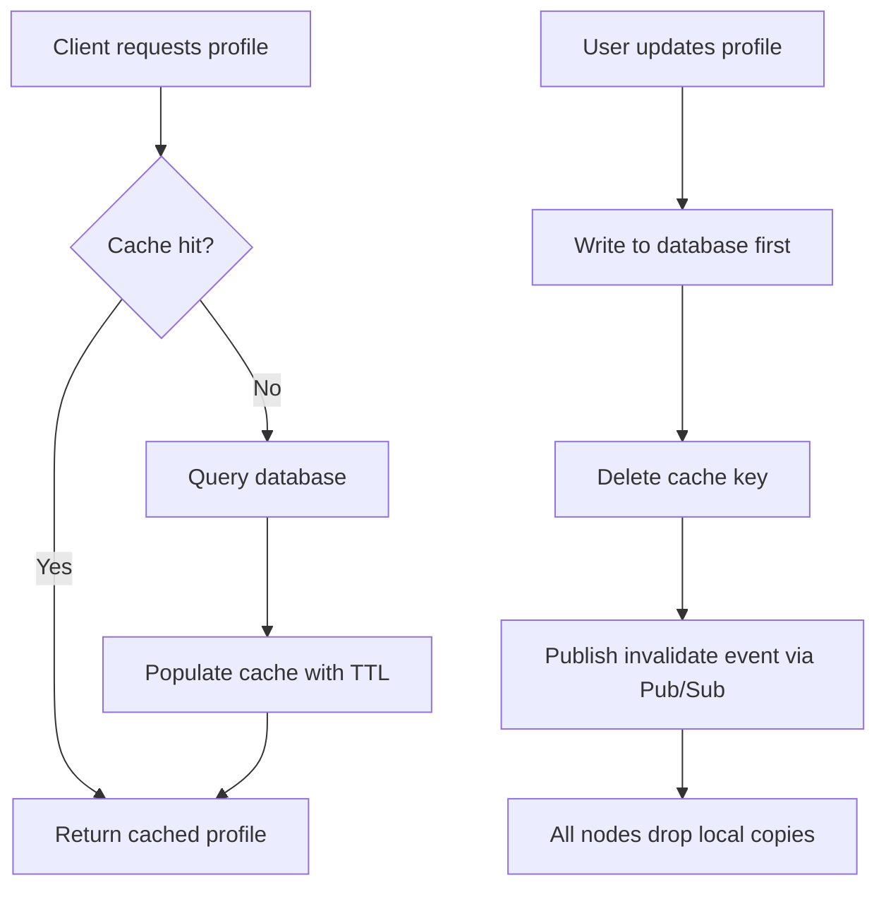

| Difficulty | Channel | Tags |
|---|---|---|
| beginner | backend | redis, memcached, cache-invalidation |

Picture a service handling billions of requests per second, holding trillions of items in memory for more than a billion users. That was Facebook's memcached fleet, one of the largest cache deployments ever built [1]. The twist? Fetching data was the easy part — knowing when that data had gone stale was the real war. When a user updated their profile, every cached copy scattered across clusters and regions had to be invalidated, or strangers would see old names, old photos, and old settings. This is the story of cache invalidation — and the Redis-versus-Memcached trade-off that decides whether your profile service stays consistent or quietly lies to its users.

---

> ### Real-World Case — Facebook (Meta)
>
> Facebook served user data and profiles from one of the largest memcached deployments on Earth — billions of requests per second across many frontend clusters and multiple geographic regions. When a user updated their data, every cached copy of that data across the fleet had to be invalidated, or users would see stale profiles.
>
> | | |
> |---|---|
> | **Challenge** | On a database write, the corresponding memcache keys must be deleted to prevent stale reads. But with many databases and thousands of memcached servers spanning regions, naive invalidation storms caused unacceptable packet rates, replication lag could let a stale value get re-cached before invalidation arrived (the 'stale set' race condition), and a config error could poison invalidations across the whole fleet — historically requiring a slow rolling restart of the entire memcache infrastructure. |
> | **Solution** | They built a delete-based invalidation pipeline: SQL statements that modify authoritative state are amended to carry the memcache keys to invalidate, and daemons called 'mcsqueal' tail each database's commit log on every DB, extract deletes, and broadcast them — batched through mcrouter — to memcached servers in every frontend cluster. They preferred deletes over sets (deletes are idempotent and demand-filled), added 'leases' to block stale clients from setting old values after a delete, and used a 'remote marker' mechanism in replica regions to redirect reads to the master when replication lag could expose stale data. |
> | **Outcome** | The mcsqueal batching produced an 18x improvement in the median number of deletes per packet. Invalidation of keys co-located with the master reached four 9s reliability within 1 second and five 9s after one hour. Their cache layer served billions of requests per second holding trillions of items for over a billion users. Counterintuitively, only 4% of all deletes issued actually resulted in the invalidation of cached data. |
> | **Lesson** | Delete-on-write is safer than set-on-write because it is idempotent — and the true enemy isn't invalidation volume, it's the stale-set race, where an in-flight read re-populates the cache with old data after your delete. Also, the majority of invalidations are wasted work that hits no cached key, so optimizing the pipeline for cost and packet efficiency matters more than the number of deletes. |

---

## Hook — Billions of Profiles, One Stale Username

Here is the thing about caching that nobody warns you about on day one: reading is rarely the problem. Writing — specifically, writing and then telling every other copy of the data to forget what it knew — is where careers are made and pagers go off at 3am [4].

Imagine a user named Dana changes her profile photo. Her friends in your app should see the new photo instantly. But at scale, Dana's profile is cached in dozens of places: a local in-process cache on each app server, a shared Redis or Memcached layer, a CDN edge, maybe a mobile client. The instant she taps save, every one of those copies becomes a tiny lie [4].

💡 **Insight:** Data is easy to cache. Data is brutally hard to *un-cache* — and the faster your system grows, the more copies of the truth you are juggling at once.

So how do you invalidate a key that lives in a thousand places without melting your database or your network? Facebook answered that question at a scale almost nobody else has faced. Their answer contains a plot twist that will change how you think about deletes forever.

## Problem — The Hardest Problem in Computer Science

Phil Karlton's famous quip says there are only two hard things in computer science: cache invalidation and naming things. That joke survives because it is painfully true. Caching itself is trivial — a hash map with extra steps. Keeping cached data *consistent with the source of truth* is where systems break.

The core challenge for a user profile service looks simple on a whiteboard: read a profile, cache it, serve it fast. But every one of those steps hides a trap:

- **Stale reads:** After a write, some node still serves the old value until its TTL expires.
- **Thundering herds:** A popular key expires, and thousands of requests slam the database simultaneously [5].
- **Split brain:** Two caches disagree about the current value because an invalidation message was dropped.
- **Hot keys:** One celebrity profile gets hit millions of times, overwhelming a single cache shard.

The stakes escalate with scale. A stale profile on a social app is embarrassing. A stale *permissions* or *account balance* cache is a security or money-losing incident. Consequently, the invalidation strategy you choose is really a decision about how much inconsistency your business can tolerate — and for how long.

But wait. Before you reach for the simplest solution, you should see what happens when one company tries to invalidate billions of keys per second across the planet.

## Real-World Case — Facebook (Meta) and the mcsqueal Invalidation Pipeline

Facebook ran one of the largest memcached deployments on Earth — billions of requests per second across many frontend clusters and multiple geographic regions [1]. Their cache layer held trillions of items for over a billion users [1]. Reads were never the hard part. Writes were.

When a user updated their data, Facebook needed every cached copy of that data across the fleet to be invalidated. If even one regional cluster missed the memo, users would see stale profiles. The naive approach — have the web servers delete keys directly after a write — does not scale, because it generates a storm of deletes that competes with production traffic.

Their solution, a system they called **mcsqueal**, flipped the architecture. Instead of the application issuing deletes, a daemon tailed the MySQL commit logs on each database, extracted the keys that changed, and batched those deletes before routing them to the correct memcached servers [1]. The results were remarkable:

- Batching in mcsqueal produced an **18x improvement** in the median number of deletes packed into each packet [1].
- Invalidation of keys co-located with the master database reached **four 9s reliability within 1 second** and **five 9s after one hour** [1].
- The cache layer served **billions of requests per second**, holding **trillions of items** for over **a billion users** [1].

🔥 **Hot Take:** Here is the twist that breaks most developers' intuition. Only **4% of all deletes issued actually resulted in the invalidation of cached data** [1]. That is not a bug — it is the whole point. The other 96% of deletes hit keys that were never cached in the first place, and firing them blindly (but cheaply) was still the winning move. Efficient invalidation is about making the *miss* cheap, not eliminating it.

That insight reframes everything. If you think your invalidation system is wasteful because most deletes do nothing, you are in good company — you have just rediscovered Facebook's design.

## Deep Dive — Redis vs Memcached: The Real Trade-offs

Building on Facebook's story, the natural question is: which cache engine should you actually reach for? Both Redis and Memcached store key-value data in memory, and both are fast [2][3]. But they diverge sharply the moment cache invalidation gets complicated.

Memcached is deliberately minimal. It is a pure, multi-threaded caching layer with no persistence and no built-in messaging [2][6]. Redis is a data-structure server: it offers persistence, atomic operations, Lua scripting, and — critically for invalidation — **Pub/Sub** [3][7][10].

| Dimension | Redis | Memcached |
|---|---|---|
| Invalidation | Pub/Sub broadcasts invalidation events across nodes [3][10] | Manual coordination required across nodes [2] |
| Persistence | Optional RDB/AOF snapshots survive restarts [3] | None — a restart means a cold cache [2] |
| Data structures | Strings, hashes, sets, sorted sets, streams [3] | Strings and blobs only [2] |
| Threading | Primarily single-threaded (fast, predictable) [3] | Multi-threaded, scales across cores [2] |
| Memory overhead | Higher per key (metadata, structures) [3] | Lower per key, great for raw blobs [2] |
| Best fit | Complex invalidation, durability, queues [3] | Massive, simple, ephemeral caching [2] |

⚠️ **Watch Out:** Memcached's lack of Pub/Sub is not a footnote — it is the architectural fork in the road. With Memcached, when a profile changes, *your application* must track every node holding that key and delete it, exactly as Facebook hand-built with mcsqueal [1][2]. With Redis, a node can publish an invalidation message and let every subscriber react [3][10].

🎯 **Key Point:** Choose Memcached when your data is simple, ephemeral, and you want raw throughput with minimal memory overhead. Choose Redis when invalidation is distributed, when you need persistence, or when you want the cache itself to help coordinate consistency [3]. The trade-off is not speed — it is how much coordination pain you are willing to outsource to the cache.

This leads directly to the operational question: what does a correct invalidation workflow actually look like, step by step?

## Workflow — From Update to Invalidation in Six Steps

Here is a battle-tested write-through workflow that combines the reliability Facebook engineered [1] with the coordination convenience Redis offers [3][10]. The golden rule: **the database is always the source of truth, and the cache is a disposable copy.**

1. **Write to the database first.** Persist the profile update to durable storage before touching any cache. If this step fails, nothing else should happen [1].
2. **Delete the cache key (do not update it).** Deleting is safer than overwriting because it avoids race conditions where a concurrent read repopulates stale data [4].
3. **Publish an invalidation event.** Using Redis Pub/Sub, broadcast the invalidation so other nodes holding copies can drop them [10].
4. **Invalidate local in-process caches.** Every subscriber removes the key from its own memory cache, keeping the fleet consistent [3].
5. **Serve subsequent reads via cache-aside.** The next read misses, fetches from the database, and repopulates the cache with a fresh TTL [5].
6. **Set a sensible TTL as a safety net.** Even if every invalidation message is lost, profiles expire in 5–30 minutes and self-heal [5].

The diagram below tells the visual story of both the read path and the write/invalidation path flowing through the same cache layer:

```text
flowchart TD
    A[Client requests profile] --> B{Cache hit?}
    B -->|Yes| C[Return cached profile]
    B -->|No| D[Query database]
    D --> E[Populate cache with TTL]
    E --> C
    F[User updates profile] --> G[Write to database first]
    G --> H[Delete cache key]
    H --> I[Publish invalidate event via Pub/Sub]
    I --> J[All nodes drop local copies]
```

Notice how the write path never trusts the cache — it only *invalidates* it. That subtle choice, echoed by Facebook's commit-log-driven deletes [1], is what keeps distributed systems honest.

## Code Example — Write-Through Caching with Pub/Sub Invalidation

Theory is cheap, so here is a runnable pattern using Redis. This code implements the exact workflow above: cache-aside reads, write-through updates, and Pub/Sub-driven distributed invalidation [3][10].

```python
import json
import redis

# Shared Redis client with connection pooling: used for both cache and pub/sub
cache = redis.Redis(host="cache.internal", port=6379, decode_responses=True)
INVALIDATION_CHANNEL = "profile:invalidate"  # fan-out channel for all app nodes

def get_profile(user_id: int, db) -> dict:
    """Cache-aside read: only touch the database on a cache miss."""
    key = f"profile:{user_id}"
    cached = cache.get(key)
    if cached is not None:
        return json.loads(cached)  # fast path: sub-millisecond hit

    profile = db.fetch_profile(user_id)          # slow path on miss
    cache.set(key, json.dumps(profile), ex=900)  # TTL = 15 min safety net
    return profile

def update_profile(user_id: int, changes: dict, db) -> None:
    """Write-through update: database is the source of truth."""
    db.update_profile(user_id, changes)  # 1. persist first, never cache-first
    invalidate_profile(user_id)          # 2. then invalidate every copy

def invalidate_profile(user_id: int) -> None:
    """Delete the shared key and broadcast the change to the fleet."""
    key = f"profile:{user_id}"
    cache.delete(key)                     # drop the shared cache entry
    cache.publish(INVALIDATION_CHANNEL, key)  # notify every other node

def invalidation_listener() -> None:
    """Background worker on each app node; keeps local caches consistent."""
    pubsub = cache.pubsub()
    pubsub.subscribe(INVALIDATION_CHANNEL)
    for message in pubsub.listen():       # blocks, reacting to events
        if message["type"] == "message":
            cache.delete(message["data"])  # purge any locally held copy
```

**How it works, step by step:**

- `get_profile` implements the cache-aside pattern [5]. It returns immediately on a hit and only falls back to the database on a miss, then repopulates the cache with a 15-minute TTL.
- `update_profile` enforces the golden rule — the database write happens *before* any cache mutation, so a crash mid-update can never leave the cache ahead of the truth [1].
- `invalidate_profile` deletes the key rather than overwriting it, sidestepping read/write races that produce stale data [4].
- `cache.publish` fans the invalidation out to every subscriber, which is the piece Memcached cannot do natively [3][10].
- `invalidation_listener` runs on every node and purges local copies the moment the event arrives, giving eventual consistency across the fleet.

The design deliberately makes the common case (a cache hit) nearly free, while keeping the rare case (an invalidation) correct — the same philosophy behind Facebook's mcsqueal batching [1].

## Lessons Learned — What to Do Differently Tomorrow

The journey from a single stale username to Facebook's trillion-item fleet ends with a handful of lessons you can apply to your profile service tomorrow.

- **Delete, don't overwrite.** Deleting a key on update avoids races where a concurrent read resurrects stale data [4]. Facebook's commit-log deletes worked precisely because they removed truth, not replaced it [1].
- **Treat the database as the only source of truth.** Write to durable storage first, always. The cache is a disposable accelerator, never an authority [1][5].
- **Let the cache coordinate when you can.** Redis Pub/Sub turns distributed invalidation from a hand-built pipeline into a few lines of code [3][10]. Memcached forces you to build that coordination yourself [2].
- **Always keep a TTL.** Even the best invalidation pipeline drops messages. A 5–30 minute TTL is your self-healing net [5].
- **Make misses cheap, not rare.** The counterintuitive 4% statistic [1] proves that firing cheap, redundant deletes is often better than trying to track perfect cache state.
- **Match the tool to the job.** Simple blobs and raw throughput? Memcached [2]. Complex invalidation and durability? Redis [3].

💡 **Insight:** Consistency is a dial, not a switch. Decide how stale your data is allowed to be, then engineer backward from that number — exactly as Facebook did when they targeted four 9s within one second [1].

If this feels overwhelming, you are not alone. Start with write-through, delete-on-update, and a TTL. Add Pub/Sub when you scale past one cache node. That is the whole journey.

---

## Profile Cache Invalidation Flow



<details>
<summary><strong>Original Interview Question</strong></summary>

**Q:** You're building a user profile service that caches frequently accessed profiles. How would you implement cache invalidation when a user updates their profile, and what trade-offs would you consider between Redis and Memcached?

**A:** Implement write-through caching with TTL-based expiration. On profile update, invalidate the cache by deleting the key and writing new data to both the database and cache. Redis offers pub/sub for automatic distributed invalidation, while Memcached requires manual coordination across nodes.

</details>

## Conclusion

Cache invalidation is not a bug you fix once — it is a discipline you practice every time data changes. Facebook's journey proves the point: with billions of requests per second and trillions of cached items, the winning strategy was not perfect invalidation but *cheap, reliable, redundant* invalidation that treated misses as acceptable [1]. So here is your call to action: today, go audit your profile service. Confirm you write to the database before the cache, that you delete rather than overwrite keys, that every cached value has a TTL, and that your invalidation actually reaches every node. Then share this one memorable insight with your team — the 4% rule: most invalidation messages will hit nothing, and that is the sign of a healthy system, not a broken one. Remember: the database is the truth, the cache is a rumor, and your job is to make sure the rumor never outlives the truth.

---

## References

1. [Facebook (Meta) incident report](https://www.usenix.org/conference/nsdi13/technical-sessions/presentation/nishtala) — article
2. [Memcached — Wikipedia](https://en.wikipedia.org/wiki/Memcached) — documentation
3. [Redis — Wikipedia](https://en.wikipedia.org/wiki/Redis) — documentation
4. [Cache invalidation — Wikipedia](https://en.wikipedia.org/wiki/Cache_invalidation) — documentation
5. [HTTP Caching — MDN Web Docs](https://developer.mozilla.org/en-US/docs/Web/HTTP/Caching) — documentation
6. [memcached — GitHub repository](https://github.com/memcached/memcached) — documentation
7. [Redis — GitHub repository](https://github.com/redis/redis) — documentation
8. [RFC 7234: HTTP/1.1 Caching](https://datatracker.ietf.org/doc/html/rfc7234) — documentation
9. [Caching Strategies — AWS ElastiCache Documentation](https://docs.aws.amazon.com/AmazonElastiCache/latest/red-ug/Strategies.html) — documentation
10. [Redis Pub/Sub — Wikipedia](https://en.wikipedia.org/wiki/Publish%E2%80%93subscribe_pattern) — documentation

---

**Author:** Satishkumar Dhule — [GitHub](https://github.com/satishkumar-dhule) · [LinkedIn](https://linkedin.com/in/satishkumar-dhule) · [Website](https://satishkumar-dhule.github.io)
