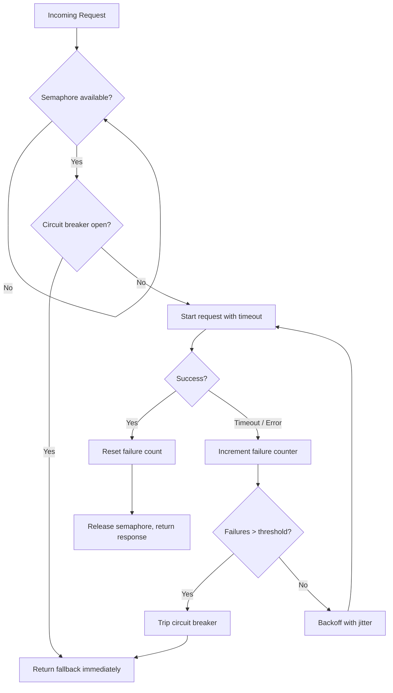

| Difficulty | Channel | Tags |
|---|---|---|
| advanced | backend | asyncio, aiohttp, concurrency |

In 2011, Netflix re-architected its API into a sprawling microservices mesh where a single user request could fan out to dozens of downstream dependencies. The cruelest lesson came when a service that was perfectly healthy — zero bugs, fast code, green dashboards — kept taking down the entire API. All it took was one slow neighbor [1]. This is the story of how that failure mode reshaped resilience engineering, and how you can bake the same defensive instincts into an aiohttp connection pool that degrades gracefully instead of collapsing.

---

> ### Real-World Case — Netflix
>
> By 2011 Netflix had re-architected its API into a highly distributed microservices system where a single user request could fan out to dozens of dependent services. They discovered that when any one downstream dependency became slow or unavailable, the client threads waiting on it would back up, saturate the whole container, and take down the entire API — a service that was otherwise perfectly healthy.
>
> | | |
> |---|---|
> | **Challenge** | Prevent a single latent or failing dependency from cascading into a full-site outage. Concurrency needed to be bounded (so one dependency couldn't consume all resources) and failing calls needed to be cut off and degraded gracefully with a fallback instead of endlessly retrying and amplifying load on the sick service. |
> | **Solution** | Netflix built and open-sourced Hystrix, which combined exactly the patterns in this topic: bulkheading via per-dependency thread pools and semaphores to cap concurrency, timeouts on every remote call, a circuit breaker that trips after the error percentage crosses a threshold (CLOSED → OPEN → HALF-OPEN recovery), and getFallback() graceful degradation. Instead of queuing, it rejects excess requests to shed load and fail fast. |
> | **Outcome** | Within roughly a year Hystrix was handling tens of billions of thread-isolated calls and hundreds of billions of semaphore-isolated calls per day at Netflix, with what Netflix described as a dramatic improvement in uptime and resilience. During real incidents, one tripped circuit returned fallbacks to users (a degraded but functional experience) while preventing the failure from consuming resources and dragging down the other healthy circuits. |
> | **Lesson** | The counterintuitive plot twist Netflix documented: when a circuit trips, the instinct to 'give it breathing room' by increasing thread pools, queue sizes, and timeouts is exactly wrong. If 10 connections were saturated, 20 will also saturate, and you end up holding 2000 connections against an already-struggling backend. The correct move is to shed load and fail fast so the dependency can recover — a circuit breaker releases pressure rather than adding to it. |

---

## Hook — When the Healthy Service Is the One That Kills You

Picture this: it is 2am, and your pager fires. Your service is not the problem. Your service has never been the problem. But right now it is returning 500s to every user, and the dashboards point at a dependency three hops away that got slow. Sound familiar? This is the exact trap Netflix stumbled into when it moved to a distributed API, and it is the trap waiting inside almost every async Python service that calls out to other services. Here is the counterintuitive twist that catches developers off guard: the danger is rarely the dependency that goes fully offline. A dead service fails fast, and fast failures are cheap. The killer is the dependency that stays up but answers slowly. Every waiting coroutine holds memory, every open socket stays open, and the pool fills with zombies. When the pool is full, your own service stops serving — not because it broke, but because it was too polite to hang up on a slow neighbor. The question is not whether this will happen to you. It is whether your connection pool knows how to say no before the whole thing goes down.

## Problem — Latency Is Contagious, and Async Makes It Worse

Before reaching for a solution, you need to feel the shape of the problem. In a synchronous world, a slow downstream call ties up a thread; you run out of threads and the service stalls. Many developers assume asyncio makes this problem disappear. It does not — it just moves the bottleneck. When you await a slow HTTP call in aiohttp, you are not blocking a thread, but you are holding a slot in your connection pool, a reference in memory, and often a semaphore permit. If the downstream service takes 30 seconds to respond and you allow 100 concurrent requests, then after 30 seconds you have 100 stuck requests and zero capacity for anyone else. Consequently, health checks start failing, load balancers drain your instance, and a single degraded dependency cascades into a full outage [2].

The stakes are enormous. A request that fans out to dozens of services amplifies every downstream hiccup. Highly available systems do not fail because of one bad deploy — they fail because a small slowness compounds across every caller. This leads to three questions every pool manager must answer:

- **How many connections should run at once?** Unbounded concurrency is not throughput; it is an outage waiting for a trigger.
- **What happens when a request times out?** Retrying blindly makes the storm worse, not better.
- **When do you stop calling a broken service entirely?** Sometimes the most resilient thing you can do is refuse to try.

Many teams learn these lessons the hard way. The good news is that Netflix already paid the tuition for you.

## Real-World Case — Netflix and the Birth of Hystrix

By 2011, Netflix had re-architected its API into a highly distributed microservices system where a single user request could fan out to dozens of dependent services [1]. The team discovered a brutal failure mode: when any one downstream dependency became slow or unavailable, the client threads waiting on it would back up, saturate the entire container, and take down the whole API — a service that was otherwise perfectly healthy. The dependency did not have to crash. It only had to get slow.

Netflix's fix was Hystrix, a library built around circuit breakers, fallbacks, and resource isolation. The results were staggering: within roughly a year, Hystrix was handling tens of billions of thread-isolated calls and hundreds of billions of semaphore-isolated calls per day, with what Netflix described as a dramatic improvement in uptime and resilience [1]. During real incidents, a single tripped circuit returned fallbacks to users — a degraded but functional experience — while preventing the failure from consuming resources and dragging down the other healthy circuits [1].

Here is the plot twist that should rearrange how you think about your own services: Netflix's breakthrough was not making calls faster. It was making them *fail on purpose*, earlier, so that the rest of the system could keep breathing. That single insight — isolate, timeout, and trip early — is the entire foundation of a production-grade aiohttp pool manager.

## Deep Dive — Semaphores, Timeouts, and Circuit Breakers Working Together

Now that you understand the failure mode, look at the moving parts that neutralize it. A resilient pool is not one mechanism; it is three that reinforce each other.

**Semaphore-based concurrency limiting.** A semaphore caps the number of in-flight requests [3]. When the pool is saturated, new callers wait in a queue instead of storming the downstream service. Crucially, this puts a ceiling on memory usage and socket consumption, which is exactly what prevented Netflix's containers from drowning.

**Timeouts that actually fire.** The default aiohttp behavior is to wait patiently forever, which is precisely what you do not want. An explicit `ClientTimeout(total=...)` guarantees a stuck request releases its semaphore permit and its connection [4]. Timeouts are your cheapest insurance policy.

**Exponential backoff with retries.** A transient blip deserves a retry, but retrying instantly during an outage is like throwing gasoline on a fire [5]. Backoff with jitter spaces retries out so your clients do not synchronize into a thundering herd [6].

**Circuit breaker.** After enough consecutive failures, the breaker trips and rejects calls immediately, returning a fallback instead of hammering a dying service [7]. This is the Hystrix pattern in miniature.

Here is the real tradeoff table — the part documentation tends to gloss over:

| Mechanism | What It Protects | Cost When Misconfigured |
|---|---|---|
| Semaphore | Your memory and sockets | Too low = artificial bottleneck; too high = no protection |
| Timeout | Your pool slots | Too low = false failures; too high = zombies pile up |
| Retry + backoff | Transient failures | Aggressive retries amplify outages |
| Circuit breaker | Downstream services | Trips too easily = unnecessary degradation |

The counterintuitive insight: these mechanisms are not additive safety features. They are a system. A timeout without a semaphore still lets too many requests pile up; a circuit breaker without a timeout never gets the failures it needs to trip. Wire them together, and they tell a coherent story about when to try, when to wait, and when to give up.

## Workflow — The Life of a Request Through a Resilient Pool

Building on the mechanisms above, here is the step-by-step journey every request should take through your pool manager:

1. **Acquire a permit.** The request enters an `asyncio.Semaphore`. If the pool is full, it waits — bounded, not unlimited.
2. **Consult the circuit breaker.** Is the downstream service currently considered unhealthy? If yes, fail fast and return a fallback.
3. **Apply a timeout.** Wrap the actual HTTP call in a `ClientTimeout` so it can never hang indefinitely.
4. **Execute the request.** On success, reset the failure counter and release the permit.
5. **Record the outcome.** On a timeout or client error, increment the failure counter and note the timestamp.
6. **Trip if necessary.** Once failures exceed a threshold within a rolling window, open the circuit so subsequent calls short-circuit.
7. **Retry with backoff.** For recoverable errors, wait an exponentially increasing, jittered interval before retrying.
8. **Release and recover.** After a cooldown, allow a probe request through; if it succeeds, close the circuit.

The diagram below traces that flow, including the two exits that matter most — the fast fallback path and the guarded retry loop.



This flow is the whole game. Notice that the fast-fail path never touches the network, and the retry path is deliberately rate-limited. Those two details are the difference between degradation and disaster.

## Code Example — Implementing the Pool Manager in Python

The following implementation ties the semaphore, timeout, retry, and circuit breaker together into a single `ConnectionPoolManager`. It is a realistic production pattern, not a toy — pay special attention to the exponential backoff with jitter and the single persistent session that enables connection keepalive.

```python
import asyncio
import random
import time
from typing import Optional, Any

import aiohttp

class CircuitOpenError(aiohttp.ClientError):
    """Raised when the circuit breaker is open and we refuse to call downstream."""

class ConnectionPoolManager:
    def __init__(
        self,
        max_connections: int = 100,
        failure_threshold: int = 5,
        cooldown_seconds: float = 60.0,
        total_timeout: float = 30.0,
    ) -> None:
        # Semaphore caps how many requests are in flight at once.
        self._semaphore = asyncio.Semaphore(max_connections)
        self._session: Optional[aiohttp.ClientSession] = None
        self._timeout = aiohttp.ClientTimeout(total=total_timeout)

        # Circuit breaker state.
        self._failure_threshold = failure_threshold
        self._cooldown = cooldown_seconds
        self._failures = 0
        self._last_failure = 0.0

    async def start(self) -> None:
        # One persistent session enables connection keepalive and reuse.
        self._session = aiohttp.ClientSession(timeout=self._timeout)

    async def close(self) -> None:
        # Always clean up on shutdown to avoid leaked connections.
        if self._session is not None:
            await self._session.close()
            self._session = None

    def _circuit_is_open(self) -> bool:
        # Open only while failures are high AND within the cooldown window.
        if self._failures < self._failure_threshold:
            return False
        return (time.monotonic() - self._last_failure) < self._cooldown

    def _record_failure(self) -> None:
        self._failures += 1
        self._last_failure = time.monotonic()

    def _reset(self) -> None:
        self._failures = 0

    async def make_request(self, url: str, max_retries: int = 3) -> Any:
        async with self._semaphore:
            if self._circuit_is_open():
                # Fail fast instead of hammering a sick dependency.
                raise CircuitOpenError("Circuit breaker open")

            for attempt in range(max_retries + 1):
                try:
                    async with self._session.get(url) as response:
                        response.raise_for_status()
                        self._reset()
                        return await response.json()
                except (asyncio.TimeoutError, aiohttp.ClientError):
                    self._record_failure()
                    if attempt == max_retries or self._circuit_is_open():
                        raise
                    # Exponential backoff with jitter avoids retry storms.
                    delay = min(2 ** attempt + random.uniform(0, 0.5), 10.0)
                    await asyncio.sleep(delay)

async def main() -> None:
    pool = ConnectionPoolManager(max_connections=50)
    await pool.start()
    try:
        data = await pool.make_request("https://api.example.com/items")
        print(data)
    finally:
        await pool.close()

if __name__ == "__main__":
    asyncio.run(main())
```

**Walking through it, section by section:**

- **The semaphore** is created once in `__init__`, so every concurrent caller shares the same ceiling. This is the resource-isolation idea straight from Hystrix [1].
- **The persistent `ClientSession`** is created in `start()` and reused for every request. Reusing a session is what allows connection pooling and keepalive [2]; creating a session per request is one of the most common performance mistakes in aiohttp code.
- **`_circuit_is_open()`** combines two conditions — a failure count above the threshold and an elapsed time inside the cooldown window. This is the state machine that gives you automatic recovery: after the cooldown passes, one probe request is allowed through to test the water.
- **`make_request()`** wraps everything in the semaphore first, so a tripped breaker still releases resources instantly.
- **The retry loop** catches only timeouts and client errors — not programmer mistakes like `KeyError` — and applies exponential backoff with random jitter, capped at 10 seconds to keep latency bounded [6].
- **`close()`** is called in a `finally` block because forgetting to close a session is a classic connection leak that surfaces only under load.

If this feels like a lot at first, you are not alone. Start with just the semaphore and the timeout. Add the circuit breaker once you have real failure data to tune the threshold against.

## Lessons Learned — What to Do Differently Tomorrow

The journey from a naive `session.get(url)` to a resilient pool manager mirrors the journey Netflix took with Hystrix. Here are the takeaways worth pinning to your team's wall:

- **Slow is more dangerous than down.** A fast failure is a gift; a slow success is a trap. Configure timeouts so slow responses become fast failures [4].
- **Bound your concurrency.** A semaphore is not a performance limiter — it is an outage preventer [3].
- **Retry with backoff and jitter, never in lockstep.** Uncoordinated retries turn a hiccup into a stampede [5][6].
- **Trip the breaker, return a fallback.** Degraded-but-functional beats down. Netflix measured the difference in billions of calls per day [1].
- **Reuse one session, close it on shutdown.** Leaked connections are invisible until they are catastrophic [2].
- **Watch out for the false sense of async safety.** Many developers believe asyncio removes the need for these patterns. It does not — it changes the resource being exhausted.

⚠️ **Battle scar to avoid:** the most common mistake is tuning the semaphore and timeout in isolation without watching real metrics. Set the pool size from observed p99 latency and downstream capacity, not from a guess. 🔥 **Hot take:** if your service has no circuit breaker, you do not have a resilient service — you have a service that has not met its first slow dependency yet.

> **Pro tip:** during startup, warm the pool with a few health-check requests. It surfaces bad TLS configuration or DNS problems before real user traffic arrives. The moral of the story? Resilience is not about being fast. It is about knowing when to stop.

---

## Resilient Request Flow


<details>
<summary><strong>Original Interview Question</strong></summary>

**Q:** How would you implement a connection pool manager for aiohttp that handles graceful degradation under high load and connection timeouts?

**A:** Implement a connection pool manager for aiohttp using a semaphore to limit concurrent connections, exponential backoff for retrying failed requests, and circuit breaker pattern to gracefully degrade under high load and connection timeouts.

</details>

## Conclusion

Netflix learned the hard way that a healthy service can die at the hands of a slow neighbor — and Hystrix was born to make that impossible [1]. You do not need a massive resilience framework to apply the same lesson. Start tomorrow by adding a bounded semaphore and an explicit timeout to your aiohttp client, then layer in exponential backoff and a circuit breaker once you have real failure metrics to tune against. The one insight worth sharing with your team: in distributed systems, the goal is not to never fail — it is to fail fast, fail small, and keep everything else breathing. Degraded beats down, every single time.

---

## References

1. [Netflix incident report](https://netflixtechblog.com/introducing-hystrix-for-resilience-engineering-13531c1ab362) — article
2. [aiohttp Client Quickstart](https://docs.aiohttp.org/en/stable/client_quickstart.html) — documentation
3. [Python asyncio Synchronization Primitives (Semaphore)](https://docs.python.org/3/library/asyncio-sync.html) — documentation
4. [aiohttp Client Reference (ClientTimeout)](https://docs.aiohttp.org/en/stable/client_reference.html) — documentation
5. [Exponential Backoff](https://en.wikipedia.org/wiki/Exponential_backoff) — article
6. [AWS Prescriptive Guidance: Retry with Backoff Pattern](https://docs.aws.amazon.com/prescriptive-guidance/latest/cloud-design-patterns/retry-backoff.html) — documentation
7. [Circuit Breaker Design Pattern](https://en.wikipedia.org/wiki/Circuit_breaker_design_pattern) — article
8. [Python asyncio Tasks and Coroutines](https://docs.python.org/3/library/asyncio-task.html) — documentation
9. [MDN: Connection Management in HTTP](https://developer.mozilla.org/en-US/docs/Web/HTTP/Connection_management_in_HTTP_1.x) — documentation

---

**Author:** Satishkumar Dhule — [GitHub](https://github.com/satishkumar-dhule) · [LinkedIn](https://linkedin.com/in/satishkumar-dhule) · [Website](https://satishkumar-dhule.github.io)
