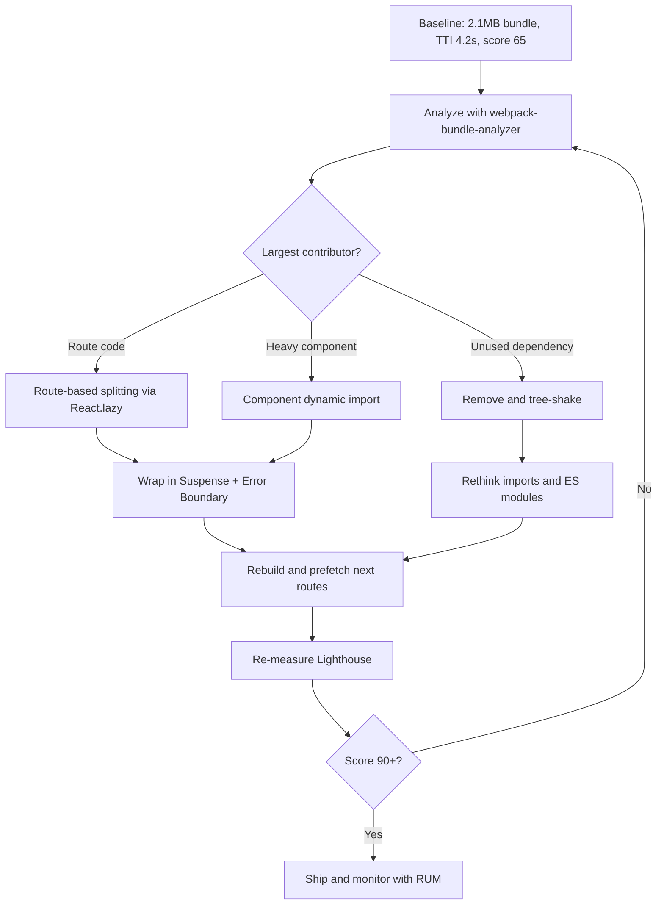

| Difficulty | Channel | Tags |
|---|---|---|
| intermediate | frontend | lighthouse, bundle, lazy-loading |

Picture this: a user taps a Pinterest link on a mid-range Android phone and then... waits. And waits. The page finally becomes interactive after a reported 23 seconds, long after most people have given up and gone back to the app. To fix it, Pinterest rebuilt its mobile web as a Progressive Web App and cut its core JavaScript bundle from 650KB down to 150KB, dropping Time To Interactive to 5.6s [1]. That transformation wasn't magic — it was a disciplined process of bundle analysis, code splitting, and lazy loading that any team can replicate, and this article walks you through that exact journey.

---

> ### Real-World Case — Pinterest
>
> In 2017 Pinterest rebuilt its mobile web experience as a Progressive Web App. The old mobile web site was a monolith that shipped a 650KB core JavaScript bundle (plus ~1MB lazy-loaded), causing pages to take a reported 23 seconds to become interactive on mobile devices.
>
> | | |
> |---|---|
> | **Challenge** | The JavaScript-heavy monolith pushed out page load and interactivity on mobile hardware; parse/compile of multi-megabyte bundles kept the main thread busy so pages were slow to become responsive, hurting engagement and signup conversion. |
> | **Solution** | The team split multi-megabyte bundles into three webpack chunk categories (a ~73KB vendor chunk for React/Redux/react-router, a ~72KB entry chunk with the app shell, and 13-18KB async route chunks), adopted route-level code splitting with React Router and component-level splitting, used webpack-bundle-analyzer/Bonsai to spot duplicate code across async chunks and hoist it into the main chunk, and added a Service Worker for runtime plus precaching of vendor/entry chunks. |
> | **Outcome** | Core bundle cut from 650KB to 150KB, First Meaningful Paint dropped from 4.2s to 1.8s, and Time To Interactive fell from 23s to 5.6s (3.9s on repeat visits via Service Worker caching). Home page JS payload went from ~490KB to ~190KB after a year of PWA operation. |
> | **Lesson** | Breaking a monolith into route- and component-level chunks plus visualizing bundle composition turns JS size into a manageable, measurable engineering problem—and the counterintuitive move of growing the entry chunk by 20% shrank every lazy-loaded chunk by up to 90%, proving shared-code placement matters more than raw chunk count. |

---

## Hook — The 4.2-Second Tab Close

Here is a number worth sitting with: 4.2 seconds. That is your current Time to Interactive, and it is the reason users are bouncing before your beautifully crafted UI ever paints. Your Lighthouse score sits at 65, your bundle weighs a monstrous 2.1MB, and somewhere a product manager is asking why the app "feels slow" on mobile while it flies on a developer's maxed-out laptop.

Sound familiar? Every team hits this wall. The app started small, and then one dependency became five, one shared component became a kitchen sink, and suddenly you are shipping an entire analytics SDK, a date library, and three charting engines to render a landing page. Many developers reach for a memoization hook and hope for the best. That is like putting premium fuel in a car with a flat tire.

The real question is not "how do I make React faster?" It is "why are we sending code the user will never run?" Answer that, and the score climbs on its own. So how did a company serving hundreds of millions of users solve exactly this problem at scale?

## Problem — You Are Shipping Code Nobody Asked For

The core issue with a bloated bundle is deceptively simple: you are downloading, parsing, and executing JavaScript that the current screen does not use. A monolithic bundle forces every user to pay for every feature — the admin dashboard, the rarely visited settings page, the heavyweight charting library, all of it, on first load.

Why does this hurt so much more on mobile? Because parsing JavaScript is expensive on lower-end hardware. A 2.1MB bundle must be transferred over a shaky network, decompressed, parsed by a slower CPU, and only then does your first render begin. Each of those steps stacks latency on top of latency. Consequently, a 4.2s Time to Interactive on a fast laptop can easily become 15-20s on a budget phone — the exact devices a huge slice of your traffic actually uses [7].

This is not just a pet metric. Lighthouse scores correlate with real business outcomes: faster pages convert better, rank better, and retain users longer. Specifically, teams that reduce main-thread blocking time see measurable gains in session duration. The stakes are real — but the fix is more nuanced than most developers assume, because the naive answer of "just split everything" creates its own set of problems. To understand the trade-offs, it helps to see what happened when a company with a genuine performance crisis rewrote the rules.

## Real-World Case — Pinterest and the 23-Second Mobile Web

In 2017, Pinterest faced a hard truth: its mobile web experience was a monolith. The legacy site shipped a 650KB core JavaScript bundle, plus roughly 1MB more loaded lazily in a way that still blocked interactivity, and pages reportedly took 23 seconds to become interactive on mobile devices [1]. Users tapped, waited, and left.

Pinterest's response was to rebuild the mobile web as a Progressive Web App, treating performance as a first-class feature rather than an afterthought. The results were dramatic. The core bundle shrank from 650KB to 150KB, First Meaningful Paint dropped from 4.2s to 1.8s, and Time To Interactive fell from a brutal 23s to 5.6s — and down to 3.9s on repeat visits thanks to Service Worker caching [1]. Over the following year of PWA operation, the home page JS payload shrank from roughly 490KB to about 190KB.

Notice what Pinterest did not do. They did not invent a secret framework or throw hardware at the problem. They analyzed what was actually in the bundle, split it along route and component boundaries, and used caching to make repeat visits nearly instant. That last point is the plot twist: the biggest wins often come from not shipping code at all. So how do you apply this thinking to an ordinary React app sitting at a Lighthouse 65?

## Deep Dive — Splitting, Shaking, and the Lazy-Loading Trade-offs

Before touching a single import, you need data. Bundle analysis is the flashlight that shows you the monster. Tools like webpack-bundle-analyzer render an interactive treemap of every module in your build, revealing the chunks that quietly dominate your payload [4]. More often than not, one or two dependencies account for half the weight — a moment/moment-timezone combo, a full lodash import, or an entire icon library where you use three icons.

Once you can see the bloat, three techniques do the heavy lifting:

- **Code splitting** breaks your single bundle into smaller chunks that load on demand. Route-based splitting is the highest-leverage starting point; component-based splitting targets heavy widgets that are not needed for the initial paint [3].
- **Tree shaking** removes dead code by static analysis, but only if you use ES modules and avoid side-effectful imports. Importing `lodash` wholesale defeats it; importing `lodash/debounce` does not [5].
- **Lazy loading** defers non-critical resources — images, below-the-fold components, third-party scripts — until they are actually needed [6].

However, there is a trap. Over-splitting creates a waterfall of tiny requests, and each chunk adds a round trip. A critical route that loads behind five sequential dynamic imports can feel slower than one well-sized bundle. Moreover, lazy loading without a thoughtful fallback causes jarring layout shifts and content flicker, which hurts perceived performance even when the network numbers improve.

That tension is why tooling matters. Suspense boundaries give you a declarative way to show fallbacks while chunks load [2], and error boundaries prevent a failed chunk fetch from white-screening your entire app. The right mental model is not "smaller is always better" — it is "ship the minimum viable code for the current screen, then prefetch intelligently for the next step."

## Workflow — A Repeatable Optimization Loop

The workflow below turns guesswork into a measurable loop. Each pass tightens the bundle, and you re-measure until the Lighthouse score crosses 90.



The loop looks like this in practice:

1. **Measure a baseline.** Record bundle size and Lighthouse TTI before any change, so you can prove impact later.
2. **Analyze the bundle.** Identify the top three modules by parsed size; they will define your first targets [4].
3. **Split by route first.** Routes are natural boundaries — a user on `/dashboard` does not need `/analytics` code yet [3].
4. **Lift heavy components out.** Charting libraries, rich text editors, and maps are prime candidates for component-level dynamic imports.
5. **Prune dependencies.** Replace bloated packages, switch to tree-shakeable ES modules, and drop dead code [5].
6. **Guard the boundaries.** Add Suspense fallbacks and error boundaries so a slow or failed chunk never breaks the page [2].
7. **Prefetch what comes next.** When a user lands on a list, prefetch the detail route so navigation feels instant.
8. **Re-measure and iterate.** Repeat the loop until the score stabilizes above 90.

This is the same disciplined, metrics-first approach that took Pinterest from a 650KB core bundle to 150KB [1]. It is not a one-time cleanup; it is a habit. And the habits become concrete the moment you see the code.

## Code Example — Wiring Up Route and Component Splitting

The snippet below implements the two highest-leverage patterns in one place: route-based splitting for entire screens, and component-based splitting for a heavy widget. Notice the `webpackChunkName` comments — they give each chunk a readable name so your bundle analyzer stays legible [4].

```javascript
import React, { lazy, Suspense } from 'react';
import { Routes, Route } from 'react-router-dom';
import ErrorBoundary from './ErrorBoundary';

// Route-based code splitting: each screen ships its own chunk.
// A user on /dashboard never downloads the /analytics code.
const Dashboard = lazy(() =>
  import(/* webpackChunkName: "dashboard" */ './routes/Dashboard')
);
const Analytics = lazy(() =>
  import(/* webpackChunkName: "analytics" */ './routes/Analytics')
);

// Component-based splitting: keep a heavy, non-critical widget
// out of the initial bundle. It loads only when it actually renders.
const HeavyChart = lazy(() =>
  import(/* webpackChunkName: "chart" */ './components/HeavyChart')
);

function AnalyticsView() {
  return (
    // Suspense shows a fallback while the chart chunk downloads.
    <Suspense fallback={<ChartSkeleton />}>
      <HeavyChart />
    </Suspense>
  );
}

function App() {
  return (
    // An error boundary stops a failed chunk fetch from white-screening the app.
    <ErrorBoundary>
      <Suspense fallback={<LoadingSpinner />}>
        <Routes>
          <Route path="/dashboard" element={<Dashboard />} />
          <Route path="/analytics" element={<AnalyticsView />} />
        </Routes>
      </Suspense>
    </ErrorBoundary>
  );
}

export default App;
```

**What this does, step by step:**

- `lazy(() => import(...))` tells the bundler to emit a separate chunk and fetch it only when the component first renders [2]. This is the engine of code splitting.
- The `webpackChunkName` comments label the output chunks, which keeps your treemap readable when you run the analyzer [4].
- The outer `Suspense` covers route-level chunk loading, so navigation shows a spinner instead of a blank screen.
- The inner `Suspense` around `HeavyChart` isolates the chart's load time from the rest of the analytics view — the page shell paints immediately while the chart streams in.
- The `ErrorBoundary` is the safety net. When a chunk fails to download on a flaky connection, the boundary degrades gracefully instead of crashing the tree.

The key design decision is where to draw the boundaries. Routes are obvious; components require judgment. Split a component when it is heavy *and* not needed for the first meaningful paint — otherwise you pay a round trip for no perceived benefit.

## Lessons Learned — What to Do Differently Tomorrow

The journey from a 65 to a 90+ Lighthouse score is less about clever tricks and more about discipline. Pinterest's rebuild proved that a 650KB core bundle can become 150KB and a 23-second TTI can fall to 5.6s without a ground-up rewrite [1] — but only if you follow the data.

Here are the takeaways worth sharing with your team:

- **Measure before you optimize.** Without a baseline, you cannot prove impact, and you will optimize the wrong chunk [4].
- **Split by routes, then by components.** Routes are free wins; components need judgment based on whether they block first paint [3].
- **Beware the over-splitting trap.** Too many chunks create a request waterfall. Fewer, well-sized chunks with prefetching beat dozens of tiny ones.
- **Tree shaking requires discipline.** Use ES modules, avoid side-effectful imports, and import submodules directly [5].
- **Lazy load beyond JavaScript.** Images and third-party scripts are frequently the biggest offenders and often the easiest to defer [6].
- **Cache aggressively for repeat visits.** Service Workers turned Pinterest's 5.6s TTI into 3.9s on return trips — a 30% gain for free [1][7].

⚠️ **Watch Out:** A lazy-loaded component without an error boundary is a production incident waiting to happen. When a chunk 404s after a deploy, users on stale tabs get cryptic errors. Always pair dynamic imports with a boundary and a sensible retry.

💡 **Insight:** The fastest code is code you never ship. Every dependency removed beats every dependency optimized.

The moral of the story? Performance is a feature you maintain, not a project you finish. Start with analysis, split along real boundaries, verify with metrics, and let caching reward your returning users.

---

## Bundle Optimization Workflow


<details>
<summary><strong>Original Interview Question</strong></summary>

**Q:** You're tasked with improving a React app's Lighthouse performance score from 65 to 90+. The bundle size is 2.1MB and Time to Interactive is 4.2s. What specific steps would you take to optimize the bundle and implement lazy loading?

**A:** Implement code splitting with React.lazy() and Suspense, analyze bundle composition with webpack-bundle-analyzer to identify largest chunks, remove unused dependencies and optimize imports, add dynamic imports for heavy components and third-party libraries, implement route-based splitting for better initial load times, and utilize tree shaking with proper ES module configuration.

</details>

## Conclusion

Two years and one PWA rebuild later, Pinterest had cut its core bundle by over 75% and its Time To Interactive from 23 seconds to under 6 [1]. You do not need hundreds of millions of users to benefit from the same playbook. Tomorrow, open your build, run webpack-bundle-analyzer, and find the single heaviest chunk [4]. Split it along the nearest route boundary with React.lazy and Suspense [2], add an error boundary, rebuild, and re-run Lighthouse [9]. Then repeat. The memorable insight to share with your team: the fastest code is the code you never ship — so stop asking how to make your bundle faster and start asking why it is so big in the first place.

---

## References

1. [Pinterest incident report](https://medium.com/dev-channel/a-pinterest-progressive-web-app-performance-case-study-3bd6ed2e6154) — article
2. [React lazy — Lazy-load components on demand](https://react.dev/reference/react/lazy) — documentation
3. [React Suspense — Display a fallback while content loads](https://react.dev/reference/react/Suspense) — documentation
4. [webpack-bundle-analyzer — Interactive bundle treemap](https://github.com/webpack-contrib/webpack-bundle-analyzer) — documentation
5. [Tree shaking — Dead code elimination](https://en.wikipedia.org/wiki/Tree_shaking) — paper
6. [MDN — Lazy loading](https://developer.mozilla.org/en-US/docs/Web/Performance/Lazy_loading) — documentation
7. [MDN — Service Worker API](https://developer.mozilla.org/en-US/docs/Web/API/Service_Worker_API) — documentation
8. [web.dev — Reduce JavaScript payloads with code splitting](https://web.dev/articles/reduce-javascript-payloads-with-code-splitting) — blog
9. [Lighthouse — Automated auditing for web performance](https://github.com/GoogleChrome/lighthouse) — documentation

---

**Author:** Satishkumar Dhule — [GitHub](https://github.com/satishkumar-dhule) · [LinkedIn](https://linkedin.com/in/satishkumar-dhule) · [Website](https://satishkumar-dhule.github.io)
