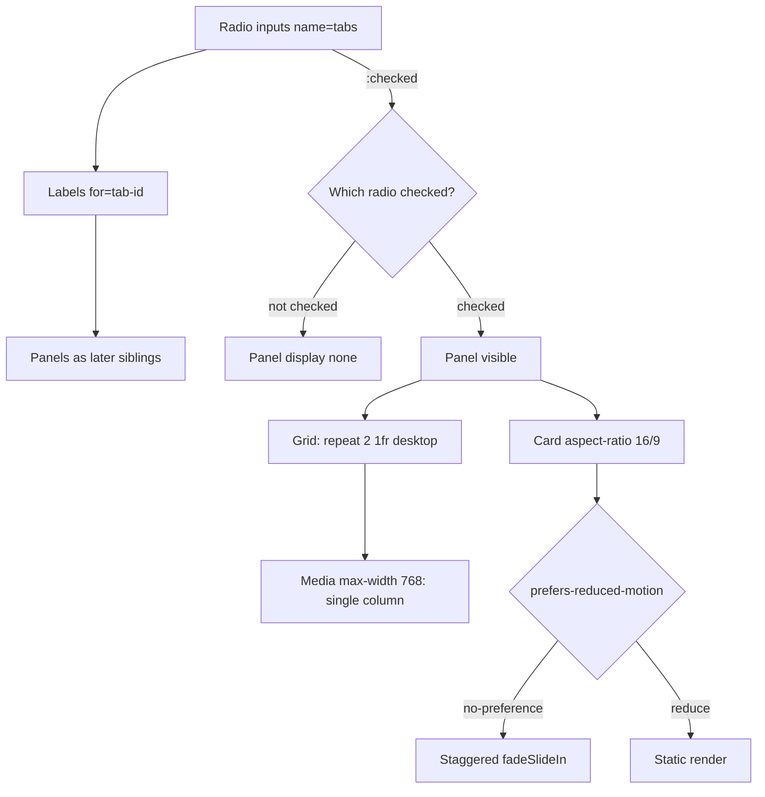

| Difficulty | Channel | Tags |
|---|---|---|
| beginner | frontend | css, flexbox, grid, animations |

In September 2013, Apple shipped the iOS 7 redesign and, almost overnight, turned everyday phone use into a nausea trigger for thousands of people — parallax wallpapers, zooming app launches, and slide transitions that some users simply could not tolerate [1]. One iOS developer described having to close her eyes during screen transitions just to avoid vertigo [1]. That moment is why `prefers-reduced-motion` exists in every modern browser today — and it is the exact principle you need to master before you build the "simple" CSS-only tab panel a design system asks for.

---

> ### Real-World Case — Apple
>
> When Apple shipped the iOS 7 redesign in September 2013, it introduced far more aggressive motion than rival systems: parallax wallpapers that shifted as you tilted the device, zooming app-launch transitions, and slide animations. Within days, a wave of users reported dizziness, vertigo, and nausea from simply using their phones; iOS developer Jenni Leder described having to close her eyes during transitions.
>
> | | |
> |---|---|
> | **Challenge** | Apple's signature motion design was physically harming users with vestibular disorders and motion sensitivity, and there was no way for those users to turn it off. A core visual-design decision had become an OS-level accessibility failure for a significant slice of the user base. |
> | **Solution** | In iOS 7.1 (March 2014) Apple added a 'Reduce Motion' switch under Settings > General > Accessibility that replaced zoom/slide transitions with cross-dissolves and disabled the parallax effect, giving users a first-class way to signal that non-essential motion should be removed. That OS-level preference eventually became the exact signal the Web platform exposes to CSS as the `prefers-reduced-motion` media query used in this tab-panel pattern. |
> | **Outcome** | The setting shipped to hundreds of millions of iOS devices and set the precedent the Web adopted: `prefers-reduced-motion` is now supported in Chrome, Firefox, Safari, Edge and mobile browsers, and is cited by W3C/WAI as the mechanism for WCAG 2.1 SC 2.3.3 (Animation from Interactions). Apple's own accessibility documentation still describes the behavior today. |
> | **Lesson** | Motion that delights one user can make another physically sick, so animation must be treated as opt-in with an accessible fallback. That is why modern implementations wrap entrance/stagger animations in `@media (prefers-reduced-motion: no-preference)` instead of applying them unconditionally. |

---

## Hook — The Motion Nobody Asked For

Picture a design-system docs page. Tabs, cards, a subtle entrance animation. Harmless, right? Now imagine the same animation playing on a phone while a user with a vestibular disorder tries to read your docs. What felt like polish to you is a physical assault to them. Apple learned this the hard way in 2013, when a wave of users reported dizziness and nausea from iOS 7's aggressive motion [1]. The lesson landed with the entire industry: motion is not a free decoration, it is an accessibility decision. And the cruelest part? The feature that protects users — `prefers-reduced-motion` — takes about four lines of CSS to respect. Four lines between delight and discomfort. Keep that tension in mind, because the tab panel you are about to build is the perfect place to get this right or spectacularly wrong.

## Problem — Tabs Without JavaScript, and Without Excuses

Here is the brief that trips up a surprising number of developers: build a tabbed panel for a design-system docs page using no JavaScript. On desktop, each tab shows a 2×2 grid of cards; on mobile, those cards collapse to a single column. Every card has a fixed 16:9 image area, a title, and a short meta line. Oh, and add a subtle staggered entrance animation — but respect `prefers-reduced-motion`, and keep `:focus-visible` outlines intact for keyboard users.

Why is this hard? Because most developers reach for state, and state lives in JavaScript. Tabs feel like a state machine: which panel is open? So the instinct is `useState`, an event handler, a click listener. Strip that away and you must re-learn a truth every front-end veteran eventually discovers: CSS already has a state machine, and it is called the `:checked` pseudo-class.

The stakes are bigger than aesthetics. If the tab order is wrong, keyboard users get trapped. If you hide panels with `display:none` but forget focus, screen-reader users land in invisible content. If your entrance animation ignores motion preferences, you ship the iOS 7 problem to your own users. Consequently, this "beginner" exercise quietly tests four senior-level instincts at once: layout, state, accessibility, and empathy.

## Real-World Case — Apple and the iOS 7 Motion Sickness Wave

When Apple shipped iOS 7 in September 2013, it doubled down on motion as a design language. Parallax wallpapers shifted as you tilted the device. Apps zoomed open from their icons. Screens slid in and out. It felt futuristic — until it felt awful. Within days, a wave of users reported dizziness, vertigo, and nausea from simply using their phones, and iOS developer Jenni Leder described needing to close her eyes during transitions to avoid the effect [1].

The reaction was loud enough to force a response. Apple shipped the "Reduce Motion" accessibility setting, which replaced the parallax and zoom effects with a simple cross-fade — still polished, but survivable for motion-sensitive users [1]. More importantly, the episode pushed the wider industry to standardize a media query that could ask the operating system, "Does this user want less motion?" That query is `prefers-reduced-motion`, now supported in Chrome, Firefox, Safari, and Edge, and cited by the W3C as the mechanism for WCAG 2.1 Success Criterion 2.3.3, Animation from Interactions [2][3].

Here is the plot twist: the setting that shipped to hundreds of millions of devices was not a niche edge case. Roughly a third of adults experience some form of motion sensitivity, and vestibular disorders affect millions — meaning a "subtle" animation is a real accessibility hazard at scale, not a theoretical one [4]. Apple did not design for the median user; the incident forced them to design for the edges. That is the standard your tab panel now inherits.

## Deep Dive — The CSS State Machine Behind the Curtain

Building on that lesson, let's dissect why radio inputs are the right state primitive. A radio group is governed by a shared `name` attribute: give five radios the same name and the browser guarantees exactly one is `:checked` at a time [5][6]. That is a free, native, accessible state machine. Pair each radio with a ``, and clicking the label toggles the radio — no JavaScript required. Because the label's `for` attribute creates a proper association, keyboard users get the same behavior for free: arrow keys move selection within a radio group, and the browser manages focus semantics for you [5].

Now the clever part: how does `:checked` reveal a panel? Through the sibling combinator. If every panel is a sibling that follows its radio in the DOM, then `.tabs input:not(:checked) ~ .panel { display: none; }` hides all panels whose radio is not selected. The general sibling combinator (`~`) selects any later sibling, not just the immediate one — that is what makes the flat markup structure work [7]. Reorder your DOM so a panel sits before its radio and the whole trick collapses. This is the single most common battle scar developers hit.

For layout, CSS Grid gives you a declarative responsive switch. Setting `grid-template-columns: repeat(2, 1fr)` produces the desktop 2×2, and a single `@media (max-width: 768px)` block reassigns it to `1fr` for mobile [8]. No floats, no flex-basis math, no `clearfix` — just one rule that reads like an intention. The fixed image area comes from `aspect-ratio: 16 / 9`, a property that reserves space before the image loads and prevents the dreaded layout shift [9].

Then there is motion. The animation must be intentional and reversible. By wrapping the `@keyframes` in `@media (prefers-reduced-motion: no-preference)`, the animation simply never gets defined when a user prefers reduced motion [2]. This is not a hack — it is the documented, recommended pattern, and it satisfies WCAG 2.3.3 [3]. Finally, `:focus-visible` outlines only appear for keyboard navigation, so you keep accessibility without ugly rings on every mouse click [10]. Here is a quick trade-off table to make the choices concrete:

| Decision | Naive approach | Production choice | Why it matters |
|---|---|---|---|
| Tab state | JavaScript `onclick` | Radio `:checked` | Zero JS, native a11y |
| Panel visibility | `height:0` tricks | `:not(:checked) ~ .panel` | Predictable, no reflow jank |
| Image sizing | Fixed `height` | `aspect-ratio: 16/9` | No layout shift [9] |
| Animation | Always on | Gated by motion query | Protects users [2][3] |

💡 Insight: The radio trick is not a hack. It is the browser's own accessibility model doing the work your framework would otherwise reimplement — usually worse.

## Workflow — From Inputs to Panels, Step by Step

This leads to a repeatable assembly order. Get the DOM sequence right and the CSS almost writes itself; get it wrong and you will debug selectors for an hour. The diagram below captures the flow.

The steps are straightforward but order-dependent:

1. Declare one radio input per tab, all sharing `name="tabs"`, with the first marked `checked` so a panel is visible on load.
2. Immediately follow the inputs with their labels, each using `for="tab-"` so the association is explicit.
3. Place one `` sibling per tab, after the labels, in the same relative order as the radios.
4. Use the general sibling combinator to hide panels whose radio is not selected.
5. Lay out cards with `grid-template-columns: repeat(2, 1fr)`, then override to a single column under 768px.
6. Give each image container `aspect-ratio: 16 / 9` to lock proportions.
7. Gate the staggered `@keyframes` behind `prefers-reduced-motion: no-preference`.
8. Keep `:focus-visible` outlines and never remove them with `outline: none`.

The critical insight is that steps 1–3 are structural: the browser's state machine reads the DOM order, so the panel must come after the controls. If you picture the DOM as a timeline, the radio fires the event and every panel downstream listens. That is why a "no JavaScript" tab panel is really a DOM-ordering puzzle disguised as a styling exercise.

## Code Example — Wiring the Pieces Together

The JavaScript below never runs at interaction time — it exists only to generate the markup the CSS state machine depends on. That distinction matters: after the HTML lands in the DOM, the tabs work with zero runtime JS, which means they survive a failed bundle load and keep working for users with scripting disabled.

The key lines are annotated. Notice how the input, label, and panel are emitted together per tab so their DOM order is never accidental, and how the card structure always includes the `aspect-ratio` image container plus title and meta line.

## Lessons Learned — Ship Motion That Respects Your Users

Apple's 2013 stumble was not a story about bad taste. It was a story about a team optimizing for delight while a measurable slice of their users paid the price in physical discomfort [1]. The industry's answer, `prefers-reduced-motion`, is now baked into every major browser and enshrined in WCAG 2.1 SC 2.3.3 [2][3] — and it costs you almost nothing to honor.

Here is what to carry forward:

- Structure beats cleverness. The radio/label/panel order is the entire mechanism; get the DOM right and the CSS is trivial [7].
- `aspect-ratio` is not optional polish. It reserves space and eliminates cumulative layout shift, which is both a UX and a Core Web Vitals win [9].
- Never remove focus outlines. Replace `:focus-visible` styling thoughtfully; keyboard users depend on it [10].
- Motion lives behind a media query. Wrap `@keyframes` in `prefers-reduced-motion: no-preference` so the default is inclusive [2].
- Test with your keyboard and with reduced motion enabled. Two settings, five minutes, and you catch the bugs that ship to millions.

⚠️ Watch Out: The most common failure is a DOM order that breaks the sibling combinator — a panel nested inside a wrapper div no longer qualifies as a sibling of the radio. Flatten the structure.

So what should you do differently tomorrow? Before adding any animation, ask the question Apple's engineers had to learn the hard way: who is this motion for, and who does it hurt? The tabs still look great. They just no longer make anyone close their eyes. That is the difference between shipping a feature and shipping an accessible one — and it is a one-line insight worth sharing with your team the next time someone says "let's add a little motion."

---

## CSS-Only Tab State Flow

<strong>Original Interview Question</strong>

**Q:** Build a CSS-only tab panel for a design-system docs page. Use radio inputs to switch tabs (no JavaScript). Desktop: a 2x2 grid of cards under each tab; mobile: single column. Each card has a fixed 16:9 image area, a title, and a short meta line. Add a subtle entrance animation with a stagger and keep focus-visible outlines; ensure prefers-reduced-motion is respected?

**A:** Use a set of radio inputs with a shared `name` attribute and corresponding `` elements for each tab section. The `:checked` state of each radio controls visibility of its associated panel via adjacent sibling selectors. Each panel renders a 2×2 card grid on desktop and collapses to a single column on mobile. Cards use `aspect-ratio: 16/9` for fixed image containers, with a title and meta line below.

## Conclusion

Apple's iOS 7 taught the industry an expensive lesson: motion is not neutral, and the users it hurts are not hypothetical [1]. The good news is that honoring `prefers-reduced-motion`, fixing your DOM order, and using `:focus-visible` takes minutes, not sprints. Build the tabs, then immediately test them two ways — tab through with the keyboard, and enable reduced motion — before you ship. The memorable takeaway to share with your team: every animation is a promise to delight some users and a risk to others, so let the user's OS decide which one wins.

---

## References

1. [Apple incident report](https://www.theguardian.com/technology/2014/mar/13/apple-iphone-ipad-ios-71-motion-sickness) — article
2. [MDN: prefers-reduced-motion media query](https://developer.mozilla.org/en-US/docs/Web/CSS/@media/prefers-reduced-motion) — documentation
3. [W3C WAI: Understanding SC 2.3.3 — Animation from Interactions](https://www.w3.org/WAI/WCAG21/Understanding/animation-from-interactions.html) — documentation
4. [Wikipedia: Motion sickness](https://en.wikipedia.org/wiki/Motion_sickness) — article
5. [MDN: :checked pseudo-class](https://developer.mozilla.org/en-US/docs/Web/CSS/:checked) — documentation
6. [MDN: Radio input element](https://developer.mozilla.org/en-US/docs/Web/HTML/Element/input/radio) — documentation
7. [MDN: General sibling combinator (~)](https://developer.mozilla.org/en-US/docs/Web/CSS/General_sibling_combinator) — documentation
8. [MDN: CSS Grid Layout](https://developer.mozilla.org/en-US/docs/Web/CSS/CSS_grid_layout) — documentation
9. [MDN: aspect-ratio property](https://developer.mozilla.org/en-US/docs/Web/CSS/aspect-ratio) — documentation
10. [MDN: :focus-visible pseudo-class](https://developer.mozilla.org/en-US/docs/Web/CSS/:focus-visible) — documentation

---

**Author:** Satishkumar Dhule — [GitHub](https://github.com/satishkumar-dhule) · [LinkedIn](https://linkedin.com/in/satishkumar-dhule) · [Website](https://satishkumar-dhule.github.io)
