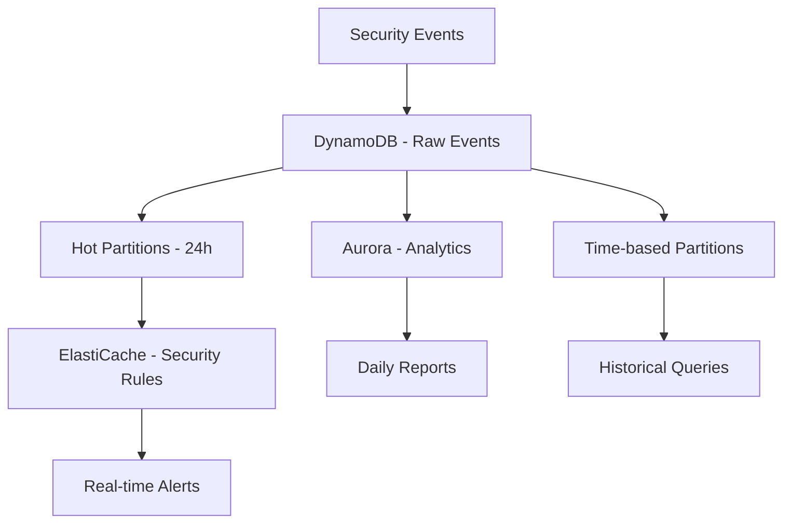

| Difficulty | Channel | Tags |
|---|---|---|
| intermediate | aws | rds, aurora, dynamodb, elasticache |

Ever had your API crash at 3am because your database couldn't handle the security event tsunami? We've all been there - watching monitoring graphs spike while frantically trying to keep the lights on. Let's talk about building a database architecture that laughs at 10M+ daily events instead of crying.

---

## The Three-Headed Database Dragon

When you're drowning in security events, you need more than just one database. Think of it like a kitchen: you wouldn't use a butter knife to chop vegetables, debone a chicken, and frost a cake. Each AWS service has its sweet spot: 💡 Pro Tip : The magic isn't in choosing ONE database - it's in orchestrating all three like a symphony conductor. Service Best For When It Screams "Help Me" DynamoDB High-velocity writes, simple reads You need complex joins or ad-hoc queries Aurora Analytics, complex queries Your write throughput exceeds 100K/sec ElastiCache Hot data, caching Your cache hit rate drops below 80% 🔥 Hot Take : Most engineers over-engineer with Aurora from day one. Start with DynamoDB and add Aurora only when your analytics queries start timing out.

## Partitioning Strategy: The Art of Not Creating Hot Spots

Hot partitions are the silent killers of scalable systems. They're like that one checkout lane at the grocery store that always has 20 people while others are empty. ⚠️ Gotcha : Using just the date as your partition key is a rookie mistake. Everyone's security events for October 15th end up in the same partition, creating a massive bottleneck. Here's the battle-tested strategy: // Smart partitioning that distributes load const partitionKey = `security-events#${date.slice(0, 7)}#${hash(event.sourceIP) % 100}`; const sortKey = `${event.timestamp}#${event.eventType}`; // Hot partition for recent data (last 24h) if (isRecentEvent(timestamp)) { const hotPartition = `security-events#hot#${date.slice(0, 10)}#${hash(event.sourceIP) % 50}`; // Write to both hot and regular partition for read performance } 🎯 Key Insight : The hash modulo distributes events across 100 partitions, preventing any single partition from becoming the bottleneck.

## Real-World Scale Numbers

Let's talk actual scale, not theoretical fluff: Events per second : ~116 (10M / 24h / 3600s) Peak bursts : Up to 1,000 events/sec during attacks Storage needed : ~50GB/day (assuming 5KB per event) Read latency requirement : The architecture that actually works at scale: DynamoDB: Handles the write firehose with auto-scaling ElastiCache: Stores security rules with 99.9% hit rate Aurora: Runs nightly analytics jobs (not real-time queries) Real-World Case Study Netflix Netflix processes billions of viewing events daily using a similar multi-database approach. They use DynamoDB for real-time event ingestion, Cassandra (similar to Aurora) for analytics, and Redis (ElastiCache) for user session data and recommendations caching. Key Takeaway: The key insight from Netflix is separating real-time processing from analytics. They don't try to make one database do everything - each service has a specific job, and they orchestrate data flow between them.

## Wrapping Up

Ready to build a security monitoring system that doesn't buckle under pressure? Start today: 1) Implement DynamoDB with smart partitioning, 2) Add ElastiCache for your security rules lookup, 3) Set up Aurora for analytics when you need it. Your 3am self will thank you.

> **Did you know?**
> DynamoDB can handle over 20 million requests per second at its peak - that's like processing every Harry Potter book ever sold in just 3 seconds!

---

## Architecture & Flow

<strong>Original Interview Question</strong>

**Q:** You're designing a security monitoring system that needs to store 10M+ events per day with millisecond read latency. How would you choose between DynamoDB, Aurora, and ElastiCache, and what's your data partitioning strategy?

**A:** Use DynamoDB as the primary storage with a composite key strategy: partition key by month (security-events#YYYY-MM) combined with time-based sort keys for time-series efficiency, implement hot partitioning for recent data with TTL for automatic cleanup, leverage Aurora PostgreSQL for complex analytical queries and reporting, and utilize ElastiCache Redis to cache frequently accessed security rules and threat intelligence data.

## Conclusion

Ready to build a security monitoring system that doesn't buckle under pressure? Start today: 1) Implement DynamoDB with smart partitioning, 2) Add ElastiCache for your security rules lookup, 3) Set up Aurora for analytics when you need it. Your 3am self will thank you.

---

## References

1. [AWS DynamoDB Best Practices](https://docs.aws.amazon.com/amazondynamodb/latest/developerguide/best-practices.html) — documentation
2. [Netflix Engineering Blog - Event Processing](https://netflixtechblog.com/) — blog
3. [AWS Database Migration Patterns](https://aws.amazon.com/blogs/database/) — blog

---

**Author:** Satishkumar Dhule — [GitHub](https://github.com/satishkumar-dhule) · [LinkedIn](https://linkedin.com/in/satishkumar-dhule) · [Website](https://satishkumar-dhule.github.io)
