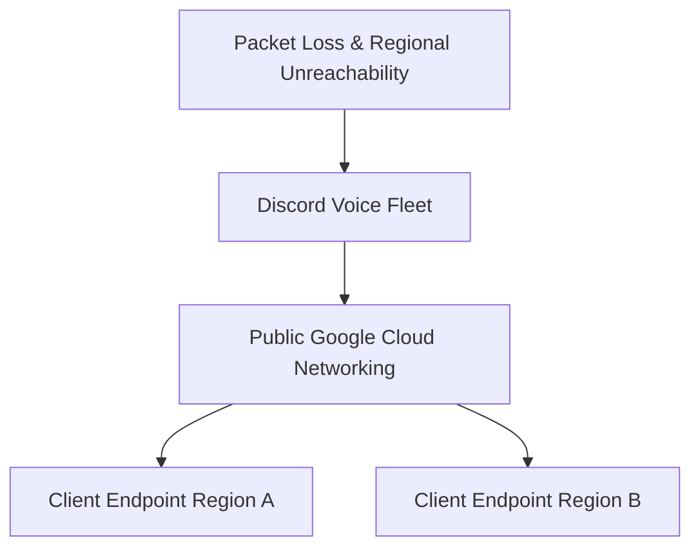

| Difficulty | Channel | Tags |
|---|---|---|
| advanced | aws | networking, outage, gcp |

A global voice outage struck in August 2020, turning everyday conversations into static-filled silence. This post recounts the crisis as it unfolded, the detective work that followed, and the hard lessons learned for building resilient real-time services.

---

## The Moment

It was 3am when the Discord dashboard lit up in red across multiple regions, and voice channels abruptly dropped. Users reported being unable to join or sustain voice sessions, even as text chat remained largely functional 1 . The first wave of incident tickets and social posts pointed to a systemic voice-service failure rather than a single regional outage 2 .

## The Investigation

SREs traced traffic from the voice fleet to client endpoints through Google Cloud networking paths. Metrics showed elevated packet loss and elevated retransmissions on voice connections, with session establishments failing during handshake and media setup. Real‑time traces indicated that some regions could not establish reliable routes, triggering timeouts and client disconnections. Teams convened a rapid war room, mapped dependencies across regions, and cross‑checked provider status dashboards to confirm external routing disruptions 1 2 .

## Root Cause

A public Google Cloud networking disruption severed connectivity paths between Discord's voice fleet and client endpoints, causing packet loss and regional reachability failures. The outage exposed an insufficient rapid failover mechanism across regions, so traffic could not be redistributed quickly enough to maintain voice sessions in disconnected areas 2 . In plain terms: when the public cloud networking path failed, region‑local voice services stayed partially isolated, amplifying the impact.

## Fix

Immediate actions prioritized restoring usable paths for the largest affected regions, with engineers manually steering traffic to healthier routes and nearby regions where possible. Long‑term remedies focused on multi‑region redundancy, multi‑provider failover automation, and strengthened incident runbooks. The aim was to shorten recovery time and eliminate single points of regional routing dependence, while improving monitoring to detect similar anomalies earlier 2 .

## Lessons

Key takeaways include: (1) design for multi‑region resilience and cross‑provider redundancy; (2) automate rapid failover and maintainakt incident runbooks; (3) instrument voice paths end‑to‑end with clear rollback criteria; (4) simulate large‑scale network disruptions to validate recovery procedures. These patterns help prevent recurrences and shorten future MTTR.

## Prevention

Prevention hinges on proactive architecture: deploy across multiple regions with diverse egress/ingress paths, implement automated failover that doesn’t rely on manual rerouting, and codify postmortems into living runbooks. Regular chaos testing, synthetic traffic for voice paths, and cross‑provider health checks should become standard practice. Real-World Case Study Discord A widespread outage disrupted Discord voice services due to a Google Cloud networking disruption, breaking voice connections across multiple regions. Key Takeaway: Increase resilience with multi-region redundancy and a multi-provider strategy; improve automated failover and incident runbooks to shorten recovery time.

## Wrapping Up

Engineers should bake resilience into voice services by combining geographic diversity, automated failover, and disciplined incident response to minimize reliance on any single provider path.

> **Did you know?**
> The incident highlighted how a single external routing disruption can cascade into multi‑region voice service failures, despite text services staying online.

---

## Architecture & Flow

## Conclusion

Engineers should bake resilience into voice services by combining geographic diversity, automated failover, and disciplined incident response to minimize reliance on any single provider path.

---

## References

1. [Discord Status — Voice Server Outage (2020)](https://status.discord.com/incidents/voice-server-outage-2020) — postmortem
2. [Google Cloud Status Dashboard](https://status.cloud.google.com/) — documentation
3. [Designing for High Availability on Google Cloud](https://cloud.google.com/architecture/designing-for-high-availability) — documentation
4. [Global Load Balancing Overview](https://cloud.google.com/load-balancing/docs/global/overview) — documentation
5. [Google Cloud Networking Overview](https://cloud.google.com/products/networking) — documentation
6. [Discord Status Page](https://status.discord.com) — documentation
7. [Cloud Networking Resilience Patterns](https://cloud.google.com/blog/products/networking/building-resilient-networks) — blog
8. [Availability and Disaster Recovery Best Practices](https://cloud.google.com/architecture/designing-for-availability-and-disaster-recovery) — documentation

---

**Author:** Satishkumar Dhule — [GitHub](https://github.com/satishkumar-dhule) · [LinkedIn](https://linkedin.com/in/satishkumar-dhule) · [Website](https://satishkumar-dhule.github.io)
