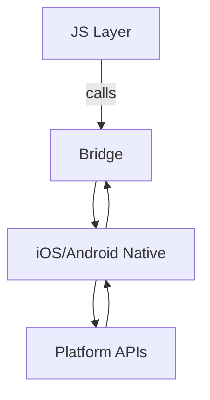

| Difficulty | Channel | Tags |
|---|---|---|
| beginner | react-native | native, bridge |

Picture this: Discord’s iOS app once lurched into frame drops on older devices, leaving users staring at stuttering animations. A dedicated performance squad hunted for bottlenecks in the JS-to-native bridge and found critical paths where image loading and rendering blocked the UI. They offloaded those hot paths to purpose-built native modules, rewiring the flow to sustain 60 FPS and extend battery life 1. The lesson for teams: when the bridge becomes the bottleneck, a targeted native module can flip performance from painful to perceptible.

---

## The Bridge Between Worlds

Native Modules in React Native create a bridge between JavaScript and platform-specific native code, enabling access to APIs that aren’t exposed to JS and allowing performance-critical tasks to run closer to the metal 2 4 5 . This bridge is where many teams discover the difference between “works in theory” and “works on devices,” especially for operations that require precise timing or hardware access. For context, the React Native ecosystem relies on this bridge to unlock iOS/Android capabilities beyond what JavaScript alone can safely perform 2 4 .

## When to Reach for a Native Module

Ideal use cases include: Bluetooth/peripheral communication, biometric authentication, advanced camera controls, custom hardware integration, and CPU-intensive calculations 3 6 . In contrast, UI-only tasks, simple storage, or routine network requests are better left to JavaScript libraries (like fetch/axios) to avoid unnecessary bridge overhead 6 .

## Performance and Threading: The Real Terrain

Bridge overhead matters: each async call can incur a serialization cost as messages cross the JS-native boundary 6 . Native modules run on the main thread by default, so moving heavy work to background threads is essential to keep the JS thread unblocked 8 . Proper memory management and clean resource deallocation across the bridge prevent leaks that silently erode performance over time 8 12 . A pragmatic approach blends batching of calls and carefully designed async patterns (promises/rejects) to minimize stalls 7 9 .

## A Practical Sketch

Android native module example (Java): // Android native module @ReactMethod public Promise performHeavyComputation(Promise promise) { new Thread(() -> { try { String result = heavyCalculation(); promise.resolve(result); } catch (Exception e) { promise.reject("ERROR", e.getMessage()); } }).start(); } This pattern shows offloading CPU-intensive work to a background thread while returning results asynchronously to JS via a Promise.

## Real-World Applications

Beyond the Discord case, mobile teams lean on native modules to optimize media pipelines, location services, and sensor data processing—areas where JavaScript alone struggles to meet stringent latency, power, and threading constraints 1 2 10 . Common pitfall: assuming a single path fits all devices; testing across device families often reveals hidden bottlenecks that native code can address with targeted optimizations 12 . Real-World Case Study Discord Discord adopted React Native early and built a performance-focused squad to diagnose and fix iOS performance issues. They uncovered severe UI lockups and frame drops on older devices, then implemented native modules to optimize image loading and rendering while reworking critical paths for 60 FPS and better battery life. Key Takeaway: When JS-to-native bridge bottlenecks hit hot paths (like image decoding and heavy UI components), offloading to a purpose-built native module can yield dramatic gains. Combine with targeted RN architecture tweaks and profiling across devices to achieve tangible, measurable improvements.

## Wrapping Up

Start small: identify hot paths, prototype a native module, and measure FPS and battery impact across devices. The right native module can be a force multiplier for your React Native app.

> **Did you know?**
> Many performance gains come from offloading only the hot paths, not the entire workload—precision beats brute force.

---

## Architecture & Flow

<strong>Original Interview Question</strong>

**Q:** What are Native Modules in React Native, when should you use them, and what are the key performance and threading considerations?

**A:** Native Modules bridge JavaScript and native code to access platform-specific APIs not available in JS. Use for Bluetooth, biometrics, camera controls, or performance-critical operations. Consider bridge overhead, threading model (main vs background), and async communication patterns.

## Conclusion

Start small: identify hot paths, prototype a native module, and measure FPS and battery impact across devices. The right native module can be a force multiplier for your React Native app.

---

## References

1. [How Discord achieves native iOS performance with React Native](https://discord.com/blog/how-discord-achieves-native-ios-performance-with-react-native) — article
2. [React Native](https://en.wikipedia.org/wiki/React_Native) — documentation
3. [JavaScript](https://en.wikipedia.org/wiki/JavaScript) — documentation
4. [React Native GitHub](https://github.com/facebook/react-native) — repository
5. [React GitHub](https://github.com/facebook/react) — repository
6. [Using Promises - MDN](https://developer.mozilla.org/en-US/docs/Web/JavaScript/Guide/Using_promises) — documentation
7. [Promise - MDN](https://developer.mozilla.org/en-US/docs/Web/JavaScript/Reference/Global_Objects/Promise) — documentation
8. [Async function - MDN](https://developer.mozilla.org/en-US/docs/Web/JavaScript/Reference/Statements/async_function) — documentation
9. [Await - MDN](https://developer.mozilla.org/en-US/docs/Web/JavaScript/Reference/Operators/await) — documentation
10. [Expo - Expo SDK](https://github.com/expo/expo) — repository
11. [Event loop (JavaScript) - Wikipedia](https://en.wikipedia.org/wiki/Event_loop) — documentation

---

**Author:** Satishkumar Dhule — [GitHub](https://github.com/satishkumar-dhule) · [LinkedIn](https://linkedin.com/in/satishkumar-dhule) · [Website](https://satishkumar-dhule.github.io)
