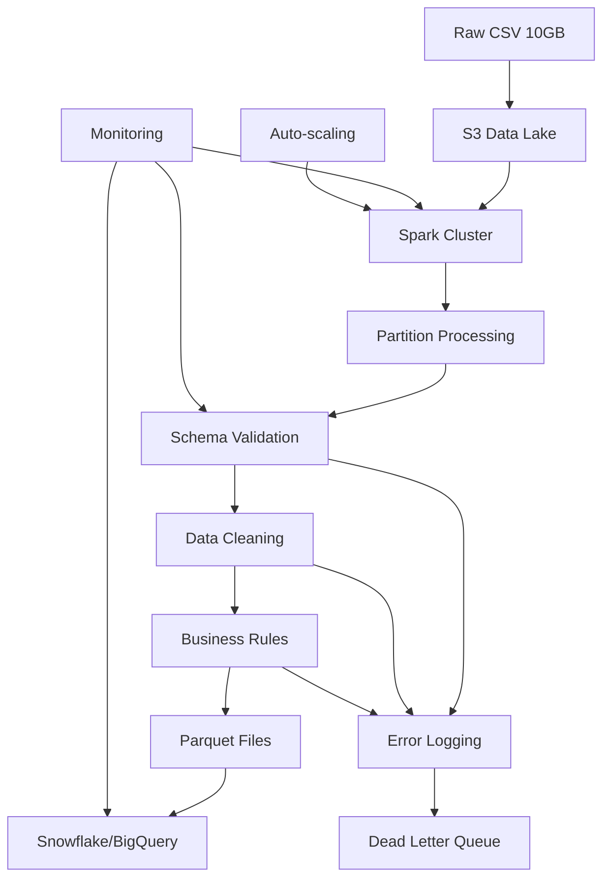

| Difficulty | Channel | Tags |
|---|---|---|
| beginner | data-engineering | data-engineering |

Picture this: It's 2016 at Meta (Facebook), and a massive data pipeline is choking. What should take hours is dragging on for three agonizing days, with hundreds of sharded Hive jobs struggling to process 60 TB of compressed data for entity ranking 1. The team was drowning in complexity, watching precious compute cycles evaporate while business insights waited in purgatory. This wasn't just a technical problem—it was a crisis that demanded a radical rethink of how they handled data at scale.

---

## The Breaking Point: When Traditional Pipelines Collapse

Many developers hit this wall: your CSV files grow from megabytes to gigabytes, then suddenly to terabytes. The scripts that worked yesterday are timing out today. You're not alone—this is where data pipelines go to die. The 10GB CSV scenario might seem manageable compared to Meta's 60TB monster, but the fundamental challenges are identical: single-threaded processing, memory constraints, and fragile error handling that cascades into system-wide failures 2 . 💡 The Hidden Cost : Most teams underestimate the operational overhead. A 10GB daily file becomes 3.65TB monthly. Your "simple" solution is now a liability. ⚠️ Watch Out : Traditional ETL tools like pandas or simple shell scripts will hit memory walls around 2-4GB, regardless of your server's RAM. The issue isn't memory—it's inefficient data loading patterns.

## The Spark Revolution: Distributed Processing Demystified

Apache Spark changed everything by treating data processing as a distributed problem rather than a single-machine challenge 3 . Instead of loading your entire 10GB CSV into memory, Spark partitions it across multiple workers, each handling a slice. This isn't just parallel processing—it's a fundamentally different paradigm that scales linearly with your cluster size. # The Spark way - partitioned from the start from pyspark.sql import SparkSession spark = SparkSession.builder.appName("user_activity").getOrCreate() # Automatic partitioning based on file size df = spark.read.csv("s3://logs/user_activity.csv", header=True, inferSchema=True) 🔥 Hot Take : Most developers over-engineer their Spark jobs. The magic isn't in complex transformations—it's in letting Spark handle the heavy lifting of partitioning, scheduling, and fault tolerance automatically 4 . Well-designed data pipelines transform raw information into actionable business insights

## Architecture That Survives the Storm

A production-ready pipeline needs more than just Spark—it needs defense in depth. Here's what separates the amateurs from the pros: Layer 1: Ingestion - Your data lake isn't just storage; it's your first line of defense. S3 provides durability, versioning, and lifecycle policies that prevent data loss 5 . Layer 2: Processing - Spark clusters with auto-scaling handle variable workloads. The key? Dynamic allocation that adds workers during peak loads and scales down to save costs 6 . Layer 3: Validation - Schema enforcement catches data quality issues before they corrupt your warehouse. Use Spark's built-in constraints or tools like Great Expectations 7 . Layer 4: Loading - Parquet files with columnar compression reduce storage costs by 60-80% while improving query performance 8 .

## The Plot Twist: When More Hardware Isn't the Answer

Here's the counterintuitive truth: Meta's initial solution was throwing more hardware at the problem. More Hive jobs, more sharding, more complexity. The breakthrough came when they simplified—replacing hundreds of brittle jobs with a handful of well-optimized Spark applications 1 . The lesson? Distributed processing frameworks like Spark can dramatically simplify and accelerate large-scale data pipelines when properly optimized, but they require significant infrastructure improvements to handle extreme scale reliably 1 . 🎯 Key Point : Performance gains come from better algorithms and data locality, not just bigger clusters. Spark's Catalyst optimizer and Tungsten execution engine often provide 2-10x improvements over naive implementations 9 . Real-World Case Study Meta (Facebook) Facebook needed to process massive datasets for entity ranking, with a pipeline that originally took 3 days using hundreds of sharded Hive jobs to process 60 TB of compressed data. Key Takeaway: Distributed processing frameworks like Spark can dramatically simplify and accelerate large-scale data pipelines when properly optimized, but require significant infrastructure improvements to handle extreme scale reliably.

## Wrapping Up

The journey from struggling with 10GB CSV files to effortlessly processing terabytes isn't about buying bigger servers—it's about embracing distributed processing patterns that scale. Start with Spark on a modest cluster, focus on data quality from day one, and remember that Meta's 60TB breakthrough came from simplification, not added complexity. Your future self will thank you when that 10GB file becomes 100GB and your pipeline doesn't even break a sweat.

> **Did you know?**
> Apache Spark was originally created at UC Berkeley in 2009 and became an Apache project in 2013. It's now used by 80% of Fortune 500 companies, processing petabytes of data daily across industries from social media to financial services 3.

---

## Architecture & Flow

<strong>Original Interview Question</strong>

**Q:** You have a 10GB CSV file with user activity logs that needs to be processed daily. The file contains user_id, timestamp, action_type, and metadata. How would you design a data pipeline to efficiently process this file and load it into a data warehouse?

**A:** Use a distributed processing framework like Apache Spark or AWS Glue. Split the CSV into partitions, process in parallel, apply schema validation and data cleaning, then load into the warehouse using bulk insert operations.

## Conclusion

The journey from struggling with 10GB CSV files to effortlessly processing terabytes isn't about buying bigger servers—it's about embracing distributed processing patterns that scale. Start with Spark on a modest cluster, focus on data quality from day one, and remember that Meta's 60TB breakthrough came from simplification, not added complexity. Your future self will thank you when that 10GB file becomes 100GB and your pipeline doesn't even break a sweat.

---

## References

1. [Apache Spark @Scale: A 60 TB+ production use case](https://engineering.fb.com/2016/08/31/core-infra/apache-spark-scale-a-60-tb-production-use-case/) — blog
2. [Apache Spark Documentation](https://spark.apache.org/docs/latest/) — documentation
3. [Big Data Processing with Apache Spark](https://en.wikipedia.org/wiki/Apache_Spark) — documentation
4. [Spark Performance Tuning Guide](https://spark.apache.org/docs/latest/tuning.html) — documentation
5. [Amazon S3 Documentation](https://docs.aws.amazon.com/s3/) — documentation
6. [Spark Dynamic Allocation](https://spark.apache.org/docs/latest/job-scheduling.html#dynamic-resource-allocation) — documentation
7. [Great Expectations Data Validation](https://docs.greatexpectations.io/) — documentation
8. [Apache Parquet Documentation](https://parquet.apache.org/) — documentation
9. [Spark SQL Catalyst Optimizer](https://spark.apache.org/docs/latest/sql-performance-tuning.html) — documentation
10. [AWS Glue Documentation](https://docs.aws.amazon.com/glue/) — documentation
11. [Snowflake Documentation](https://docs.snowflake.com/) — documentation
12. [Google BigQuery Documentation](https://cloud.google.com/bigquery/docs) — documentation

---

**Author:** Satishkumar Dhule — [GitHub](https://github.com/satishkumar-dhule) · [LinkedIn](https://linkedin.com/in/satishkumar-dhule) · [Website](https://satishkumar-dhule.github.io)
