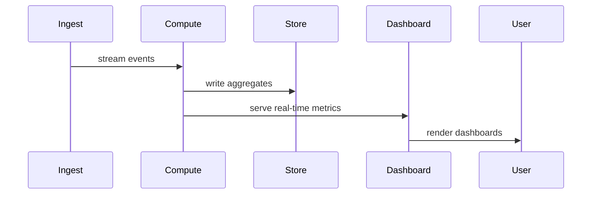

| Difficulty | Channel | Tags |
|---|---|---|
| beginner | python | python |

It was 3am when the pager blared: Stripe needed real-time analytics over trillions of events to power dashboards and monitoring, with sub-100ms latency on multi-petabyte data 1. The challenge demanded a data architecture built for horizontal fragmentation and blazing ingestion, a pattern that scales far beyond a single function. This tale begins with a simple Python snippet and unfolds into lessons that echo across modern streaming pipelines.

---

## Hooked on Real-Time

Picture this: a retail spike on Black Friday, dashboards updating faster than the crowd can blink. Stripe’s journey demonstrates why latency targets at scale aren’t just about hardware, but about how data is shaped and queried 1 . In practice, teams learn to design for fast ingestion and quick, precise queries over multi-PB datasets. The takeaway: even small code patterns can reflect the architecture of a fortress-like data stack. ⚡ Key idea: real-time analytics at scale hinges on data structures and streaming pipelines that minimize lag, not just raw horsepower.

## Discovery in a Tiny Function

A minimalist Python function becomes a microcosm of scale. The original question asks to sum even numbers from a list, but the distilled pattern involves a generator expression paired with a robust input check. The code below illustrates the approach that balances readability, safety, and performance: def sum_even_numbers(numbers): if not isinstance(numbers, list): raise TypeError("Input must be a list") return sum(num for num in numbers if isinstance(num, int) and num % 2 == 0) Why this matters: the generator expression processes items one by one, keeping memory usage steady even as data grows, and the single-pass sum stays O(n) time. This is the micro-pattern that scales when embedded in larger analytics jobs. 2 3 4

## Edge Cases, Grand Stage

Real-world data never behaves perfectly. Edge cases matter because they determine reliability in dashboards and alarms. Highlights: Empty lists return 0 by arithmetic design, avoiding false positives. Non-integers are ignored to prevent TypeErrors during aggregation. Input validation guards the function against unexpected shapes, a small price for big stability in production pipelines.

## From Snippet to System

The pattern scales: a small, well-behaved unit feeds a cascade of analytics jobs. In high-velocity streams, such patterns keep footprint low and latency predictable. When combined with specialized analytics storage and streaming pipelines, these tiny decisions become pivotal components of a sub-100ms, multi-PB system. The contrast is instructive: the same logic that sums evens can inform how to filter, map, and reduce streams in real-time dashboards. 1 Real-World Case Study Stripe During Black Friday–Cyber Monday, Stripe needed real-time analytics over trillions of events to power dashboards and internal monitoring, requiring sub-100ms query latency on multi-petabyte data while maintaining rapid ingestion. Key Takeaway: Specialized analytics storage and real-time data pipelines can deliver sub-100ms latency at multi-PB scale; design for horizontal fragmentation and low ingestion lag to meet peak demand; the right data architecture unlocks real-time visibility during critical events.

## Wrapping Up

Start small with robust edge-case handling, then align the tiny pattern with the architecture of real-time pipelines to scale gracefully.

> **Did you know?**
> A tiny Python pattern can mirror large-scale systems when designed for laziness, demonstrating how local code decisions ripple through entire data stacks.

---

## Architecture & Flow

<strong>Original Interview Question</strong>

**Q:** Write a Python function that takes a list of integers and returns the sum of all even numbers. How would you handle edge cases?

**A:** Use a generator expression with sum() for optimal performance. Implement input validation to handle edge cases robustly. The function gracefully handles empty lists by returning 0 and ignores non-integer elements to prevent TypeErrors. For large datasets, the generator approach provides memory efficiency by processing items one at a time.

## Conclusion

Start small with robust edge-case handling, then align the tiny pattern with the architecture of real-time pipelines to scale gracefully.

---

## References

1. [Stripe’s Journey to $18.6B of Transactions During Black Friday-Cyber Monday with Apache Pinot](https://startree.ai/user-stories/stripe-journey-to-18-b-of-transactions-with-apache-pinot/) — article
2. [sum — Python Documentation](https://docs.python.org/3/library/functions.html#sum) — documentation
3. [Generator expressions — Python Documentation](https://docs.python.org/3/reference/expressions.html#generator-expressions) — documentation
4. [Generator (computer programming) — Wikipedia](https://en.wikipedia.org/wiki/Generator_(computer_programming)) — encyclopedia
5. [Big O notation — Wikipedia](https://en.wikipedia.org/wiki/Big_O_notation) — encyclopedia
6. [Introduction to AWS Kinesis Data Streams](https://docs.aws.amazon.com/streams/latest/dev/introduction.html) — documentation
7. [Pods overview — Kubernetes](https://kubernetes.io/docs/concepts/workloads/pods/pod-overview/) — documentation
8. [The CPython Reference Implementation — GitHub](https://github.com/python/cpython) — repository
9. [Attention Is All You Need — arXiv](https://arxiv.org/abs/1706.03762) — paper
10. [HTTP/1.1 Semantics RFC 7230](https://datatracker.ietf.org/doc/html/rfc7230) — documentation
11. [Iterables and Iterators — Python Docs](https://docs.python.org/3/library/itertools.html) — documentation

---

**Author:** Satishkumar Dhule — [GitHub](https://github.com/satishkumar-dhule) · [LinkedIn](https://linkedin.com/in/satishkumar-dhule) · [Website](https://satishkumar-dhule.github.io)
