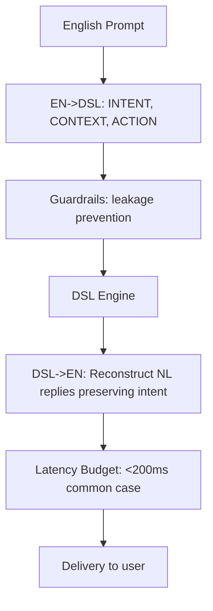

| Difficulty | Channel | Tags |
|---|---|---|
| advanced | prompt-engineering | prompt-engineering |

Many developers discover that breaches are not just about data theft; they reveal where the weak seams live. Microsoft faced EchoLeak in production, illustrating how prompt-injection-like techniques can operate without a user cue and still reach sensitive channels 1 . Building on this, the journey begins with a simple question: can a multilingual prompt pipeline be structured so that the most dang

---

## Hooked by a breach, hungry for a safer design

Many developers discover that breaches are not just about data theft; they reveal where the weak seams live. Microsoft faced EchoLeak in production, illustrating how prompt-injection-like techniques can operate without a user cue and still reach sensitive channels 1 . Building on this, the journey begins with a simple question: can a multilingual prompt pipeline be structured so that the most dangerous parts never leave a tightly guarded DSL boundary, yet still produce natural, friendly responses? The answer hinges on designing a two-pass pipeline that decouples language understanding from safety decisions, while a vigilant guardrail layer watches every transition 2 .

## The two-pass blueprint: EN to DSL, then DSL to EN

Building on the problem, the design centers on a two-pass pipeline. First, translate English prompts into an internal DSL with explicit tokens like INTENT, CONTEXT, and ACTION. Then, reconstruct natural-language replies from the DSL while preserving intent and tone. Guardrails live where the DSL operates, so leakage of system prompts or sensitive data is prevented before any human-visible text is produced. This separation reduces surface area and makes auditing easier, a pattern many teams adopt to tame complexity when multilingual prompts meet safety constraints 3 .

## Guardrails at the DSL edge: isolation, provenance, and checks

The guardrails act as gatekeepers between the human language layer and the internal decision layer. By enforcing constraints at the DSL level, the system prevents system prompts or sensitive data from leaking into DSL-to-English outputs. This mirrors best practices in secure-by-design patterns and prompt-safety research, where isolation and provenance tracking form the core of defense against novel prompt-injection tactics 3 . For developers, this means explicit DSL schemas, verifiable transitions, and testable guard checks that fail closed when anomalies are detected 11 .

## Latency as a feature, not a afterthought

Latency budgets shape every design choice. Real-time customer support expects sub-200ms responses in common cases, so every layer—from natural-language understanding to DSL translation and back to English—must be tuned aggressively. Latency is not just performance; it’s a security constraint here, because a slow path invites time-based side channels and increases exposure windows for potential attacks. In practice, latency considerations align with established performance guidance across cloud-native and ML deployments 11 , 6 .

## Prototype in motion: a minimal EN-&gt;DSL and DSL-&gt;EN sketch

A minimal Python prototype demonstrates the core idea: EN->DSL mapping, guarded DSL->EN reconstruction, and a simple drift/latency evaluator with mock models. The EN->DSL mapper extracts a compact DSL payload with keys like INTENT, CONTEXT, and ACTION. The DSL->EN reconstructor translates that payload back into a natural-language reply that preserves intent and tone. A lightweight drift/latency evaluator runs mock models, measures latency, and reports drift signals to guide tuning. This tiny scaffold shows how the pieces fit together while keeping the guardrails front and center.

## Real-world proof: a lesson from the trenches

The Microsoft incident underscores a universal truth: guardrails are more than a feature; they are a culture. The lesson is clear—treat LLM system prompts as highly sensitive assets, ensure isolation, provenance, and layered guardrails, and continuously test against evolving prompt-injection techniques. In practice, that means architectural patterns that confine sensitive prompts to protected layers, with independent auditing of each translation step 1 .

## From lesson to practice: a simple, end-to-end diagram

The following diagram outlines the end-to-end flow, highlighting where guardrails intervene and how latency stays within bounds. It also clarifies how EN prompts travel, how DSL tokens steer actions, and how the final EN reply is synthesized while preserving intent and tone. Real-World Case Study Microsoft EchoLeak revealed a zero-click prompt injection vulnerability in production Microsoft 365 Copilot where a crafted email could cause the agent to exfiltrate internal prompts and data across trusted channels without any user interaction. Key Takeaway: Treat LLM system prompts as highly sensitive assets; enforce strict isolation, provenance, and multi-layer guardrails; continuously test against novel prompt-injection techniques and integrate secure-by-design patterns into multilingual prompt-translation pipelines.

## Wrapping Up

The journey reveals that a secure, multilingual prompt pipeline is not a luxury but a necessity for real-time support systems. By locking critical prompts behind a guarded DSL and measuring drift and latency with lightweight mocks, teams gain a reproducible path from discovery to safe production. The takeaway: treat prompt pipelines as security-first features, not performance afterthoughts.

> **Did you know?**
> Latency budgets often compress in production; the 90th percentile can be dramatically tighter than average.

---

## Architecture & Flow

<strong>Original Interview Question</strong>

**Q:** Design a multilingual prompt-translation layer for a real-time customer-support assistant used across Stripe, Microsoft, and Zoom. It should (a) translate English prompts into an internal DSL to steer safety and actions, (b) reconstruct natural-language replies from the DSL preserving intent and tone, (c) enforce guardrails to prevent leakage of system prompts or sensitive data, while staying under sub-200ms latency in common cases. Provide a minimal Python prototype showing EN->DSL mapping, guarded DSL->EN reconstruction, and a simple drift/latency evaluator with mock models?

**A:** Propose a two-pass pipeline: English -> DSL with tokens like INTENT, CONTEXT, ACTION; DSL -> natural-language reply preserving tone. Guardrails are enforced at the DSL level; include a language-availa

## Conclusion

The journey reveals that a secure, multilingual prompt pipeline is not a luxury but a necessity for real-time support systems. By locking critical prompts behind a guarded DSL and measuring drift and latency with lightweight mocks, teams gain a reproducible path from discovery to safe production. The takeaway: treat prompt pipelines as security-first features, not performance afterthoughts.

---

## References

1. [EchoLeak: The First Real-World Zero-Click Prompt Injection Exploit in a Production LLM System](https://arxiv.org/abs/2509.10540) — article
2. [Prompt injection](https://en.wikipedia.org/wiki/Prompt_injection) — documentation
3. [Web security](https://developer.mozilla.org/en-US/docs/Web/Security) — documentation
4. [Transformers](https://github.com/huggingface/transformers) — documentation
5. [OpenAI Cookbook](https://github.com/openai/openai-cookbook) — documentation
6. [Real-time endpoints in SageMaker](https://docs.aws.amazon.com/sagemaker/latest/dg/real-time-endpoints.html) — documentation
7. [Kubernetes overview](https://kubernetes.io/docs/concepts/overview/what-is-kubernetes/) — documentation
8. [Typing in Python](https://docs.python.org/3/library/typing.html) — documentation
9. [HTTP semantics (RFC 7231)](https://datatracker.ietf.org/doc/html/rfc7231) — documentation
10. [Latency](https://en.wikipedia.org/wiki/Latency) — documentation
11. [PyTorch](https://github.com/pytorch/pytorch) — documentation
12. [TensorFlow](https://github.com/tensorflow/tensorflow) — documentation
13. [Deno](https://github.com/denoland/deno) — documentation

---

**Author:** Satishkumar Dhule — [GitHub](https://github.com/satishkumar-dhule) · [LinkedIn](https://linkedin.com/in/satishkumar-dhule) · [Website](https://satishkumar-dhule.github.io)
