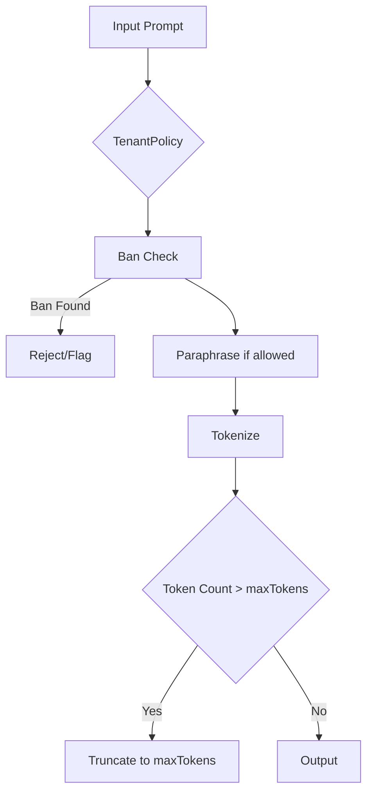

| Difficulty | Channel | Tags |
|---|---|---|
| beginner | llm-ops | llm-ops |

Picture this: a large enterprise relies on a Bedrock-backed, multi-tenant gateway to power dozens of teams. Costs spike, governance frays, and latency unpredictably creeps up. AWS tackled this head-on by building an internal SaaS service that tracks cost and usage for foundation models on Bedrock, enforcing per-tenant governance with a centralized gateway 1. The result isn’t just cheaper or faster; it’s a blueprint for scaling GenAI responsibly. This article follows that spirit: you’ll see how a per-tenant prompt mutation gate can shorten prompts to a configurable maxTokens while preserving intent, under clear policy and deterministically applied paraphrase. 1

---

## Hook: The AWS Case That Ignites the Journey

Many developers discover a sneaky tension in enterprise AI: every team wants access to powerful models, but costs, data boundaries, and security rules differ across teams. AWS’s experience building an internal SaaS service for foundation models on Bedrock demonstrates how a centralized gateway with strict per-tenant governance can scale governance, cost tracking, and throttling without compromising user experience 1 . Building on this, the journey begins with a simple question: how can a per-tenant policy gate automatically shorten prompts, enforce tokens caps, and preserve intent? The stakes are high—slippage in policy or semantics can mean misinformed decisions, budget overruns, or hidden data exposure 1 .

## Discovery: Designing the Per-Tenant Mutation Gate

Building on the AWS blueprint, the core idea is a per-tenant policy schema that governs how prompts are mutated before they ever reach a model. Consider a lightweight data model that captures the essentials: type TenantPolicy = { tenantId: string maxTokens: number bannedTokens: string[] allowParaphrase: boolean } maxTokens sets the hard cap for token count, a guardrail against runaway costs and latency 8 . bannedTokens ensure sensitive or prohibited content never leaves the gateway 7 . allowParaphrase controls whether a deterministic paraphrase step may be applied to shorten or adjust prompts while preserving intent 4 5 . Mutation order matters. A predictable, auditable sequence locks in safety and determinism: Ban check: if any banned token appears, the mutation halts or flags for review. Deterministic paraphrase: if allowed, apply a rule-based, reproducible paraphrase to shorten content without changing meaning 4 7 . Truncation: tokenize and cut to maxTokens, then join back to a compliant prompt. For context, tokenization is the process of splitting text into tokens that models count and process; this concept is widely discussed and standardized in language processing literature 8 .

## Implementation Walkthrough: A Minimal Mutation Pipeline

Here’s a compact, deterministic mutation flow you can start with. It mirrors the AWS lesson of central governance while keeping the logic approachable: type TenantPolicy = { tenantId: string maxTokens: number bannedTokens: string[] allowParaphrase: boolean } function tokenize(s: string): string[] { return s.trim().split(/\s+/) } function paraphrase(s: string): string { return s.replace(/transfer/g, 'move').replace(/\$/g, 'USD ') } function applyMutation(prompt: string, policy: TenantPolicy): string { // Ban check: if any banned token appears, reject mutation (or flag for review) for (const t of policy.bannedTokens) { if (prompt.includes(t)) return prompt // or throw/flag in production } let m = prompt // Deterministic paraphrase if allowed if (policy.allowParaphrase) m = paraphrase(m) // Tokenization and truncation const tokens = tokenize(m) if (tokens.length > policy.maxTokens) m = tokens.slice(0, policy.maxTokens).join(' ') return m } Example: TenantPolicy: { tenantId: 'team-rocket', maxTokens: 12, bannedTokens: ['secret'], allowParaphrase: true } Prompt: "Transfer $1000 to vendor account" Mutated: "move USD 1000 to vendor account" (paraphrase applied, token count fine) This is the baseline. In practice, you’ll want a small suite of synthetic prompts to validate token caps and semantic retention under various policies. Inline tests would cover: (a) no paraphrase when allowParaphrase is false, (b) semantics preserved after paraphrase, (c) truncation never violates critical phrasing, (d) banned-token hits are rejected or flagged for review.

## Follow the Mutation, Test the Impact

A minimal test plan uses synthetic prompts to validate token caps and semantic preservation: Test 1: No paraphrase, strict maxTokens = 6; input longer sentence; verify output is exactly 6 tokens. Test 2: Paraphrase enabled; input with a verb mapped in paraphrase rules; verify output tokens stay within maxTokens and semantics remain intact. Test 3: Banned token triggers rejection or safe fallback; verify mutation path halts and logs the event. Test 4: Edge-case punctuation and contractions; verify tokenization treats them as expected and truncation doesn’t split meaningful chunks. Concrete prompts for validation: Prompt A: "Transfer $250 to the vendor team" with maxTokens 8, paraphrase on -> expect "move USD 250 to the vendor team" truncated to 8 tokens if needed. Prompt B: "Secret project kickoff notes" with banned token 'Secret' present -> mutation should reject/flag. Prompt C: A long, multi-sentence briefing that exceeds maxTokens -> expect truncation to maxTokens while preserving a coherent beginning. Real-World Case Study Amazon Web Services (AWS) AWS demonstrates building an internal SaaS layer to provide access to foundation models (Bedrock) in a multi-tenant setup, focusing on per-tenant governance, cost tracking, and throttling. Key Takeaway: Per-tenant cost governance and quota enforcement can scale to many teams, while decoupling cost reporting from model latency; a centralized SaaS gateway with clear data partitioning makes it feasible to manage multi-tenant GenAI at enterprise scale.

## Wrapping Up

The journey from real-world governance to a practical per-tenant mutation gate demonstrates how policy, determinism, and testing come together to scale GenAI responsibly. Start with a minimal policy, prove it with synthetic prompts, then layer in telemetry and audits to grow confidence across teams.

> **Did you know?**
> Many enterprises discover that a well-placed paraphrase rule can shave 20–40% of average prompt length without losing essential meaning, but edge cases require careful auditing for safety.

---

## Architecture & Flow

<strong>Original Interview Question</strong>

**Q:** In a beginner-friendly, multi-tenant LLM gateway, design a per-tenant prompt mutation gate that shortens prompts to a configurable maxTokens by applying deterministic paraphrase and selective truncation while enforcing policy tokens and preserving intent. Specify data models, mutation order, concrete examples, and a minimal test plan with synthetic prompts to validate token caps and semantic preservation?

**A:** Implement per-tenant policy schema: {tenantId, maxTokens, bannedTokens[], allowParaphrase}. Mutation steps: ban check, deterministic paraphrase when allowed, then truncation to maxTokens; provide a sa

## Conclusion

The journey from real-world governance to a practical per-tenant mutation gate demonstrates how policy, determinism, and testing come together to scale GenAI responsibly. Start with a minimal policy, prove it with synthetic prompts, then layer in telemetry and audits to grow confidence across teams.

---

## References

1. [Build an internal SaaS service with cost and usage tracking for foundation models on Amazon Bedrock](https://aws.amazon.com/blogs/machine-learning/build-an-internal-saas-service-with-cost-and-usage-tracking-for-foundation-models-on-amazon-bedrock/) — article
2. [Cost Management](https://docs.aws.amazon.com/cost-management/index.html) — documentation
3. [Attention Is All You Need](https://arxiv.org/abs/1706.03762) — paper
4. [BERT: Pre-training of Deep Bidirectional Transformers for Language Understanding](https://arxiv.org/abs/1810.04805) — paper
5. [openai-python](https://github.com/openai/openai-python) — repository
6. [Transformers](https://github.com/huggingface/transformers) — repository
7. [Tokenization](https://en.wikipedia.org/wiki/Tokenization) — article
8. [String.split() - MDN](https://developer.mozilla.org/en-US/docs/Web/JavaScript/Reference/Global_Objects/String/split) — documentation
9. [textwrap — Text wrapping and filling](https://docs.python.org/3/library/textwrap.html) — documentation

---

**Author:** Satishkumar Dhule — [GitHub](https://github.com/satishkumar-dhule) · [LinkedIn](https://linkedin.com/in/satishkumar-dhule) · [Website](https://satishkumar-dhule.github.io)
