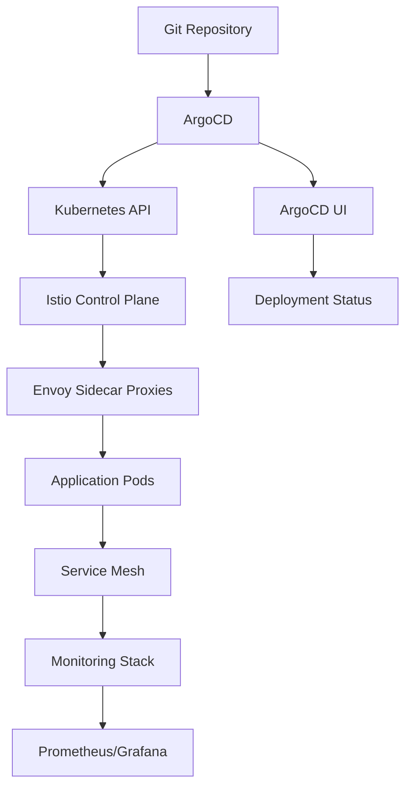

| Difficulty | Channel | Tags |
|---|---|---|
| advanced | kubernetes | istio, argocd, gitops, service-mesh |

At its core, Istio is a service mesh that provides a uniform way to secure, connect, and monitor microservices. It works by deploying a sidecar proxy (Envoy) alongside each application container in your Kubernetes pods 1 . This architecture intercepts all network traffic and applies policies for security, routing, and observability without requiring changes to your application code. The key compon

---

## Understanding the Service Mesh Foundation

At its core, Istio is a service mesh that provides a uniform way to secure, connect, and monitor microservices. It works by deploying a sidecar proxy (Envoy) alongside each application container in your Kubernetes pods 1 . This architecture intercepts all network traffic and applies policies for security, routing, and observability without requiring changes to your application code. The key components include: Data Plane : Envoy proxies that handle actual traffic Control Plane : Pilot, Citadel, and Galley for configuration and policy management Ingress/Egress Gateways : Managing traffic entering and leaving the mesh apiVersion: networking.istio.io/v1beta1 kind: VirtualService metadata: name: reviews-route spec: hosts: - reviews.prod.svc.cluster.local http: - match: - uri: prefix: "/wpcatalog" - uri: prefix: "/consumercatalog" rewrite: uri: "/newcatalog" route: - destination: host: reviews.prod.svc.cluster.local subset: v2 This configuration demonstrates how Istio can route traffic based on URI patterns, a capability that becomes crucial when implementing canary deployments or A/B testing scenarios 2 .

## GitOps with ArgoCD: The Declarative Approach

ArgoCD embraces the GitOps methodology where Git is the single source of truth for your application's desired state. Instead of running kubectl apply commands manually, you commit your Kubernetes manifests to Git, and ArgoCD ensures your cluster matches that state 3 . The workflow is elegantly simple: Developers push changes to Git ArgoCD detects the changes ArgoCD compares desired state (Git) with actual state (cluster) ArgoCD synchronizes the cluster to match Git apiVersion: argoproj.io/v1alpha1 kind: Application metadata: name: istio-system namespace: argocd spec: project: default source: repoURL: 'https://github.com/istio/istio' targetRevision: HEAD path: manifests/charts/istio-control/istio-discovery destination: server: 'https://kubernetes.default.svc' namespace: istio-system syncPolicy: automated: prune: true selfHeal: true This ArgoCD Application resource demonstrates how to deploy Istio itself using GitOps principles, creating a self-healing system that automatically recovers from drift 4 .

## Integrating Istio with ArgoCD: Best Practices

The real magic happens when you combine Istio's service mesh capabilities with ArgoCD's GitOps automation. Here's how to set up a robust integration: Progressive Delivery Strategy Use Istio's traffic splitting capabilities combined with ArgoCD's sync waves to implement sophisticated deployment strategies: apiVersion: networking.istio.io/v1beta1 kind: DestinationRule metadata: name: reviews-destination spec: host: reviews subsets: - name: v1 labels: version: v1 - name: v2 labels: version: v2 --- apiVersion: networking.istio.io/v1beta1 kind: VirtualService metadata: name: reviews annotations: argocd.argoproj.io/sync-options: SkipDryRunOnMissingResource=true spec: hosts: - reviews http: - route: - destination: host: reviews subset: v1 weight: 90 - destination: host: reviews subset: v2 weight: 10 Security Integration Leverage Istio's mTLS capabilities while managing certificates through ArgoCD: apiVersion: security.istio.io/v1beta1 kind: PeerAuthentication metadata: name: default namespace: production spec: mtls: mode: STRICT This configuration enforces mutual TLS between all services in the production namespace, a critical security measure that's automatically enforced through your GitOps pipeline 5 .

## Monitoring and Observability Stack

Both Istio and ArgoCD provide extensive monitoring capabilities that integrate seamlessly with popular observability tools. Istio generates detailed metrics for every service interaction, while ArgoCD offers insights into your deployment pipeline health. Istio Telemetry Integration apiVersion: telemetry.istio.io/v1alpha1 kind: Telemetry metadata: name: default namespace: production spec: metrics: - providers: - name: prometheus - overrides: - match: metric: ALL_METRICS tagOverrides: source_app: operation: REMOVE destination_app: operation: REMOVE ArgoCD Monitoring with Prometheus apiVersion: v1 kind: ServiceMonitor metadata: name: argocd-metrics namespace: argocd spec: selector: matchLabels: app.kubernetes.io/name: argocd-metrics endpoints: - port: metrics interval: 30s path: /metrics These configurations enable comprehensive monitoring of both your service mesh and GitOps operations, providing the visibility needed for reliable operations 6 . Real-World Case Study Netflix Netflix manages thousands of microservices that need to communicate securely and reliably. They implemented a service mesh architecture similar to Istio to handle traffic management, security policies, and observability at scale. Their deployment pipeline uses GitOps principles to ensure consistency across their massive infrastructure. Key Takeaway: Even at massive scale, declarative configuration and automated deployment management are essential for maintaining reliability and security in complex microservices environments.

## Wrapping Up

The combination of Istio and ArgoCD represents a paradigm shift in how we manage cloud-native applications. By separating concerns—Istio handling runtime service communication and ArgoCD managing deployment state—you create a more resilient, observable, and maintainable system. The GitOps approach ensures consistency and auditability, while the service mesh provides the security and traffic management capabilities needed for production microservices environments. Start by implementing basic Istio features with ArgoCD, then gradually adopt more advanced patterns like canary deployments, traffic shifting, and policy enforcement. The key is to iterate incrementally, allowing your team to build confidence with both technologies before tackling complex scenarios.

> **Did you know?**
> Istio was originally developed by Google, IBM, and Lyft as an open-source project, with the Envoy proxy (developed at Lyft) serving as its foundation. The name 'Istio' comes from the Greek word for 'sail,' reflecting its role in navigating the complex seas of microservices communication.

---

## Architecture & Flow

---

## References

1. [Istio Documentation](https://istio.io/latest/docs/) — documentation
2. [ArgoCD Documentation](https://argo-cd.readthedocs.io/) — documentation
3. [Envoy Proxy Documentation](https://www.envoyproxy.io/docs/) — documentation
4. [GitOps Principles](https://www.weave.works/technologies/gitops/) — documentation
5. [Kubernetes Service Mesh](https://kubernetes.io/docs/concepts/services-networking/service-mesh/) — documentation
6. [Progressive Delivery with Istio](https://istio.io/latest/docs/tasks/traffic-management/traffic-shifting/) — documentation
7. [CNCF Service Mesh Landscape](https://landscape.cncf.io/category=service-mesh) — documentation
8. [ArgoCD Best Practices](https://argo-cd.readthedocs.io/en/stable/operator-manual/high-availability/) — documentation
9. [Istio Security](https://istio.io/latest/docs/concepts/security/) — documentation
10. [GitOps with ArgoCD](https://argo-cd.readthedocs.io/en/stable/user-guide/gitops-large-org/) — documentation
11. [Service Mesh Patterns](https://servicemesh.es/) — documentation
12. [Kubernetes Observability](https://kubernetes.io/docs/tasks/debug/debug-cluster/resource-usage-monitoring/) — documentation

---

**Author:** Satishkumar Dhule — [GitHub](https://github.com/satishkumar-dhule) · [LinkedIn](https://linkedin.com/in/satishkumar-dhule) · [Website](https://satishkumar-dhule.github.io)
