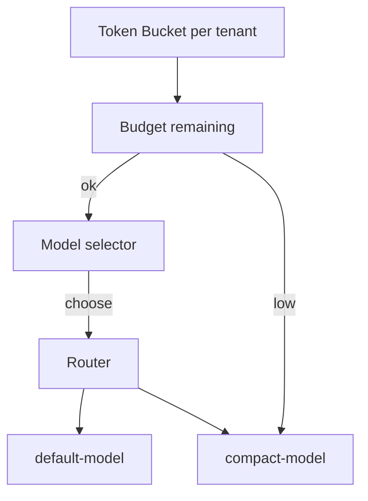

| Difficulty | Channel | Tags |
|---|---|---|
| beginner | llm-ops | llm-ops |

Picture this: Microsoft scales Azure OpenAI deployments across 50+ models, only to watch per-region TPM/RPM quotas throttle deployments and burst traffic, triggering Terraform failures and furious retries 1. In that pressure cooker, teams discover that quota-aware automation isn’t a nicety—it’s the difference between a smooth gateway and a bottleneck that bleeds both latency and cost. This journey explores how to design a lightweight, per-tenant budgeting approach that throttles gently, routes to cheaper models when budgets tighten, and stays predictable as demands ebb and flow 1.

---

## Building the Compass: How to think about cost, latency, and isolation

In multi-tenant environments, costs rise where budgets collide with demand. The stand-out idea is to give each tenant its own budget and enforce it without clobbering global performance. Many developers discover that a token-bucket throttling mechanism paired with a simple model-tiering policy can cap spend while preserving responsiveness for high-priority tenants 2 3 . However, the real leverage comes from decoupling configuration from quotas: treat quotas as first-class signals that influence routing decisions, not afterthought knobs. When a tenant’s budget nears exhaustion, the gateway should nimbly switch to a lighter model or trim context to maintain SLA targets, instead of queuing or failing requests outright 4 5 .

## Character in the room: the data model that makes it possible

Think of a per-tenant BudgetStore that tracks initial_budget, remaining_tokens, and a dynamic low-water mark. Each request deducts tokens, and the router consults the tenant’s budget and token bucket state to decide whether to serve the default model or fall back to a cheaper option. The per-tenant isolation ensures one tenant’s burst doesn’t derail others, while a lightweight selector keeps latency predictable. A practical takeaway is that the budget surface must be observable, with clear signals for when to reallocate or throttle. This aligns with industry patterns around quota management and service-level transparency 6 7 .

## From concept to concrete: the minimal code sketch

A compact function demonstrates the core idea: deduct tokens, check remaining budget, and select a model accordingly. The pattern is intentionally small and composable, enabling teams to expand with richer policies (e.g., context trimming, dynamic batch sizing) without rearchitecting the gateway. function selectModel(tenant: string, tokensUsed: number, budgetStore: BudgetStore) { if (budgetStore.remaining(tenant) < 0.2 * budgetStore.initial(tenant)) { return 'compact-model'; } return 'default-model'; } This approach mirrors widely used rate-limiting and quota strategies described in industry references 2 3 .

## A minimal test plan to keep it honest

Tests should validate both cost and latency guardrails under realistic mixes of tenant budgets and workloads. Key elements: Latency targets: 95th percentile 4 . Bursty traffic under uneven budgets: verify budget drain triggers timely fallbacks without tripping global rate limits 5 . Cost reporting: verify per-tenant cost aggregation and cutoff behavior when budgets hit low-water marks 11 . Failover correctness: ensure fallback paths never starve high-priority tenants during quota pressure 9 .

## A quick tour of the data surface you’ll need

Core data considerations: BudgetStore: per-tenant initial_budget, remaining_tokens, and time-varying spend. TokenBucket: tokens_per_window, refill_rate, and a low-water threshold. ModelTier: default-model, compact-model, and any in-between tiers. RoutingRules: per-tenant preferences, SLAs, and fallback strategies. Observability is essential: trace requests with tenant-id, model chosen, tokens consumed, and budget state to enable auditing and cost-aware optimization 8 12 .

## Putting it all together: a lightweight diagram

The following Mermaid diagram illustrates the flow from budget checks to model selection. It keeps the narrative grounded in a practical, scalable pattern you can implement today. flowchart TD TB[Token Bucket per tenant] B[Budget remaining] S[Model selector] R[Router] D[default-model] C[compact-model] TB --> B B -->|ok| S B -->|low| C S -->|choose| R R --> D R --> C This visual aligns with established patterns for quota-aware automation and dynamic allocation 8 11 .

## Reality check: a real-world war story

Real-world lessons show that quotas can stall progress if automation remains rigid. Microsoft’s Azure OpenAI deployments revealed how quota pressure can derail scalable, regionally distributed deployments, underscoring the need for quota-aware automation and early fallback strategies 1 . The takeaway is clear: decouple quota allocation from deployment configuration, and implement dynamic reallocation paths to cheaper resources when quotas or budgets tighten 1 . Real-World Case Study Microsoft At scale, Azure OpenAI deployments across 50+ models hit per-region TPM/RPM quotas, causing Terraform deployment failures and throttling; teams lacked a way to predictably allocate quotas across models. Key Takeaway: Design quota-aware automation; decouple deployment configuration from quota allocation; implement dynamic reallocation strategies and fallback paths to cheaper resources when quotas or budgets are constrained.

## Wrapping Up

Budget-aware routing transforms risk into predictability. By decoupling quotas from deployment and adding graceful fallbacks, teams can sustain performance while controlling cost. Tomorrow's gateway design benefits from starting with per-tenant budgets, lightweight token throttling, and cheap fallbacks—the trio that keeps both latency and spend under control. Consider sharing the core insight with your team: you don’t have to choose between cost and performance; you can balance both with a disciplined, observable approach.

> **Did you know?**
> Some of the earliest scalable quota systems draw from network traffic shaping and have evolved into layered billing and SLA-aware routing in modern LLM gateways.

---

## Architecture & Flow

<strong>Original Interview Question</strong>

**Q:** Design a beginner-friendly cost-aware routing policy for a multi-tenant LLM gateway used by Coinbase, Airbnb, and Discord. Tenants have different budgets and SLAs. Propose a lightweight per-tenant budget model, token throttling, and a fallback to cheaper models when budgets are exhausted. Describe data models, config, and a minimal test plan, including latency targets and rough cost estimates?

**A:** Implement per-tenant budgets with a token bucket and a model-tier selector. On each request, deduct tokens; if the bucket falls below a low-water mark, route to a lighter model or trim context to meet

## Conclusion

Budget-aware routing transforms risk into predictability. By decoupling quotas from deployment and adding graceful fallbacks, teams can sustain performance while controlling cost. Tomorrow's gateway design benefits from starting with per-tenant budgets, lightweight token throttling, and cheap fallbacks—the trio that keeps both latency and spend under control. Consider sharing the core insight with your team: you don’t have to choose between cost and performance; you can balance both with a disciplined, observable approach.

---

## References

1. [The Azure LLM Quota Problem You'll Hit At Scale (And How I Built Around It)](https://medium.com/@sohaibsohailengineer/the-azure-llm-quota-problem-youll-hit-at-scale-and-how-i-built-around-it-8069be46bc90) — article
2. [Token bucket](https://en.wikipedia.org/wiki/Token_bucket) — documentation
3. [Rate limiting](https://en.wikipedia.org/wiki/Rate_limiting) — documentation
4. [Kubernetes – Resource quotas](https://kubernetes.io/docs/concepts/policy/resource-quotas/) — documentation
5. [AWS Service Quotas](https://docs.aws.amazon.com/servicequotas/latest/userguide/intro.html) — documentation
6. [HTTP 429 Too Many Requests (RFC 6585)](https://datatracker.ietf.org/doc/html/rfc6585) — documentation
7. [HTTP/1.1 Semantics (RFC 7231)](https://datatracker.ietf.org/doc/html/rfc7231) — documentation
8. [Netflix Conductor](https://github.com/Netflix/conductor) — documentation
9. [Istio](https://github.com/istio/istio) — documentation
10. [OpenTelemetry](https://github.com/open-telemetry/opentelemetry-specification) — documentation
11. [Retry-After header (MDN)](https://developer.mozilla.org/en-US/docs/Web/HTTP/Headers/Retry-After) — documentation
12. [Attention Is All You Need (arXiv)](https://arxiv.org/abs/1706.03762) — paper

---

**Author:** Satishkumar Dhule — [GitHub](https://github.com/satishkumar-dhule) · [LinkedIn](https://linkedin.com/in/satishkumar-dhule) · [Website](https://satishkumar-dhule.github.io)
