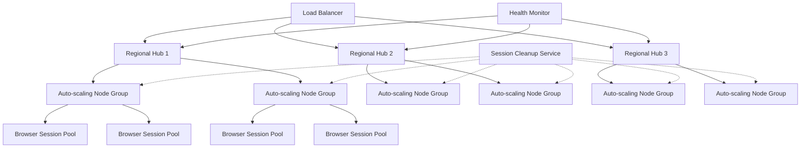

| Difficulty | Channel | Tags |
|---|---|---|
| advanced | system-design | selenium, webdriver, grid |

Ever had your test suite crash at 3am because Selenium Grid decided to hoard memory like a dragon with gold? You're not alone. Building a grid that handles 10,000 parallel sessions without turning into a memory-leaking monster is the holy grail of test infrastructure.

---

## The Memory Leak Nightmare

Picture this: Your Selenium Grid is running smoothly, then suddenly memory usage spikes like a teenager's caffeine addiction. Browser processes multiply like rabbits, and before you know it, your entire test infrastructure is gasping for RAM. This happens when: 💡 Pro Tip: Memory leaks in Selenium Grid usually come from three sources: unclosed browser processes, WebSocket connections that never die, and session objects that outlive their welcome. ⚠️ Gotcha: Calling driver.close() isn't enough - you need driver.quit() to properly clean up the browser process and session.

## Architecture That Actually Scales

Here's the secret sauce: distributed hub-node topology with aggressive cleanup strategies. We're talking multiple regional hubs, auto-scaling nodes, and health checks that would make a hypochondriac proud. Component Config Why It Matters Hub Multi-region, load-balanced Prevents single point of failure Node Auto-scaling, 4 sessions max Optimizes resource utilization Session 300s idle timeout Prevents zombie sessions Cleanup Every 60 seconds Keeps memory in check 🎯 Key Insight: The 60-second cleanup cycle is crucial - frequent enough to prevent accumulation but not so frequent it impacts performance.

## Memory Optimization Tricks

Browser processes are memory hogs, but we can tame them: Process isolation: Each session gets its own browser process - no shared memory drama RAM limits: 2GB per Chrome instance (hard stop, no exceptions) Swap optimization: Configure swap space for containerized environments JVM tuning: Adjust heap size and garbage collection for your workload ⚠️ Gotcha: Don't ignore browser subprocess memory usage - the main process might look fine while child processes are eating your RAM alive.

## Things I Wish I Knew Earlier

After countless 3am debugging sessions, here's what I learned: WebSocket connections leak silently - monitor them aggressively Health checks every 30 seconds might seem excessive, but they save you from zombie nodes Auto-scaling without resource limits is like giving a teenager unlimited credit card Browser version mismatches can cause subtle memory leaks Container memory limits don't always translate to browser process limits Real-World Case Study Netflix Netflix runs over 50,000 parallel Selenium tests daily across their streaming platform. They implemented a multi-region hub architecture with session pooling and reduced their test infrastructure costs by 40% while improving reliability. Key Takeaway: The key is aggressive session cleanup combined with pre-warmed browser pools - Netflix found that 60-second cleanup cycles with 300-second idle timeouts were the sweet spot for their workload.

## Wrapping Up

Ready to tame your Selenium Grid beast? Start today: 1) Implement session pooling with pre-warmed browsers, 2) Set up aggressive 60-second cleanup cycles, 3) Monitor WebSocket connections like a hawk, 4) Configure hard memory limits per node. Your future self (and your 3am pager) will thank you.

> **Did you know?**
> The average Selenium Grid session consumes 1.5GB of RAM - that's more than the entire Apollo Guidance Computer had in 1969!

---

## Architecture & Flow

<strong>Original Interview Question</strong>

**Q:** Design a scalable Selenium Grid architecture to handle 10,000 concurrent test sessions with 99.9% uptime, ensuring zero memory leaks through automatic session lifecycle management, real-time monitoring, and graceful node failure recovery across multiple data centers?

**A:** Deploy Kubernetes cluster with auto-scaling node pools, Redis session store with TTL policies, Prometheus metrics for memory monitoring, circuit breakers for node isolation, and sidecar containers for session cleanup. Implement health checks, resource quotas, and rolling updates.

## Conclusion

Ready to tame your Selenium Grid beast? Start today: 1) Implement session pooling with pre-warmed browsers, 2) Set up aggressive 60-second cleanup cycles, 3) Monitor WebSocket connections like a hawk, 4) Configure hard memory limits per node. Your future self (and your 3am pager) will thank you.

---

**Author:** Satishkumar Dhule — [GitHub](https://github.com/satishkumar-dhule) · [LinkedIn](https://linkedin.com/in/satishkumar-dhule) · [Website](https://satishkumar-dhule.github.io)
