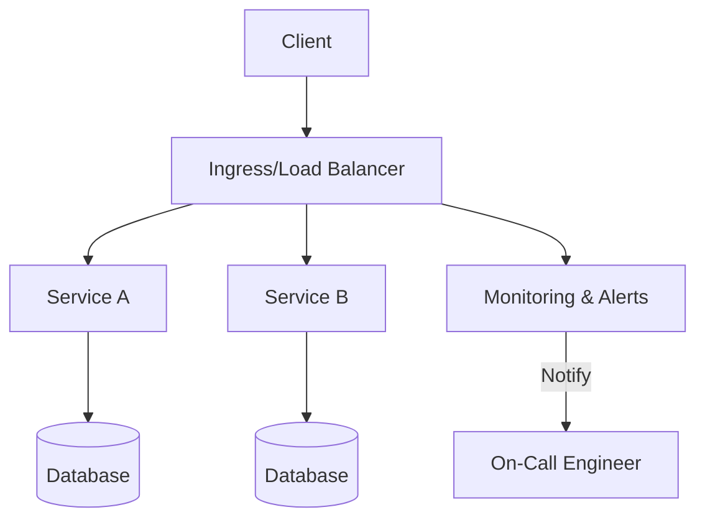

| Difficulty | Channel | Tags |
|---|---|---|
| beginner | sre | sre, reliability |

It was May 12, 2020—the day Slack faced its first major outage in years. A rollout of a database configuration change sparked a performance bug, driving a load spike and a misrouted traffic cascade that lasted hours, finally sparking a three-minute customer-visible impact in the morning. The incident forced teams to rethink reliability not as a collection of isolated services but as an end-to-end system, where ingress, load balancing, and change management all play starring roles 1.

---

## A Day Slack Learned to Read the Load

Building on the chaos, this chapter explores how a single outage revealed a systemic truth: reliability is not a bolt-on feature, but an operating system for the entire service chain. In the aftermath, teams realized that the resilience of the ingress/load-balancing stack and the rigor of change-management are just as critical as the health of individual services 1 . Consequently, many developers discover that bottlenecks often hide in the edges—where traffic first enters and decisions are made under pressure. The journey now shifts from patching symptoms to engineering reliability into the codebase itself, where infrastructure challenges become programmable problems to solve. 💡 Insight: The biggest reliability gains come from treating load balancing, ingress, and deployment as first-class code, not afterthoughts 2 3 .

## What Is SRE, Really? A Story of Turning Ops into Code

Building on the idea that reliability can be engineered, Site Reliability Engineering (SRE) reframes operations as a software problem. SRE applies software engineering to infrastructure and operations, automating repetitive tasks, and reducing toil by writing code that sustains reliability at scale 2 3 . This isn’t a poetry of acronyms; it’s a discipline that translates customer expectations into measurable, codified practices. Service Level Objectives (SLOs) and Service Level Indicators (SLIs) translate user experience into numbers you can monitor and improve 2 . Error budgets convert reliability into a visible negotiation between velocity and stability, guiding release cadences and incident response 3 . Automation replaces manual rituals with repeatable pipelines, reducing human error during deploys and scaling events 6 . A blameless postmortem culture teaches teams to learn from failures rather than blame individuals, accelerating learning and reducing repair times 3 . Comprehensive monitoring and alerting stitch together data across services, enabling fast detection and containment 7 . def calculate_error_budget(slo_percentage, period_days): allowed_downtime_minutes = period_days * 24 * 60 * (100 - slo_percentage) / 100 return allowed_downtime_minutes This code example translates a target SLO into a concrete allowance for downtime, turning a vague promise into a calculable limit you can enforce in your deployment pipelines 3 .

## From Theory to Practice: The Battle Plan

However, turning these ideas into everyday practice requires a concrete game plan. The following moves are common in teams that are hardening their systems against subtle stateful failures: Automate everything: remove toil by coding responses to common incidents and automating deployments, tests, and rollbacks 7 . Define and measure SLOs and SLIs: set clear reliability targets tied to user experience, not just system health metrics 2 4 . Use blameless postmortems: document what happened, why it happened, and how to prevent recurrence without assigning fault 3 . Invest in monitoring and tracing: ensure visibility across ingress, load balancers, services, and databases so issues are detected before users notice 7 . Harden the ingress/load-balancing stack: modern load-balancers and service mesh patterns help prevent misrouted traffic from cascading into outages 5 9 . Building on the Slack experience, the path to resilience often runs through the edge where traffic enters the system—this is where a modern, codified load-balancing strategy matters most 1 5 . Real-World Case Study Slack Slack experienced its first major outage in years on May 12, 2020. A rollout of a database configuration change triggered a performance bug, causing a load spike; autoscaling surged, but a bug in the load-balancer state led to misrouted traffic and a multi-hour disruption before containment. The incident culminated in a three-minute customer-visible impact in the morning, and Slack ended up running the largest webapp fleet it had ever run, with a 75% increase in instances. Key Takeaway: Reliability is as much about the resilience of the ingress/load-balancing stack and change-management processes as it is about individual services. Automated, modernized load-balancing (Envoy/xDS) and improved incident monitoring are critical to prevent subtle state inconsistencies from cascading into outages.

## Wrapping Up

Reliability scales not by adding more servers, but by turning the path from user to service into a programmable, observable, and learnable system. The takeaway: treat ingress, change management, and monitoring as code, and the rest will follow. Your team can start onboarding SRE patterns by defining a single, measurable SLO, drafting an error budget, and automating the first three to-dos that still require human intervention.

> **Did you know?**
> The term 'SRE' was famously popularized by Google, shaping reliability practices across the industry 2.

---

## Architecture & Flow

<strong>Original Interview Question</strong>

**Q:** What is Site Reliability Engineering and how does it differ from traditional operations?

**A:** Site Reliability Engineering (SRE) applies software engineering principles to infrastructure challenges, automating operational tasks and emphasizing reliability through code-based solutions rather than manual intervention.

## Conclusion

Reliability scales not by adding more servers, but by turning the path from user to service into a programmable, observable, and learnable system. The takeaway: treat ingress, change management, and monitoring as code, and the rest will follow. Your team can start onboarding SRE patterns by defining a single, measurable SLO, drafting an error budget, and automating the first three to-dos that still require human intervention.

---

## References

1. [A Terrible, Horrible, No-Good, Very Bad Day at Slack](https://slack.engineering/a-terrible-horrible-no-good-very-bad-day-at-slack/) — article
2. [Site reliability engineering](https://en.wikipedia.org/wiki/Site_reliability_engineering) — documentation
3. [Site Reliability Engineering (SRE) book site](https://sre.google/sre-book/) — documentation
4. [Ingress (Kubernetes) - Networking](https://kubernetes.io/docs/concepts/services-networking/ingress/) — documentation
5. [AWS Well-Architected Framework](https://docs.aws.amazon.com/wellarchitected/latest/framework/well-architected-framework.html) — documentation
6. [Understanding Load Balancers](https://en.wikipedia.org/wiki/Load_balancing_(computing)) — documentation
7. [Envoy Proxy](https://github.com/envoyproxy/envoy) — repository
8. [Prometheus: Monitoring system &amp; time series database](https://github.com/prometheus/prometheus) — repository
9. [Python 3 Documentation](https://docs.python.org/3/) — documentation
10. [DigitalOcean Load Balancers](https://www.digitalocean.com/products/load-balancers/) — product
11. [A Terrible, Horrible, No-Good, Very Bad Day at Slack (duplicate entry for emphasis)](https://slack.engineering/a-terrible-horrible-no-good-very-bad-day-at-slack/) — article

---

**Author:** Satishkumar Dhule — [GitHub](https://github.com/satishkumar-dhule) · [LinkedIn](https://linkedin.com/in/satishkumar-dhule) · [Website](https://satishkumar-dhule.github.io)
