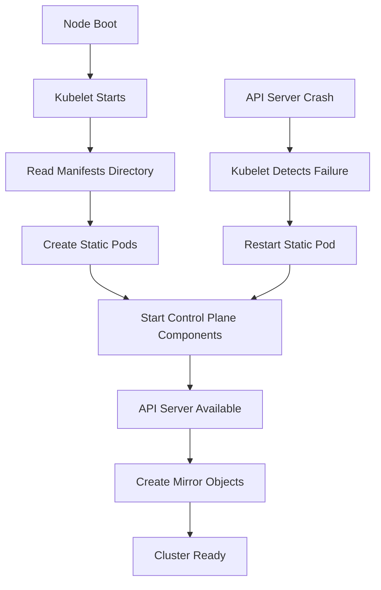

| Difficulty | Channel | Tags |
|---|---|---|
| intermediate | kubernetes | kubernetes, static-pods |

Static pods break all the rules you've learned about Kubernetes. While regular pods go through the familiar dance of API server → scheduler → kubelet, static pods take a shortcut. The kubelet directly monitors a configuration directory (typically /etc/kubernetes/manifests ) and creates pods based on the YAML files it finds there 3 . # Static pod manifest example apiVersion: v1 kind: Pod metadata:

---

## What Makes Static Pods Different?

Static pods break all the rules you've learned about Kubernetes. While regular pods go through the familiar dance of API server → scheduler → kubelet, static pods take a shortcut. The kubelet directly monitors a configuration directory (typically /etc/kubernetes/manifests ) and creates pods based on the YAML files it finds there 3 . # Static pod manifest example apiVersion: v1 kind: Pod metadata: name: static-web-server namespace: default spec: containers: - name: nginx image: nginx:1.21 ports: - containerPort: 80 This bypass of the API server has profound implications. Static pods can't be managed with kubectl commands, they don't show up in the cluster's etcd datastore (except as mirror objects), and they're bound to the specific node where they're defined. The kubelet manages their lifecycle entirely independently, restarting them if they crash and ensuring they stay running even when the rest of the cluster is offline 4 .

## The Bootstrap Architecture

Static pods form the foundation of Kubernetes' self-healing capabilities. When you boot up a control plane node, the kubelet starts first and immediately looks for static pod manifests. It finds the API server, etcd, and controller manager definitions and starts them without any external coordination 5 . This creates a chicken-and-egg problem that's elegantly solved: the API server runs as a static pod, managed by the kubelet, which then allows the rest of the Kubernetes control plane to function. Once the API server is up, the kubelet creates mirror objects of the static pods in the API server, making them visible to kubectl but still managed locally 6 . The beauty of this design is that if the API server crashes, the kubelet doesn't wait for human intervention. It restarts the static pod automatically, often before you even notice there was a problem. This self-healing behavior is why static pods are the preferred way to deploy control plane components in most Kubernetes distributions 7 .

## When to Use Static Pods in Production

While static pods are primarily used for control plane components, they have several practical applications in production environments: Critical Infrastructure : Run logging agents, monitoring collectors, or security scanners that must always be available, even during cluster outages 8 . Bootstrap Dependencies : Deploy configuration management tools or custom controllers that need to run before the rest of the cluster is ready 9 . Edge Computing : In edge scenarios with unreliable connectivity, static pods ensure essential services keep running locally 10 . # Deploying a static pod on a node sudo mkdir -p /etc/kubernetes/manifests sudo cp my-static-pod.yaml /etc/kubernetes/manifests/ # Kubelet will detect and start it within seconds However, static pods come with trade-offs. They're tied to specific nodes, making them unsuitable for horizontally scalable applications. They also bypass Kubernetes' advanced scheduling features, resource quotas, and network policies. Use them sparingly and only for truly node-local, critical workloads 11 .

## Troubleshooting Static Pod Issues

Debugging static pods requires a different mindset since kubectl commands won't work. Here's your troubleshooting toolkit: Check Kubelet Logs : The kubelet's logs are your primary source of truth for static pod issues: # View kubelet logs for static pod events sudo journalctl -u kubelet | grep static Verify Manifest Directory : Ensure your YAML files are in the correct location and readable by the kubelet: # Check manifest directory and permissions ls -la /etc/kubernetes/manifests/ sudo -u kubelet ls /etc/kubernetes/manifests/ Inspect Container Runtime : Use the container runtime directly to see what's actually running: # Check running containers with crictl sudo crictl ps | grep static sudo crictl inspect <container-id> Remember that static pods appear as mirror objects in the API server, but you can't manage them through kubectl. If you need to update a static pod, you must modify the manifest file on the node itself and wait for the kubelet to detect the change 12 . Real-World Case Study Google Google's Borg system, the predecessor to Kubernetes, faced similar challenges with keeping critical infrastructure running during system failures. They developed the concept of 'jobs' that could run independently of the central scheduler, which directly influenced the design of static pods in Kubernetes. Key Takeaway: The most reliable systems are those that can heal themselves without human intervention, which is exactly what static pods enable at the infrastructure level.

## Wrapping Up

Static pods are Kubernetes' secret weapon for resilience and reliability. They ensure that critical infrastructure components can survive even the most catastrophic cluster failures, providing the foundation for Kubernetes' self-healing architecture. While they're not suitable for every workload, understanding static pods is essential for anyone serious about Kubernetes operations and system reliability. The next time you're designing a critical system that must stay online no matter what, consider whether static pods might be the right tool for the job.

> **Did you know?**
> Static pods are so fundamental to Kubernetes that the API server itself typically runs as a static pod, creating a beautiful self-referential loop where the cluster's brain is kept alive by the very system it manages.

---

## Architecture & Flow

## Conclusion

Static pods are Kubernetes' secret weapon for resilience and reliability. They ensure that critical infrastructure components can survive even the most catastrophic cluster failures, providing the foundation for Kubernetes' self-healing architecture. While they're not suitable for every workload, understanding static pods is essential for anyone serious about Kubernetes operations and system reliability. The next time you're designing a critical system that must stay online no matter what, consider whether static pods might be the right tool for the job.

---

## References

1. [Kubernetes Documentation: Static Pods](https://kubernetes.io/docs/tasks/configure-pod-container/static-pod/) — documentation
2. [Kubernetes The Hard Way: Static Pods](https://github.com/kelseyhightower/kubernetes-the-hard-way/blob/master/docs/04-certificate-authority.md) — documentation
3. [Kubelet Source Code: Static Pod Management](https://github.com/kubernetes/kubernetes/blob/master/pkg/kubelet/pod.go) — source
4. [CNCF Blog: Understanding Kubernetes Control Plane](https://www.cncf.io/blog/2021/04/20/understanding-the-kubernetes-control-plane/) — blog
5. [Kubernetes Architecture Overview](https://kubernetes.io/docs/concepts/architecture/) — documentation
6. [Google Borg Paper: The Global Workload Scheduler](https://research.google/pubs/pub43438/) — research
7. [Kubernetes Bootstrapping Guide](https://kubernetes.io/docs/setup/production-environment/tools/kubeadm/kubeadm-init/) — documentation
8. [Container Runtime Interface (CRI) Documentation](https://github.com/kubernetes/cri-api) — documentation
9. [Kubernetes High Availability Design](https://kubernetes.io/docs/setup/production-environment/tools/kubeadm/high-availability/) — documentation
10. [Edge Computing with Kubernetes](https://kubernetes.io/blog/2020/09/30/running-kubernetes-on-the-edge/) — blog
11. [Kubernetes Troubleshooting Guide](https://kubernetes.io/docs/tasks/debug-application-cluster/debug-cluster/) — documentation
12. [Kubernetes Source Code: Mirror Pod Creation](https://github.com/kubernetes/kubernetes/blob/master/pkg/kubelet/pod_manager.go) — source

---

**Author:** Satishkumar Dhule — [GitHub](https://github.com/satishkumar-dhule) · [LinkedIn](https://linkedin.com/in/satishkumar-dhule) · [Website](https://satishkumar-dhule.github.io)
