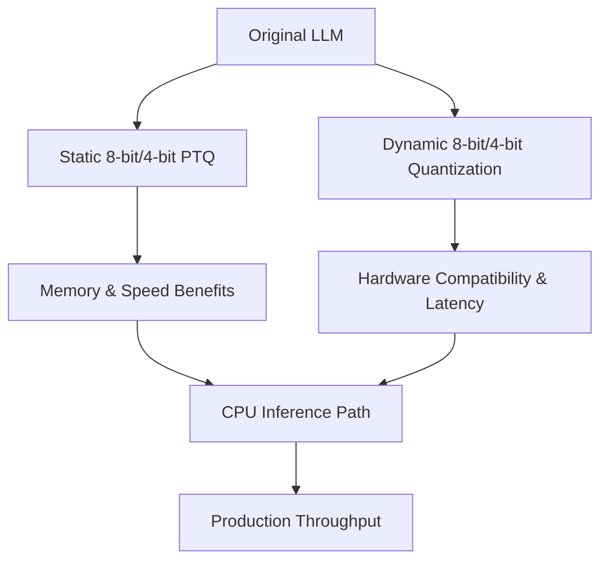

| Difficulty | Channel | Tags |
|---|---|---|
| beginner | llm-ops | quantization, pruning, distillation |

In Roblox's world, the challenge was brutal: deploy high-throughput text classification on CPUs to handle over 1B inferences per day with median latency under 20ms. The team compared CPU vs GPU costs and pursued an incremental optimization path, starting with DistilBert, dynamic shapes, and quantization to meet real-time needs 1. The journey reveals a surprising truth: smaller models paired with smart quantization and input shaping can unlock CPU-scale throughput without breaking the bank, while threading and caching decisions often swing the final numbers. Many developers discover that the path to real-time inference isn’t about bigger GPUs, but smarter, leaner engines running on capable CPUs.

---

## The Challenge You Face in Production

Production models live under relentless pressure: throughput, latency, memory, and cost all collide at the same moment. Roblox’s case demonstrates the stakes clearly: delivering scalable, real-time text classification on CPU infrastructure while keeping costs in check and latency predictable 1 . That means rethinking everything from model size to data pipelines, and from calibration data to thread management. The punchline: you don’t just deploy a model—you orchestrate an entire inference orchestra that must perform under steady load, with tight budgets, on hardware that wasn’t built for your exact workload.

## A Toolkit That Ships: Quantization, Pruning, Distillation

You’ll likely combine three core levers: quantization, pruning, and distillation. Quantization can shrink memory footprints and boost speed, with static (post-training) quantization delivering 2–4x speedups and minimal accuracy loss (often under 2%), while dynamic quantization improves hardware compatibility at the cost of some latency. Quantization-aware training (QAT) helps preserve accuracy when moving toward sub-8-bit precisions, and advanced approaches like GPTQ/AWQ push memory reductions even further with careful calibration 2 3 . In practice, static PTQ is a common starting point for stable deployments, while QAT shines when tiny precision steps threaten accuracy, and dynamic quantization helps bridge hardware gaps.}

## Trade-offs You’ll Actually Measure

Key metrics to trade off: memory, speed, and accuracy. Memory drops dramatically with aggressive quantization (4-bit can cut memory by up to 8x versus FP16 in many scenarios), while inference speed improves with optimized bit widths on capable hardware. Accuracy tends to tolerate 8-bit quantization with minimal degradation for many LLMs, but very aggressive quantization or non-uniform models (e.g., MoE) may require special handling. The production reality is that hardware characteristics and batch patterns dramatically shape results, so empirical calibration matters more than theoretical gains 2 3 . A practical example is using 4-bit quantization with 8-bit matrix operations and careful dtype choices to balance speed and numerical stability.

## Putting It Into Practice

Production often adopts a staged path: begin with a smaller model (e.g., DistilBert or similar compact architectures), enable post-training quantization on CPU, then iterate with dynamic shapes and quantization calibration. Calibration data becomes the compass for static quantization, and mixed-precision strategies (e.g., FP16 attention with INT8 matrices) can unlock better throughput without sacrificing too much latency or accuracy. The Roblox case exemplifies incremental optimization: start small, measure real latency and throughput, then layer in quantization and shape changes to approach target SLAs 1 .

## Counterintuitive Truths and War Stories

Counterintuitively, GPUs aren’t always cheaper for very high-throughput inference; well-tuned CPU paths can win on TCO when latency targets are tight and batch sizes vary. Real-world deployments teach that threading, caching, and data pipelines often dominate throughput, sometimes more than the model size itself. In practice, a phased approach—distillation to shrink the model, dynamic shapes to fit workload, and post-training quantization—can unlock CPU-scale throughput with favorable costs, provided calibration and threading are handled meticulously 1 . Real-World Case Study Roblox Roblox needed to deploy high-throughput text classification in production, handling over 1B inferences per day with median latency under 20ms on CPU-based infrastructure. They compared CPU vs GPU costs and pursued a path of incremental optimization starting with DistilBert, dynamic shapes, and quantization to meet real-time needs. Key Takeaway: For real-time production inference, smaller models plus post-training quantization and input shaping can unlock CPU-scale throughput with favorable cost efficiency; careful threading and caching dramatically influence results; don’t assume GPUs are always cheaper for high-throughput inference.

## Wrapping Up

Real-time production inference becomes feasible on CPU by combining smaller models with post-training quantization, input shaping, and careful system-level optimizations. Start with a compact model, validate latency at target concurrency, and progressively layer in quantization and shaping strategies to hit production SLAs.

> **Did you know?**
> In high-throughput production, threading and data caching can dominate latency, sometimes more than the model size itself.

---

## Architecture & Flow

<strong>Original Interview Question</strong>

**Q:** What are the key techniques and trade-offs for optimizing large language models in production, including quantization strategies and their impact on performance?

**A:** Production optimization combines quantization (8-bit/4-bit), pruning, and distillation. Static quantization offers 2-4x speedup with minimal accuracy loss (<2%), while dynamic quantization provides better compatibility but higher latency. Quantization-aware training preserves accuracy for sub-8-bit models, and GPTQ/AWQ achieve 3-5x memory reduction with careful calibration.

## Conclusion

Real-time production inference becomes feasible on CPU by combining smaller models with post-training quantization, input shaping, and careful system-level optimizations. Start with a compact model, validate latency at target concurrency, and progressively layer in quantization and shaping strategies to hit production SLAs.

---

## References

1. [How We Scaled Bert To Serve 1+ Billion Daily Requests on CPUs](https://corp.roblox.com/newsroom/2020/05/scaled-bert-serve-1-billion-daily-requests-cpus) — article
2. [Quantization (deep learning)](https://en.wikipedia.org/wiki/Quantization) — documentation
3. [PyTorch Documentation: Quantization](https://pytorch.org/docs/stable/quantization.html) — documentation
4. [AWS SageMaker: Quantization](https://docs.aws.amazon.com/sagemaker/latest/dg/model-server-quantization.html) — documentation
5. [HuggingFace Transformers](https://github.com/huggingface/transformers) — github
6. [BitsAndBytes: 4-bit Quantization](https://github.com/facebookresearch/bitsandbytes) — github
7. [Distilling the Knowledge in a Neural Network](https://arxiv.org/abs/1503.02531) — paper
8. [Attention Is All You Need](https://arxiv.org/abs/1706.03762) — paper
9. [Binarized Neural Networks](https://arxiv.org/abs/1602.02830) — paper
10. [NVIDIA DeepLearningExamples](https://github.com/NVIDIA/DeepLearningExamples) — github
11. [Kubernetes Documentation](https://kubernetes.io/docs/) — documentation
12. [Wikipedia — Quantization](https://en.wikipedia.org/wiki/Quantization) — documentation

---

**Author:** Satishkumar Dhule — [GitHub](https://github.com/satishkumar-dhule) · [LinkedIn](https://linkedin.com/in/satishkumar-dhule) · [Website](https://satishkumar-dhule.github.io)
