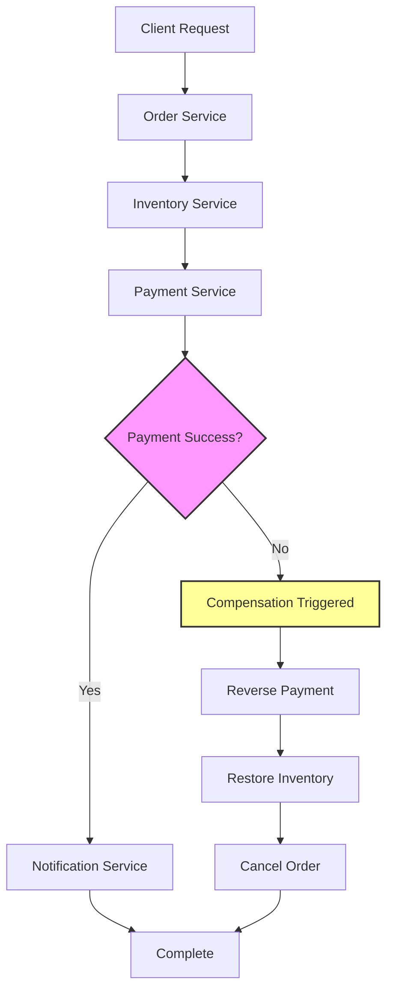

| Difficulty | Channel | Tags |
|---|---|---|
| advanced | testing | api-testing, database-testing, mocking |

Picture this: DoorDash's engineers are staring at their monitors in horror. Their brand-new DashPass subscription service is live, but something's terribly wrong. Financial partners are reporting duplicate transactions, customer accounts are showing inconsistent balances, and the support team is drowning in angry calls. The culprit? Race conditions in their distributed transaction system that were corrupting data across multiple partner systems 1. This nightmare scenario reveals exactly why testing Saga patterns isn't just academic—it's mission-critical for any team building distributed systems.

---

## The Distributed Transaction Nightmare

Every developer who's built microservices has faced this moment: you need to coordinate actions across multiple services, but one service fails midway through. What happens to the completed operations? Do they roll back automatically? Do you leave the system in an inconsistent state? This is where the Saga pattern enters the story—not as a hero, but as a complex solution to an even more complex problem. 💡 The Insight : Traditional two-phase commits are like trying to get five people to agree on dinner simultaneously—someone always backs out, leaving everyone hanging. Sagas are more like a coordinated restaurant tour where if one stop fails, everyone knows exactly how to undo their previous choices 2 . The challenge isn't just implementing the pattern—it's proving it works under every conceivable failure scenario. You're not just testing code; you're testing the resilience of your entire distributed system.

## Building the Test Battlefield

Testing Sagas requires thinking like a chaos engineer. You need to simulate every possible failure mode while maintaining deterministic test results. Here's the battle-tested approach: The Architecture of Truth : Testcontainers : Spin up real databases and message brokers—no mocks allowed when financial data is at stake Contract Testing : Use Pact to verify API contracts between services before they even talk to each other Event Orchestration : Embedded Kafka simulates the exact message flows your production system uses State Verification : Cross-database consistency checks that would make your DBA proud @Test void testSagaWithCompensation() { // Given: Order service receives order orderId = orderService.createOrder(orderRequest); // When: Payment service fails paymentService.simulateFailure(orderId); // Then: Verify compensation executed await().atMost(5, SECONDS) .untilAsserted(() -> { assertOrderStatus(orderId, CANCELLED); assertInventoryRestored(orderId); assertPaymentReversed(orderId); }); } ⚠️ Watch Out : Many teams make the mistake of over-mocking their integration tests. When you're testing exactly-once semantics, you need the real deal—actual databases, real message queues, and genuine network latency 3 . Testing distributed transactions requires comprehensive debugging strategies

## The Five Scenarios That Keep Engineers Up at Night

Your Saga tests must cover these critical failure modes. Missing even one could lead to production disasters: Scenario What It Tests Why It Matters Happy Path All services complete successfully Your baseline for success Single Service Failure Compensation triggers correctly The most common failure mode Network Partition Timeout and retry mechanisms Real-world network issues Concurrent Sagas Transaction isolation Prevents race conditions Compensation Failure Cascading rollback handling When recovery itself fails 🔥 Hot Take : The concurrent Sagas test is where most teams discover their architectural flaws. DoorDash learned this the hard way when multiple DashPass subscription processes created race conditions that duplicated transactions across partner systems 1 . The key insight? Exactly-once semantics in distributed systems are best achieved through workflow orchestration with unique job IDs rather than distributed locks, providing both reliability and simplicity for critical financial workflows.

## The Battle Scars of Saga Testing

After countless production incidents and debugging sessions, here are the hard-won lessons: Common Pitfalls That Will Bite You : Race Conditions : Async workflows create timing issues that only appear under load Test Data Cleanup : Improper isolation between test runs creates flaky tests Mock Overuse : Fake infrastructure misses real-world failure modes Idempotency Testing : Services must handle duplicate events gracefully Many developers discover that their "integration tests" are actually just expensive unit tests. True Saga testing requires spinning up the entire stack—databases, message queues, and all the services that will talk to each other in production 4 . 💡 Pro Tip : Use deterministic UUIDs and timestamps in your test data. This makes debugging failures much easier when you need to trace a single transaction through multiple services and logs. Real-World Case Study DoorDash DoorDash faced race conditions and data corruption when integrating financial partners for their DashPass subscription service, where multiple concurrent processes could duplicate transactions or leave inconsistent state across partner systems. Key Takeaway: Exactly-once semantics in distributed systems are best achieved through workflow orchestration with unique job IDs rather than distributed locks, providing both reliability and simplicity for critical financial workflows.

## Wrapping Up

The DoorDash DashPass incident teaches us that testing Saga patterns isn't just about verifying functionality—it's about preventing financial disasters. When you're building distributed systems that handle money or critical data, your integration tests must be as robust as your production code. Start with real infrastructure using Testcontainers, test every failure scenario you can imagine, and remember that exactly-once semantics come from careful orchestration, not clever locking. Your future self—and your customers—will thank you.

> **Did you know?**
> The Saga pattern was originally developed in the 1980s for database systems, long before microservices became popular. It was named after the ancient Icelandic sagas—long, complex stories with many interconnected parts, just like distributed transactions!

---

## Architecture & Flow

<strong>Original Interview Question</strong>

**Q:** How would you design integration tests for a Saga pattern implementation across 5 microservices to ensure exactly-once transaction processing and proper compensation handling during partial failures?

**A:** Use contract testing with Testcontainers for each service, event-driven test orchestrator, and verify compensation transactions through idempotent test scenarios with deterministic state validation.

## Conclusion

The DoorDash DashPass incident teaches us that testing Saga patterns isn't just about verifying functionality—it's about preventing financial disasters. When you're building distributed systems that handle money or critical data, your integration tests must be as robust as your production code. Start with real infrastructure using Testcontainers, test every failure scenario you can imagine, and remember that exactly-once semantics come from careful orchestration, not clever locking. Your future self—and your customers—will thank you.

---

## References

1. [Enabling Faster Financial Partnership Integrations Using Cadence](https://doordash.engineering/2022/05/18/enabling-faster-financial-partnership-integrations-using-cadence/) — article
2. [Saga Pattern Documentation](https://microservices.io/patterns/data/saga.html) — documentation
3. [Testcontainers Official Documentation](https://www.testcontainers.org/) — documentation
4. [Contract Testing with Pact](https://pact.io/) — documentation
5. [Distributed Systems Principles](https://en.wikipedia.org/wiki/Distributed_computing) — documentation
6. [Kafka Documentation](https://kafka.apache.org/documentation/) — documentation
7. [Chaos Engineering Principles](https://principlesofchaos.org/) — documentation
8. [Two-Phase Commit Problems](https://en.wikipedia.org/wiki/Two-phase_commit) — documentation
9. [Event-Driven Architecture](https://aws.amazon.com/event-driven-architecture/) — documentation
10. [Microservices Testing Strategies](https://martinfowler.com/articles/microservice-testing/) — article
11. [Workflow Orchestration Patterns](https://cloud.google.com/blog/products/application-development/introduction-to-workflow-orchestration) — article

---

**Author:** Satishkumar Dhule — [GitHub](https://github.com/satishkumar-dhule) · [LinkedIn](https://linkedin.com/in/satishkumar-dhule) · [Website](https://satishkumar-dhule.github.io)
